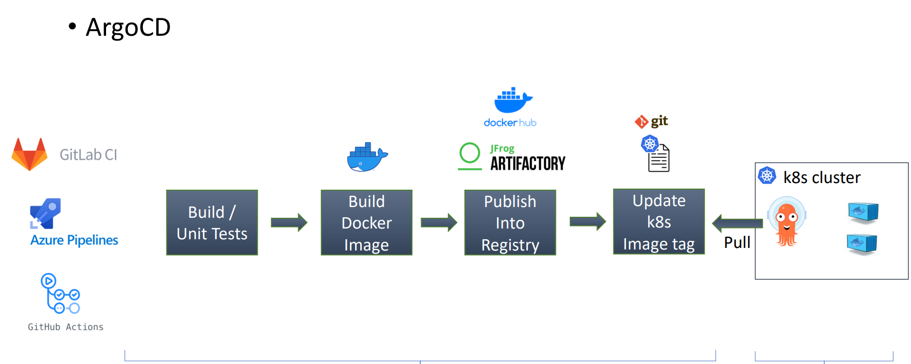
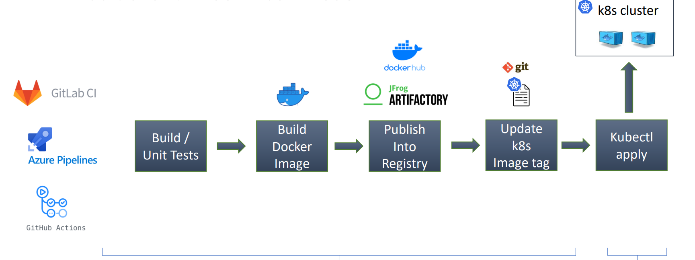
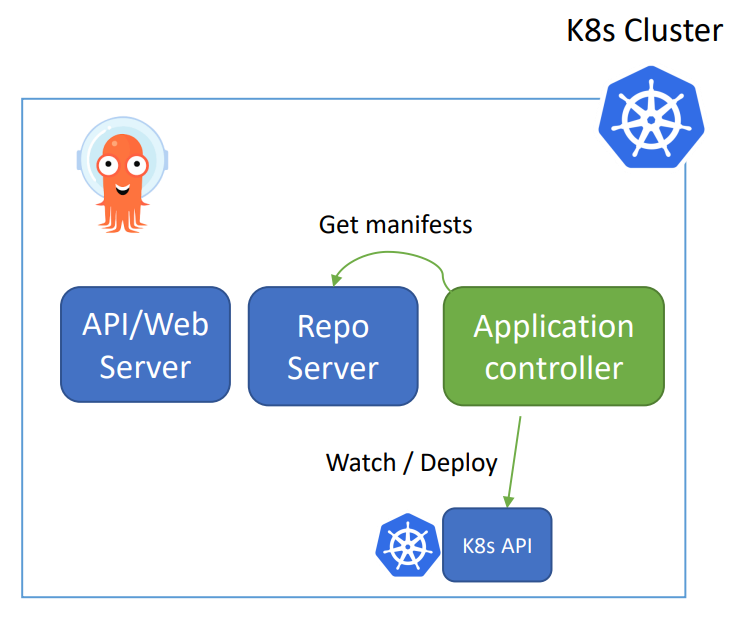

# ArgoCD - Fundamental

[Back](../index.md)

- [ArgoCD - Fundamental](#argocd---fundamental)
  - [GitOps](#gitops)
    - [Pull Model](#pull-model)
  - [ArgoCD](#argocd)
    - [Core Concepts](#core-concepts)
  - [Architecture](#architecture)
    - [ArgoCD Server](#argocd-server)
    - [Repo Server](#repo-server)
    - [Application controller](#application-controller)
    - [Additional Components](#additional-components)
  - [Remote Cluster](#remote-cluster)
    - [Authentication](#authentication)
  - [Best Practices](#best-practices)
    - [Repositories Separation](#repositories-separation)
    - [Environments Manifest](#environments-manifest)
    - [Common Practices](#common-practices)

---

## GitOps

- `GitOps`
  - an **operational framework** that uses `Git` repositories as the "**single source of truth**" to define, manage, and deploy infrastructure and applications.

- **Principles of GitOps**
  - **Declarative Infrastructure**:
    - The **desired state** of the system is defined **declaratively** (e.g., Kubernetes YAML files) rather than through manual, imperative commands.
  - **Versioned and Immutable**:
    - All infrastructure and application configurations are **stored in Git**, ensuring a complete, versioned history for auditing and easy rollbacks.
  - **Automated Synchronization**:
    - Software agents (e.g., in the cluster) **automatically pull changes from the Git** repository and **update** the live environment, eliminating manual deployment steps.
  - **Continuous Reconciliation**:
    - The system **constantly monitors** for discrepancies between the Git repository and the actual state, automatically correcting any drift to ensure alignment.

---

### Pull Model

- `pull model`
  - a deployment strategy where an **in-cluster agent** (like Argo CD or Flux) continuously **monitors** a Git repository for changes and **pulls** them to **synchronize** the environment's actual state with the desired state. I

- Sample flow: Full release

- dev commit changes to main branch
- Trigger main pipeline
  - build
  - test
  - code analysis
  - docker build
  - docker push
  - update test manifests
- Argo sync changes to test env
- postsysnc trigger test-staging pipeline
  - integration test
  - security test
  - dast testing
  - update staging manifests
- if pass, create merge request to update staging env
- Argo sync changes to staging env
- postsysnc trigger staging-prod pipeline
  - performance test
  - pen test
  - manual test
  - UAT
  - update prod manifests
- if pass, create a merge request to update prod env
- if Approval, Argo sync changes to prod env

---

## ArgoCD

- `ArgoCD`
  - a GitOps **continues delivery** tool for Kubernetes.

- Not a CI tool

- Features
  - `Git` as the **source of truth**.
    - Developer and DevOps engineer will update the Git code only.
  - Keep your cluster in **sync** with `Git`.
  - Easy **rollback**.
  - More security : Grant **access to ArgoCD** only.
  - Disaster recovery solution : You easily deploy the same apps to any k8s cluster.

---

### Core Concepts

- `Application`
  - a Kubernetes `Custom Resource Definition (CRD)` that defines the **desired state of an application** in a target cluster, **sourcing** its configuration (YAML, Helm, Kustomize) from a Git repository.
  - **the unit of deployment** and tracking, enabling GitOps by monitoring for differences between the Git repository and the cluster.
- **Source** :
  - Helm charts
  - Kustomize application
  - k8s manifests
  - jsonnet
- **Destination**: cluster and namespace.

---

- `Projects`
  - provide a **logical grouping** of `applications`.
  - a **logical grouping** of `applications` used to organize, restrict, and manage access **in multi-tenant environments**.
  - acts as a **safety boundary**, defining **which Git repositories** can be used, **where** applications can be deployed (clusters/namespaces), and **which users** can perform actions via RBAC.

- Use case:
  - when ArgoCD is used by multiple teams.

---

- `Desired state` vs `Actual state`
- `Desired state`:
  - the **definitive version** of what Kubernetes resources should look like, as defined by the **manifests stored in `Git` repository**.

- `Actual state`:
  - what is **currently running** in Kubernetes cluster.

- `Sync`
  - the process that **reconciles** the `desired state` of an `application` (defined in Git) with its `actual state` in a Kubernetes cluster.
  - makes the **live cluster** **match** the **`Git` repository**, applying manifest changes, creating new resources, or deleting removed ones.
  - can be manual or automated.

- `Refresh` (`Compare`)
  - **updates** the application's **status** by **comparing** the desired Git state with the live cluster state, **without changing cluster resources**.
  - By default, automatically refreshes every 3 minutes.

---

## Architecture

3 main components:

- ArgoCD Server (API + Web Server).
- ArgoCD Repo Server.
- ArgoCD Application Controller.

---

### ArgoCD Server

- Its a gRPC/REST server which **exposes the API** consumed by the **Web UI, CLI**.
  - Application management (Create, Update, Delete).
  - Application operations (ex: Sync, Rollback)
  - Repos and clusters management.
  - Authentication.

---

### Repo Server

- `Repo Server`
  - acts as the bridge between `Git repositories` and `Kubernetes`.
  - roles:
    - **Clones** and keeps Git repositories **up-to-date**.
    - **generates** Kubernetes manifests (via Helm, Kustomize, etc.),
    - and **caches** them

---

### Application controller

- `Application controller`
  - a Kubernetes controller which **continuously monitors** running applications and **compares** the current, live state against the desired target state.

- Roles:
  - Communicate with `Repo server` to get the generated manifests.
  - Communicate with `k8s API` to get actual cluster state.
  - **Deploy** apps manifests to destination clusters.
  - **Detects** OutofSync Apps and take corrective actions “If needed”.
  - Invoking **user-defined hooks** for lifecycle events (PreSync, Sync, PostSync).

- How it Works:
  - **Observes**:
    - It looks at the `Argo CD Application CRD` and the target cluster.
  - **Compares**:
    - It **fetches the desired manifests** from the repo server and **compares** them to the `actual state`.
  - **Acts**:
    - It **updates** the Application status and **synchronizes** the cluster if enabled.

---

### Additional Components

- `Redis`: used for caching.
- `Dex`: **identity service** to integrate with **external identity providers**.
- `ApplicationSet Controller`: It automates the **generation of Argo CD Applications**

---

## Remote Cluster

- By **default**, ArgoCD has the **permission to deploy** into the **local cluster** where its running.
- can add remote k8s clusters information including **credentials** as `k8s secrets`.
  - Each secret must have label of `argocd.argoproj.io/secret-type: cluster`
- Each cluster must have the below data:
  - Name.
  - Server (cluster api server url).
  - Config (an option to authenticate to the cluster).
  - namespaces (optional): comma-separated list of namespaces which are accessible in that cluster.
- can add remote clusters declarativly or using cli.

---

### Authentication

- options to authenticate to remote clusters:
  - Basic authentication (username and password)
  - Bearer token authentication.
  - IAM authentication configuration (suitable for cloud k8s clusters).
  - External provider command to supply client credentials.

---

## Best Practices

### Repositories Separation

Separating `application config repo` from `application code repo`

- Cleaner Git history of what changes were made
- The application might consist of services that are distributed in multiple Git repositories, but is **deployed as a single unit**.
- Separation of access. **Maintainers of application source code** maybe not be the same as the **maintainers of application config**.
- **Smaller overhead** on Argo CD repo-controller, cloning config repo without the source code.

---

### Environments Manifest

Types of environments:

- Static environments:
  - Test
  - Staging
  - Production
- On-demand environments :
  - created for a **small period** for feature testing.
  - Can be created once a **pull request** created and destroyed once the pull request is closed.

---

How to handle on-demand environments creation/deletion:

- On-demand environments can be created by two options
  - Option-1:
    - Use `ApplicationSet Pull Request Generator`, it will handle creating ArgoCD applications per open pull request. And it will be Argo CD application will be **destroyed once Pull request is closed**.
  - Option-2:
    - Single branch for on-demand environments, and a folder per environment and each folder will contain the related manifests. (You need to write a script using CI pipeline to create theses folders and manifests per Pull request).

---

How to handle static environments config?

- **Approach #1: Single branch** all static environments:
  - e.g, Main branch, contains the helm chart values files for-each static environment:
    - Values-test.yaml.
    - Values-staging.yaml.
    - Values-prod.yaml.
- **Approach #2**: Branch per static environment
  - Test branch.
  - Staging branch.
  - Production branch. (You can use tags or commits SHA for production environments)

---

### Common Practices

- Immutable manifests
  - Use immutable manifests in production
  - Avoid using `HEAD` revision and **use tags or commits SHA**.

- Replicas and HPA
  - If you want HPA to control the number of replicas , then **don’t include replicas in Git**.

- Plan for secrets management
  - Don’t store plain secrets in git.
  - There are several solutions for secrets:
    - Within Git
      - `Sealed secrets`.
      - `SOPS`
    - External secrets store:
      - `Hashicorp Vault`
      - `External Secrets Operator`
      - Cloud secrets store
        - `Aws secret operator`

- Plan for ArgoCD Instances
  - Use a **separated** ArgoCD instance for **production**.
  - Use **HA setup** for production.
  - Its recommended to have **at least two instances**:
    - Non-prod instance.
    - Prod instance.

- App of Apps and ApplicationSet
  - Use `app of apps` to manage ArgoCD application.
  - Use `Application Set` and the power of generators to generate applications.
