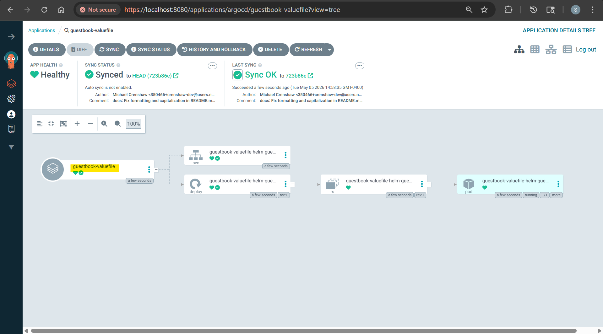
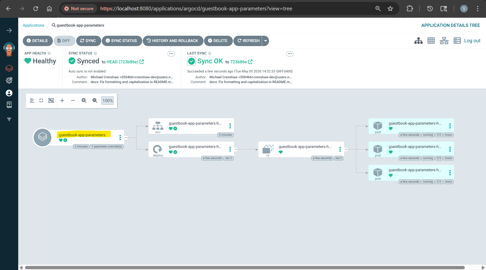
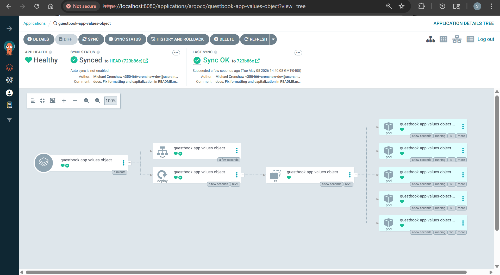

# ArgoCD - Deploying Helm Charts

[Back](../index.md)

- [ArgoCD - Deploying Helm Charts](#argocd---deploying-helm-charts)
  - [Deploy Helm Charts](#deploy-helm-charts)
    - [Lab: Deploy Helm Chart](#lab-deploy-helm-chart)
  - [Helm Value](#helm-value)
    - [`valueFiles`](#valuefiles)
      - [Lab: Deploy Helm Charts with valueFiles](#lab-deploy-helm-charts-with-valuefiles)
    - [`parameters`](#parameters)
      - [Lab: Deploy Helm Charts with parameters](#lab-deploy-helm-charts-with-parameters)
    - [`valuesObject`](#valuesobject)
      - [Lab: Deploy Helm Charts with values object](#lab-deploy-helm-charts-with-values-object)

---

## Deploy Helm Charts

- `Argo CD` is a `helm template` engine.
  - When managing a Helm chart with Argo CD, it does not run `helm install` or `helm upgrade`.
  - there is no Helm history, helm install, helm upgrade, or helm uninstall.
- can use `Argo CD` to deploy both charts stored **in private own repositories**, as well as charts that are **publicly** available.


---

### Lab: Deploy Helm Chart

- Argocd application

```yaml
apiVersion: argoproj.io/v1alpha1
kind: Application
metadata:
  name: guestbook
  namespace: argocd
spec:
  project: default
  source:
    repoURL: https://github.com/simonangel-fong/argocd-example-apps.git
    targetRevision: HEAD
    path: helm-guestbook
  destination:
    server: "https://kubernetes.default.svc"
    namespace: default
```

```sh
kubectl apply -f guestbook-app.yaml
# application.argoproj.io/guestbook created

argocd app list
# NAME              CLUSTER                         NAMESPACE  PROJECT  STATUS     HEALTH   SYNCPOLICY  CONDITIONS  REPO                                                        PATH            TARGET
# argocd/guestbook  https://kubernetes.default.svc  default    default  OutOfSync  Missing  Manual      <none>      https://github.com/simonangel-fong/argocd-example-apps.git  helm-guestbook  HEAD

argocd app sync argocd/guestbookargocd app sync argocd/guestbook
# TIMESTAMP                  GROUP        KIND   NAMESPACE                  NAME        STATUS    HEALTH        HOOK  MESSAGE
# 2026-05-05T13:03:09-04:00            Service     default  guestbook-helm-guestbook  OutOfSync  Missing
# 2026-05-05T13:03:09-04:00   apps  Deployment     default  guestbook-helm-guestbook  OutOfSync  Missing
# 2026-05-05T13:03:10-04:00            Service     default  guestbook-helm-guestbook  OutOfSync  Missing              service/guestbook-helm-guestbook created
# 2026-05-05T13:03:10-04:00   apps  Deployment     default  guestbook-helm-guestbook  OutOfSync  Missing              deployment.apps/guestbook-helm-guestbook created

# Name:               argocd/guestbook
# Project:            default
# Server:             https://kubernetes.default.svc
# Namespace:          default
# URL:                https://argocd.example.com/applications/argocd/guestbook
# Source:
# - Repo:             https://github.com/simonangel-fong/argocd-example-apps.git
#   Target:           HEAD
#   Path:             helm-guestbook
# SyncWindow:         Sync Allowed
# Sync Policy:        Manual
# Sync Status:        Synced to HEAD (723b86e)
# Health Status:      Progressing

# Operation:          Sync
# Sync Revision:      723b86e01bea11dcf72316cb172868fcbf05d69e
# Phase:              Succeeded
# Start:              2026-05-05 13:03:09 -0400 EDT
# Finished:           2026-05-05 13:03:09 -0400 EDT
# Duration:           0s
# Message:            successfully synced (all tasks run)

# GROUP  KIND        NAMESPACE  NAME                      STATUS  HEALTH       HOOK  MESSAGE
#        Service     default    guestbook-helm-guestbook  Synced  Healthy            service/guestbook-helm-guestbook created
# apps   Deployment  default    guestbook-helm-guestbook  Synced  Progressing        deployment.apps/guestbook-helm-guestbook created

argocd app get argocd/guestbook
# Name:               argocd/guestbook
# Project:            default
# Server:             https://kubernetes.default.svc
# Namespace:          default
# URL:                https://argocd.example.com/applications/guestbook
# Source:
# - Repo:             https://github.com/simonangel-fong/argocd-example-apps.git
#   Target:           HEAD
#   Path:             helm-guestbook
# SyncWindow:         Sync Allowed
# Sync Policy:        Manual
# Sync Status:        Synced to HEAD (723b86e)
# Health Status:      Healthy

# GROUP  KIND        NAMESPACE  NAME                      STATUS  HEALTH   HOOK  MESSAGE
#        Service     default    guestbook-helm-guestbook  Synced  Healthy        service/guestbook-helm-guestbook created
# apps   Deployment  default    guestbook-helm-guestbook  Synced  Healthy        deployment.apps/guestbook-helm-guestbook created
```

---

## Helm Value

- Loading Precedence order: the higher Overriding the lower Chart Values

1. By default: Chart's own `values.yaml` file
2. Files specified under the `valueFiles` option
   - Later entries in the list take precedence over earlier entries.
3. Entries specified under the `valuesObject` option
4. Entries specified under the `parameters` option
   - Later entries in the list take precedence over earlier entries.

- example

```yaml
spec:
  source:
  repoURL: https://kubernetes.github.io/dashboard/
  chart: kubernetes-dashboard
  targetRevision: 7.13.0
  helm:
    valueFiles:
      - values.yaml
      - custom-values.yaml
    valuesObject:
      kong:
        enabled: true
    parameters:
      - name: "nginx.enabled"
        value: "false"
```

---

### `valueFiles`

```yaml
spec:
  source:
    helm:
      valueFiles:
        - values.yaml
```

---

#### Lab: Deploy Helm Charts with valueFiles

```yaml
apiVersion: argoproj.io/v1alpha1
kind: Application
metadata:
  name: guestbook-valuefile
  namespace: argocd
spec:
  project: default
  source:
    repoURL: https://github.com/simonangel-fong/argocd-example-apps.git
    targetRevision: HEAD
    path: helm-guestbook
    helm:
      valueFiles:
        - values.yaml
  destination:
    server: "https://kubernetes.default.svc"
    namespace: default
```

```sh
kubectl apply -f guestbook-app/guestbook-app-value-file.yaml
# application.argoproj.io/guestbook-valuefile created

argocd app list
# NAME                        CLUSTER                         NAMESPACE  PROJECT  STATUS     HEALTH   SYNCPOLICY  CONDITIONS  REPO                                                        PATH            TARGET
# argocd/guestbook-valuefile  https://kubernetes.default.svc  default    default  OutOfSync  Missing  Manual      <none>      https://github.com/simonangel-fong/argocd-example-apps.git  helm-guestbook  HEAD

argocd app sync argocd/guestbook-valuefile

```



---

### `parameters`

```yaml
spec:
  source:
    helm:
      parameters:
        - name: "replicaCount"
          value: "3"
```

#### Lab: Deploy Helm Charts with parameters

```yaml
apiVersion: argoproj.io/v1alpha1
kind: Application
metadata:
  name: guestbook-app-parameters
  namespace: argocd
spec:
  project: default
  source:
    repoURL: https://github.com/simonangel-fong/argocd-example-apps.git
    targetRevision: HEAD
    path: helm-guestbook
    helm:
      # parameters
      parameters:
        - name: "replicaCount"
          value: "3"
  destination:
    server: "https://kubernetes.default.svc"
    namespace: default
```

```sh
kubectl apply -f guestbook-app/guestbook-app-parameters.yaml
# application.argoproj.io/guestbook-app-parameters created

argocd app list
# NAME                             CLUSTER                         NAMESPACE  PROJECT  STATUS     HEALTH   SYNCPOLICY  CONDITIONS  REPO                                                        PATH            TARGET
# argocd/guestbook-app-parameters  https://kubernetes.default.svc  default    default  OutOfSync  Missing  Manual      <none>      https://github.com/simonangel-fong/argocd-example-apps.git  helm-guestbook  HEAD

argocd app sync argocd/guestbook-app-parameters

kubectl get po
# NAME                                                      READY   STATUS    RESTARTS   AGE
# guestbook-app-parameters-helm-guestbook-78d98bb7b-4q5w5   1/1     Running   0          7s
# guestbook-app-parameters-helm-guestbook-78d98bb7b-s9mmm   1/1     Running   0          7s
# guestbook-app-parameters-helm-guestbook-78d98bb7b-sm8jx   1/1     Running   0          7s
```



---

### `valuesObject`

```yaml
spec:
  source:
    helm:
      valuesObject:
        replicaCount: 5
```

---

#### Lab: Deploy Helm Charts with values object

```yaml
apiVersion: argoproj.io/v1alpha1
kind: Application
metadata:
  name: guestbook-app-values-object
  namespace: argocd
spec:
  project: default
  source:
    repoURL: https://github.com/simonangel-fong/argocd-example-apps.git
    targetRevision: HEAD
    path: helm-guestbook
    helm:
      valuesObject:
        replicaCount: 5
  destination:
    server: "https://kubernetes.default.svc"
    namespace: default
```

```sh
kubectl apply -f guestbook-app/guestbook-app-values-object.yaml
# application.argoproj.io/guestbook-app-values-object created

argocd app list
# NAME                                CLUSTER                         NAMESPACE  PROJECT  STATUS     HEALTH   SYNCPOLICY  CONDITIONS  REPO                                                        PATH            TARGET
# argocd/guestbook-app-values-object  https://kubernetes.default.svc  default    default  OutOfSync  Missing  Manual      <none>      https://github.com/simonangel-fong/argocd-example-apps.git  helm-guestbook  HEAD

argocd app sync argocd/guestbook-app-values-object

kubectl get po
# NAME                                                          READY   STATUS    RESTARTS   AGE
# guestbook-app-values-object-helm-guestbook-74f99fcdbd-25vtx   1/1     Running   0          6s
# guestbook-app-values-object-helm-guestbook-74f99fcdbd-2rjk2   1/1     Running   0          6s
# guestbook-app-values-object-helm-guestbook-74f99fcdbd-hwr2m   1/1     Running   0          6s
# guestbook-app-values-object-helm-guestbook-74f99fcdbd-j4llt   1/1     Running   0          6s
# guestbook-app-values-object-helm-guestbook-74f99fcdbd-zvzjj   1/1     Running   0          6s
```


