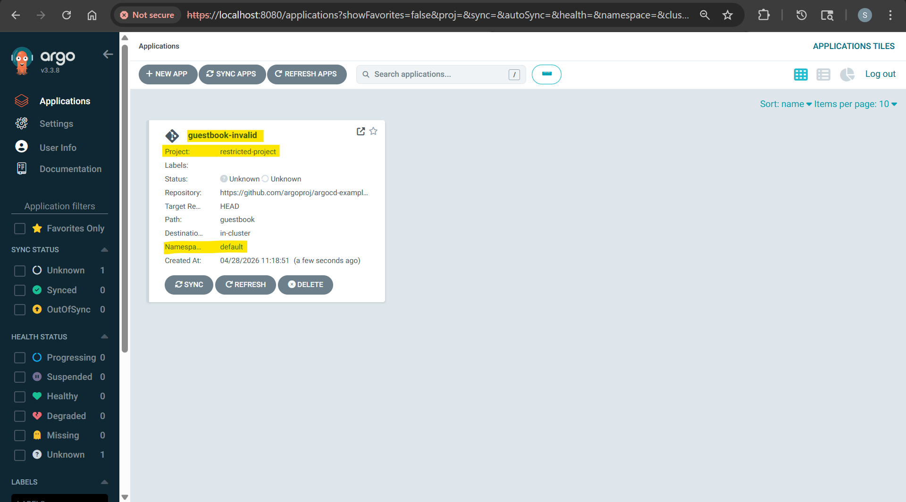
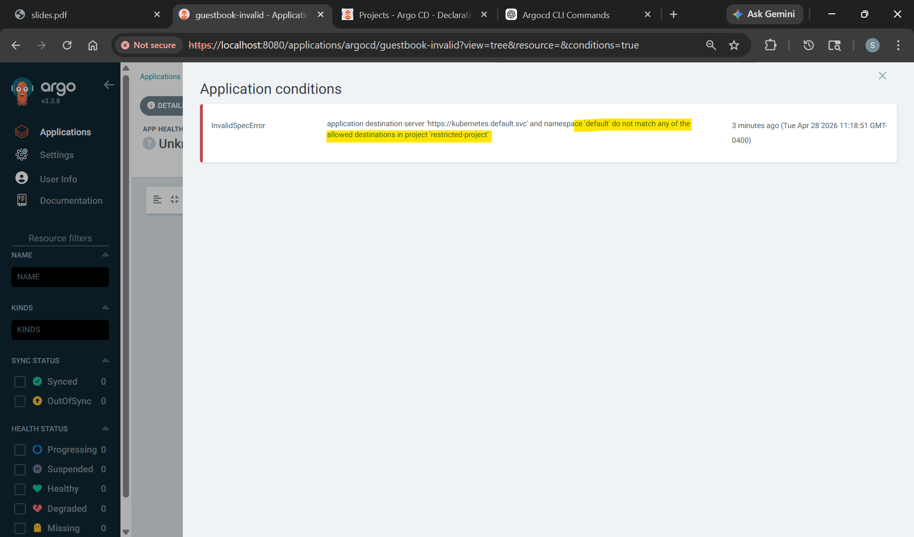
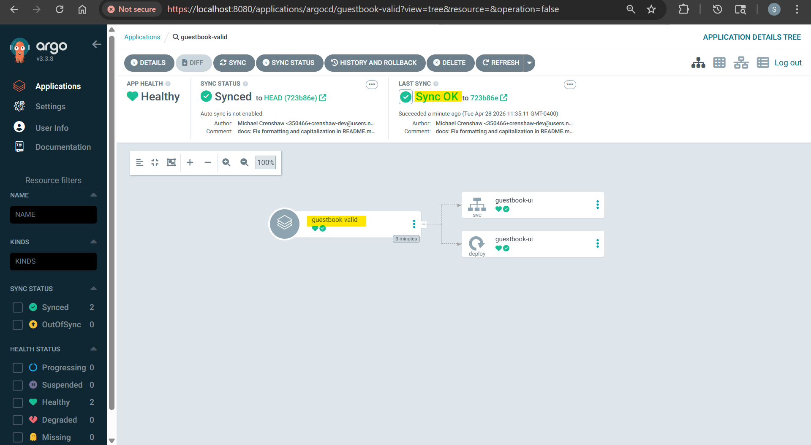

# ArgoCD - Project

[Back](../index.md)

- [ArgoCD - Project](#argocd---project)
  - [Project](#project)
  - [Common Commands](#common-commands)
  - [Declarative Yaml](#declarative-yaml)
  - [Lab: Default project](#lab-default-project)
  - [Lab: Create project](#lab-create-project)
    - [Create Project: Imparative](#create-project-imparative)
    - [Create a Permissive Project: Declarative](#create-a-permissive-project-declarative)
  - [Lab: Create a Restricted Project](#lab-create-a-restricted-project)
    - [Invalid Application](#invalid-application)
    - [Valid Application](#valid-application)
  - [??Project role](#project-role)

---

## Project

- `Projects`
  - provide a **logical grouping** of `applications`.
  - a **logical grouping** of `applications` used to organize, restrict, and manage access **in multi-tenant environments**.
  - acts as a **safety boundary**, defining **which Git repositories** can be used, **where** applications can be deployed (clusters/namespaces), and **which users** can perform actions via RBAC.

- **Default Project**
  - ArgoCD creates a default project once you install it.

- Features:
  - Enables to create a role with set of policies "permissions" to grant access to a project's applications"
    - can use it to grant CI system a specific access to project applications.
      - It must be associated with JWT.
    - can use it to grant oidc groups a specific access to project applications.

- Use case:
  - when ArgoCD is used by multiple teams.

---

## Common Commands

- Common Project

| Command                             | Description                                                             |
| ----------------------------------- | ----------------------------------------------------------------------- |
| `argocd proj list`                  | List all Argo CD projects.                                              |
| `argocd proj get <project_name>`    | Show details of one project.                                            |
| `argocd proj create <project_name>` | Create a new Argo CD project.                                           |
| `argocd proj delete <project_name>` | Delete a project. Usually only works when no applications are using it. |

- source

| Command                                               | Description                                                 |
| ----------------------------------------------------- | ----------------------------------------------------------- |
| `argocd proj add-source <project_name> <repo-url>`    | Allow the project to deploy from a specific Git repository. |
| `argocd proj remove-source <project_name> <repo-url>` | Remove an allowed Git repository from the project.          |

- destination

| Command                                                              | Description                                                      |
| -------------------------------------------------------------------- | ---------------------------------------------------------------- |
| `argocd proj add-destination <project_name> <server> <namespace>`    | Allow the project to deploy to a specific cluster and namespace. |
| `argocd proj remove-destination <project_name> <server> <namespace>` | Remove an allowed deployment destination.                        |

- resource

| Command                                                              | Description                            |
| -------------------------------------------------------------------- | -------------------------------------- |
| `argocd proj allow-cluster-resource <project_name> <group> <kind>`   | Allow cluster-scoped resources.        |
| `argocd proj deny-cluster-resource <project_name> <group> <kind>`    | Deny a cluster-scoped resource type.   |
| `argocd proj allow-namespace-resource <project_name> <group> <kind>` | Allow namespace-scoped resources.      |
| `argocd proj deny-namespace-resource <project_name> <group> <kind>`  | Deny a namespace-scoped resource type. |

- role

| Command                                                               | Description                                         |
| --------------------------------------------------------------------- | --------------------------------------------------- |
| `argocd proj role create <project_name> <role-name>`                  | Create a project-level role.                        |
| `argocd proj role delete <project_name> <role-name>`                  | Delete a project-level role.                        |
| `argocd proj role add-policy <project_name> <role-name> ...`          | Add RBAC policy permissions to a project role.      |
| `argocd proj role remove-policy <project_name> <role-name> ...`       | Remove RBAC policy permissions from a project role. |
| `argocd proj role create-token <project_name> <role-name>`            | Create an API token for a project role.             |
| `argocd proj role delete-token <project_name> <role-name> <token-id>` | Delete an API token from a project role.            |

---

## Declarative Yaml

```yaml
apiVersion: argoproj.io/v1alpha1
kind: AppProject
metadata:
  name: project-1
  namespace: argocd
spec:
  description: project description
  # allow all repo
  sourceRepos:
    - "*"
  # dest all cluster
  destinations:
    - server: "*"
      namespace: "*"
  # allow all cluster resources
  clusterResourceWhitelist:
    - group: "*"
      kind: "*"
  # allow all namespace resources
  namespaceResourceWhitelist:
    - group: "*"
      kind: "*"
```

- Restrict

```yaml
apiVersion: argoproj.io/v1alpha1
kind: AppProject
metadata:
  name: project-1
  namespace: argocd
spec:
  description: project description
  # specify repo
  sourceRepos:
    - "https://github.com/mabusaa/argocd-example-apps.git"
  # specify cluster ns
  destinations:
    - server: https://kubernetes.default.svc
      namespace: "ns-1"
  # Only allow ns resources
  clusterResourceWhitelist:
    - group: ""
      kind: "Namespace"
  # Only allow deployment resources
  namespaceResourceWhitelist:
    - group: "apps"
      kind: "Deployment"
  # blacklist ns np
  namespaceResourceBlacklist:
    - group: “”
      kind: “NetworkPolicy"
```

- Set in app

```yaml
apiVersion: argoproj.io/v1alpha1
kind: Application
metadata:
  name: guestbook
  namespace: argocd
spec:
  project: project-1 # specify project
  destination:
    server: "https://kubernetes.default.svc"
    namespace: guestbook
  source:
    repoURL: "https://github.com/argoproj/argocd-example-apps.git"
    targetRevision: HEAD
    path: helm-guestbook
```

---

## Lab: Default project

```sh
argocd proj list
# NAME     DESCRIPTION  DESTINATIONS  SOURCES  CLUSTER-RESOURCE-WHITELIST  NAMESPACE-RESOURCE-BLACKLIST  SIGNATURE-KEYS  ORPHANED-RESOURCES  DESTINATION-SERVICE-ACCOUNTS
# default               *,*           *        */*                         <none>                        <none>          disabled            <none>

# View default project
argocd proj get default
# Name:                        default
# Description:
# Destinations:                *,*
# Repositories:                *
# Source Namespaces:           <none>
# Scoped Repositories:         <none>
# Allowed Cluster Resources:   */*
# Scoped Clusters:             <none>
# Denied Namespaced Resources: <none>
# Signature keys:              <none>
# Orphaned Resources:          disabled
```

---

## Lab: Create project

### Create Project: Imparative

```sh
# Create a project
argocd proj create demo-project

# Allow one Git repo
argocd proj add-source demo-project https://github.com/argoproj/argocd-example-apps.git

# Allow deployment to guestbook namespace in the in-cluster Kubernetes cluster
argocd proj add-destination demo-project https://kubernetes.default.svc guestbook

argocd proj get demo-project
# Name:                        demo-project
# Description:
# Destinations:                https://kubernetes.default.svc,guestbook
# Repositories:                https://github.com/argoproj/argocd-example-apps.git
# Source Namespaces:           <none>
# Scoped Repositories:         <none>
# Allowed Cluster Resources:   <none>
# Scoped Clusters:             <none>
# Denied Namespaced Resources: <none>
# Signature keys:              <none>
# Orphaned Resources:          disabled

# Create an application under this project
argocd app create guestbook-1 \
  --repo https://github.com/argoproj/argocd-example-apps.git \
  --path guestbook \
  --dest-server https://kubernetes.default.svc \
  --dest-namespace guestbook \
  --project demo-project

# application 'guestbook-1' created

# sync
argocd app sync guestbook-1
# TIMESTAMP                  GROUP        KIND   NAMESPACE                  NAME    STATUS   HEALTH        HOOK  MESSAGE
# 2026-04-28T10:31:49-04:00            Service   guestbook          guestbook-ui    Synced  Healthy
# 2026-04-28T10:31:49-04:00   apps  Deployment   guestbook          guestbook-ui    Synced  Healthy
# 2026-04-28T10:31:49-04:00            Service   guestbook          guestbook-ui    Synced  Healthy              service/guestbook-ui unchanged
# 2026-04-28T10:31:49-04:00   apps  Deployment   guestbook          guestbook-ui    Synced  Healthy              deployment.apps/guestbook-ui unchanged

# Name:               argocd/guestbook-1
# Project:            demo-project
# Server:             https://kubernetes.default.svc
# Namespace:          guestbook
# URL:                https://argocd.example.com/applications/guestbook-1
# Source:
# - Repo:             https://github.com/argoproj/argocd-example-apps.git
#   Target:
#   Path:             guestbook
# SyncWindow:         Sync Allowed
# Sync Policy:        Manual
# Sync Status:        Synced to  (723b86e)
# Health Status:      Healthy

# Operation:          Sync
# Sync Revision:      723b86e01bea11dcf72316cb172868fcbf05d69e
# Phase:              Succeeded
# Start:              2026-04-28 10:31:49 -0400 EDT
# Finished:           2026-04-28 10:31:49 -0400 EDT
# Duration:           0s
# Message:            successfully synced (all tasks run)

# GROUP  KIND        NAMESPACE  NAME          STATUS  HEALTH   HOOK  MESSAGE
#        Service     guestbook  guestbook-ui  Synced  Healthy        service/guestbook-ui unchanged
# apps   Deployment  guestbook  guestbook-ui  Synced  Healthy        deployment.apps/guestbook-ui unchanged
```

- remove app

```sh
argocd app delete guestbook-1
# Are you sure you want to delete 'guestbook-1' and all its resources? [y/n] y
# application 'guestbook-1' deleted

argocd proj delete guestbook-1 demo-project
```

---

### Create a Permissive Project: Declarative

- Project

```yaml
apiVersion: argoproj.io/v1alpha1
kind: AppProject

metadata:
  name: demo-project
  namespace: argocd

spec:
  description: Permissive demo project

  sourceRepos:
    - "*"

  destinations:
    - server: "*"
      namespace: "*"

  clusterResourceWhitelist:
    - group: "*"
      kind: "*"

  namespaceResourceWhitelist:
    - group: "*"
      kind: "*"
```

- App

```yaml
apiVersion: argoproj.io/v1alpha1
kind: Application

metadata:
  name: guestbook
  namespace: argocd

spec:
  project: demo-project

  source:
    repoURL: https://github.com/argoproj/argocd-example-apps.git
    targetRevision: HEAD
    path: guestbook

  destination:
    server: https://kubernetes.default.svc
    namespace: guestbook
```

```sh
# create project
kubectl apply -f demo_proj01.yaml
# appproject.argoproj.io/demo-project created

kubectl get appproject -n argocd
# NAME           AGE
# default        19h
# demo-project   91s

# create app
kubectl apply -f demo_proj01_app.yaml
# application.argoproj.io/guestbook created

kubectl get app -n argocd
# NAME        SYNC STATUS   HEALTH STATUS
# guestbook   OutOfSync     Missing

# sync
argocd app sync guestbook

kubectl get app -n argocd
# NAME        SYNC STATUS   HEALTH STATUS
# guestbook   Synced        Healthy
```

---

## Lab: Create a Restricted Project

```sh
kubectl create namespace app
# namespace/app created
```

- Project

```yaml
apiVersion: argoproj.io/v1alpha1
kind: AppProject

metadata:
  name: restricted-project
  namespace: argocd

spec:
  description: Only allow applications to deploy into the app namespace

  sourceRepos:
    - https://github.com/argoproj/argocd-example-apps.git

  destinations:
    - server: https://kubernetes.default.svc
      namespace: app # only allow app ns

  clusterResourceWhitelist:
    - group: "*"
      kind: "*"

  namespaceResourceWhitelist:
    - group: "*"
      kind: "*"
```

```sh
kubectl apply -f demo_proj02_restricted.yaml
```

---

### Invalid Application

```yaml
apiVersion: argoproj.io/v1alpha1
kind: Application

metadata:
  name: guestbook-invalid
  namespace: argocd

spec:
  project: restricted-project

  source:
    repoURL: https://github.com/argoproj/argocd-example-apps.git
    targetRevision: HEAD
    path: guestbook

  destination:
    server: https://kubernetes.default.svc
    namespace: default # invalid ns
```

```sh
kubectl apply -f demo_proj02_restricted_app_invalid.yaml
# application.argoproj.io/guestbook-invalid created

kubectl get app -n argocd
# NAME                SYNC STATUS   HEALTH STATUS
# guestbook-invalid   Unknown       Unknown

argocd app list
# NAME                      CLUSTER                         NAMESPACE  PROJECT             STATUS   HEALTH   SYNCPOLICY  CONDITIONS        REPO                                                 PATH       TARGET
# argocd/guestbook-invalid  https://kubernetes.default.svc  default    restricted-project  Unknown  Unknown  Manual      InvalidSpecError  https://github.com/argoproj/argocd-example-apps.git  guestbook  HEAD

argocd app get argocd/guestbook-invalid
# Name:               argocd/guestbook-invalid
# Project:            restricted-project
# Server:             https://kubernetes.default.svc
# Namespace:          default
# URL:                https://argocd.example.com/applications/guestbook-invalid
# Source:
# - Repo:             https://github.com/argoproj/argocd-example-apps.git
#   Target:           HEAD
#   Path:             guestbook
# SyncWindow:         Sync Allowed
# Sync Policy:        Manual
# Sync Status:        Unknown
# Health Status:      Unknown

# CONDITION         MESSAGE                                                                                                                                                               LAST TRANSITION
# InvalidSpecError  application destination server 'https://kubernetes.default.svc' and namespace 'default' do not match any of the allowed destinations in project 'restricted-project'  2026-04-28 11:18:51 -0400 EDT

argocd app sync argocd/guestbook-invalid

```





---

### Valid Application

```yaml
apiVersion: argoproj.io/v1alpha1
kind: Application

metadata:
  name: guestbook-valid
  namespace: argocd

spec:
  project: restricted-project

  source:
    repoURL: https://github.com/argoproj/argocd-example-apps.git
    targetRevision: HEAD
    path: guestbook

  destination:
    server: https://kubernetes.default.svc
    namespace: app # valid ns
```

```sh
kubectl apply -f demo_proj02_restricted_app_valid.yaml
# application.argoproj.io/guestbook-valid created

kubectl get app -n argocd
# NAME                SYNC STATUS   HEALTH STATUS
# guestbook-invalid   Unknown       Unknown
# guestbook-valid     OutOfSync     Missing

argocd app sync argocd/guestbook-valid

kubectl get app -n argocd
# NAME                SYNC STATUS   HEALTH STATUS
# guestbook-invalid   Unknown       Unknown
# guestbook-valid     Synced        Healthy

argocd app list
# NAME                      CLUSTER                         NAMESPACE  PROJECT             STATUS   HEALTH   SYNCPOLICY  CONDITIONS        REPO                                                 PATH       TARGET
# argocd/guestbook-invalid  https://kubernetes.default.svc  default    restricted-project  Unknown  Unknown  Manual      InvalidSpecError  https://github.com/argoproj/argocd-example-apps.git  guestbook  HEAD
# argocd/guestbook-valid    https://kubernetes.default.svc  app        restricted-project  Synced   Healthy  Manual      <none>            https://github.com/argoproj/argocd-example-apps.git  guestbook  HEAD

```



---

## ??Project role

- `Project Roles`
  - define fine-grained `RBAC (Role-Based Access Control)` permissions scoped specifically to an `AppProject`. 
  - determine which users, groups, or CI pipelines **can view, sync, or manage** specific applications within a project, enabling secure multi-tenant setups where teams only control their assigned resources.

- controls **who** can do **what** inside that project.

---

- Role example

```yaml
roles:
  - name: ci-role
    description: Sync privileges for demo-project
    policies:
    - p, proj:demo-project:ci-role, applications, sync, demo-project/*, allow
Projectname:rolename Action: sync,get,create,delete,update,override
Application name: * means all

```