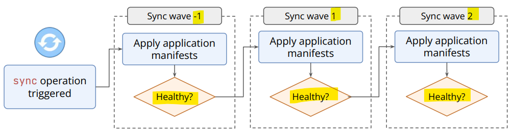
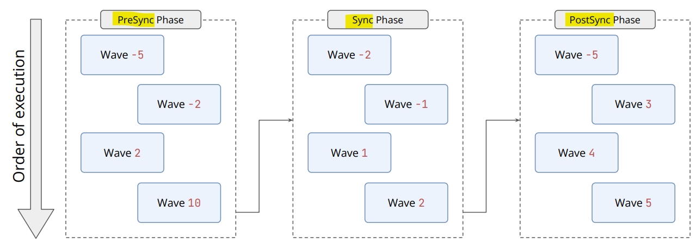
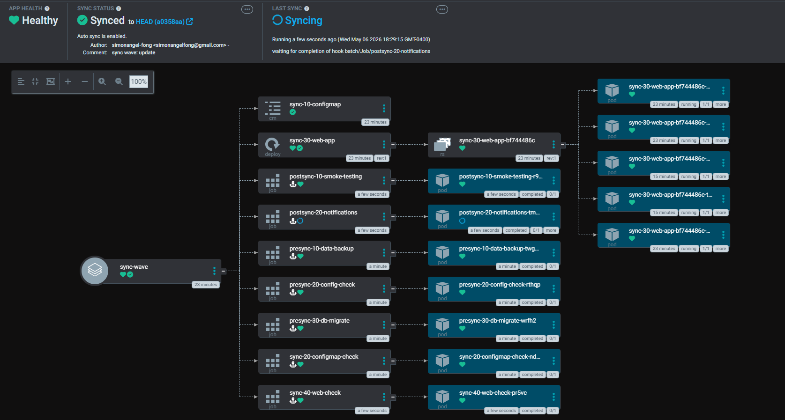

# ArgoCD - Sync Hook

[Back](../index.md)

- [ArgoCD - Sync Hook](#argocd---sync-hook)
  - [Sync Phases \& Hook](#sync-phases--hook)
    - [Hook Deletion Policies](#hook-deletion-policies)
    - [Lab: Sync Hook](#lab-sync-hook)
  - [Sync Waves](#sync-waves)
  - [Sync Phases + Sync Waves](#sync-phases--sync-waves)
    - [Lab: Sync Phases + Sync Waves](#lab-sync-phases--sync-waves)

---

## Sync Phases & Hook

- `Sync Phases`
  - Specific **stages of a sync operation**

| Phases       | Description                                                       | Use cases                                      |
| ------------ | ----------------------------------------------------------------- | ---------------------------------------------- |
| `PreSync`    | Executes **before** any resources are applied.                    | DB migrations, schema updates, security checks |
| `Sync`       | **Default**. Runs **alongside** standard **application syncing**. |                                                |
| `Skip`       | Indicates to Argo CD to **skip** the application of the manifest. |                                                |
| `PostSync`   | Executes **after** all resources are **synced and healthy**.      | smoke tests, notifying Slack                   |
| `SyncFail`   | Runs if the synchronization **fails**.**fails**.                  |                                                |
| `PreDelete`  | Executes **before** the application is **deleted**.               |                                                |
| `PostDelete` | Executes **after** the application is deleted.                    |                                                |

---

- `Sync hooks`
  - the Kubernetes annotations `argocd.argoproj.io/hook` used by resources to **specify custom logic at specific stages** of an sync operation.

- example

```yaml
apiVersion: batch/v1
kind: Job
metadata:
  generateName: database-migrations
  annotations:
    argocd.argoproj.io/hook: PreSync
```

---

### Hook Deletion Policies

- `hook deletion policies` (`argocd.argoproj.io/hook-delete-policy`)
  - **annotations** that dictate when automated task resources (like Jobs or Pods) **are cleaned up** after running.
  - They ensure cluster cleanliness by automatically **deleting completed hooks**.

- Policies include `HookSucceeded`, `HookFailed`, and `BeforeHookCreation`.

| Policies             | Description                                                                                                                    |
| -------------------- | ------------------------------------------------------------------------------------------------------------------------------ |
| `HookSucceeded`      | Deletes the resource if it **finishes successfully**, but keeps it for debugging if it fails.                                  |
| `HookFailed`         | Deletes the resource if **the hook fails**.                                                                                    |
| `BeforeHookCreation` | **Default** policy; **deletes any existing** hook resource before creating a new one, ensuring a clean state for the new hook. |

---

- How to Use Them:
  - `Annotations` are **added** to the resource metadata, typically to Kubernetes Jobs or Pods used for tasks like migrations, as shown in this Argo CD Resource Hooks Documentation.

---

### Lab: Sync Hook

- sync-hook/

```yaml
apiVersion: batch/v1
kind: Job
metadata:
  name: db-migration-job
  annotations:
    argocd.argoproj.io/hook: PreSync
    argocd.argoproj.io/hook-delete-policy: BeforeHookCreation, HookSucceeded
spec:
  backoffLimit: 2
  template:
    spec:
      restartPolicy: Never
      containers:
        - name: migration
          image: busybox
          command:
            - "sh"
            - "-c"
            - "echo 'Running db migration...'; sleep 20; echo 'Done'"
---
apiVersion: apps/v1
kind: Deployment
metadata:
  name: nginx-deployment
  labels:
    app: nginx
spec:
  replicas: 3
  selector:
    matchLabels:
      app: nginx
  template:
    metadata:
      labels:
        app: nginx
    spec:
      containers:
        - name: nginx
          image: nginx:1.14.2
          ports:
            - containerPort: 80
```

- App

```yaml
apiVersion: argoproj.io/v1alpha1
kind: Application
metadata:
  name: sync-job
  namespace: argocd
spec:
  project: default
  source:
    repoURL: "git@github.com:simonangel-fong/Demo_Helm_Private_Repo.git"
    targetRevision: HEAD
    path: sync-hook
  destination:
    server: "https://kubernetes.default.svc"
    namespace: default
  syncPolicy:
    syncOptions:
      - CreateNamespace=true
```

```sh
kubectl apply -f sync-hook.yaml
```

---

## Sync Waves

- `Sync Waves`
  - an annotation-based feature (`argocd.argoproj.io/sync-wave`) that **controls the order** in which Kubernetes resources are **applied** to a cluster.

- `integer wave value`
  - a numerical annotation used to **control the exact deployment order** of Kubernetes resources.
    - **Default Value: 0**

- Behavior:
  - ArgoCD orders waves from the **lowest integer** to the **highest**.
    - **Lower values**: deployed **first**
    - **negative numbers** are allowed **for pre-deployment**
    - all resources in the **same wave** deploy **in parallel**.
  - ArgoCD **waits** for all resources in one wave to be **healthy** before proceeding to the next.
    - If a resource in a wave **fails** to become healthy, the **subsequent waves** will **not be deployed**, causing the **sync to "get stuck"**.



- Example:

```yaml
metadata:
  annotations:
    argocd.argoproj.io/sync-wave: "5"
```

---

- **Sync waves and phases (hooks) can be combined!**
  - When specifying both options, Argo CD will apply the manifests and execute the operations following the `Sync Wave` order within each `Sync Phase`!

- Example Scenario (Using Sync Waves):
  - Wave -5: Namespaces, Network Policies.
  - Wave -1: Persistent Volume Claims, ConfigMaps, Secrets.
  - Wave 0 (Default): Database Deployment.
  - Wave 1: Application Deployment.



---

## Sync Phases + Sync Waves

Order:

- phase
- wave, from lower values
- By kind
- By name

- The Scenario: Deploying a Data-Driven Web AppPhase

1. `PreSync`: The Setup
   1. **Wave -1**:
      - Create the Namespace so it definitely exists.
   2. **Wave 0**:
      - Run a Database Migration job to update the schema.
      - Argo CD waits here until the migration is successful.
2. Phase 2: `Sync` (The Main Event)
   1. **Wave 1**:
      - Deploy the Database and Redis cache.
      - Argo CD waits until the database is "Healthy" and ready for connections.
   2. **Wave 2**:
      - Deploy the Backend API.
      - Argo CD waits until the API passes its readiness probe.
   3. **Wave 3**:
      - Deploy the Frontend UI.
      - Since the API is already up, the UI won't show "502 Bad Gateway" errors to users.
3. Phase 3: `PostSync` (The Wrap-up)
   1. **Wave 0**:
      - Run a Smoke Test script to verify the website loads.
   2. **Wave 5**:
      - Send a Slack Notification saying "Deployment Complete!"

---

### Lab: Sync Phases + Sync Waves

- presync-10-job.yaml

```yaml
apiVersion: batch/v1
kind: Job
metadata:
  name: presync-10-data-backup
  annotations:
    argocd.argoproj.io/hook: PreSync
    argocd.argoproj.io/hook-delete-policy: BeforeHookCreation, HookSucceeded
    argocd.argoproj.io/sync-wave: "10"
spec:
  backoffLimit: 2
  template:
    spec:
      restartPolicy: Never
      containers:
        - name: data-backup
          image: busybox
          command:
            - "sh"
            - "-c"
            - "echo 'Running data-backup ...'; sleep 5; echo 'Done'"
```

- presync-20-job.yaml

```yaml
apiVersion: batch/v1
kind: Job
metadata:
  name: presync-20-config-check
  annotations:
    argocd.argoproj.io/hook: PreSync
    argocd.argoproj.io/hook-delete-policy: BeforeHookCreation, HookSucceeded
    argocd.argoproj.io/sync-wave: "20"
spec:
  backoffLimit: 2
  template:
    spec:
      restartPolicy: Never
      containers:
        - name: config-check
          image: busybox
          command:
            - "sh"
            - "-c"
            - "echo 'Running config-check...'; sleep 5; echo 'Done'"
```

- presync-30-job.yaml

```yaml
apiVersion: batch/v1
kind: Job
metadata:
  name: presync-30-db-migrate
  annotations:
    argocd.argoproj.io/hook: PreSync
    argocd.argoproj.io/hook-delete-policy: BeforeHookCreation, HookSucceeded
    argocd.argoproj.io/sync-wave: "30"
spec:
  backoffLimit: 2
  template:
    spec:
      restartPolicy: Never
      containers:
        - name: db-migrate
          image: busybox
          command:
            - "sh"
            - "-c"
            - "echo 'Running db-migrate...'; sleep 5; echo 'Done'"
```

- sync-10-cm.yaml

```yaml
apiVersion: v1
kind: ConfigMap
metadata:
  name: sync-10-configmap
  annotations:
    argocd.argoproj.io/sync-wave: "10"
data:
  db_host: "pgdb"
```

- sync-20-cm.yaml

```yaml
apiVersion: batch/v1
kind: Job
metadata:
  name: sync-20-configmap-check
  annotations:
    argocd.argoproj.io/hook: Sync
    argocd.argoproj.io/hook-delete-policy: BeforeHookCreation, HookSucceeded
    argocd.argoproj.io/sync-wave: "20"
spec:
  backoffLimit: 2
  template:
    spec:
      restartPolicy: Never
      containers:
        - name: configmap-check
          image: busybox
          command:
            - "sh"
            - "-c"
            - "echo 'Running configmap-check...'; sleep 5; echo 'Done'"
```

- sync-30-cm.yaml

```yaml
apiVersion: apps/v1
kind: Deployment
metadata:
  name: sync-30-web-app
  labels:
    app: nginx
  annotations:
    argocd.argoproj.io/sync-wave: "30"
spec:
  replicas: 5
  selector:
    matchLabels:
      app: nginx
  template:
    metadata:
      labels:
        app: nginx
    spec:
      containers:
        - name: nginx
          image: nginx:1.14.2
          ports:
            - containerPort: 80
```

- sync-40-cm.yaml

```yaml
apiVersion: batch/v1
kind: Job
metadata:
  name: sync-40-web-check
  annotations:
    argocd.argoproj.io/hook: Sync
    argocd.argoproj.io/hook-delete-policy: BeforeHookCreation, HookSucceeded
    argocd.argoproj.io/sync-wave: "40"
spec:
  backoffLimit: 2
  template:
    spec:
      restartPolicy: Never
      containers:
        - name: web-check
          image: busybox
          command:
            - "sh"
            - "-c"
            - "echo 'Running web-check...'; sleep 5; echo 'Done'"
```

- postsync-10-job.yaml

```yaml
apiVersion: batch/v1
kind: Job
metadata:
  name: postsync-10-smoke-testing
  annotations:
    argocd.argoproj.io/hook: PostSync
    argocd.argoproj.io/hook-delete-policy: BeforeHookCreation, HookSucceeded
    argocd.argoproj.io/sync-wave: "10"
spec:
  backoffLimit: 2
  template:
    spec:
      restartPolicy: Never
      containers:
        - name: smoke-testing
          image: busybox
          command:
            - "sh"
            - "-c"
            - "echo 'Running smoke-testing...'; sleep 5; echo 'Done'"
```

- postsync-20-job.yaml

```yaml
apiVersion: batch/v1
kind: Job
metadata:
  name: postsync-20-notifications
  annotations:
    argocd.argoproj.io/hook: PostSync
    argocd.argoproj.io/hook-delete-policy: BeforeHookCreation, HookSucceeded
    argocd.argoproj.io/sync-wave: "20"
spec:
  backoffLimit: 2
  template:
    spec:
      restartPolicy: Never
      containers:
        - name: notifications
          image: busybox
          command:
            - "sh"
            - "-c"
            - "echo 'Running notifications...'; sleep 5; echo 'Done'"
```

```sh
kubectl apply -f sync-wave.yaml
# application.argoproj.io/sync-wave created
```


