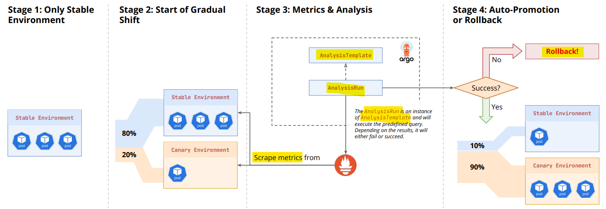
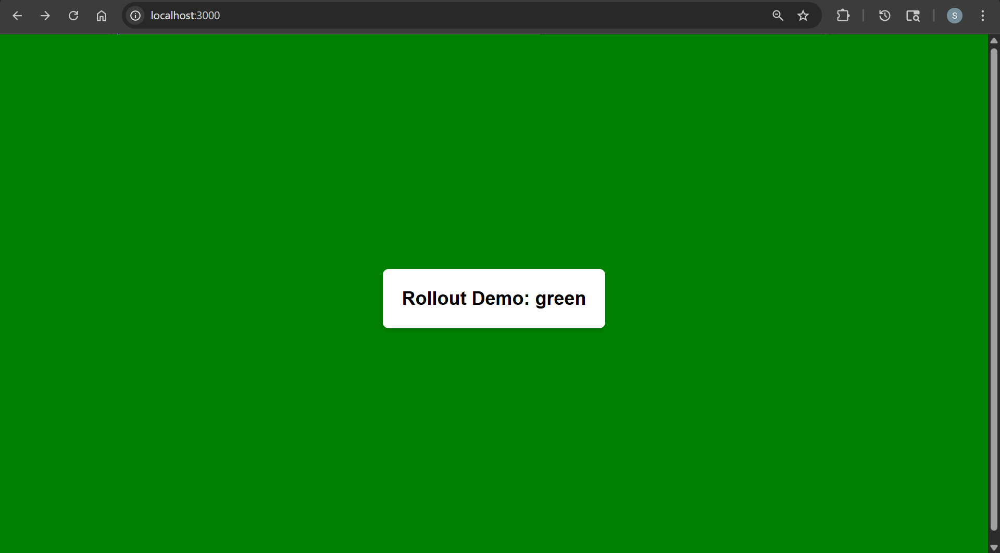
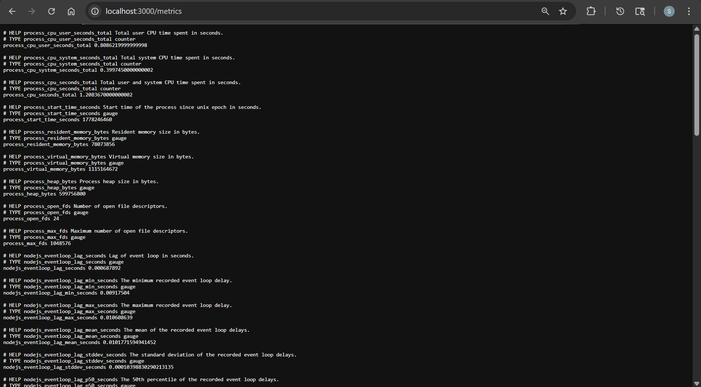
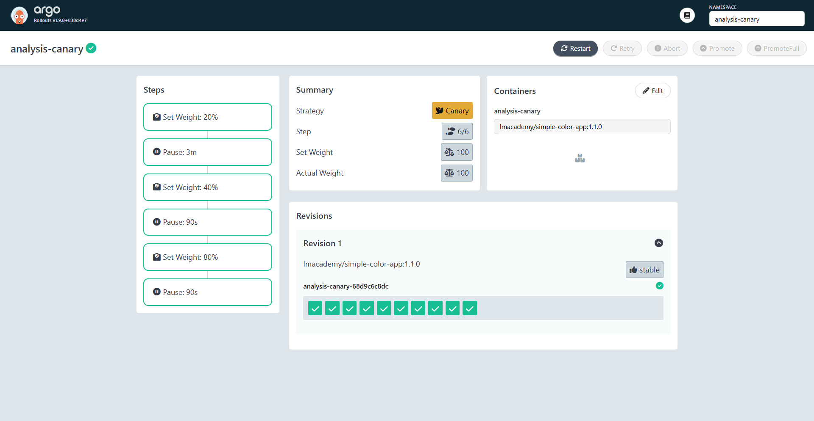
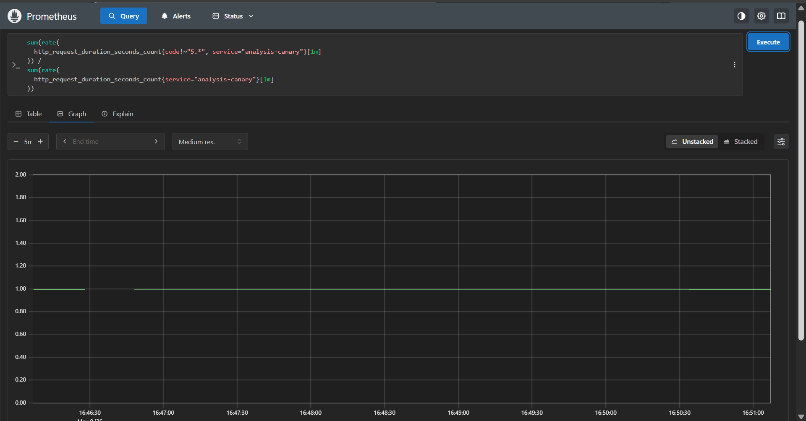
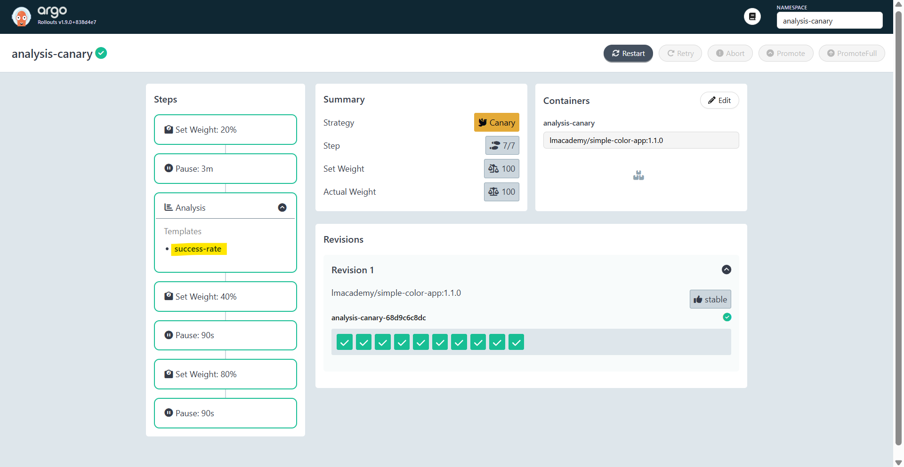
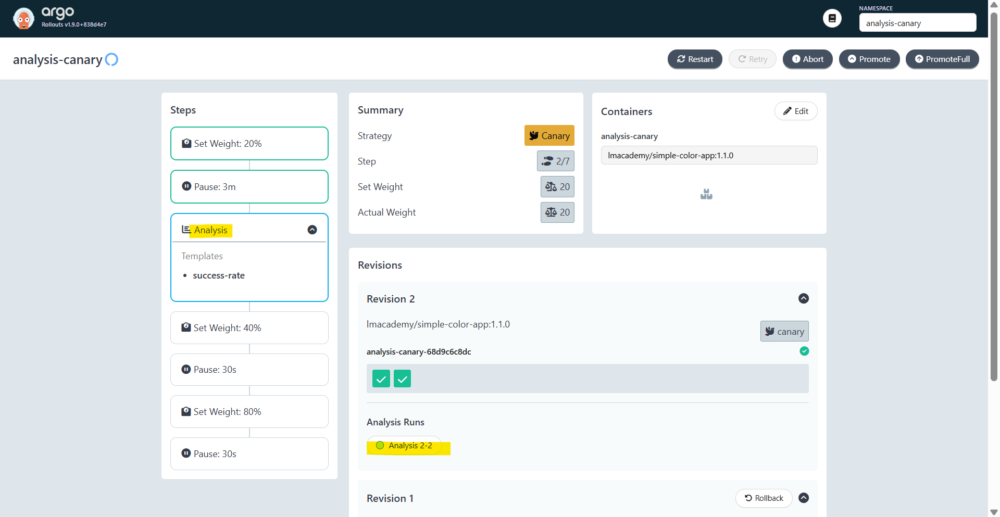
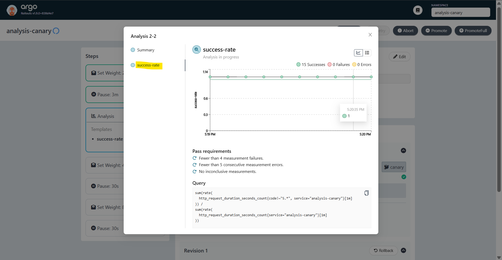
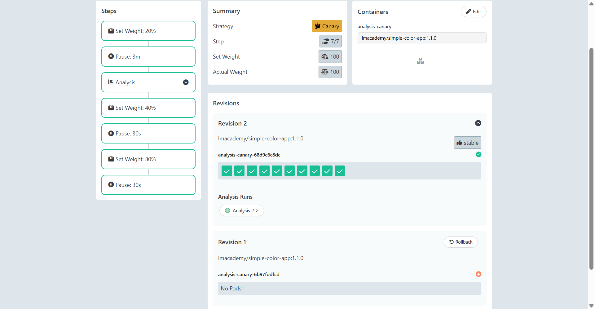
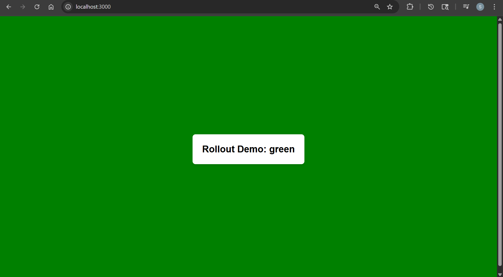

# Argo Rollout - with `Prometheus`

[Back](../index.md)

- [Argo Rollout - with `Prometheus`](#argo-rollout---with-prometheus)
  - [Analysis](#analysis)
  - [Lab: Analysis Canary](#lab-analysis-canary)
    - [Create Analysis](#create-analysis)
    - [Add Analysis to Rollout](#add-analysis-to-rollout)
    - [Deploy Good version](#deploy-good-version)
    - [Deploy Bad Version???](#deploy-bad-version)
  - [Lab: Blue/Green Prepromotion Analysis(Skip)](#lab-bluegreen-prepromotion-analysisskip)

---

## Analysis

- `Analysis`
  - a feature for **automated** `canary` and `blue-green` deployments that **verifies app health** by **querying metrics** (e.g., Prometheus, Datadog) or webhooks during updates.
  - automatically **promotes** or **rolls back** applications based on these results, ensuring safety by pausing or aborting deployments if performance KPIs fail.
- Features of Analysis in Argo Rollouts:
  - **Automation & Safety**:
    - It **automates the verification process**, eliminating the need for manual checks.
    - If the metrics **fail**, the **rollout** is automatically aborted.
  - **Analysis Templates & Runs**:
    - `AnalysisTemplate`: Defines **what to measure** (e.g., HTTP error rate).
    - `AnalysisRun`: The **actual execution** of a template during a **rollout**, tied specifically to that rollout instance.
    - `ClusterAnalysisTemplate`: A template that can be **shared across multiple rollouts**.
  - **Metric Providers**:
    - Supports various platforms for measuring data points like response time, error rate, and resource utilization.
    - Common providers include:
      - `Prometheus`
      - `Datadog`
      - `Webhooks/HTTP APIs`
    - **Timing Options**:
      - **Background Analysis**: Runs alongside a `canary` update, checking metrics throughout the process.
      - **Pre-Promotion Analysis**: Validates a `Blue/Green` release before switching production traffic.
      - **Post-Promotion Analysis**: Validates the **new version** after it has received traffic.
  - **Outcome Management**:
    - Based on the results, the rollout can proceed, abort and rollback, or stay paused, providing robust control over deployment risk.



---

## Lab: Analysis Canary

```yaml
# 00-namespace.yaml
apiVersion: v1
kind: Namespace
metadata:
  name: analysis-canary
---
# 01-services.yaml
apiVersion: v1
kind: Service
metadata:
  name: analysis-canary
  namespace: analysis-canary
  annotations:
    prometheus.io/scrape: "true"
    prometheus.io/port: "3000"
    prometheus.io/path: "/metrics"
spec:
  ports:
    - name: http
      port: 3000
      targetPort: 3000
      protocol: TCP
  selector:
    app: analysis-canary
---
apiVersion: v1
kind: Service
metadata:
  name: analysis-canary-stable
  namespace: analysis-canary
  annotations:
    prometheus.io/scrape: "true"
    prometheus.io/port: "3000"
    prometheus.io/path: "/metrics"
spec:
  ports:
    - name: http
      port: 3000
      targetPort: 3000
      protocol: TCP
  selector:
    app: analysis-canary
---
apiVersion: v1
kind: Service
metadata:
  name: analysis-canary-canary
  namespace: analysis-canary
  annotations:
    prometheus.io/scrape: "true"
    prometheus.io/port: "3000"
    prometheus.io/path: "/metrics"
spec:
  ports:
    - name: http
      port: 3000
      targetPort: 3000
      protocol: TCP
  selector:
    app: analysis-canary
---
# 02-rollout.yaml
apiVersion: argoproj.io/v1alpha1
kind: Rollout
metadata:
  name: analysis-canary
  namespace: analysis-canary
spec:
  replicas: 10
  selector:
    matchLabels:
      app: analysis-canary
  template:
    metadata:
      labels:
        app: analysis-canary
      annotations:
        prometheus.io/scrape: "true"
        prometheus.io/port: "3000"
        prometheus.io/path: "/metrics"
    spec:
      containers:
        - name: analysis-canary
          image: lmacademy/simple-color-app:1.1.0
          env:
            - name: ERROR_RATE
              value: "0"
              # value: '0.01'
            - name: APP_COLOR
              value: green
          ports:
            - name: http
              containerPort: 3000
              protocol: TCP
  strategy:
    canary:
      canaryService: analysis-canary-canary
      stableService: analysis-canary-stable
      steps:
        - setWeight: 20
        - pause:
            # pause for metrics collection
            duration: 3m
        - analysis:
            # pass argument
            args:
              - name: service-name
                value: analysis-canary
            # specify template
            templates:
              - templateName: success-rate
        - setWeight: 40
        - pause:
            duration: 90s
        - setWeight: 80
        - pause:
            duration: 90s
```

```sh
kubectl apply -f .
# namespace/analysis-canary created
# service/analysis-canary created
# service/analysis-canary-stable created
# service/analysis-canary-canary created
# rollout.argoproj.io/analysis-canary created
# analysistemplate.argoproj.io/success-rate created

kubectl argo rollouts get rollout analysis-canary -n analysis-canary
# Name:            analysis-canary
# Namespace:       analysis-canary
# Status:          ✔ Healthy
# Strategy:        Canary
#   Step:          7/7
#   SetWeight:     100
#   ActualWeight:  100
# Images:          lmacademy/simple-color-app:1.1.0 (stable)
# Replicas:
#   Desired:       10
#   Current:       10
#   Updated:       10
#   Ready:         10
#   Available:     10

# NAME                                         KIND        STATUS     AGE  INFO
# ⟳ analysis-canary                            Rollout     ✔ Healthy  32s
# └──# revision:1
#    └──⧉ analysis-canary-68d9c6c8dc           ReplicaSet  ✔ Healthy  32s  stable
#       ├──□ analysis-canary-68d9c6c8dc-6pjwr  Pod         ✔ Running  32s  ready:1/1
#       ├──□ analysis-canary-68d9c6c8dc-7p6wt  Pod         ✔ Running  32s  ready:1/1
#       ├──□ analysis-canary-68d9c6c8dc-9764n  Pod         ✔ Running  32s  ready:1/1
#       ├──□ analysis-canary-68d9c6c8dc-bnv4k  Pod         ✔ Running  32s  ready:1/1
#       ├──□ analysis-canary-68d9c6c8dc-jzj7s  Pod         ✔ Running  32s  ready:1/1
#       ├──□ analysis-canary-68d9c6c8dc-n6t96  Pod         ✔ Running  32s  ready:1/1
#       ├──□ analysis-canary-68d9c6c8dc-r7bwh  Pod         ✔ Running  32s  ready:1/1
#       ├──□ analysis-canary-68d9c6c8dc-4x7hc  Pod         ✔ Running  31s  ready:1/1
#       ├──□ analysis-canary-68d9c6c8dc-fcffc  Pod         ✔ Running  31s  ready:1/1
#       └──□ analysis-canary-68d9c6c8dc-rnqbb  Pod         ✔ Running  31s  ready:1/1

kubectl port-forward svc/analysis-canary -n analysis-canary 3000:3000
```

- App page
  

- Metrics
  

- Argo rollout
  

---

### Create Analysis

1. Create script query

```sh
#!/bin/bash

URL=${1:-"localhost:3000"}
DURATION=${2:-"-1"}

end_time=""
if [ "$DURATION" != "-1" ]; then
  end_time=$(( $(date +%s) + DURATION ))
fi

while true; do
  STATUS=$(curl -s -o /dev/null -w "%{http_code}" "http://$URL")
  echo "$(date '+%H:%M:%S') - HTTP $STATUS"

  if [ -n "$end_time" ] && [ "$(date +%s)" -ge "$end_time" ]; then
    echo "Done after ${DURATION}s"
    break
  fi

  sleep 1
done

```

2. Crate query with promSQL

```sql
sum(rate(
  http_request_duration_seconds_count{code!~"5.*", service="{{args.service-name}}"}[1m]
)) /
sum(rate(
  http_request_duration_seconds_count{service="{{args.service-name}}"}[1m]
))
```



3. Create analysis

```yaml
apiVersion: argoproj.io/v1alpha1
kind: AnalysisTemplate
metadata:
  name: success-rate
  namespace: analysis-canary
spec:
  args:
    - name: service-name
  metrics:
    - name: success-rate
      interval: 5s
      count: 60
      successCondition: result[0] >= 0.95
      failureLimit: 3
      provider:
        prometheus:
          address: http://prometheus-server.monitoring.svc.cluster.local:80
          query: |
            sum(rate(
              http_request_duration_seconds_count{code!~"5.*", service="{{args.service-name}}"}[1m]
            )) /
            sum(rate(
              http_request_duration_seconds_count{service="{{args.service-name}}"}[1m]
            ))
```

```sh
kubectl apply -f 03-analysis.yaml
# analysistemplate.argoproj.io/success-rate created
```

---

### Add Analysis to Rollout

```yaml
steps:
  - setWeight: 20
  - pause:
      # pause for metrics collection
      duration: 3m
  - analysis:
      # pass argument
      args:
        - name: service-name
          value: analysis-canary
      # specify template
      templates:
        - templateName: success-rate
```

```sh
kubectl apply -f 02-rolout.yaml
# rollout.argoproj.io/analysis-canary configured
```



> Note: `setWeight` of traffic impact the `successCondition`
> If weight = 20% and app level error rate is 50%, then 0.10 failure = 0.9 success, < 0.95 success

---

### Deploy Good version

- update error rate

```yaml
containers:
  - name: analysis-canary
    image: lmacademy/simple-color-app:1.1.0
    env:
      - name: ERROR_RATE
        value: "0" # stable
      - name: APP_COLOR
        value: green # good
```

```sh
kubectl apply -f 02-rollout.yaml
# rollout.argoproj.io/analysis-canary configured

kubectl argo rollouts get rollout analysis-canary -n analysis-canary
# Name:            analysis-canary
# Namespace:       analysis-canary
# Status:          ◌ Progressing
# Message:         more replicas need to be updated
# Strategy:        Canary
#   Step:          2/7
#   SetWeight:     20
#   ActualWeight:  20
# Images:          lmacademy/simple-color-app:1.1.0 (canary, stable)
# Replicas:
#   Desired:       10
#   Current:       10
#   Updated:       2
#   Ready:         10
#   Available:     10

# NAME                                         KIND         STATUS         AGE    INFO
# ⟳ analysis-canary                            Rollout      ◌ Progressing  3m32s
# ├──# revision:2
# │  ├──⧉ analysis-canary-68d9c6c8dc           ReplicaSet   ✔ Healthy      3m10s  canary
# │  │  ├──□ analysis-canary-68d9c6c8dc-br96j  Pod          ✔ Running      3m9s   ready:1/1
# │  │  └──□ analysis-canary-68d9c6c8dc-wcbdf  Pod          ✔ Running      3m9s   ready:1/1
# │  └──α analysis-canary-68d9c6c8dc-2-2       AnalysisRun  ◌ Running      6s     ✔ 2
# └──# revision:1
#    └──⧉ analysis-canary-6b97fddfcd           ReplicaSet   ✔ Healthy      3m32s  stable
#       ├──□ analysis-canary-6b97fddfcd-88w26  Pod          ✔ Running      3m32s  ready:1/1
#       ├──□ analysis-canary-6b97fddfcd-8qzk2  Pod          ✔ Running      3m32s  ready:1/1
#       ├──□ analysis-canary-6b97fddfcd-drfvr  Pod          ✔ Running      3m32s  ready:1/1
#       ├──□ analysis-canary-6b97fddfcd-fbbjp  Pod          ✔ Running      3m32s  ready:1/1
#       ├──□ analysis-canary-6b97fddfcd-hrshz  Pod          ✔ Running      3m32s  ready:1/1
#       ├──□ analysis-canary-6b97fddfcd-m6p6t  Pod          ✔ Running      3m32s  ready:1/1
#       ├──□ analysis-canary-6b97fddfcd-r5f6f  Pod          ✔ Running      3m32s  ready:1/1
#       └──□ analysis-canary-6b97fddfcd-vm6tr  Pod          ✔ Running      3m32s  ready:1/1
```

- Argo Rollout - Dashbaord
  

- Argo Rollout - Analysis
  

- Argo Rollout - Complete
  

- App Page
  

---

### Deploy Bad Version???

---

## Lab: Blue/Green Prepromotion Analysis(Skip)
