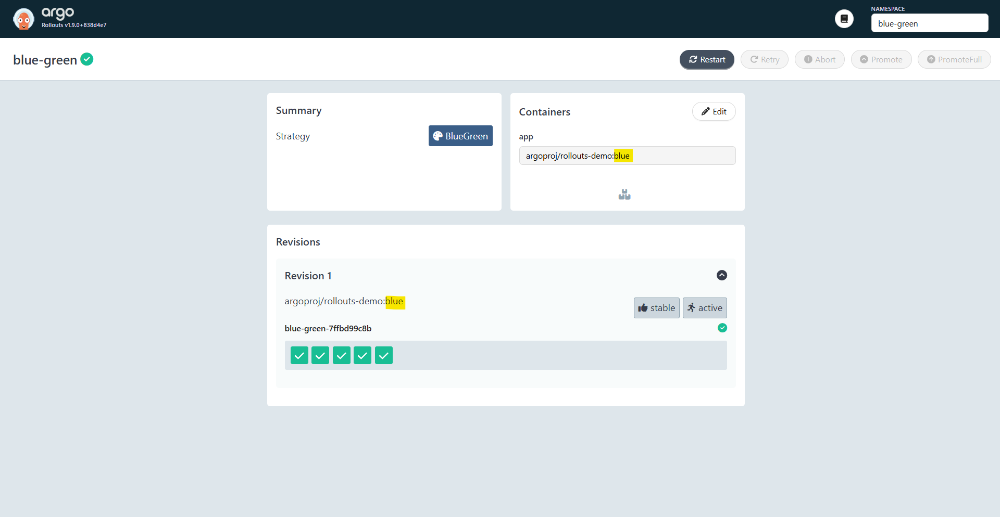
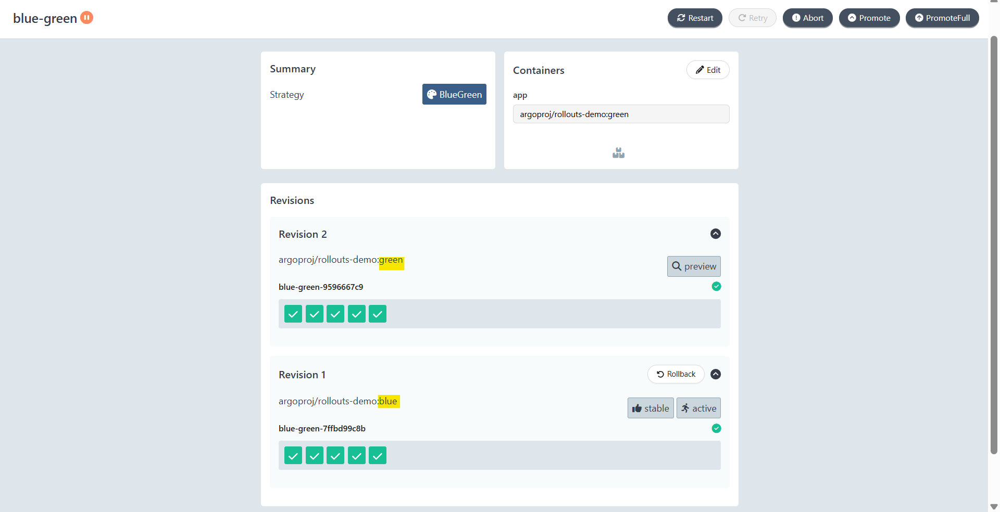
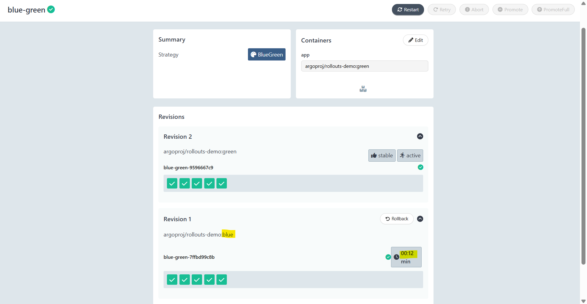
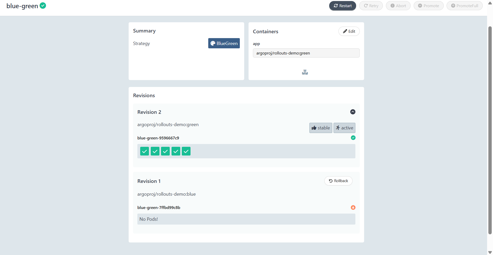

# Argo Rollout - Blue-Green Deployment Strategy

[Back](../index.md)

- [Argo Rollout - Blue-Green Deployment Strategy](#argo-rollout---blue-green-deployment-strategy)
  - [Blue-Green Deployment](#blue-green-deployment)
  - [Lab: Blue-Green Deployment](#lab-blue-green-deployment)
    - [Step 0: Deploy Active Version(Blue)](#step-0-deploy-active-versionblue)
    - [Step 1: Deploy Preview Version(Green)](#step-1-deploy-preview-versiongreen)
    - [Step 2: Promote Green to Blue](#step-2-promote-green-to-blue)

---

## Blue-Green Deployment

- `Blue-green deployment`
  - a **software release strategy** that **minimizes downtime and risk** by **running two identical production environments**
    - allows developers to **test the new version in production** before instantly switching all traffic from `Blue` to `Green`
    - **enabling instant rollbacks** if issues occur.
- `Blue`
  - current live version
- `Green`
  - new version.

---

- **Benefits**
  - **Reduced Risk**:
    - New code is thoroughly **tested in a production environment** before handling live users.
  - **Fast Rollback**:
    - Quick recovery from issues by **switching traffic** back to the original environment.
  - **No Downtime**:
    - Ideal for applications that need to remain available 24/7.

- **Drawbacks**
  - **High Cost**:
    - Requires **doubling the infrastructure resources** to maintain two identical production environments.
  - **Data Synchronization**:
    - Ensuring that databases work correctly with both versions can be complex.

---

**How It Works**

1. Stage 1: Only `Blue` Environment
   - `Blue` is Active
     - The **current** application (`Blue`) is **serving** live user traffic.
   - The application's **stable** version is running.

2. Stage 2: `Blue` & `Green` Environments Side by Side
   - `Green` is Prepared:
     - The **new version** is deployed and tested in the **idle environment** (`Green`).
   - A new ReplicaSet is created as the `Green` Environment, and the `Green` Service points towards its pods.

3. Stage 3: Green Environment as the New Blue
   - Switch Traffic:
     - Once validated, the router/load balancer is configured to **direct all user traffic** to the Green environment.
   - When the new `Green` Environment is deemed healthy, it's promoted as the new `Blue` Environment.
   - The `Blue` environment **stays idle as a backup** for immediate rollback if needed, or becomes the new "idle" environment for the next release.

---

## Lab: Blue-Green Deployment

### Step 0: Deploy Active Version(Blue)

```yaml
# 00-namespace.yaml
apiVersion: v1
kind: Namespace
metadata:
  name: blue-green
---
# 01-services.yaml
apiVersion: v1
kind: Service
metadata:
  name: blue-green-active
  namespace: blue-green
spec:
  ports:
    - name: http
      port: 3000
      targetPort: 3000
      protocol: TCP
  selector:
    app: blue-green
---
apiVersion: v1
kind: Service
metadata:
  name: blue-green-preview
  namespace: blue-green
spec:
  ports:
    - name: http
      port: 3000
      targetPort: 3000
      protocol: TCP
  selector:
    app: blue-green
---
# 02-rollout.yaml
apiVersion: argoproj.io/v1alpha1
kind: Rollout
metadata:
  name: blue-green
  namespace: blue-green
spec:
  replicas: 5
  selector:
    matchLabels:
      app: blue-green
  template:
    metadata:
      labels:
        app: blue-green
    spec:
      containers:
        - name: app
          image: argoproj/rollouts-demo:blue
          # image: argoproj/rollouts-demo:green
          ports:
            - containerPort: 3000
  strategy:
    blueGreen:
      activeService: blue-green-active
      previewService: blue-green-preview
      autoPromotionEnabled: false
```

```sh
kubectl apply -f .
```



---

### Step 1: Deploy Preview Version(Green)

- Update rollout with green

```yaml
apiVersion: argoproj.io/v1alpha1
kind: Rollout
spec:
  template:
    spec:
      containers:
        - name: app
          image: argoproj/rollouts-demo:green # new Preview Version
```

```sh
kubectl apply -f 02-rollout.yaml
# rollout.argoproj.io/blue-green configured

kubectl argo rollouts get rollout blue-green -n blue-green
# Name:            blue-green
# Namespace:       blue-green
# Status:          ॥ Paused
# Message:         BlueGreenPause
# Strategy:        BlueGreen
# Images:          argoproj/rollouts-demo:blue (stable, active)
#                  argoproj/rollouts-demo:green (preview)
# Replicas:
#   Desired:       5
#   Current:       10
#   Updated:       5
#   Ready:         5
#   Available:     5

# NAME                                    KIND        STATUS     AGE  INFO
# ⟳ blue-green                            Rollout     ॥ Paused   14m
# ├──# revision:2
# │  └──⧉ blue-green-9596667c9            ReplicaSet  ✔ Healthy  99s  preview
# │     ├──□ blue-green-9596667c9-c82xm   Pod         ✔ Running  99s  ready:1/1
# │     ├──□ blue-green-9596667c9-kqbq8   Pod         ✔ Running  99s  ready:1/1
# │     ├──□ blue-green-9596667c9-lb97s   Pod         ✔ Running  99s  ready:1/1
# │     ├──□ blue-green-9596667c9-lj8dv   Pod         ✔ Running  99s  ready:1/1
# │     └──□ blue-green-9596667c9-rm9xf   Pod         ✔ Running  99s  ready:1/1
# └──# revision:1
#    └──⧉ blue-green-7ffbd99c8b           ReplicaSet  ✔ Healthy  14m  stable,active
#       ├──□ blue-green-7ffbd99c8b-29llj  Pod         ✔ Running  14m  ready:1/1
#       ├──□ blue-green-7ffbd99c8b-6dc94  Pod         ✔ Running  14m  ready:1/1
#       ├──□ blue-green-7ffbd99c8b-98fjn  Pod         ✔ Running  14m  ready:1/1
#       ├──□ blue-green-7ffbd99c8b-mtxsk  Pod         ✔ Running  14m  ready:1/1
#       └──□ blue-green-7ffbd99c8b-zqzqf  Pod         ✔ Running  14m  ready:1/1

```



> Blue green side by side

---

### Step 2: Promote Green to Blue

- Promote

```sh
kubectl argo rollouts promote blue-green -n blue-green
# rollout 'blue-green' promoted
```



---

- Eventually

```sh
kubectl argo rollouts get rollout blue-green -n blue-green
# Name:            blue-green
# Namespace:       blue-green
# Status:          ✔ Healthy
# Strategy:        BlueGreen
# Images:          argoproj/rollouts-demo:green (stable, active)
# Replicas:
#   Desired:       5
#   Current:       5
#   Updated:       5
#   Ready:         5
#   Available:     5

# NAME                                   KIND        STATUS        AGE    INFO
# ⟳ blue-green                           Rollout     ✔ Healthy     17m
# ├──# revision:2
# │  └──⧉ blue-green-9596667c9           ReplicaSet  ✔ Healthy     4m32s  stable,active
# │     ├──□ blue-green-9596667c9-c82xm  Pod         ✔ Running     4m32s  ready:1/1
# │     ├──□ blue-green-9596667c9-kqbq8  Pod         ✔ Running     4m32s  ready:1/1
# │     ├──□ blue-green-9596667c9-lb97s  Pod         ✔ Running     4m32s  ready:1/1
# │     ├──□ blue-green-9596667c9-lj8dv  Pod         ✔ Running     4m32s  ready:1/1
# │     └──□ blue-green-9596667c9-rm9xf  Pod         ✔ Running     4m32s  ready:1/1
# └──# revision:1
#    └──⧉ blue-green-7ffbd99c8b          ReplicaSet  • ScaledDown  17m

kubectl get replicasets -n blue-green
# NAME                    DESIRED   CURRENT   READY   AGE
# blue-green-7ffbd99c8b   0         0         0       17m
# blue-green-9596667c9    5         5         5       4m55s
```


