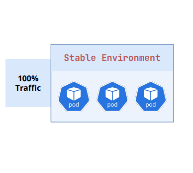
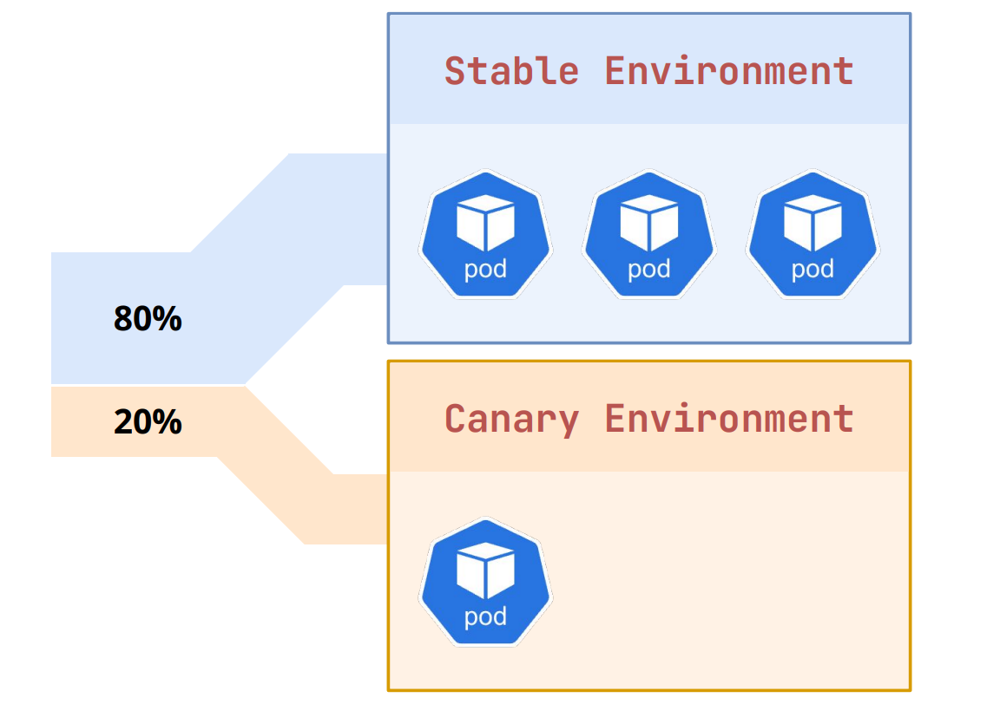
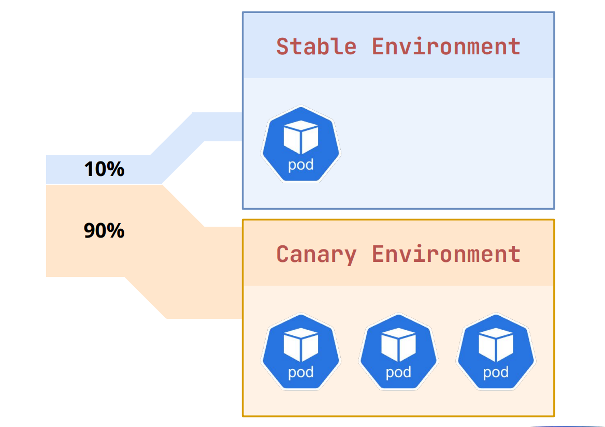
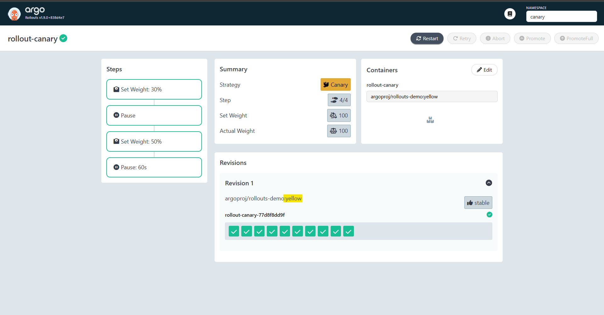
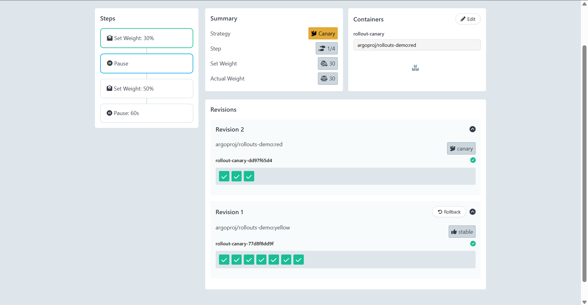
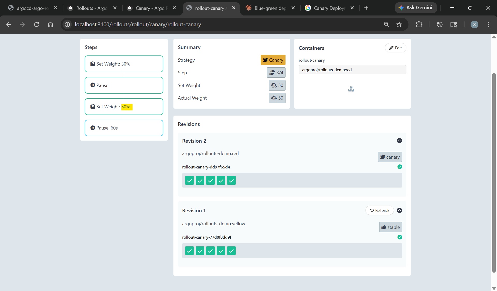
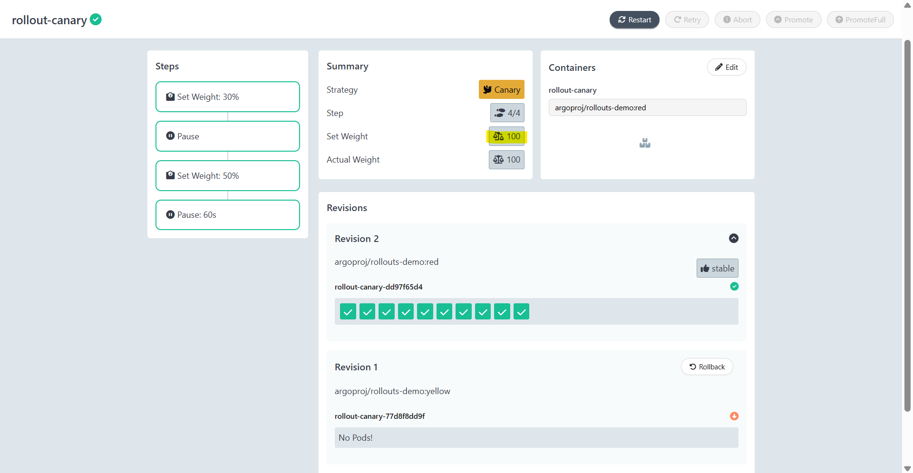

# Argo Rollout - Canary Deployment Strategy

[Back](../index.md)

- [Argo Rollout - Canary Deployment Strategy](#argo-rollout---canary-deployment-strategy)
  - [Canary Deployment](#canary-deployment)
  - [Lab:](#lab)
    - [Step 1: Deploy Stable Version](#step-1-deploy-stable-version)
    - [Step 2: Gradual Shift](#step-2-gradual-shift)
      - [Preview Version](#preview-version)
      - [Promotion](#promotion)
    - [Step 3: Full promotion](#step-3-full-promotion)
    - [Clean up](#clean-up)

---

## Canary Deployment

- `canary deployment`
  - a **software release strategy** that reduces risk by **gradually rolling out** new features to a **small subset of users** before making them available to everyone.
  - acts as an e**arly warning system** allowing developers to test stability in production, monitor for errors, and easily roll back if issues arise.

- Key Aspects of Canary Deployments
  - **Phased Rollout**:
    - Traffic is split between the old (stable) version and the new (canary) version, often using a `load balancer`.
  - **Reduced Risk**:
    - If the new version fails, **only a small percentage** of users are affected, limiting potential downtime or bugs.
  - **Real-world Testing**:
    - Developers can evaluate performance and **gather user feedback in a live environment** rather than a testing environment.
  - **Easy Rollback**:
    - If monitoring detects issues, traffic can be **instantly reverted** to the old version.

---

- **How It Works**

1. Stage 1: Only Stable Environment:
   - The application's **stable version** is running.
   - The new version is deployed to a **limited number** of servers or instances.
     

2. Stage 2: Start of Gradual Shift
   - **New version**: A new Canary Environment is created and receives a portion of traffic.
   - **Traffic shift**: A **small portion of users** (e.g., 5%) is routed to the new version.
   - **Monitor**: Metrics, logs, and user feedback are monitored for errors.
     

3. Stage 3: Continuation of Gradual Shift
   - The traffic is gradually shifted to the Canary Environment until it receives **all the traffic**.
     

---

- Comparison to Other Strategies
- vs. `Blue/Green`:
  - Canary is more risk-averse.
  - Blue/Green switches 100% of traffic at once between two identical environments
  - Canary does it in stages.
- vs. `A/B Testing`:
  - Canary is primarily for testing system stability,
  - A/B testing is for measuring the impact on user behavior.

---

## Lab:

### Step 1: Deploy Stable Version

```yaml
# 00-namespace.yaml
apiVersion: v1
kind: Namespace
metadata:
  name: canary
---
# 01-services.yaml
apiVersion: v1
kind: Service
metadata:
  name: rollout-canary-public
  namespace: canary
spec:
  ports:
    - name: http
      port: 80
      targetPort: 80
      protocol: TCP
  selector:
    app: rollout-canary
---
apiVersion: v1
kind: Service
metadata:
  name: rollout-canary-stable
  namespace: canary
spec:
  ports:
    - name: http
      port: 80
      targetPort: 80
      protocol: TCP
  selector:
    app: rollout-canary
---
apiVersion: v1
kind: Service
metadata:
  name: rollout-canary-preview
  namespace: canary
spec:
  ports:
    - name: http
      port: 80
      targetPort: 80
      protocol: TCP
  selector:
    app: rollout-canary
---
# 02-rollout.yaml
apiVersion: argoproj.io/v1alpha1
kind: Rollout
metadata:
  name: rollout-canary
  namespace: canary
spec:
  replicas: 10
  selector:
    matchLabels:
      app: rollout-canary
  template:
    metadata:
      labels:
        app: rollout-canary
    spec:
      containers:
        - name: rollout-canary
          # image: argoproj/rollouts-demo:yellow
          image: argoproj/rollouts-demo:red
          ports:
            - name: http
              containerPort: 80
              protocol: TCP
  strategy:
    canary:
      canaryService: rollout-canary-preview
      stableService: rollout-canary-stable
      steps:
        - setWeight: 30
        - pause: {} # indefinite — manual promotion required
        - setWeight: 50
        - pause:
            duration: 60s
```

```sh
kubectl apply -f .
# namespace/canary created
# service/rollout-canary-public created
# service/rollout-canary-stable created
# service/rollout-canary-preview created
# rollout.argoproj.io/rollout-canary created

kubectl argo rollouts get rollout rollout-canary -n canary
# Name:            rollout-canary
# Namespace:       canary
# Status:          ✔ Healthy
# Strategy:        Canary
#   Step:          4/4
#   SetWeight:     100
#   ActualWeight:  100
# Images:          argoproj/rollouts-demo:yellow (stable)
# Replicas:
#   Desired:       10
#   Current:       10
#   Updated:       10
#   Ready:         10
#   Available:     10

# NAME                                        KIND        STATUS     AGE  INFO
# ⟳ rollout-canary                            Rollout     ✔ Healthy  39s
# └──# revision:1
#    └──⧉ rollout-canary-77d8f8dd9f           ReplicaSet  ✔ Healthy  39s  stable
#       ├──□ rollout-canary-77d8f8dd9f-2lmsz  Pod         ✔ Running  39s  ready:1/1
#       ├──□ rollout-canary-77d8f8dd9f-4pqw6  Pod         ✔ Running  39s  ready:1/1
#       ├──□ rollout-canary-77d8f8dd9f-967v9  Pod         ✔ Running  39s  ready:1/1
#       ├──□ rollout-canary-77d8f8dd9f-cmz5d  Pod         ✔ Running  39s  ready:1/1
#       ├──□ rollout-canary-77d8f8dd9f-gt56n  Pod         ✔ Running  39s  ready:1/1
#       ├──□ rollout-canary-77d8f8dd9f-jxd9j  Pod         ✔ Running  39s  ready:1/1
#       ├──□ rollout-canary-77d8f8dd9f-kdcnn  Pod         ✔ Running  39s  ready:1/1
#       ├──□ rollout-canary-77d8f8dd9f-px8pv  Pod         ✔ Running  39s  ready:1/1
#       ├──□ rollout-canary-77d8f8dd9f-rmrlq  Pod         ✔ Running  39s  ready:1/1
#       └──□ rollout-canary-77d8f8dd9f-vdjtr  Pod         ✔ Running  39s  ready:1/1
```



---

### Step 2: Gradual Shift

#### Preview Version

```yaml
image: argoproj/rollouts-demo:red
```

```sh
kubectl apply -f .
# namespace/canary unchanged
# service/rollout-canary-public unchanged
# service/rollout-canary-stable unchanged
# service/rollout-canary-preview unchanged
# rollout.argoproj.io/rollout-canary configured

kubectl argo rollouts get rollout rollout-canary -n canary
# Name:            rollout-canary
# Namespace:       canary
# Status:          ॥ Paused
# Message:         CanaryPauseStep
# Strategy:        Canary
#   Step:          1/4
#   SetWeight:     30
#   ActualWeight:  30
# Images:          argoproj/rollouts-demo:red (canary)
#                  argoproj/rollouts-demo:yellow (stable)
# Replicas:
#   Desired:       10
#   Current:       10
#   Updated:       3
#   Ready:         10
#   Available:     10

# NAME                                        KIND        STATUS     AGE   INFO
# ⟳ rollout-canary                            Rollout     ॥ Paused   106s
# ├──# revision:2
# │  └──⧉ rollout-canary-dd97f65d4            ReplicaSet  ✔ Healthy  21s   canary
# │     ├──□ rollout-canary-dd97f65d4-29szj   Pod         ✔ Running  21s   ready:1/1
# │     ├──□ rollout-canary-dd97f65d4-4vqvv   Pod         ✔ Running  21s   ready:1/1
# │     └──□ rollout-canary-dd97f65d4-pgmm5   Pod         ✔ Running  21s   ready:1/1
# └──# revision:1
#    └──⧉ rollout-canary-77d8f8dd9f           ReplicaSet  ✔ Healthy  106s  stable
#       ├──□ rollout-canary-77d8f8dd9f-967v9  Pod         ✔ Running  106s  ready:1/1
#       ├──□ rollout-canary-77d8f8dd9f-cmz5d  Pod         ✔ Running  106s  ready:1/1
#       ├──□ rollout-canary-77d8f8dd9f-gt56n  Pod         ✔ Running  106s  ready:1/1
#       ├──□ rollout-canary-77d8f8dd9f-kdcnn  Pod         ✔ Running  106s  ready:1/1
#       ├──□ rollout-canary-77d8f8dd9f-px8pv  Pod         ✔ Running  106s  ready:1/1
#       ├──□ rollout-canary-77d8f8dd9f-rmrlq  Pod         ✔ Running  106s  ready:1/1
#       └──□ rollout-canary-77d8f8dd9f-vdjtr  Pod         ✔ Running  106s  ready:1/1
```



#### Promotion

```sh
kubectl argo rollouts promote rollout-canary -n canary
# rollout 'rollout-canary' promoted

kubectl argo rollouts get rollout rollout-canary -n canary
# Name:            rollout-canary
# Namespace:       canary
# Status:          ॥ Paused
# Message:         CanaryPauseStep
# Strategy:        Canary
#   Step:          3/4
#   SetWeight:     50
#   ActualWeight:  50
# Images:          argoproj/rollouts-demo:red (canary)
#                  argoproj/rollouts-demo:yellow (stable)
# Replicas:
#   Desired:       10
#   Current:       10
#   Updated:       5
#   Ready:         10
#   Available:     10

# NAME                                        KIND        STATUS         AGE    INFO
# ⟳ rollout-canary                            Rollout     ॥ Paused       4m45s
# ├──# revision:2
# │  └──⧉ rollout-canary-dd97f65d4            ReplicaSet  ✔ Healthy      3m20s  canary
# │     ├──□ rollout-canary-dd97f65d4-29szj   Pod         ✔ Running      3m20s  ready:1/1
# │     ├──□ rollout-canary-dd97f65d4-4vqvv   Pod         ✔ Running      3m20s  ready:1/1
# │     ├──□ rollout-canary-dd97f65d4-pgmm5   Pod         ✔ Running      3m20s  ready:1/1
# │     ├──□ rollout-canary-dd97f65d4-7gvfw   Pod         ✔ Running      11s    ready:1/1
# │     └──□ rollout-canary-dd97f65d4-lfc8x   Pod         ✔ Running      11s    ready:1/1
# └──# revision:1
#    └──⧉ rollout-canary-77d8f8dd9f           ReplicaSet  ✔ Healthy      4m45s  stable
#       ├──□ rollout-canary-77d8f8dd9f-967v9  Pod         ◌ Terminating  4m45s  ready:1/1
#       ├──□ rollout-canary-77d8f8dd9f-cmz5d  Pod         ✔ Running      4m45s  ready:1/1
#       ├──□ rollout-canary-77d8f8dd9f-gt56n  Pod         ✔ Running      4m45s  ready:1/1
#       ├──□ rollout-canary-77d8f8dd9f-kdcnn  Pod         ✔ Running      4m45s  ready:1/1
#       ├──□ rollout-canary-77d8f8dd9f-px8pv  Pod         ✔ Running      4m45s  ready:1/1
#       ├──□ rollout-canary-77d8f8dd9f-rmrlq  Pod         ◌ Terminating  4m45s  ready:1/1
#       └──□ rollout-canary-77d8f8dd9f-vdjtr  Pod         ✔ Running      4m45s  ready:1/1
```



---

### Step 3: Full promotion

```sh
kubectl argo rollouts get rollout rollout-canary -n canary
# Name:            rollout-canary
# Namespace:       canary
# Status:          ✔ Healthy
# Strategy:        Canary
#   Step:          4/4
#   SetWeight:     100
#   ActualWeight:  100
# Images:          argoproj/rollouts-demo:red (stable)
# Replicas:
#   Desired:       10
#   Current:       10
#   Updated:       10
#   Ready:         10
#   Available:     10

# NAME                                       KIND        STATUS        AGE    INFO
# ⟳ rollout-canary                           Rollout     ✔ Healthy     7m6s
# ├──# revision:2
# │  └──⧉ rollout-canary-dd97f65d4           ReplicaSet  ✔ Healthy     5m41s  stable
# │     ├──□ rollout-canary-dd97f65d4-29szj  Pod         ✔ Running     5m41s  ready:1/1
# │     ├──□ rollout-canary-dd97f65d4-4vqvv  Pod         ✔ Running     5m41s  ready:1/1
# │     ├──□ rollout-canary-dd97f65d4-pgmm5  Pod         ✔ Running     5m41s  ready:1/1
# │     ├──□ rollout-canary-dd97f65d4-7gvfw  Pod         ✔ Running     2m32s  ready:1/1
# │     ├──□ rollout-canary-dd97f65d4-lfc8x  Pod         ✔ Running     2m32s  ready:1/1
# │     ├──□ rollout-canary-dd97f65d4-4879x  Pod         ✔ Running     89s    ready:1/1
# │     ├──□ rollout-canary-dd97f65d4-68ltg  Pod         ✔ Running     89s    ready:1/1
# │     ├──□ rollout-canary-dd97f65d4-cmlxg  Pod         ✔ Running     89s    ready:1/1
# │     ├──□ rollout-canary-dd97f65d4-j6zmh  Pod         ✔ Running     89s    ready:1/1
# │     └──□ rollout-canary-dd97f65d4-xpx5n  Pod         ✔ Running     89s    ready:1/1
# └──# revision:1
#    └──⧉ rollout-canary-77d8f8dd9f          ReplicaSet  • ScaledDown  7m6s
```



---

### Clean up

```sh
kubectl get rollouts -n canary
# NAME             DESIRED   CURRENT   UP-TO-DATE   AVAILABLE   AGE
# rollout-canary   10        10        10           10          9m47s

kubectl delete rollouts rollout-canary -n canary
# rollout.argoproj.io "rollout-canary" deleted from canary namespace
```
