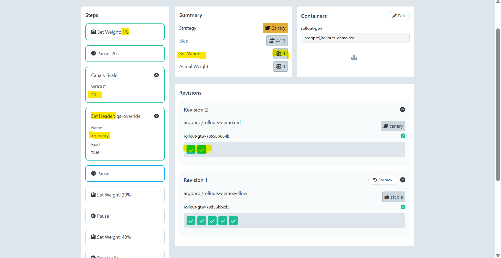

# Argo Rollout - Traffic-Weighted Canary

[Back](../index.md)

- [Argo Rollout - Traffic-Weighted Canary](#argo-rollout---traffic-weighted-canary)
  - [Header-based routing](#header-based-routing)
  - [Lab: Header-based routing](#lab-header-based-routing)
    - [Deploy Stable Version](#deploy-stable-version)
    - [Deploy Preview Version](#deploy-preview-version)

---

## Header-based routing

- `Header-based routing`
  - direct **specific HTTP requests** to a `canary` version of the application **based on request headers**, rather than a random percentage of traffic.
  - **useful** for `A/B testing`, `session stickiness`, or allowing **internal testers** to preview a new version by adding a specific header (e.g., x-canary: true).

- **How it Works**
  - `header-based routing` uses the `setHeaderRoute` action within the rollout steps.
  - When a **request matches** the specified header criteria, the traffic router (like Istio or Nginx) **bypasses the weighted logic** and sends that traffic directly to the canary service.

---

## Lab: Header-based routing

### Deploy Stable Version

```sh
kubectl apply -f .
# namespace/gtw-canary unchanged
# gateway.gateway.networking.k8s.io/rollout-gtw unchanged
# httproute.gateway.networking.k8s.io/rollout-gtw-route configured
# service/rollout-gtw-stable unchanged
# service/rollout-gtw-canary unchanged
# rollout.argoproj.io/rollout-gtw created
```

### Deploy Preview Version

```sh
# confirm pod scale 40%
kubectl argo rollouts get rollout rollout-gtw -n gtw-canary
# Name:            rollout-gtw
# Namespace:       gtw-canary
# Status:          ॥ Paused
# Message:         CanaryPauseStep
# Strategy:        Canary
#   Step:          4/13
#   SetWeight:     1
#   ActualWeight:  1
# Images:          argoproj/rollouts-demo:red (canary)
#                  argoproj/rollouts-demo:yellow (stable)
# Replicas:
#   Desired:       5
#   Current:       7
#   Updated:       2
#   Ready:         7
#   Available:     7

# NAME                                     KIND        STATUS     AGE    INFO
# ⟳ rollout-gtw                            Rollout     ॥ Paused   7m
# ├──# revision:2
# │  └──⧉ rollout-gtw-78558b664b           ReplicaSet  ✔ Healthy  2m38s  canary
# │     ├──□ rollout-gtw-78558b664b-d98z9  Pod         ✔ Running  2m38s  ready:1/1
# │     └──□ rollout-gtw-78558b664b-q6g89  Pod         ✔ Running  2m17s  ready:1/1
# └──# revision:1
#    └──⧉ rollout-gtw-79d56bbcd5           ReplicaSet  ✔ Healthy  7m     stable
#       ├──□ rollout-gtw-79d56bbcd5-4xsq7  Pod         ✔ Running  7m     ready:1/1
#       ├──□ rollout-gtw-79d56bbcd5-p2572  Pod         ✔ Running  7m     ready:1/1
#       ├──□ rollout-gtw-79d56bbcd5-p8j4v  Pod         ✔ Running  7m     ready:1/1
#       ├──□ rollout-gtw-79d56bbcd5-vzxb2  Pod         ✔ Running  7m     ready:1/1
#       └──□ rollout-gtw-79d56bbcd5-zlmm4  Pod         ✔ Running  7m     ready:1/1

# confirm traffic 1%; header
kubectl describe httproute -n gtw-canary rollout-gtw-route
  # Rules:
  #   Backend Refs:
  #     Group:
  #     Kind:    Service
  #     Name:    rollout-gtw-stable
  #     Port:    80
  #     Weight:  99
  #     Group:
  #     Kind:    Service
  #     Name:    rollout-gtw-canary
  #     Port:    80
  #     Weight:  1
  #   Backend Refs:
  #     Group:
  #     Kind:    Service
  #     Name:    rollout-gtw-canary
  #     Port:    80
  #     Weight:  1
  #   Matches:
  #     Headers:
  #       Name:   x-canary
  #       Type:   Exact
  #       Value:  true
  #     Path:
  #       Type:   PathPrefix
  #       Value:  /
  #   Name:       qa-override
```


