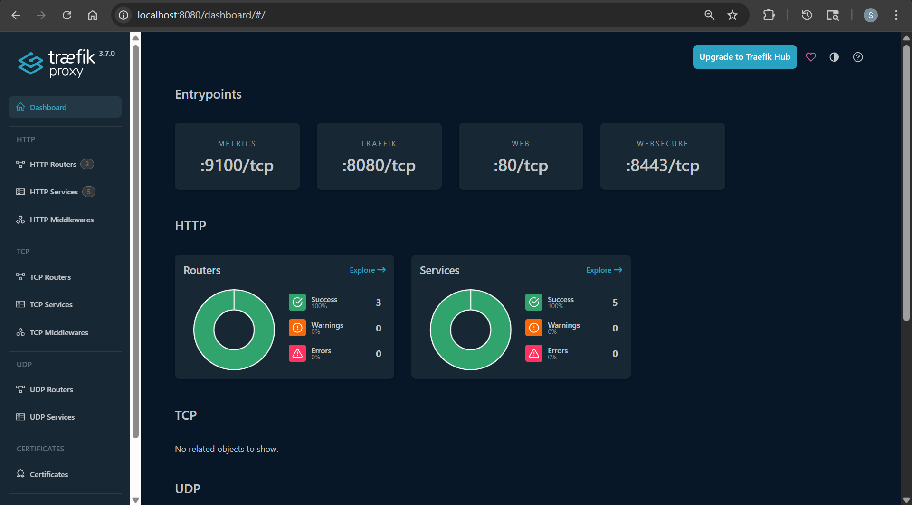

# Gateway API - Traefik

[Back](../index.md)

- [Gateway API - Traefik](#gateway-api---traefik)
  - [Inatall](#inatall)
  - [Sample Application](#sample-application)
  - [Install Argo Rollout Controller](#install-argo-rollout-controller)

---

## Inatall

- ref:
  - https://doc.traefik.io/traefik/getting-started/kubernetes/

```sh
# install Gateway controller
kubectl apply -f https://github.com/kubernetes-sigs/gateway-api/releases/download/v1.5.1/standard-install.yaml
# customresourcedefinition.apiextensions.k8s.io/backendtlspolicies.gateway.networking.k8s.io created
# customresourcedefinition.apiextensions.k8s.io/gatewayclasses.gateway.networking.k8s.io created
# customresourcedefinition.apiextensions.k8s.io/gateways.gateway.networking.k8s.io created
# customresourcedefinition.apiextensions.k8s.io/grpcroutes.gateway.networking.k8s.io created
# customresourcedefinition.apiextensions.k8s.io/httproutes.gateway.networking.k8s.io created
# customresourcedefinition.apiextensions.k8s.io/listenersets.gateway.networking.k8s.io created
# customresourcedefinition.apiextensions.k8s.io/referencegrants.gateway.networking.k8s.io created
# customresourcedefinition.apiextensions.k8s.io/tlsroutes.gateway.networking.k8s.io created
# validatingadmissionpolicy.admissionregistration.k8s.io/safe-upgrades.gateway.networking.k8s.io created
# validatingadmissionpolicybinding.admissionregistration.k8s.io/safe-upgrades.gateway.networking.k8s.io created

# add traefik helm repo
helm repo add traefik https://traefik.github.io/charts
helm repo update
kubectl create namespace traefik
```

- Values.yaml
  - ref: https://doc.traefik.io/traefik/setup/kubernetes/

```yaml
# values.yaml
ports:
  web:
    port: 80
    expose:
      default: true
    exposedPort: 80

ingressRoute:
  dashboard:
    enabled: true
    matchRule: Host(`localhost`)
    entryPoints:
      - web

api:
  dashboard: true
  insecure: false

ingressClass:
  enabled: false

providers:
  kubernetesIngress:
    enabled: false
  kubernetesGateway:
    enabled: true

gateway:
  listeners:
    web:           # HTTP listener that matches entryPoint `web`
      port: 80
      protocol: HTTP
      namespacePolicy:
        from: All

logs:
  access:
    enabled: true

metrics:
  prometheus:
    enabled: true
```

```sh
helm search repo traefik
# NAME                    CHART VERSION   APP VERSION     DESCRIPTION
# traefik/traefik         40.0.0          v3.7.0          A Traefik based Kubernetes ingress controller

helm upgrade -i traefik traefik/traefik -f traefik-values.yaml --version 40.0.0 -n traefik --wait
# Release "traefik" does not exist. Installing it now.
# NAME: traefik
# LAST DEPLOYED: Thu May  7 16:32:33 2026
# NAMESPACE: traefik
# STATUS: deployed
# REVISION: 1
# TEST SUITE: None
# NOTES:
# traefik with docker.io/traefik:v3.7.0 has been deployed successfully on traefik namespace!

kubectl get GatewayClass
# NAME      CONTROLLER                      ACCEPTED   AGE
# traefik   traefik.io/gateway-controller   True       9s

kubectl get ingressroute -n traefik
# NAME                AGE
# traefik-dashboard   9m34s

kubectl port-forward svc/traefik -n traefik 8080:80
```



---

## Sample Application

```yaml
apiVersion: apps/v1
kind: Deployment
metadata:
  name: whoami
spec:
  replicas: 2
  selector:
    matchLabels:
      app: whoami
  template:
    metadata:
      labels:
        app: whoami
    spec:
      containers:
        - name: whoami
          image: traefik/whoami
          ports:
            - containerPort: 8080
---
apiVersion: v1
kind: Service
metadata:
  name: whoami
spec:
  ports:
    - port: 8080
  selector:
    app: whoami
---
apiVersion: traefik.io/v1alpha1
kind: IngressRoute
metadata:
  name: whoami
spec:
  entryPoints:
    - web
  routes:
    - match: Host(`whoami.localhost`)
      kind: Rule
      services:
        - name: whoami
          port: 8080
```

```sh
kubectl apply -f demo.yaml
# deployment.apps/whoami created
# service/whoami created
# ingressroute.traefik.io/whoami created

curl -v -H "Host: whoami.localhost" http://localhost
```
---

## Install Argo Rollout Controller

- helm values ref: https://rollouts-plugin-trafficrouter-gatewayapi.readthedocs.io/en/latest/installation/#installing-the-plugin-via-init-containers


```sh
helm upgrade --install argo-rollouts argo/argo-rollouts --version 2.40.9 --namespace argo-rollouts --create-namespace --values rollout-values.yaml
# Release "argo-rollouts" has been upgraded. Happy Helming!
# NAME: argo-rollouts
# LAST DEPLOYED: Thu May  7 18:29:06 2026
# NAMESPACE: argo-rollouts
# STATUS: deployed
# REVISION: 2
# DESCRIPTION: Upgrade complete
# TEST SUITE: None

# restart deploy
kubectl rollout restart deployment -n argo-rollouts argo-rollouts
# deployment.apps/argo-rollouts restarted

kubectl get po -n argo-rollouts -w
# NAME                                       READY   STATUS    RESTARTS   AGE
# argo-rollouts-5dfb44df9d-24br9             1/1     Running   0          49s
# argo-rollouts-5dfb44df9d-f94nq             1/1     Running   0          69s
# argo-rollouts-dashboard-64d9f854c9-2z4r4   1/1     Running   0          5m34s

# confirm
kubectl logs argo-rollouts-5dfb44df9d-24br9 -n argo-rollouts | grep plugin
# Defaulted container "argo-rollouts" out of: argo-rollouts, copy-gwapi-plugin (init)
# time="2026-05-07T22:37:29Z" level=info msg="Copied plugin from /plugins/rollouts-plugin-trafficrouter-gatewayapi to /home/argo-rollouts/plugin-bin/argoproj-labs/gatewayAPI"
```