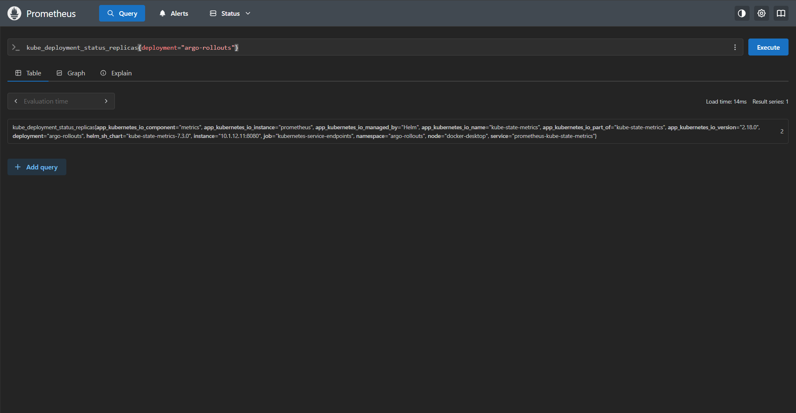

# Argo Rollout - with `Prometheus`

[Back](../index.md)

- [Argo Rollout - with `Prometheus`](#argo-rollout---with-prometheus)
  - [Prometheus Architecture](#prometheus-architecture)
  - [Lab: Install Prometheus](#lab-install-prometheus)

---

## Prometheus Architecture

- `Prometheus server`
  - the brain of the whole system.
  - **periodically scrapes metrics** from configured targets, stores them in its time-series database (TSDB), evaluates alerting/recording rules, and exposes a query interface (PromQL).
  - pull model

- `kube-state-metrics`
  - a **service** that **watches the Kubernetes API** and converts object state into Prometheus-compatible metrics — things like pod readiness, deployment replica counts, node conditions, and job statuses.

- `node-exporter`
  - runs on **every node** and exposes hardware and **OS metrics** from the host — CPU, memory, disk I/O, network, file descriptors, etc.
  - It's the ground-level view of each machine.

- `Pushgateway`
  - Accepts pushed metrics
  - Short-lived jobs like batch processes or cron jobs die **before Prometheus can scrape** them, so they **push their final metrics** to the `Pushgateway`, which holds them until Prometheus scrapes it.

- `Alertmanager`
  - receives **firing alerts** from the Prometheus server and handles everything downstream: deduplication (so you don't get 100 pages for the same incident), grouping, silencing, inhibition, and routing alerts to the right destination (Slack, PagerDuty, email, etc.).

---

## Lab: Install Prometheus

```sh
helm repo add prometheus-community https://prometheus-community.github.io/helm-charts
helm repo update

helm search repo prometheus
# prometheus-community/prometheus                         29.6.0          v3.11.3         Prometheus is a monitoring system and time seri...

helm upgrade --install prometheus prometheus-community/prometheus --version 29.6.0 --namespace monitoring --create-namespace --values prometheus_values.yaml
# NAME: prometheus
# LAST DEPLOYED: Thu May  7 22:03:47 2026
# NAMESPACE: monitoring
# STATUS: deployed
# REVISION: 1
# DESCRIPTION: Install complete
# TEST SUITE: None
# NOTES:
# The Prometheus server can be accessed via port 80 on the following DNS name from within your cluster:
# prometheus-server.monitoring.svc.cluster.local


# Get the Prometheus server URL by running these commands in the same shell:
#   export NODE_PORT=$(kubectl get --namespace monitoring -o jsonpath="{.spec.ports[0].nodePort}" services prometheus-server)
#   export NODE_IP=$(kubectl get nodes --namespace monitoring -o jsonpath="{.items[0].status.addresses[0].address}")
#   echo http://$NODE_IP:$NODE_PORT

# Prometheus alertmanager can be accessed via port 9093 on the following DNS name from within your cluster:
# prometheus-alertmanager.monitoring.svc.cluster.local


# Get the Alertmanager URL by running these commands in the same shell:
#   export POD_NAME=$(kubectl get pods --namespace monitoring -l "app.kubernetes.io/name=alertmanager,app.kubernetes.io/instance=prometheus" -o jsonpath="{.items[0].metadata.name}")
#   kubectl --namespace monitoring port-forward $POD_NAME 9093

# Prometheus Pushgateway can be accessed via port 9091 on the following DNS name from within your cluster:
# prometheus-prometheus-pushgateway.monitoring.svc.cluster.local


# Get the Pushgateway URL by running these commands in the same shell:
#   export POD_NAME=$(kubectl get pods --namespace monitoring -l "app.kubernetes.io/name=prometheus-pushgateway,app.kubernetes.io/instance=prometheus" -o jsonpath="{.items[0].metadata.name}")
#   kubectl --namespace monitoring port-forward $POD_NAME 9091

# For more information on running Prometheus, visit:
# https://prometheus.io/

# confirm
kubectl get po -n monitoring


kubectl port-forward svc/prometheus-server 8080:80 -n monitoring
```


