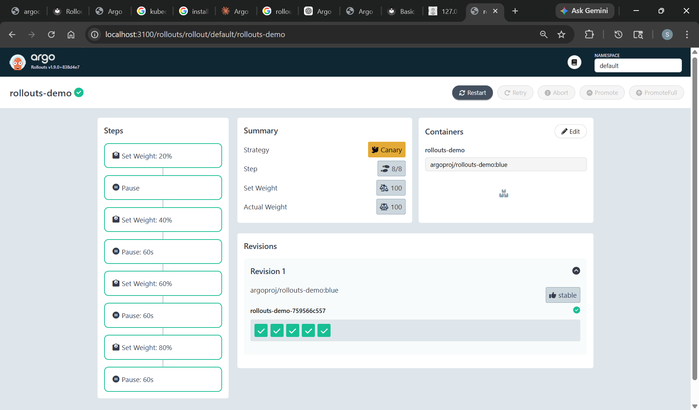
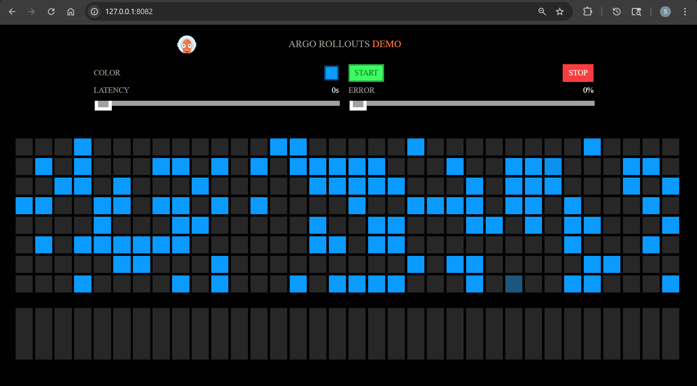
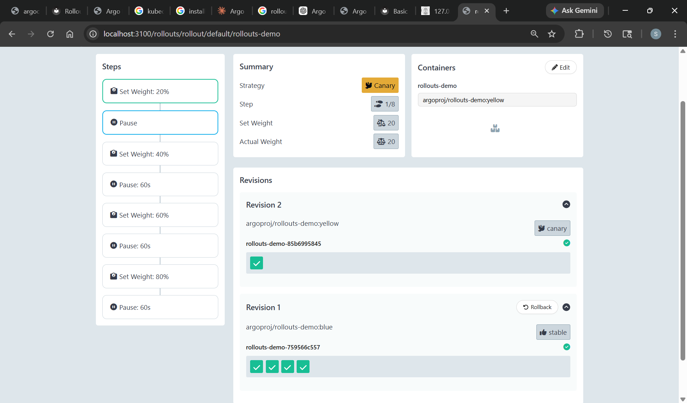
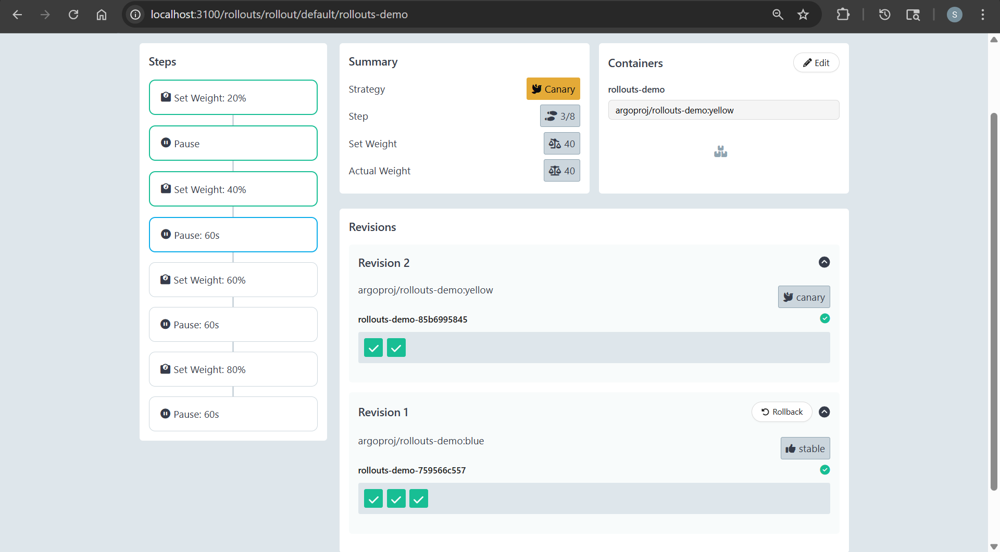
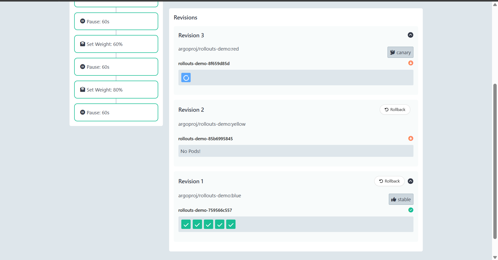
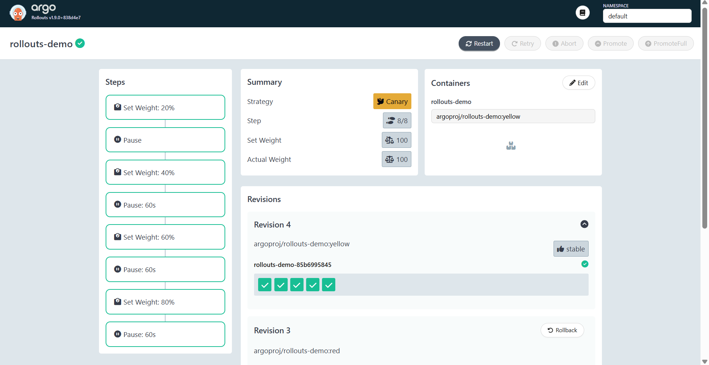
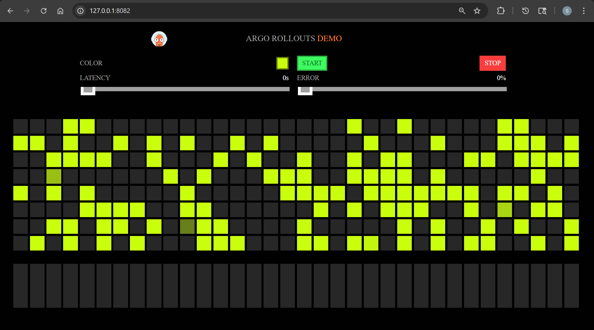

# Argo Rollout - Rollout

[Back](../index.md)

- [Argo Rollout - Rollout](#argo-rollout---rollout)
  - [Rollout CRD](#rollout-crd)
    - [Common Commands](#common-commands)
    - [Lab: Demo rollout](#lab-demo-rollout)
      - [Deploy a Rollout](#deploy-a-rollout)
      - [Updating a Rollout](#updating-a-rollout)
      - [Promoting a Rollout](#promoting-a-rollout)
      - [Aborting a Rollout](#aborting-a-rollout)
      - [Promote until full deploy](#promote-until-full-deploy)
      - [Clean up](#clean-up)

---

## Rollout CRD

- `Argo Rollouts`
  - a set of `CRDs` that replaces the standard `Kubernetes Deployment` object to provide advanced, automated deployment capabilities.
  - It facilitates progressive delivery—specifically blue-green and canary deployments—to reduce downtime and risk during application updates.

---

### Common Commands

- Viewing & Monitoring

| Command                                               | Description                                                           |
| ----------------------------------------------------- | --------------------------------------------------------------------- |
| `kubectl argo rollouts list rollouts`                 | Lists Rollout resources in the current namespace.                     |
| `kubectl argo rollouts list rollouts -n <namespace>`  | List rollouts in a specific namespace                                 |
| `kubectl argo rollouts get rollout <rollout>`         | Displays detailed status of a Rollout.                                |
| `kubectl argo rollouts get rollout <rollout> --watch` | Watches the Rollout progress in real time.                            |
| `kubectl argo rollouts status <rollout>`              | Shows whether a Rollout is healthy, progressing, paused, or degraded. |

- Creating and Updating

| Command                                                         | Description                                                    |
| --------------------------------------------------------------- | -------------------------------------------------------------- |
| `kubectl apply -f rollout.yaml`                                 | Apply a rollout manifest (standard way to update rollout spec) |
| `kubectl argo rollouts restart <rollout>`                       | **Restarts** pods managed by the Rollout.                      |
| `kubectl argo rollouts set image <rollout> <container>=<image>` | Updates the container image of a Rollout.                      |

- Controlling Progression

| Command                                               | Description                                                                 |
| ----------------------------------------------------- | --------------------------------------------------------------------------- |
| `kubectl argo rollouts promote <rollout>`             | Manually promotes a paused Rollout to the next step.                        |
| `kubectl argo rollouts promote <rollout> --full`      | Fully promotes the Rollout and skips the remaining canary steps.            |
| `kubectl argo rollouts abort <rollout>`               | Aborts the current rollout update and stops progressing to the new version. |
| `kubectl argo rollouts retry rollout <rollout>`       | **Retries** a failed Rollout.                                               |
| `kubectl argo rollouts pause <rollout>`               | Pauses a Rollout manually.                                                  |
| `kubectl argo rollouts resume <rollout>`              | Resumes a paused Rollout.                                                   |
| `kubectl argo rollouts undo <rollout>`                | Rolls back to a **previous revision**.                                      |
| `kubectl argo rollouts undo <name> --to-revision=<N>` | Roll back to a specific revision number                                     |
| `kubectl delete rollout rollouts-demo`                | Delete rollout                                                              |

- Analysis & Experiments

| Command                                                                              | Description                                       |
| ------------------------------------------------------------------------------------ | ------------------------------------------------- |
| `kubectl argo rollouts lint -f <file>`                                               | Validates Rollout manifests before applying them. |
| `kubectl argo rollouts terminate analysisrun <analysisrun>`                          | Terminates a running AnalysisRun.                 |
| `kubectl argo rollouts retry analysisrun <analysisrun>`                              | Retries a failed AnalysisRun.                     |
| `kubectl argo rollouts completion bash`                                              | Generates shell completion for Bash.              |
| `kubectl argo rollouts get experiment <name>`                                        | Get details of an experiment                      |
| `kubectl argo rollouts list experiments`                                             | List all experiments                              |
| `kubectl argo rollouts create analysisrun --from-clusteranalysistemplate <template>` | Manually trigger an analysis run                  |

---

- example

```yaml
apiVersion: argoproj.io/v1alpha1
kind: Rollout
metadata:
  name: guestbook-ui
spec:
  replicas: 5
  selector:
    matchLabels:
      app: guestbook
  template:
    spec:
      containers:
        - name: guestbook
          image: argoproj/rollouts-demo:blue
  strategy: {}
```

---

### Lab: Demo rollout

#### Deploy a Rollout

```yaml
# rollout.yaml
apiVersion: argoproj.io/v1alpha1
kind: Rollout
metadata:
  name: rollouts-demo
spec:
  replicas: 5
  selector:
    matchLabels:
      app: rollouts-demo
  template:
    metadata:
      labels:
        app: rollouts-demo
    spec:
      containers:
        - name: rollouts-demo
          image: argoproj/rollouts-demo:blue # v1 (stable)
          ports:
            - name: http
              containerPort: 8080
              protocol: TCP
  strategy:
    canary:
      steps:
        - setWeight: 20 # 20%
        - pause: {} # Pause, manual promotion required
        - setWeight: 40 # 40%
        - pause: { duration: 60 } # Auto-advance
        - setWeight: 60 # 60%
        - pause: { duration: 60 } # Auto-advance
        - setWeight: 80 # 80%
        - pause: { duration: 60 } # Auto-advance, Full rollout

---
# service.yaml
# service.yaml
apiVersion: v1
kind: Service
metadata:
  name: rollouts-demo
spec:
  ports:
    - port: 80
      targetPort: http
      protocol: TCP
      name: http
  selector:
    app: rollouts-demo
```

```sh
kubectl apply -f .
# rollout.argoproj.io/rollouts-demo created
# service/rollouts-demo created

kubectl argo rollouts list rollouts
# NAME           STRATEGY   STATUS        STEP  SET-WEIGHT  READY  DESIRED  UP-TO-DATE  AVAILABLE
# rollouts-demo  Canary     Healthy       8/8   100         5/5    5        5           5

kubectl argo rollouts get rollouts rollouts-demo
# Name:            rollouts-demo
# Namespace:       default
# Status:          ✔ Healthy
# Strategy:        Canary
#   Step:          8/8
#   SetWeight:     100
#   ActualWeight:  100
# Images:          argoproj/rollouts-demo:blue (stable)
# Replicas:
#   Desired:       5
#   Current:       5
#   Updated:       5
#   Ready:         5
#   Available:     5

# NAME                                       KIND        STATUS     AGE    INFO
# ⟳ rollouts-demo                            Rollout     ✔ Healthy  2m47s
# └──# revision:1
#    └──⧉ rollouts-demo-759566c557           ReplicaSet  ✔ Healthy  2m47s  stable
#       ├──□ rollouts-demo-759566c557-65gg8  Pod         ✔ Running  2m47s  ready:1/1
#       ├──□ rollouts-demo-759566c557-g2wgt  Pod         ✔ Running  2m47s  ready:1/1
#       ├──□ rollouts-demo-759566c557-gk9w6  Pod         ✔ Running  2m47s  ready:1/1
#       ├──□ rollouts-demo-759566c557-n2k7x  Pod         ✔ Running  2m47s  ready:1/1
#       └──□ rollouts-demo-759566c557-rdp8t  Pod         ✔ Running  2m47s  ready:1/1

kubectl argo rollouts status rollouts-demo
# Healthy
```





---

#### Updating a Rollout

- Set image

```sh
kubectl argo rollouts set image rollouts-demo rollouts-demo=argoproj/rollouts-demo:yellow
# rollout "rollouts-demo" image updated

kubectl argo rollouts get rollouts rollouts-demo
# Name:            rollouts-demo
# Namespace:       default
# Status:          ॥ Paused
# Message:         CanaryPauseStep
# Strategy:        Canary
#   Step:          1/8
#   SetWeight:     20
#   ActualWeight:  20
# Images:          argoproj/rollouts-demo:blue (stable)
#                  argoproj/rollouts-demo:yellow (canary)
# Replicas:
#   Desired:       5
#   Current:       5
#   Updated:       1
#   Ready:         5
#   Available:     5

# NAME                                       KIND        STATUS     AGE    INFO
# ⟳ rollouts-demo                            Rollout     ॥ Paused   5m38s
# ├──# revision:2
# │  └──⧉ rollouts-demo-85b6995845           ReplicaSet  ✔ Healthy  17s    canary
# │     └──□ rollouts-demo-85b6995845-cmkg6  Pod         ✔ Running  17s    ready:1/1
# └──# revision:1
#    └──⧉ rollouts-demo-759566c557           ReplicaSet  ✔ Healthy  5m38s  stable
#       ├──□ rollouts-demo-759566c557-65gg8  Pod         ✔ Running  5m38s  ready:1/1
#       ├──□ rollouts-demo-759566c557-g2wgt  Pod         ✔ Running  5m38s  ready:1/1

kubectl argo rollouts list rollouts
# NAME           STRATEGY   STATUS        STEP  SET-WEIGHT  READY  DESIRED  UP-TO-DATE  AVAILABLE
# rollouts-demo  Canary     Paused        1/8   20          5/5    5        1           5
```



---

#### Promoting a Rollout

```sh
kubectl argo rollouts promote rollouts-demo
# rollout 'rollouts-demo' promoted

kubectl argo rollouts get rollouts rollouts-demo
# Name:            rollouts-demo
# Namespace:       default
# Status:          ॥ Paused
# Message:         CanaryPauseStep
# Strategy:        Canary
#   Step:          3/8
#   SetWeight:     40
#   ActualWeight:  40
# Images:          argoproj/rollouts-demo:blue (stable)
#                  argoproj/rollouts-demo:yellow (canary)
# Replicas:
#   Desired:       5
#   Current:       5
#   Updated:       2
#   Ready:         5
#   Available:     5

# NAME                                       KIND        STATUS         AGE    INFO
# ⟳ rollouts-demo                            Rollout     ॥ Paused       9m9s
# ├──# revision:2
# │  └──⧉ rollouts-demo-85b6995845           ReplicaSet  ✔ Healthy      3m48s  canary
# │     ├──□ rollouts-demo-85b6995845-cmkg6  Pod         ✔ Running      3m48s  ready:1/1
# │     └──□ rollouts-demo-85b6995845-qvjqh  Pod         ✔ Running      4s     ready:1/1
# └──# revision:1
#    └──⧉ rollouts-demo-759566c557           ReplicaSet  ✔ Healthy      9m9s   stable
#       ├──□ rollouts-demo-759566c557-65gg8  Pod         ✔ Running      9m9s   ready:1/1
```



---

#### Aborting a Rollout

```sh
kubectl argo rollouts set image rollouts-demo rollouts-demo=argoproj/rollouts-demo:red
# rollout "rollouts-demo" image updated

kubectl argo rollouts abort rollouts-demo
# rollout 'rollouts-demo' aborted

kubectl argo rollouts get rollouts rollouts-demo
# Name:            rollouts-demo
# Namespace:       default
# Status:          ✖ Degraded
# Message:         RolloutAborted: Rollout aborted update to revision 3
# Strategy:        Canary
#   Step:          0/8
#   SetWeight:     0
#   ActualWeight:  0
# Images:          argoproj/rollouts-demo:blue (stable)
# Replicas:
#   Desired:       5
#   Current:       5
#   Updated:       0
#   Ready:         5
#   Available:     5

# NAME                                       KIND        STATUS         AGE    INFO
# ⟳ rollouts-demo                            Rollout     ✖ Degraded     9m45s
# ├──# revision:3
# │  └──⧉ rollouts-demo-8f659d85d            ReplicaSet  • ScaledDown   26s    canary
# │     └──□ rollouts-demo-8f659d85d-r6wnv   Pod         ◌ Terminating  26s    ready:1/1
# ├──# revision:2
# │  └──⧉ rollouts-demo-85b6995845           ReplicaSet  • ScaledDown   4m24s
# └──# revision:1
#    └──⧉ rollouts-demo-759566c557           ReplicaSet  ✔ Healthy      9m45s  stable
#       ├──□ rollouts-demo-759566c557-65gg8  Pod         ✔ Running      9m45s  ready:1/1
```



---

#### Promote until full deploy

```sh
# reset image
kubectl argo rollouts set image rollouts-demo rollouts-demo=argoproj/rollouts-demo:yellow
# rollout "rollouts-demo" image updated

# advance
kubectl argo rollouts promote rollouts-demo
# rollout 'rollouts-demo' promoted

kubectl argo rollouts get rollouts rollouts-demo
# Name:            rollouts-demo
# Namespace:       default
# Status:          ✔ Healthy
# Strategy:        Canary
#   Step:          8/8
#   SetWeight:     100
#   ActualWeight:  100
# Images:          argoproj/rollouts-demo:yellow (stable)
# Replicas:
#   Desired:       5
#   Current:       5
#   Updated:       5
#   Ready:         5
#   Available:     5

# NAME                                       KIND        STATUS        AGE    INFO
# ⟳ rollouts-demo                            Rollout     ✔ Healthy     19m
# ├──# revision:4
# │  └──⧉ rollouts-demo-85b6995845           ReplicaSet  ✔ Healthy     13m    stable
# │     ├──□ rollouts-demo-85b6995845-knlcc  Pod         ✔ Running     7m35s  ready:1/1
# │     ├──□ rollouts-demo-85b6995845-8sfmm  Pod         ✔ Running     6m11s  ready:1/1
# │     ├──□ rollouts-demo-85b6995845-s46b8  Pod         ✔ Running     5m5s   ready:1/1
# │     ├──□ rollouts-demo-85b6995845-6q8hd  Pod         ✔ Running     3m59s  ready:1/1
# │     └──□ rollouts-demo-85b6995845-zrkww  Pod         ✔ Running     2m53s  ready:1/1
# ├──# revision:3
# │  └──⧉ rollouts-demo-8f659d85d            ReplicaSet  • ScaledDown  9m54s
# └──# revision:1
#    └──⧉ rollouts-demo-759566c557           ReplicaSet  • ScaledDown  19m
```





---

#### Clean up

```sh
kubectl delete rollout rollouts-demo
# rollout.argoproj.io "rollouts-demo" deleted from default namespace
```
