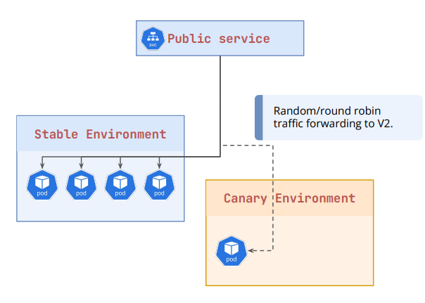
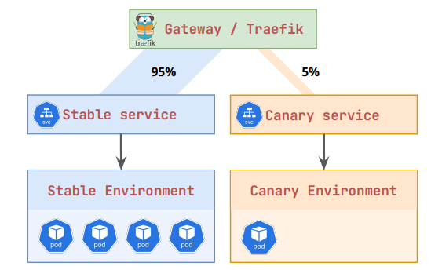
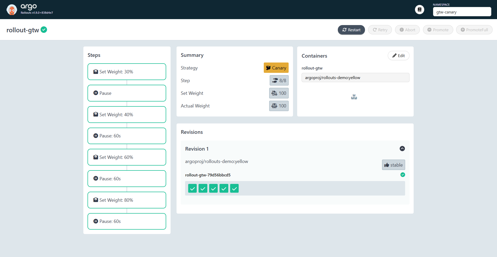
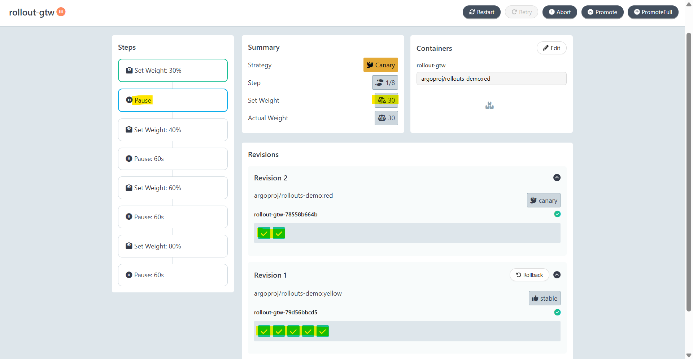
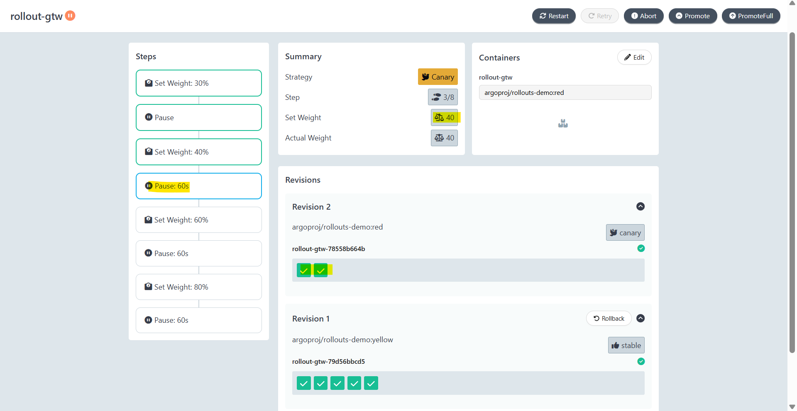
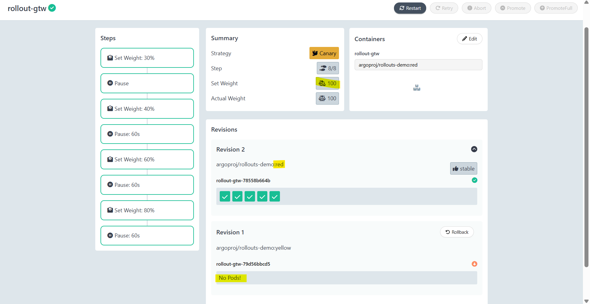

# Argo Rollout - Traffic-Weighted Canary

[Back](../index.md)

- [Argo Rollout - Traffic-Weighted Canary](#argo-rollout---traffic-weighted-canary)
  - [Replica-Weighted vs Traffic-Weighted](#replica-weighted-vs-traffic-weighted)
  - [Lab: Traffic-Weighted Canary](#lab-traffic-weighted-canary)
    - [Step 1: Deploy Stable Version](#step-1-deploy-stable-version)
    - [Step 2: Deploy Preview Version](#step-2-deploy-preview-version)
    - [Step 3: Promote](#step-3-promote)
    - [Full Deployment](#full-deployment)

---

## Replica-Weighted vs Traffic-Weighted

- `Replica-Weighted` / `native Kubernetes canary`
  - adjusts the **number of pods (replicas)** running the new version to determine the traffic split.

- **How it Works**:
  - Relies on Kubernetes **kube-proxy round-robin load balancing**.
  - If you have 9 pods of version A and 1 pod of version B, 10% of requests go to B.

- **Pros**:
  - Easy to implement, works with native Kubernetes without extra tools.
- **Cons**:
  - Coarse-grained.
    - For 1% of traffic, you need 100 total replicas.
    - Autoscaling is difficult because scaling the stable version changes the percentage.

- **Use Case**:
  - **Small-scale** deployments where **precise traffic percentages** are **not critical**.



---

- `Traffic-Weighted` / `intelligent canary`
  - uses `service mesh` or `ingress controllers` to precisely **route** a specific percentage of traffic (e.g., 5% or 10%) to the canary pods, independent of replica count.

- **How it Works**:
  - Uses an `ingress controller` (like NGINX) or `service mesh` (like `Istio` or Linkerd) to split traffic based on rules, allowing a single canary pod to receive exactly 5% of traffic even if there are only 2 replicas total.

- **Pros**:
  - **Precise control**, independent of pod count, allows for fine-grained routing.
- **Cons**:
  - Requires **additional infrastructure** (e.g., Istio) and configuration.

- **Use Case**:
  - Complex, high-traffic applications requiring precise canary testing with automated rollback.



- **IMPORTANTS**:
  - By default, the **stable version will be kept** until the canary deployment completes.
  -

---

## Lab: Traffic-Weighted Canary

### Step 1: Deploy Stable Version

```yaml
# 00-namespace.yaml
apiVersion: v1
kind: Namespace
metadata:
  name: gtw-canary
---
# 01-gateway.yaml
apiVersion: gateway.networking.k8s.io/v1
kind: Gateway
metadata:
  name: rollout-gtw
  namespace: gtw-canary
spec:
  gatewayClassName: traefik
  listeners:
    - name: http
      protocol: HTTP
      port: 80
      allowedRoutes:
        namespaces:
          from: Same
---
# 02-httproute.yaml
apiVersion: gateway.networking.k8s.io/v1
kind: HTTPRoute
metadata:
  name: rollout-gtw-route
  namespace: gtw-canary
spec:
  parentRefs:
    - name: rollout-gtw
  hostnames:
    - "app.localhost"
  rules:
    - backendRefs:
        - name: rollout-gtw-stable
          port: 80
          weight: 1
        - name: rollout-gtw-canary
          port: 80
          weight: 1
---
# 03-services.yaml
apiVersion: v1
kind: Service
metadata:
  name: rollout-gtw-stable
  namespace: gtw-canary
spec:
  ports:
    - name: http
      port: 80
      targetPort: 80
      protocol: TCP
  selector:
    app: rollout-gtw
---
apiVersion: v1
kind: Service
metadata:
  name: rollout-gtw-canary
  namespace: gtw-canary
spec:
  ports:
    - name: http
      port: 80
      targetPort: 80
      protocol: TCP
  selector:
    app: rollout-gtw
---
# 04-rollout.yaml
apiVersion: argoproj.io/v1alpha1
kind: Rollout
metadata:
  name: rollout-gtw
  namespace: gtw-canary
spec:
  replicas: 5
  selector:
    matchLabels:
      app: rollout-gtw
  template:
    metadata:
      labels:
        app: rollout-gtw
    spec:
      containers:
        - name: rollout-gtw
          image: argoproj/rollouts-demo:yellow
          # image: argoproj/rollouts-demo:red
          ports:
            - name: http
              containerPort: 80
              protocol: TCP
  strategy:
    canary:
      dynamicStableScale: true
      canaryService: rollout-gtw-canary
      stableService: rollout-gtw-stable
      trafficRouting:
        plugins:
          argoproj-labs/gatewayAPI:
            httpRoute: rollout-gtw-route
            namespace: gtw-canary
      steps:
        - setWeight: 30
        - pause: {}             
        - setWeight: 40
        - pause:
            duration: 10s
        - setWeight: 60
        - pause:
            duration: 10s
        - setWeight: 80
        - pause:
            duration: 10s
```

```sh
kubectl apply -f .
# namespace/gtw-canary created
# gateway.gateway.networking.k8s.io/rollout-gtw created
# httproute.gateway.networking.k8s.io/rollout-gtw-route created
# service/rollout-gtw-stable created
# service/rollout-gtw-canary created
# rollout.argoproj.io/rollout-gtw created

# confirm
kubectl argo rollouts get rollout rollout-gtw -n gtw-canary
# Name:            rollout-gtw
# Namespace:       gtw-canary
# Status:          ✔ Healthy
# Strategy:        Canary
#   Step:          8/8
#   SetWeight:     100
#   ActualWeight:  100
# Images:          argoproj/rollouts-demo:yellow (stable)
# Replicas:
#   Desired:       5
#   Current:       5
#   Updated:       5
#   Ready:         5
#   Available:     5

# NAME                                     KIND        STATUS     AGE  INFO
# ⟳ rollout-gtw                            Rollout     ✔ Healthy  16s
# └──# revision:1
#    └──⧉ rollout-gtw-79d56bbcd5           ReplicaSet  ✔ Healthy  16s  stable
#       ├──□ rollout-gtw-79d56bbcd5-ds8th  Pod         ✔ Running  16s  ready:1/1
#       ├──□ rollout-gtw-79d56bbcd5-gt6m7  Pod         ✔ Running  16s  ready:1/1
#       ├──□ rollout-gtw-79d56bbcd5-jh5j8  Pod         ✔ Running  16s  ready:1/1
#       ├──□ rollout-gtw-79d56bbcd5-s6jz7  Pod         ✔ Running  16s  ready:1/1
#       └──□ rollout-gtw-79d56bbcd5-vw9r4  Pod         ✔ Running  16s  ready:1/1

# confirm httproute weight
kubectl describe httproute -n gtw-canary rollout-gtw-route
#   Rules:
#     Backend Refs:
#       Group:
#       Kind:    Service
#       Name:    rollout-gtw-stable
#       Port:    80
#       Weight:  100
#       Group:
#       Kind:    Service
#       Name:    rollout-gtw-canary
#       Port:    80
#       Weight:  0
```



---

### Step 2: Deploy Preview Version

```yaml
image: argoproj/rollouts-demo:red
```

```sh
kubectl apply -f 04-rollout.yaml
# rollout.argoproj.io/rollout-gtw configured

kubectl argo rollouts get rollout rollout-gtw -n gtw-canary
# Name:            rollout-gtw
# Namespace:       gtw-canary
# Status:          ॥ Paused
# Message:         CanaryPauseStep
# Strategy:        Canary
#   Step:          1/8
#   SetWeight:     30
#   ActualWeight:  30
# Images:          argoproj/rollouts-demo:red (canary)
#                  argoproj/rollouts-demo:yellow (stable)
# Replicas:
#   Desired:       5
#   Current:       7
#   Updated:       2
#   Ready:         7
#   Available:     7

# NAME                                     KIND        STATUS     AGE    INFO
# ⟳ rollout-gtw                            Rollout     ॥ Paused   9m50s
# ├──# revision:2
# │  └──⧉ rollout-gtw-78558b664b           ReplicaSet  ✔ Healthy  54s    canary
# │     ├──□ rollout-gtw-78558b664b-6jvv4  Pod         ✔ Running  54s    ready:1/1
# │     └──□ rollout-gtw-78558b664b-87lvx  Pod         ✔ Running  54s    ready:1/1
# └──# revision:1
#    └──⧉ rollout-gtw-79d56bbcd5           ReplicaSet  ✔ Healthy  9m50s  stable
#       ├──□ rollout-gtw-79d56bbcd5-ds8th  Pod         ✔ Running  9m50s  ready:1/1
#       ├──□ rollout-gtw-79d56bbcd5-gt6m7  Pod         ✔ Running  9m50s  ready:1/1
#       ├──□ rollout-gtw-79d56bbcd5-jh5j8  Pod         ✔ Running  9m50s  ready:1/1
#       ├──□ rollout-gtw-79d56bbcd5-s6jz7  Pod         ✔ Running  9m50s  ready:1/1
#       └──□ rollout-gtw-79d56bbcd5-vw9r4  Pod         ✔ Running  9m50s  ready:1/1

kubectl describe httproute rollout-gtw-route -n gtw-canary
#   Rules:
#     Backend Refs:
#       Group:
#       Kind:    Service
#       Name:    rollout-gtw-stable
#       Port:    80
#       Weight:  70
#       Group:
#       Kind:    Service
#       Name:    rollout-gtw-canary
#       Port:    80
#       Weight:  30
```



---

### Step 3: Promote

```sh
kubectl argo rollouts promote rollout-gtw -n gtw-canary
# rollout 'rollout-gtw' promoted

kubectl argo rollouts get rollout rollout-gtw -n gtw-canary
# Name:            rollout-gtw
# Namespace:       gtw-canary
# Status:          ॥ Paused
# Message:         CanaryPauseStep
# Strategy:        Canary
#   Step:          3/8
#   SetWeight:     40
#   ActualWeight:  40
# Images:          argoproj/rollouts-demo:red (canary)
#                  argoproj/rollouts-demo:yellow (stable)
# Replicas:
#   Desired:       5
#   Current:       7
#   Updated:       2
#   Ready:         7
#   Available:     7

# NAME                                     KIND        STATUS     AGE   INFO
# ⟳ rollout-gtw                            Rollout     ॥ Paused   14m
# ├──# revision:2
# │  └──⧉ rollout-gtw-78558b664b           ReplicaSet  ✔ Healthy  5m4s  canary
# │     ├──□ rollout-gtw-78558b664b-6jvv4  Pod         ✔ Running  5m4s  ready:1/1
# │     └──□ rollout-gtw-78558b664b-87lvx  Pod         ✔ Running  5m4s  ready:1/1
# └──# revision:1
#    └──⧉ rollout-gtw-79d56bbcd5           ReplicaSet  ✔ Healthy  14m   stable
#       ├──□ rollout-gtw-79d56bbcd5-ds8th  Pod         ✔ Running  14m   ready:1/1
#       ├──□ rollout-gtw-79d56bbcd5-gt6m7  Pod         ✔ Running  14m   ready:1/1
#       ├──□ rollout-gtw-79d56bbcd5-jh5j8  Pod         ✔ Running  14m   ready:1/1
#       ├──□ rollout-gtw-79d56bbcd5-s6jz7  Pod         ✔ Running  14m   ready:1/1
#       └──□ rollout-gtw-79d56bbcd5-vw9r4  Pod         ✔ Running  14m   ready:1/1

kubectl describe httproute rollout-gtw-route -n gtw-canary
#   Rules:
#     Backend Refs:
#       Group:
#       Kind:    Service
#       Name:    rollout-gtw-stable
#       Port:    80
#       Weight:  60
#       Group:
#       Kind:    Service
#       Name:    rollout-gtw-canary
#       Port:    80
#       Weight:  40
```



---

### Full Deployment

```sh
kubectl argo rollouts get rollout rollout-gtw -n gtw-canary
# Name:            rollout-gtw
# Namespace:       gtw-canary
# Status:          ✔ Healthy
# Strategy:        Canary
#   Step:          8/8
#   SetWeight:     100
#   ActualWeight:  100
# Images:          argoproj/rollouts-demo:red (stable)
# Replicas:
#   Desired:       5
#   Current:       5
#   Updated:       5
#   Ready:         5
#   Available:     5

# NAME                                     KIND        STATUS        AGE    INFO
# ⟳ rollout-gtw                            Rollout     ✔ Healthy     18m
# ├──# revision:2
# │  └──⧉ rollout-gtw-78558b664b           ReplicaSet  ✔ Healthy     9m57s  stable
# │     ├──□ rollout-gtw-78558b664b-6jvv4  Pod         ✔ Running     9m57s  ready:1/1
# │     ├──□ rollout-gtw-78558b664b-87lvx  Pod         ✔ Running     9m57s  ready:1/1
# │     ├──□ rollout-gtw-78558b664b-wj5hx  Pod         ✔ Running     4m2s   ready:1/1
# │     ├──□ rollout-gtw-78558b664b-pwsb6  Pod         ✔ Running     2m58s  ready:1/1
# │     └──□ rollout-gtw-78558b664b-sk2gh  Pod         ✔ Running     114s   ready:1/1
# └──# revision:1
#    └──⧉ rollout-gtw-79d56bbcd5           ReplicaSet  • ScaledDown  18m

kubectl describe httproute rollout-gtw-route -n gtw-canary
#   Rules:
#     Backend Refs:
#       Group:
#       Kind:    Service
#       Name:    rollout-gtw-stable
#       Port:    80
#       Weight:  100
#       Group:
#       Kind:    Service
#       Name:    rollout-gtw-canary
#       Port:    80
#       Weight:  0
```


