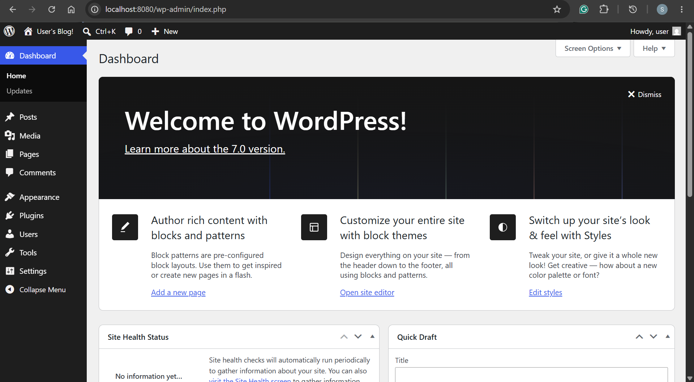

# Helm - Release

[Back](../index.md)

- [Helm - Release](#helm---release)
  - [Release](#release)
    - [Imperative Command](#imperative-command)
  - [Lab: Install Workpress](#lab-install-workpress)
    - [Add repo](#add-repo)
    - [Install Chart without values](#install-chart-without-values)
    - [Get values, notes](#get-values-notes)
    - [Upgrade Release by setting values](#upgrade-release-by-setting-values)
    - [Upgrade Release via values file](#upgrade-release-via-values-file)
    - [History and Rollback](#history-and-rollback)
    - [Uninstall release](#uninstall-release)

---

## Release

- `Release`
  - a named installation of a Helm chart
  - By default, Helm 3 stores its `release state` inside Kubernetes cluster as `Kubernetes Secrets`.

---

### Imperative Command

- Install Release

| Command                                               | Description                                                  |
| ----------------------------------------------------- | ------------------------------------------------------------ |
| `helm install RELEASE REPO/CHART`                     | Install a release from a chart within a repo.                |
| `helm install RELEASE REPO/CHART --version VERSION`   | Install a release from a chart of a version.                 |
| `helm install RELEASE REPO/CHART --set key=val`       | Install a release from a chart within a repo and set values. |
| `helm install RELEASE REPO/CHART --values VALUE_YAML` | Install a release from a chart within a yaml file of values  |
| `helm install RELEASE CHART_DIR`                      | Install a release from a local chart.                        |
| `helm install RELEASE CHART_ZIP`                      | Install a release from a local zipped chart.                 |
| `helm install RELEASE REMOTE_URL`                     | Install a release from a remote url.                         |
| `helm install RELEASE CHART --repo REPO_URL`          | Install a release from a remote repo.                        |
| `helm install RELEASE CHART_DIR --dry-run=client`     | Output all generated chart manifests                         |
| `helm install RELEASE CHART_DIR --debug`              | Enable verbose output                                        |

- Update Release

| Command                                                 | Description                                                                 |
| ------------------------------------------------------- | --------------------------------------------------------------------------- |
| `helm upgrade RELEASE CHART_DIR`                        | Upgrade release from a local chart                                          |
| `helm upgrade RELEASE RELEASE/CHART`                    | Upgrade release from repo chart                                             |
| `helm upgrade RELEASE RELEASE/CHART --version=VERSION`  | Upgrade release to a version from repo chart                                |
| `helm upgrade RELEASE RELEASE/CHART --atomic`           | upgrade process rolls back changes made in case of failed upgrade.          |
| `helm upgrade RELEASE RELEASE/CHART --cleanup-on-fail ` | allow deletion of new resources created in this upgrade when upgrade fails. |
| `helm upgrade RELEASE RELEASE/CHART --debug`            | enable verbose output.                                                      |
| `helm upgrade RELEASE RELEASE/CHART --timeout duration` | time to wait for operation. Default 5min                                    |

- Release Management

| Command                         | Description                                                          |
| ------------------------------- | -------------------------------------------------------------------- |
| `helm list`                     | Lists all of the releases for current namespace                      |
| `helm list -a`                  | Show all releases                                                    |
| `helm list -A`                  | List releases across all namespaces                                  |
| `helm list -n NAMESPACE`        | List releases for a specific namespaces                              |
| `helm list -f 'ara[a-z]+'`      | Filter releases                                                      |
| `helm list -l STRING`           | Filter by labels                                                     |
| `helm status RELEASE`           | Displays the real-time state of a deployed release.                  |
| `helm get values RELEASE`       | Shows the specific values (--set or values.yaml) used for a release. |
| `helm get note RELEASE`         | Shows the specific values (--set or values.yaml) used for a release. |
| `helm history RELEASE`          | Lists the revision history of a specific release.                    |
| `helm rollback RELEASE VERSION` | Reverts a release to a specific previous revision.                   |
| `helm uninstall RELEASE`        | Removes all resources associated with a release from the cluster.    |

---

## Lab: Install Workpress

- Go to artifact hub, search for wordpress, fileter by helm chart, select 1st.
  - click install for command

### Add repo

```sh
helm repo add bitnami https://charts.bitnami.com/bitnami
# "bitnami" has been added to your repositories

helm repo list
# NAME                    URL
# bitnami                 https://charts.bitnami.com/bitnami

# search the cache repo
helm search repo wordpress
# NAME                    CHART VERSION   APP VERSION     DESCRIPTION
# bitnami/wordpress       32.1.0          7.0.0           WordPress is the world's most popular blogging ...
```

### Install Chart without values

```sh
helm install local-wp bitnami/wordpress --version 32.1.0

helm list
# NAME            NAMESPACE       REVISION        UPDATED                                 STATUS          CHART                   APP VERSION
# local-wp        default         1               2026-06-08 16:38:05.0280162 -0400 EDT   deployed        wordpress-32.1.0        7.0.0

kubectl get po
# NAME                                  READY   STATUS    RESTARTS   AGE
# local-wp-mariadb-0                    1/1     Running   0          114s
# local-wp-wordpress-6548454bcc-wflw2   1/1     Running   0          115s

# a helm secret created for state of release in helm
kubectl get secret
# NAME                             TYPE                 DATA   AGE
# local-wp-mariadb                 Opaque               2      2m15s
# local-wp-wordpress               Opaque               1      2m15s
# sh.helm.release.v1.local-wp.v1   helm.sh/release.v1   1      2m15s

kubectl describe secret sh.helm.release.v1.local-wp.v1
# Name:         sh.helm.release.v1.local-wp.v1
# Namespace:    default
# Labels:       modifiedAt=1780951087
#               name=local-wp
#               owner=helm
#               status=deployed
#               version=1
# Annotations:  <none>

# Type:  helm.sh/release.v1

# Data
# ====
# release:  85928 bytes

# app uses LoadBalancer svc
kubectl get svc
# NAME                        TYPE           CLUSTER-IP       EXTERNAL-IP   PORT(S)                      AGE
# kubernetes                  ClusterIP      10.96.0.1        <none>        443/TCP                      10d
# local-wp-mariadb            ClusterIP      10.110.143.177   <none>        3306/TCP                     4m35s
# local-wp-mariadb-headless   ClusterIP      None             <none>        3306/TCP                     4m35s
# local-wp-wordpress          LoadBalancer   10.105.112.79    localhost     80:32009/TCP,443:30867/TCP   4m35s
```

---

### Get values, notes

```sh
# get values
helm get values local-wp
# USER-SUPPLIED VALUES:
# null

# get notes
helm get notes local-wp
# NOTES:
# CHART NAME: wordpress
# CHART VERSION: 32.1.0
# APP VERSION: 7.0.0

# ⚠ WARNING: Since August 28th, 2025, only a limited subset of images/charts are available for free.
#     Subscribe to Bitnami Secure Images to receive continued support and security updates.
#     More info at https://bitnami.com and https://github.com/bitnami/containers/issues/83267

# ** Please be patient while the chart is being deployed **

# Your WordPress site can be accessed through the following DNS name from within your cluster:

#     local-wp-wordpress.default.svc.cluster.local (port 80)
# ...

# get metadata
helm get metadata local-wp
# NAME: local-wp
# CHART: wordpress
# VERSION: 32.1.0
# APP_VERSION: 7.0.0
# ANNOTATIONS: fips=true,images=- name: apache-exporter
#   version: 1.0.12
#   image: registry-1.docker.io/bitnami/apache-exporter:latest
# - name: os-shell
#   version: "5"
#   image: registry-1.docker.io/bitnami/os-shell:latest
# - name: wordpress
#   version: 7.0.0
#   image: registry-1.docker.io/bitnami/wordpress:latest
# ,licenses=Apache-2.0,tanzuCategory=application
# DEPENDENCIES: common,mariadb
# NAMESPACE: default
# REVISION: 1
# STATUS: deployed
# DEPLOYED_AT: 2026-06-08T16:38:05-04:00
```

---

### Upgrade Release by setting values

- set svc as clusterip

```sh
helm upgrade -i local-wp bitnami/wordpress --version 32.1.0 --set "service.type=ClusterIP"
# Release "local-wp" has been upgraded. Happy Helming!
# NAME: local-wp
# LAST DEPLOYED: Mon Jun  8 17:17:39 2026
# NAMESPACE: default
# STATUS: deployed
# REVISION: 2
# TEST SUITE: None
# NOTES:
# CHART NAME: wordpress
# CHART VERSION: 32.1.0
# APP VERSION: 7.0.0

# confirm
helm list
# NAME            NAMESPACE       REVISION        UPDATED                                 STATUS          CHART                   APP VERSION
# local-wp        default         2               2026-06-08 17:17:39.051811224 -0400 EDT deployed        wordpress-32.1.0        7.0.0

# get values
helm get values local-wp
# USER-SUPPLIED VALUES:
# service:
#   type: ClusterIP

kubectl get svc local-wp-wordpress
# NAME                 TYPE        CLUSTER-IP      EXTERNAL-IP   PORT(S)          AGE
# local-wp-wordpress   ClusterIP   10.105.112.79   <none>        80/TCP,443/TCP   40m

# forward
kubectl port-forward svc/local-wp-wordpress 8080:80

# test
curl localhost:8080 -I
# HTTP/1.1 200 OK
# Date: Mon, 08 Jun 2026 21:20:00 GMT
# Server: Apache
# Link: <http://localhost:8080/wp-json/>; rel="https://api.w.org/"
# Content-Type: text/html; charset=UTF-8

# get login secret
k get secret local-wp-wordpress -o jsonpath='{.data.wordpress-password}' | base64 -d

# login
# localhost:8080/admin
```



---

### Upgrade Release via values file

```sh
tee values.yaml<<EOF
service:
  ports:
    http: 8080
replicaCount: 3
EOF

helm upgrade -i local-wp bitnami/wordpress --version 32.1.0 --reuse-values -f values.yaml

# get values
helm get values local-wp
# USER-SUPPLIED VALUES:
# replicaCount: 3
# service:
#   ports:
#     http: 8080
#   type: ClusterIP

kubectl get svc local-wp-wordpress
# NAME                 TYPE        CLUSTER-IP       EXTERNAL-IP   PORT(S)            AGE
# local-wp-wordpress   ClusterIP   10.101.231.230   <none>        8080/TCP,443/TCP   17m

kubectl get deploy
# NAME                 READY   UP-TO-DATE   AVAILABLE   AGE
# local-wp-wordpress   3/3     3            3           20m
```

---

### History and Rollback

```sh
helm history local-wp
# REVISION        UPDATED                         STATUS          CHART                   APP VERSION     DESCRIPTION
# 1               Mon Jun  8 17:52:19 2026        superseded      wordpress-32.1.0        7.0.0           Install complete
# 2               Mon Jun  8 17:54:43 2026        superseded      wordpress-32.1.0        7.0.0           Upgrade complete
# 3               Mon Jun  8 18:02:32 2026        superseded      wordpress-32.1.0        7.0.0           Upgrade complete
# 4               Mon Jun  8 18:08:17 2026        superseded      wordpress-32.1.0        7.0.0           Upgrade complete
# 5               Mon Jun  8 18:09:35 2026        superseded      wordpress-32.1.0        7.0.0           Upgrade complete
# 6               Mon Jun  8 18:11:37 2026        superseded      wordpress-32.1.0        7.0.0           Upgrade complete
# 7               Mon Jun  8 18:20:22 2026        deployed        wordpress-32.1.0        7.0.0           Upgrade complete

# get the latest values
helm get values local-wp
# USER-SUPPLIED VALUES:
# replicaCount: 3
# service:
#   ports:
#     http: 8080
#   type: ClusterIP

# get values of a revision
helm get values local-wp --revision 4
# USER-SUPPLIED VALUES:
# service:
#   ports:
#     http: 8080

# check helm secret
k get secret -l owner=helm
# NAME                             TYPE                 DATA   AGE
# sh.helm.release.v1.local-wp.v1   helm.sh/release.v1   1      37m
# sh.helm.release.v1.local-wp.v2   helm.sh/release.v1   1      35m
# sh.helm.release.v1.local-wp.v3   helm.sh/release.v1   1      27m
# sh.helm.release.v1.local-wp.v4   helm.sh/release.v1   1      21m
# sh.helm.release.v1.local-wp.v5   helm.sh/release.v1   1      20m
# sh.helm.release.v1.local-wp.v6   helm.sh/release.v1   1      18m
# sh.helm.release.v1.local-wp.v7   helm.sh/release.v1   1      9m41s
```

- rollout with but

```sh
tee values.yaml<<EOF
image:
  tag: nonexist
EOF

helm upgrade -i local-wp bitnami/wordpress --version 32.1.0 --reuse-values -f values.yaml

# confirm deploy
helm list
# NAME            NAMESPACE       REVISION        UPDATED                                 STATUS          CHART                   APP VERSION
# local-wp        default         8               2026-06-08 18:42:53.646617288 -0400 EDT deployed        wordpress-32.1.0        7.0.0

# confirm pod fails
kubectl get po
# NAME                                  READY   STATUS              RESTARTS   AGE
# local-wp-mariadb-0                    1/1     Running             0          51m
# local-wp-wordpress-6548454bcc-22bzx   1/1     Running             0          31m
# local-wp-wordpress-6548454bcc-746g8   1/1     Running             0          35m
# local-wp-wordpress-6548454bcc-ktx2d   1/1     Running             0          31m
# local-wp-wordpress-84595f57bc-zxkgh   0/1     Init:ErrImagePull   0          39s

# rollback to previous
helm rollback local-wp 7
# Rollback was a success! Happy Helming!

# revision 9: rollback to 7
helm history local-wp
# REVISION        UPDATED                         STATUS          CHART                   APP VERSION     DESCRIPTION
# 1               Mon Jun  8 17:52:19 2026        superseded      wordpress-32.1.0        7.0.0           Install complete
# 2               Mon Jun  8 17:54:43 2026        superseded      wordpress-32.1.0        7.0.0           Upgrade complete
# 3               Mon Jun  8 18:02:32 2026        superseded      wordpress-32.1.0        7.0.0           Upgrade complete
# 4               Mon Jun  8 18:08:17 2026        superseded      wordpress-32.1.0        7.0.0           Upgrade complete
# 5               Mon Jun  8 18:09:35 2026        superseded      wordpress-32.1.0        7.0.0           Upgrade complete
# 6               Mon Jun  8 18:11:37 2026        superseded      wordpress-32.1.0        7.0.0           Upgrade complete
# 7               Mon Jun  8 18:20:22 2026        superseded      wordpress-32.1.0        7.0.0           Upgrade complete
# 8               Mon Jun  8 18:42:53 2026        superseded      wordpress-32.1.0        7.0.0           Upgrade complete
# 9               Mon Jun  8 18:45:01 2026        deployed        wordpress-32.1.0        7.0.0           Rollback to 7

# confirm values
helm get values local-wp
# USER-SUPPLIED VALUES:
# replicaCount: 3
# service:
#   ports:
#     http: 8080
#   type: ClusterIP

# confirm po
kubectl get po
# NAME                                  READY   STATUS    RESTARTS   AGE
# local-wp-mariadb-0                    1/1     Running   0          54m
# local-wp-wordpress-6548454bcc-22bzx   1/1     Running   0          34m
# local-wp-wordpress-6548454bcc-746g8   1/1     Running   0          38m
# local-wp-wordpress-6548454bcc-ktx2d   1/1     Running   0          34m

# check helm secret
k get secret -l owner=helm
# NAME                             TYPE                 DATA   AGE
# sh.helm.release.v1.local-wp.v1   helm.sh/release.v1   1      56m
# sh.helm.release.v1.local-wp.v2   helm.sh/release.v1   1      54m
# sh.helm.release.v1.local-wp.v3   helm.sh/release.v1   1      46m
# sh.helm.release.v1.local-wp.v4   helm.sh/release.v1   1      40m
# sh.helm.release.v1.local-wp.v5   helm.sh/release.v1   1      39m
# sh.helm.release.v1.local-wp.v6   helm.sh/release.v1   1      37m
# sh.helm.release.v1.local-wp.v7   helm.sh/release.v1   1      28m
# sh.helm.release.v1.local-wp.v8   helm.sh/release.v1   1      6m18s
# sh.helm.release.v1.local-wp.v9   helm.sh/release.v1   1      4m11s
```

- atomic upgrade

```sh
tee values.yaml<<EOF
image:
  tag: nonexist
EOF

helm upgrade -i local-wp bitnami/wordpress --version 32.1.0
    --reuse-values -f values.yaml   \
    --atomic \
    --cleanup-on-fail   \
    --debug     \
    --timeout 2m
# history.go:56: 2026-06-08 19:00:52.356903011 -0400 EDT m=+0.580824737 [debug] getting history for release local-wp
# upgrade.go:164: 2026-06-08 19:00:56.669431815 -0400 EDT m=+4.893353571 [debug] preparing upgrade for local-wp
# upgrade.go:561: 2026-06-08 19:00:56.762315466 -0400 EDT m=+4.986237200 [debug] reusing the old release's values
# upgrade.go:172: 2026-06-08 19:00:57.056673306 -0400 EDT m=+5.280595023 [debug] performing update for local-wp
# upgrade.go:375: 2026-06-08 19:00:57.267162286 -0400 EDT m=+5.491083998 [debug] creating upgraded release for local-wp
# client.go:388: 2026-06-08 19:00:57.383961083 -0400 EDT m=+5.607882802 [debug] checking 15 resources for changes
# client.go:734: 2026-06-08 19:00:57.391718322 -0400 EDT m=+5.615640049 [debug] Patch NetworkPolicy "local-wp-mariadb" in namespace default
# client.go:734: 2026-06-08 19:00:57.398922835 -0400 EDT m=+5.622844562 [debug] Patch NetworkPolicy "local-wp-wordpress" in namespace default
# client.go:734: 2026-06-08 19:00:57.40621497 -0400 EDT m=+5.630136688 [debug] Patch PodDisruptionBudget "local-wp-mariadb" in
# ...
# wait.go:87: 2026-06-08 19:03:07.597065847 -0400 EDT m=+128.107818411 [debug] wait for resources succeeded within 2s
# rollback.go:258: 2026-06-08 19:03:07.605113422 -0400 EDT m=+128.115865986 [debug] superseding previous deployment 11
# rollback.go:85: 2026-06-08 19:03:07.633872618 -0400 EDT m=+128.144625183 [debug] updating status for rolled back release for local-wp
# Error: UPGRADE FAILED: release local-wp failed, and has been rolled back due to atomic being set: context deadline exceeded
# helm.go:92: 2026-06-08 19:03:07.661949352 -0400 EDT m=+128.172701935 [debug] context deadline exceeded
# release local-wp failed, and has been rolled back due to atomic being set
# helm.sh/helm/v3/pkg/action.(*Upgrade).failRelease
#         helm.sh/helm/v3/pkg/action/upgrade.go:538
# helm.sh/helm/v3/pkg/action.(*Upgrade).reportToPerformUpgrade
#         helm.sh/helm/v3/pkg/action/upgrade.go:399
# helm.sh/helm/v3/pkg/action.(*Upgrade).releasingUpgrade
#         helm.sh/helm/v3/pkg/action/upgrade.go:459
# runtime.goexit
#         runtime/asm_amd64.s:1693
# UPGRADE FAILED
# main.newUpgradeCmd.func2
#         helm.sh/helm/v3/cmd/helm/upgrade.go:244
# github.com/spf13/cobra.(*Command).execute
#         github.com/spf13/cobra@v1.10.2/command.go:1015
# github.com/spf13/cobra.(*Command).ExecuteC
#         github.com/spf13/cobra@v1.10.2/command.go:1148
# github.com/spf13/cobra.(*Command).Execute
#         github.com/spf13/cobra@v1.10.2/command.go:1071
# main.main
#         helm.sh/helm/v3/cmd/helm/helm.go:91
# runtime.main
#         runtime/proc.go:285
# runtime.goexit
#         runtime/asm_amd64.s:1693

# confirm rollback
helm history local-wp
# 12              Mon Jun  8 19:00:56 2026        failed          wordpress-32.1.0        7.0.0           Upgrade "local-wp" failed: context deadline exceeded
# 13              Mon Jun  8 19:03:05 2026        deployed        wordpress-32.1.0        7.0.0           Rollback to 11
```

---

### Uninstall release

```sh
helm uninstall local-wp
# release "local-wp" uninstalled

helm list
# NAME    NAMESPACE       REVISION        UPDATED STATUS  CHART   APP VERSION

# clear up pvc
k get pvc
# NAME                      STATUS   VOLUME                                     CAPACITY   ACCESS MODES   STORAGECLASS   VOLUMEATTRIBUTESCLASS   AGE
# data-local-wp-mariadb-0   Bound    pvc-23461222-8bc9-4717-94c4-34044c689c7d   8Gi        RWO            hostpath       <unset>                 51m

k delete pvc data-local-wp-mariadb-0
# persistentvolumeclaim "data-local-wp-mariadb-0" deleted from default namespace

k get pv,pvc
# No resources found
```
