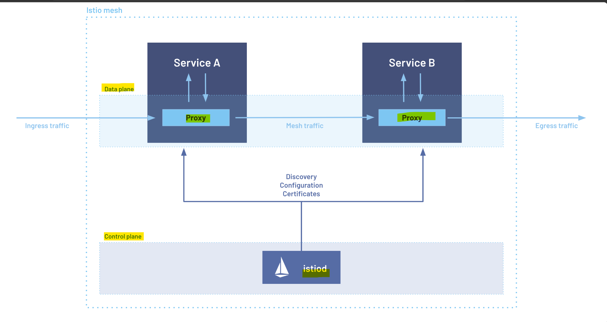

# Istio - Fundamental

[Back](../index.md)

- [Istio - Fundamental](#istio---fundamental)
  - [Service Mesh](#service-mesh)
  - [Istio Architecture](#istio-architecture)
    - [Istiod](#istiod)
    - [Ambient Mesh](#ambient-mesh)

---

## Service Mesh

- `service mesh`
  - an **infrastructure layer** that manages **service-to-service communication** inside a distributed system, especially in microservices and Kubernetes environments.

- commonly helps with:
  - **Traffic management**:
    - Routing, retries, timeouts, canary releases, blue/green deployments
  - **Reliability**:
    - Circuit breaking, failover, load balancing
  - **Observability**:
    - Metrics, logs, traces, service dependency visibility
  - **Security**:
    - mTLS encryption, service identity, authorization policies
  - **Policy control**:
    - Control which services can talk to which services

---

- Common Options
  - Istio
  - Linkerd
  - Cilium
  - Traefik
  - Consul
  - AWS App Mesh
  - Nginx Service Mesh

---

## Istio Architecture

- `Istio`:
  - an open-source "service mesh" that layers transparently onto distributed applications and Kubernetes clusters.
  - an orchestrator facilitates the management of `envoy proxies`

An `Istio service mesh` is logically split into a `data plane` and a `control plane`.

- `data plane`
  - a set of **intelligent proxies (`Envoy`)** deployed as `sidecars`.
  - **manage and control** all network communication between microservices.
  - collect and report **telemetry** on all mesh traffic.

- `control plane`
  - **manages and configures** the `proxies` to route traffic.

---

### Istiod

- `Istiod`
  - a pod running in the cluster
  - provides **service** discovery, configuration and **certificate** management.
    - Network Policies
    - `Certificate Authority (CA)`
    - Authentication
    - Authorization

- `Traffic Management API`
  - instruct `Istiod` to refine the **Envoy configuration** to exercise more granular control over the traffic in the service mesh.

---

### Ambient Mesh

- `Ambient Mesh`
  - a next-generation, **sidecar-less architecture** designed to **simplify** microservices communication, enhance security, and reduce infrastructure costs.
  - eliminates the need to inject a full proxy into every single pod, offering up to a 92% reduction in infrastructure costs compared to traditional service meshes.

---

- How It Works

- `ambient mesh` splits the `data plane` into two specialized layers:
  - `ztunnel (Zero Trust Tunnel)`:
    - A lightweight **node-level proxy** running as a `DaemonSet` that handles `Layer 4 (TCP)` traffic.
    - It automatically enforces `mutual TLS (mTLS)` and baseline **security** without requiring any application changes.
  - `Waypoint Proxies`:
    - Optional, `Layer 7 (L7) proxies` deployed only when advanced routing, traffic shaping, or L7 policies are required.
