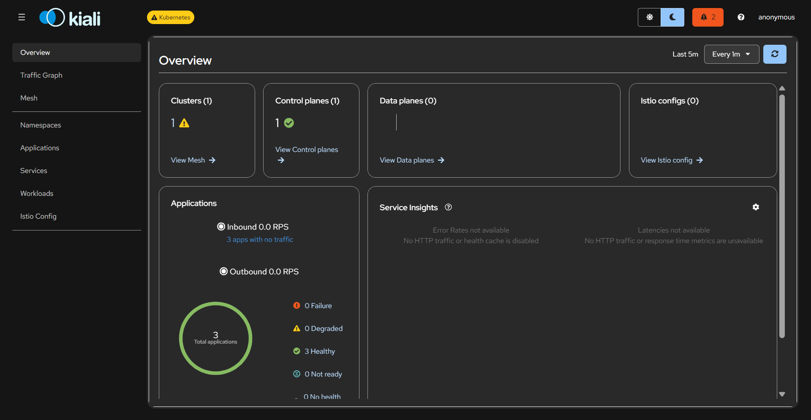
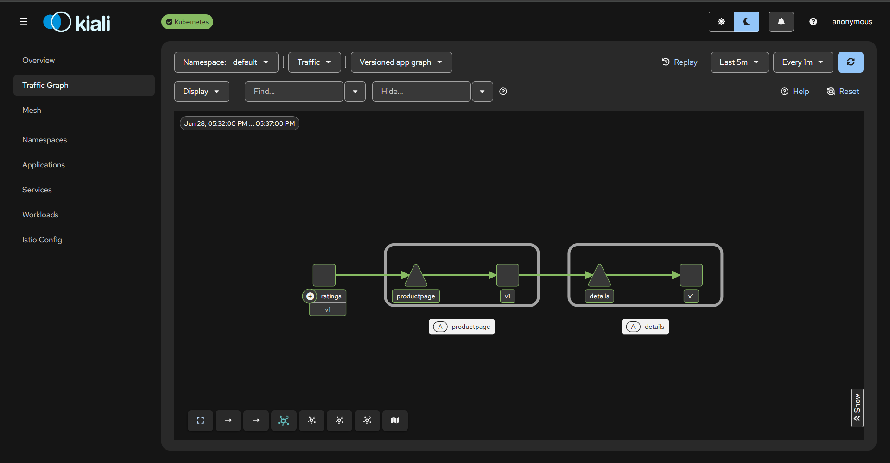

# Istio Observability - Kiali

[Back](../index.md)

- [Istio Observability - Kiali](#istio-observability---kiali)
  - [Kiali](#kiali)
  - [Lab: Installation](#lab-installation)
    - [Manifest](#manifest)
    - [Via Helm](#via-helm)
  - [Install Prometheus + Grafana addon](#install-prometheus--grafana-addon)
  - [Lab: Monitor traffic](#lab-monitor-traffic)

---

## Kiali

- `Kiali`
  - an observability console for `Istio` with service mesh configuration and validation capabilities.
  - provides detailed **metrics** and a **basic `Grafana` integration**, which can be used for advanced queries.

---

## Lab: Installation

### Manifest

```sh
# install
KUBECONFIG=./kubeconfig kubectl apply -f https://raw.githubusercontent.com/istio/istio/release-1.30/samples/addons/kiali.yaml
# serviceaccount/kiali created
# configmap/kiali created
# clusterrole.rbac.authorization.k8s.io/kiali created
# clusterrolebinding.rbac.authorization.k8s.io/kiali created
# service/kiali created
# deployment.apps/kiali created

# confirm
KUBECONFIG=./kubeconfig kubectl -n istio-system get po
# NAME                      READY   STATUS    RESTARTS   AGE
# istiod-6fdc665455-xrzq7   1/1     Running   0          72m
# kiali-68568d476c-qqk89    1/1     Running   0          7m31s

KUBECONFIG=./kubeconfig kubectl -n istio-system get svc
# NAME     TYPE        CLUSTER-IP     EXTERNAL-IP   PORT(S)                                 AGE
# istiod   ClusterIP   10.0.187.203   <none>        15010/TCP,15012/TCP,443/TCP,15014/TCP   73m
# kiali    ClusterIP   10.0.29.202    <none>        20001/TCP,9090/TCP                      9m20s

KUBECONFIG=./kubeconfig istioctl dashboard kiali
# http://localhost:20001/kiali
```



---

### Via Helm

```sh
helm repo add kiali https://kiali.org/helm-charts
helm repo update kiali
helm search repo kiali/kiali-server
# NAME                    CHART VERSION   APP VERSION     DESCRIPTION
# kiali/kiali-server      2.28.0          v2.28.0         Kiali is an open source project for service mes...

KUBECONFIG=./kubeconfig helm upgrade -i kiali-server kiali/kiali-server --namespace istio-system --set auth.strategy="anonymous"
# Release "kiali-server" does not exist. Installing it now.
# NAME: kiali-server
# LAST DEPLOYED: Sun Jun 28 17:17:52 2026
# NAMESPACE: istio-system
# STATUS: deployed
# REVISION: 1
# DESCRIPTION: Install complete
# TEST SUITE: None
# NOTES:
# Welcome to Kiali! For more details on Kiali, see: https://kiali.io
# The Kiali Server [v2.28.0] has been installed in namespace [istio-system]. It will be ready soon.
# ===============

# confirm
KUBECONFIG=./kubeconfig kubectl -n istio-system get po
# NAME                          READY   STATUS    RESTARTS   AGE
# grafana-665dcbcb9b-vt6jk      1/1     Running   0          43s
# istiod-6fdc665455-xrzq7       1/1     Running   0          100m
# kiali-6657d87584-mgbvv        1/1     Running   0          12m
# prometheus-65c465688f-sjd9c   2/2     Running   0          3m50s

KUBECONFIG=./kubeconfig kubectl -n istio-system port-forward svc/kiali 20001:20001
```

---

## Install Prometheus + Grafana addon

```sh
# Prometheus addon
KUBECONFIG=./kubeconfig kubectl apply -f https://raw.githubusercontent.com/istio/istio/release-1.30/samples/addons/prometheus.yaml
# serviceaccount/prometheus created
# configmap/prometheus created
# clusterrole.rbac.authorization.k8s.io/prometheus created
# clusterrolebinding.rbac.authorization.k8s.io/prometheus created
# service/prometheus created
# deployment.apps/prometheus created

# Grafana addon
KUBECONFIG=./kubeconfig kubectl apply -f https://raw.githubusercontent.com/istio/istio/release-1.30/samples/addons/grafana.yaml
# serviceaccount/grafana created
# configmap/grafana created
# service/grafana created
# deployment.apps/grafana created
# configmap/istio-grafana-dashboards created
# configmap/istio-services-grafana-dashboards created

# confirm
KUBECONFIG=./kubeconfig kubectl -n istio-system get po
# NAME                          READY   STATUS    RESTARTS   AGE
# istiod-6fdc665455-xrzq7       1/1     Running   0          97m
# kiali-6657d87584-mgbvv        1/1     Running   0          9m37s
# prometheus-65c465688f-sjd9c   2/2     Running   0          41s
```

---

## Lab: Monitor traffic

- deploy app

```sh
# enable sidecar injection
KUBECONFIG=./kubeconfig kubectl label namespace default istio-injection=enabled
# namespace/default labeled

# Deploy sample application
KUBECONFIG=./kubeconfig kubectl apply -f https://raw.githubusercontent.com/istio/istio/release-1.30/samples/bookinfo/platform/kube/bookinfo.yaml


KUBECONFIG=./kubeconfig kubectl exec deploy/ratings-v1 -c ratings -- curl -sS productpage:9080/productpage | head
# <meta charset="utf-8">
# <meta http-equiv="X-UA-Compatible" content="IE=edge">
# <meta name="viewport" content="width=device-width, initial-scale=1.0">


# <title>Simple Bookstore App</title>

# <script src="static/tailwind/tailwind.css"></script>
# <script type="text/javascript">
```


