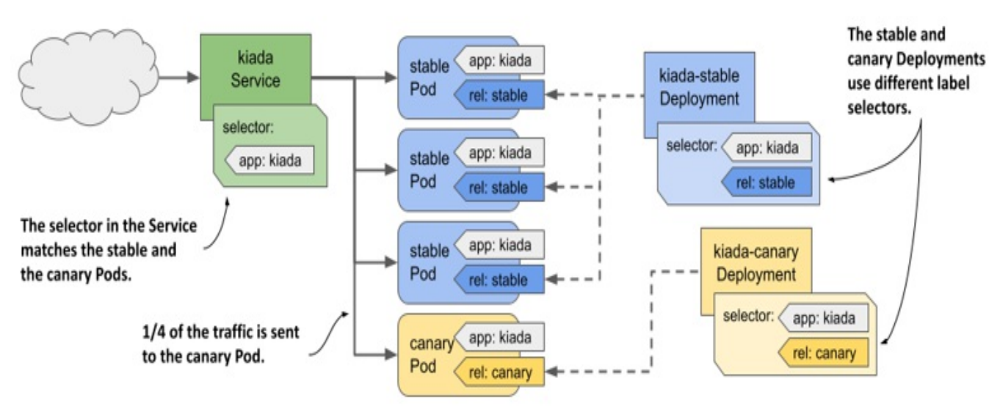

# Kubernetes - Application: Deployment

[Back](../../index.md)

- [Kubernetes - Application: Deployment](#kubernetes---application-deployment)
  - [Deployment](#deployment)
    - [Key fields](#key-fields)
  - [additional label `pod-template-hash`](#additional-label-pod-template-hash)
    - [Deployment vs ReplicaSet](#deployment-vs-replicaset)
    - [Changing the Deployment](#changing-the-deployment)
    - [Scaling Deployment](#scaling-deployment)
  - [Omitting `replicas` field](#omitting-replicas-field)
    - [Lab: omitting `replicas` field](#lab-omitting-replicas-field)
      - [Problem](#problem)
      - [Solution](#solution)
  - [Deployment Deletion](#deployment-deletion)
  - [Updating a Deployment](#updating-a-deployment)
  - [Deployment Strategies](#deployment-strategies)
      - [`Recreate`](#recreate)
      - [`Rolling Update`](#rolling-update)
  - [Pausing the rollout process](#pausing-the-rollout-process)
  - [Resuming the rollout](#resuming-the-rollout)
  - [Preventing faulty version using `minReadySeconds` field](#preventing-faulty-version-using-minreadyseconds-field)
    - [With `spec.progressDeadlineSeconds` field](#with-specprogressdeadlineseconds-field)
    - [With RollingOut Strategy](#with-rollingout-strategy)
      - [Lab: RollingOut with `minReadySeconds`](#lab-rollingout-with-minreadyseconds)
      - [Lab: RollingOut with `minReadySeconds` if a faulty version](#lab-rollingout-with-minreadyseconds-if-a-faulty-version)
    - [With Recreate Strategy](#with-recreate-strategy)
      - [Lab: Recreate with `minReadySeconds`](#lab-recreate-with-minreadyseconds)
    - [Imperative Command](#imperative-command)
    - [Declarative Command](#declarative-command)
  - [Lab: Create Deployment](#lab-create-deployment)
    - [Default Replica and strategy](#default-replica-and-strategy)
  - [Common Commands](#common-commands)
  - [Updates and Rollback](#updates-and-rollback)
    - [Deployment strategy](#deployment-strategy)
    - [Rollback](#rollback)
    - [Rollout History](#rollout-history)
  - [Rolling back vs apply old version of manifest](#rolling-back-vs-apply-old-version-of-manifest)
  - [kubectl rollout restart](#kubectl-rollout-restart)
    - [Lab: Deployment Rollout and rollback](#lab-deployment-rollout-and-rollback)
    - [Lab: Rollback](#lab-rollback)
    - [Lab: With Rollout with Error](#lab-with-rollout-with-error)
  - [Common Questions](#common-questions)
  - [Lab: Update Strategy](#lab-update-strategy)
    - [Recreate Strategy](#recreate-strategy)
    - [RollingUdate](#rollingudate)
      - [Control Pod replacement](#control-pod-replacement)
  - [Common deployment strategies](#common-deployment-strategies)
    - [Canary deployment strategy](#canary-deployment-strategy)
    - [A/B strategy](#ab-strategy)
    - [The Blue/Green strategy](#the-bluegreen-strategy)
    - [Traffic shadowing](#traffic-shadowing)

---

## Deployment

- `Deployments`
  - an **abstraction layer** over `ReplicaSets`
  - an **object** that manages the **lifecycle** of an application in a declarative way to describe the desired state, including the number of replicas and the container image to use, and orchestrates updates and rollbacks for that application in a controlled manner.
  - upgraded and higher version of `replication controller`.
  - manage the **deployment** of `replica sets`.
  - have the capability to **update** the `replica set` and are also capable of **rolling back to the previous version**.

- mainly used for **stateless workloads**

  - the `pods` created with `deployment` are fungible

- Deployment status

  - `Progressing`;
    - `Deployment` **creates** a new `ReplicaSet`.
    - `Deployment` is **scaling up** its newest `ReplicaSet`.
    - `Deployment` is **scaling down** its older `ReplicaSet(s)`.
    - New `Pods` become **ready or available** (ready for at least MinReadySeconds).
  - `complete`:
    - All of the `replicas` associated with the Deployment ha**ve been updated to the latest version**
    - All of the `replicas` associated with the Deployment are **available**.
    - **No old** `replicas` for the Deployment are running.
  - `Failed`
    - Insufficient **quota**
    - Readiness **probe** failures
    - **Image pull** errors
    - Insufficient **permissions**
    - Limit **ranges**
    - Application runtime **misconfiguration**

- Major roles:

  - **Declarative Updates**:
    - declare the desired state with YAML (or CLI)
  - **Scaling**
    - Easily scale applications up or down
  - **Rolling Updates**
    - **Deploy new versions** of your app without downtime.
  - **Rollback**
    - If something goes wrong, you can roll back to a previous version
  - **Self-healing**
    - If a Pod crashes or a node goes down, the Deployment (via ReplicaSet) ensures new Pods are scheduled.

---

- Troubleshooting Deployments failure:
  - `kubectl describe`:
    - get details of deploy and replicaset
    - event: show failure event
    - condition: show Type, Status, Reason
  - `kubectl get -o yaml`
    - output the detail message of deployment and replicaset

---

### Key fields

- `replicas`:

  - desired number of replica

- `selector`:
  - label selector
  - `matchLabels`: a map of lables
  - `matchExpressions`: a list of label selector requirements
- `template`:
  - Pod template
- `strategy`:
  - how `Pods` are replaced when **updating the Pod template**.

---

## additional label `pod-template-hash`

- Automatically add to the underlying `rs` and `pod`
  - become part of the underlying `RS` name
- **calculated** from the contents of the **Pod template**
- When the Pod template gets changed, a new ReplicaSet is created.

---

### Deployment vs ReplicaSet

- `ReplicaSet`: Ensures a **fixed number** of Pods are running.
- `Deployment`: Manages ReplicaSets, and adds features like `rolling updates` and `rollbacks`.

  - Most of the time, you won’t create ReplicaSets directly — you use a Deployment.

- `Deployment` **controls** the `ReplicaSet`, which in turn controls the individual `Pods`.
- a `ReplicaSet` object that’s **automatically created** when **creating** the `Deployment` object.

  - A `Deployment` object **doesn**'t directly **manage** the `Pod` objects, but **manages** them through a `ReplicaSet` object

- update pod:

  - RS: update only the new created pod
  - Deploy: update pods immediately

- Existing pod: the existing pods with matching labels
  - RS: controlled by RS
  - Deploy: not controlled by Deploy, because additional label `pod-template-hash` will be added.

---

### Changing the Deployment

- **Updating**:

  - The user can **update** the ongoing deployment **before it is completed**.
  - In this, the **existing** deployment will be **settled** and **new** deployment will be **created**.

- **Deleting**:

  - The user can **pause/cancel the deployment** by deleting it **before it is completed**.
  - **Recreating the same deployment** will resume it.

- **Rollback**
  - **roll back** the deployment or the deployment in progress.
  - The user can create or update the deployment by using `DeploymentSpec.PodTemplateSpec = oldRC.PodTemplateSpec`.

---

### Scaling Deployment

- When scaling a `Deployment`, the `Deployment controller` does nothing but **scale the underlying** `ReplicaSet`

  - `Deployment controller` updates the desired number of the replicas in the `ReplicaSet`
  - then the `ReplicaSet controller` to do the rest.

- If scale the underlying `RS`, the `RS controller` scales the number of pod imdiately.

  - then the `deploy controller` detects the difference between the desired replicas in the `deploy` and the underlying `rs`, and update the replicas in the `rs`
  - finally, `rs controller` reconcile the pod number.

- If the underlying `rs` object get deleted, the `deploy controller` will recreate the `rs`

---

## Omitting `replicas` field

- Practical but problematical scenario:

  - define `replicas=3` in manifest
  - scale to 5 with `kubectl scale`
  - update manifest without changing the `replicas` field and apply
    - replicas return to 3, disrupting the service.

- To avoid **accidentally scaling** a Deployment each time you **reapply its manifest file**

  - omitting the `replicas` field, which creates only 1 replica when creating
  - then `kubectl scale` to update the replica number
    - the replica number won't be touched even reapply the manifest.

- if the `replica` already apply:
  - `kubectl apply edit-last-applied deploy NAME`: to remove the replicas field in the snapshot

---

### Lab: omitting `replicas` field

#### Problem

- manifest

```yaml
# demo-deploy-with-replica.yaml
apiVersion: apps/v1
kind: Deployment
metadata:
  name: demo-deploy-with-replica
spec:
  replicas: 3
  selector:
    matchLabels:
      app: nginx
  template:
    metadata:
      labels:
        app: nginx
    spec:
      containers:
        - image: nginx
          name: nginx
```

```sh
kubectl apply -f demo-deploy-with-replica.yaml
# deployment.apps/demo-deploy-with-replica created

kubectl get deploy
# NAME                       READY   UP-TO-DATE   AVAILABLE   AGE
# demo-deploy-with-replica   3/3     3            3           25s
```

- Manually scale

```sh
kubectl scale deploy demo-deploy-with-replica --replicas=5
# deployment.apps/demo-deploy-with-replica scaled

# confirm
kubectl get deploy
# NAME                       READY   UP-TO-DATE   AVAILABLE   AGE
# demo-deploy-with-replica   5/5     5            5           2m56s
```

- reapply the manifest

```sh
kubectl apply -f demo-deploy-with-replica.yaml
# deployment.apps/demo-deploy-with-replica configured

# confirm: replica back to 3
kubectl get deploy
# NAME                       READY   UP-TO-DATE   AVAILABLE   AGE
# demo-deploy-with-replica   3/3     3            3           3m53s
```

> the replica number change back to 3

---

#### Solution

- manifest without replica

```yaml
# demo-deploy-without-replica.yaml
apiVersion: apps/v1
kind: Deployment
metadata:
  name: demo-deploy-without-replica
spec:
  selector:
    matchLabels:
      app: nginx
  template:
    metadata:
      labels:
        app: nginx
    spec:
      containers:
        - image: nginx
          name: nginx
```

```sh
kubectl apply -f demo-deploy-without-replica.yaml
# deployment.apps/demo-deploy-without-replica created

kubectl get deploy
# NAME                          READY   UP-TO-DATE   AVAILABLE   AGE
# demo-deploy-without-replica   1/1     1            1           22s
```

- Manually scale

```sh
kubectl scale deploy demo-deploy-without-replica --replicas=5
# deployment.apps/demo-deploy-without-replica scaled

kubectl get deploy
# NAME                          READY   UP-TO-DATE   AVAILABLE   AGE
# demo-deploy-without-replica   5/5     5            5           2m33s
```

- make some change and reapply manifest
  - add label: tier=web

```sh
kubectl apply -f demo-deploy-without-replica.yaml
# deployment.apps/demo-deploy-without-replica configured

kubectl get deploy demo-deploy-without-replica
# NAME                          READY   UP-TO-DATE   AVAILABLE   AGE
# demo-deploy-without-replica   5/5     5            5           5m29s
```

> the replica remain 5.

---

## Deployment Deletion

- when you delete a `Deployment` object, the underlying `ReplicaSet` and `Pods` are also deleted.

- Preserving the `ReplicaSet` and `Pods`

  - `kubectl delete deploy NAME --cascade=orphan`

- Adopting an existing ReplicaSet and Pods
  - Recreate deployment if the pod template unchanged.
  - because the additional label `pod-template-hash` is calculated based on the pod template.

---

## Updating a Deployment

---

## Deployment Strategies

- `Deployment strategies`

  - help in **defining how the new RC should replace** the existing RC.

#### `Recreate`

- **kill all the existing RC** and then **bring up the new ones**.
- This results in **quick deployment** however it will result in **downtime** when the old pods are down and the new pods have not come up.

- what happens underneath?

  - when the `pod template` update
    - 1. `deploy controller` update the desired replica to 0
    - 2. the old `rs` with **old hash** updates the replica to 0
    - 3. `rs controller` removes pod from `rs`
    - 4. `deploy controller` creates a new `rs` with new hash
    - 5. `rs controller` create `pod`

- the downtime occurts between the old and new `rs`

---

#### `Rolling Update`

- **default**
- **gradually brings down** the **old** RC and **brings up** the new one.
- This results in **slow deployment**, however there is no deployment.
- At all times, few **old** pods and few **new** pods are **available** in this process.

- the Pods are **replaced gradually**, by simultaneously

  - **scaling down** the `old ReplicaSet`
  - **scaling up** the `new ReplicaSet`

- what happens underneath?

  - when the `pod template` update
    - 1. `deploy controller` creates a new `rs` with new hash
    - 2. `deploy controller` scale down the old `rs` and scale up the new `rs` gradually, while keeping the total pod number close to the **desired number**.
    - 3. `rs controller` create pod in `new rs` and remove pod in `old rs`
    - 4. repeat process
    - 5. until `old rs` scale down to 0 and `new rs` scale up to desired number.

- Control pod replacement
  - `spec.strategy.rollingUpdate.maxSurge`:
    - The **maximum number** of Pods **above** the **desired number** of replicas that the Deployment can have **during the rolling update**.
    - can be
      - an absolute number
      - a percentage of the desired number
  - `spec.strategy.rollingUpdate.maxUnavailable`:
    - The **maximum number** of Pods relative to the **desired replica** count that can be **unavailable** during the rolling update.
    - can be
      - an absolute number
      - a percentage of the desired number
  - default:
    - `maxSurge` = 25%
    - `maxUnavailable` = 25%
  - example:
    - `MaxSurge=0; maxUnavailable=0`:
      - unavailable
      - no pod be replace at any time
    - `replicas=3; MaxSurge=0; maxUnavailable=1`:
      - total pod always = 3+0 = 3
      - avaible always = 3-1 = 2
      - scale down the `old rs` first, then scale up the `new rs`
    - `replicas=3; MaxSurge=1; maxUnavailable=0`:
      - total pod always = 3+1 = 4
      - avaible always = 3-0 = 3
      - scale up the `new rs` first, then scale down the `old rs`
    - `replicas=3; maxSurge=1, maxUnavailable=1`:
      - total pod always = 3+1 = 4
      - avaible always = 3-1 = 2
      - scale down the `old rs` and scale up the `new rs`; when one new pod available, one old pod get removed.
    - `replicas=10; maxSurge=25%, maxUnavailable=25%`:
      - total pod = 10 \* 125% ~= 13
      - available pod = 10 \* 75% ~= 8
    - higher values of `maxSurge` and `maxUnavailable`
      - higher `maxSurge`: more new pod created in the new `rs`
      - higher `maxUnavailable`: more old pod get removed in the old `rs`

---

## Pausing the rollout process

- `kubectl rollout pause deployment kiada`
  - sets `spec.paused` = true
  - `Deployment controller` **checks** this field **before** any change to the underlying `ReplicaSets`.
- deployment running both the old and new versions

---

## Resuming the rollout

- `kubectl rollout resume deployment kiada`

---

## Preventing faulty version using `minReadySeconds` field

- `Ready` vs `Available`

  - `Ready`:
    - the pods are passing `readiness probes`
  - `Available`:
    - the pod is ready **for a specific amount of time**
    - the `rolling update` continues only if the new pod is avaialbe.

- `minReadySeconds` field

  - used to define the **amount of time** between `ready` and `avaialbe`.
  - default: `0`
    - the pods are available when reaady.
  - during this time, a Pod can **receives client requests**.

---

### With `spec.progressDeadlineSeconds` field

- `spec.progressDeadlineSeconds` field
  - configure the **rollout progress deadline**
    - `rollout process` never stops completely when reaching deadline
  - default: `600s`
  - confirm by `status.conditions.Progressing`

---

### With RollingOut Strategy

- Scenario:
  - `replicas: 3`
  - `strategy: RollingUpdate`
  - `maxSurge: 1`
  - `maxUnavailable: 0`
  - `minReadySeconds: 60`
- How it works:
  - New manifest applies.
  - `Deployment Controller` **creates** a `new ReplicaSet` (New RS).
  - `Deployment Controller` **scales** the `new ReplicaSet` to **1** (calculated as replicas + maxSurge).
  - `ReplicaSet Controller` creates the first `new pod`.
  - `New pod` **passes** `Readiness Probe`; Pod begins **accepting traffic**.
  - The `Deployment` shows `READY 4/3` but `AVAILABLE 3`.
  - `Deployment Controller` waits until the `minReadySeconds: 60` timer finishes for that specific pod.
  - Once the pod is **Available**, the `Deployment Controller` **scales down** the `old ReplicaSet` to **2**.
  - The cycle repeats:
    - It "surges" a second new pod, waits 60s, then kills a second old pod.
  - This continues until only the 3 new pods remain.

| Phase           | Pod Count (Old/New) | Deployment Status        | Real-World Impact                    |
| --------------- | ------------------- | ------------------------ | ------------------------------------ |
| Start           | 3 Old / 0 New       | `3/3 READY, 3 AVAILABLE` | Only old version running.            |
| First Surge     | 3 Old / 1 New       | `4/3 READY, 3 AVAILABLE` | New pod starting; total 4 pods.      |
| First Ready     | 3 Old / 1 New       | `4/3 READY, 3 AVAILABLE` | Traffic hits new pod. Timer starts.  |
| First Available | 3 Old / 1 New       | `4/3 READY, 4 AVAILABLE` | New pod passed 60s probation.        |
| Scale Down      | 2 Old / 1 New       | `3/3 READY, 3 AVAILABLE` | One old pod killed. Total back to 3. |
| Second Surge    | 2 Old / 2 New       | `4/3 READY, 3 AVAILABLE` | Process repeats for the next pod.    |
| Success         | 0 Old / 3 New       | `3/3 READY, 3 AVAILABLE` | Rollout complete; 0 downtime.        |

---

#### Lab: RollingOut with `minReadySeconds`

```yaml
# demo-rollingout-minreadyseconds.yaml
apiVersion: apps/v1
kind: Deployment
metadata:
  name: demo-rollingout-minreadyseconds
spec:
  replicas: 3
  strategy:
    type: RollingUpdate
    rollingUpdate:
      maxSurge: 1
      maxUnavailable: 0
  minReadySeconds: 60
  selector:
    matchLabels:
      app: web
  template:
    metadata:
      labels:
        app: web
    spec:
      containers:
        - name: web
          image: nginx
```

```sh
kubectl apply -f demo-rollingout-minreadyseconds.yaml
# deployment.apps/demo-rollingout-minreadyseconds created

# update image
kubectl set image deploy demo-rollingout-minreadyseconds web=httpd
# deployment.apps/demo-rollingout-minreadyseconds image updated


# rollout status: wait until 60s
kubectl rollout status deploy demo-rollingout-minreadyseconds
# Waiting for deployment "demo-rollingout-minreadyseconds" rollout to finish: 1 out of 3 new replicas have been updated...
# Waiting for deployment "demo-rollingout-minreadyseconds" rollout to finish: 1 out of 3 new replicas have been updated...
# Waiting for deployment "demo-rollingout-minreadyseconds" rollout to finish: 1 out of 3 new replicas have been updated...
# Waiting for deployment "demo-rollingout-minreadyseconds" rollout to finish: 1 out of 3 new replicas have been updated...
# Waiting for deployment "demo-rollingout-minreadyseconds" rollout to finish: 2 out of 3 new replicas have been updated...
# Waiting for deployment "demo-rollingout-minreadyseconds" rollout to finish: 2 out of 3 new replicas have been updated...
# Waiting for deployment "demo-rollingout-minreadyseconds" rollout to finish: 2 out of 3 new replicas have been updated...
# Waiting for deployment "demo-rollingout-minreadyseconds" rollout to finish: 2 out of 3 new replicas have been updated...
# Waiting for deployment "demo-rollingout-minreadyseconds" rollout to finish: 1 old replicas are pending termination...
# Waiting for deployment "demo-rollingout-minreadyseconds" rollout to finish: 1 old replicas are pending termination...
# Waiting for deployment "demo-rollingout-minreadyseconds" rollout to finish: 1 old replicas are pending termination...
# deployment "demo-rollingout-minreadyseconds" successfully rolled out

# deploy status:
# repeat process:
#   READY & avaialable: up to 4 and down to 4
kubectl get deploy -w
# NAME                              READY   UP-TO-DATE   AVAILABLE   AGE
# demo-rollingout-minreadyseconds   3/3     3            0           22s
# demo-rollingout-minreadyseconds   3/3     3            3           68s
# demo-rollingout-minreadyseconds   3/3     3            3           81s
# demo-rollingout-minreadyseconds   3/3     3            3           81s
# demo-rollingout-minreadyseconds   3/3     0            3           81s
# demo-rollingout-minreadyseconds   3/3     1            3           81s
# demo-rollingout-minreadyseconds   4/3     1            3           84s
# demo-rollingout-minreadyseconds   4/3     1            4           2m26s
# demo-rollingout-minreadyseconds   3/3     1            3           2m26s
# demo-rollingout-minreadyseconds   3/3     2            3           2m26s
# demo-rollingout-minreadyseconds   4/3     2            3           2m29s
# demo-rollingout-minreadyseconds   4/3     2            4           3m31s
# demo-rollingout-minreadyseconds   3/3     2            3           3m31s
# demo-rollingout-minreadyseconds   3/3     3            3           3m31s
# demo-rollingout-minreadyseconds   4/3     3            3           3m34s
# demo-rollingout-minreadyseconds   4/3     3            4           4m36s
# demo-rollingout-minreadyseconds   3/3     3            3           4m36s

# rs:
kubectl get rs -w
# NAME                                         DESIRED   CURRENT   READY   AGE
# demo-rollingout-minreadyseconds-5f876cbdc4   3         3         3       27s
# demo-rollingout-minreadyseconds-5f876cbdc4   3         3         3       68s
# demo-rollingout-minreadyseconds-59778758cd   1         0         0       0s
# demo-rollingout-minreadyseconds-59778758cd   1         0         0       0s
# demo-rollingout-minreadyseconds-59778758cd   1         1         0       0s
# demo-rollingout-minreadyseconds-59778758cd   1         1         1       3s
# demo-rollingout-minreadyseconds-59778758cd   1         1         1       65s
# demo-rollingout-minreadyseconds-5f876cbdc4   2         3         3       2m26s
# demo-rollingout-minreadyseconds-59778758cd   2         1         1       65s
# demo-rollingout-minreadyseconds-5f876cbdc4   2         3         3       2m26s
# demo-rollingout-minreadyseconds-59778758cd   2         1         1       65s
# demo-rollingout-minreadyseconds-5f876cbdc4   2         2         2       2m26s
# demo-rollingout-minreadyseconds-59778758cd   2         2         1       65s
# demo-rollingout-minreadyseconds-59778758cd   2         2         2       68s
# demo-rollingout-minreadyseconds-59778758cd   2         2         2       2m10s
# demo-rollingout-minreadyseconds-5f876cbdc4   1         2         2       3m31s
# demo-rollingout-minreadyseconds-59778758cd   3         2         2       2m10s
# demo-rollingout-minreadyseconds-5f876cbdc4   1         2         2       3m31s
# demo-rollingout-minreadyseconds-5f876cbdc4   1         1         1       3m31s
# demo-rollingout-minreadyseconds-59778758cd   3         2         2       2m10s
# demo-rollingout-minreadyseconds-59778758cd   3         3         2       2m10s
# demo-rollingout-minreadyseconds-59778758cd   3         3         3       2m13s
# demo-rollingout-minreadyseconds-59778758cd   3         3         3       3m15s
# demo-rollingout-minreadyseconds-5f876cbdc4   0         1         1       4m36s
# demo-rollingout-minreadyseconds-5f876cbdc4   0         1         1       4m36s
# demo-rollingout-minreadyseconds-5f876cbdc4   0         0         0       4m36s

```

---

#### Lab: RollingOut with `minReadySeconds` if a faulty version

```yaml
# demo-rollingout-minreadyseconds-faulty.yaml
apiVersion: apps/v1
kind: Deployment
metadata:
  name: demo-rollingout-minreadyseconds-faulty
spec:
  replicas: 3
  strategy:
    type: RollingUpdate
    rollingUpdate:
      maxSurge: 1
      maxUnavailable: 0
  minReadySeconds: 60
  selector:
    matchLabels:
      app: web
  template:
    metadata:
      labels:
        app: web
    spec:
      containers:
        - name: web
          image: nginx
```

```sh
kubectl apply -f demo-rollingout-minreadyseconds-faulty.yaml
# deployment.apps/demo-rollingout-minreadyseconds-faulty created

# update faulty image
kubectl set image deploy demo-rollingout-minreadyseconds-faulty web=web

# confirm: rollout get stuck
kubectl rollout status deploy demo-rollingout-minreadyseconds-faulty
# Waiting for deployment "demo-rollingout-minreadyseconds-faulty" rollout to finish: 1 out of 3 new replicas have been updated...
# Waiting for deployment "demo-rollingout-minreadyseconds-faulty" rollout to finish: 1 out of 3 new replicas have been updated...
# error: deployment "demo-rollingout-minreadyseconds-faulty" exceeded its progress deadline

# deploy status:
kubectl get deploy -w
# NAME                                     READY   UP-TO-DATE   AVAILABLE   AGE
# demo-rollingout-minreadyseconds-faulty   3/3     3            3           2m58s
# demo-rollingout-minreadyseconds-faulty   3/3     3            3           3m19s
# demo-rollingout-minreadyseconds-faulty   3/3     3            3           3m19s
# demo-rollingout-minreadyseconds-faulty   3/3     0            3           3m19s
# demo-rollingout-minreadyseconds-faulty   3/3     1            3           3m19s

# rs:
kubectl get rs -w
# NAME                                                DESIRED   CURRENT   READY   AGE
# demo-rollingout-minreadyseconds-faulty-5f876cbdc4   3         3         3       3m6s
# demo-rollingout-minreadyseconds-faulty-7fc574699b   1         0         0       0s
# demo-rollingout-minreadyseconds-faulty-7fc574699b   1         0         0       0s
# demo-rollingout-minreadyseconds-faulty-7fc574699b   1         1         0       0s

kubectl get pod
# NAME                                                      READY   STATUS             RESTARTS   AGE
# demo-rollingout-minreadyseconds-faulty-5f876cbdc4-9zgdr   1/1     Running            0          5m23s
# demo-rollingout-minreadyseconds-faulty-5f876cbdc4-p4sd4   1/1     Running            0          5m23s
# demo-rollingout-minreadyseconds-faulty-5f876cbdc4-w7xtk   1/1     Running            0          5m23s
# demo-rollingout-minreadyseconds-faulty-7fc574699b-rqqgb   0/1     ImagePullBackOff   0          2m4s
```

> rolling update gets stuck because the image is incorrect and the `maxUnavailable: 0`, which does not allow unavailable pod.
> therefore deployment rolling update provide a safety net.

---

- fix: rollback

```sh
# check history before rollback
kubectl rollout history deployment demo-rollingout-minreadyseconds-faulty
# deployment.apps/demo-rollingout-minreadyseconds-faulty
# REVISION  CHANGE-CAUSE
# 1         <none>
# 2         <none>

# rollback deploy
kubectl rollout undo deployment demo-rollingout-minreadyseconds-faulty
# deployment.apps/demo-rollingout-minreadyseconds-faulty rolled back

# deploy status
kubectl get deploy -w
# NAME                                     READY   UP-TO-DATE   AVAILABLE   AGE
# demo-rollingout-minreadyseconds-faulty   3/3     1            3           17m
# demo-rollingout-minreadyseconds-faulty   3/3     1            3           18m
# demo-rollingout-minreadyseconds-faulty   3/3     1            3           18m
# demo-rollingout-minreadyseconds-faulty   3/3     3            3           18m
# demo-rollingout-minreadyseconds-faulty   3/3     3            3           18m

kubectl get rs -w
# NAME                                                DESIRED   CURRENT   READY   AGE
# demo-rollingout-minreadyseconds-faulty-5f876cbdc4   3         3         3       17m
# demo-rollingout-minreadyseconds-faulty-7fc574699b   1         1         0       13m
# demo-rollingout-minreadyseconds-faulty-5f876cbdc4   3         3         3       18m
# demo-rollingout-minreadyseconds-faulty-7fc574699b   0         1         0       14m
# demo-rollingout-minreadyseconds-faulty-7fc574699b   0         1         0       14m
# demo-rollingout-minreadyseconds-faulty-7fc574699b   0         0         0       14m

kubectl rollout history deployment demo-rollingout-minreadyseconds-faulty
# deployment.apps/demo-rollingout-minreadyseconds-faulty
# REVISION  CHANGE-CAUSE
# 2         <none>
# 3         <none>

# confirm: image roll back
kubectl get deploy -o wide
# NAME                                     READY   UP-TO-DATE   AVAILABLE   AGE   CONTAINERS   IMAGES   SELECTOR
# demo-rollingout-minreadyseconds-faulty   3/3     3            3           20m   web          nginx    app=web
```

---

### With Recreate Strategy

- Scenario:
  - `replicas: 3`
  - `strategy: Recreate`
  - `minReadySeconds: 60`
- How it works:
  - new manifest applys
  - `Deployment Controller` first **scales down** the **desired replica** of the old `ReplicaSet` to **zero**;
  - `ReplicaSet Controller` **terminates** the old pods of the old `ReplicaSet`
  - `Deployment Controller` **waits** for the Pods to be fully terminated;
  - `Deployment Controller` **creates** a new `ReplicaSet` and scale up
  - `ReplicaSet Controller` **creates** new pod aligned with the new `ReplicaSet`
  - New pods pass `Reaadiness Probe`; Pods accept traffic.
  - The `Deployment`
    - shows status of `READY 3/3` but `AVAILABLE 0`
    - waits until the `minReadySeconds: 60`
  - If pods stay healthy after `minReadySeconds`, deployment status shows `AVAILABLE 3/3`

| Phase       | Deployment Status        | Real-World Impact                          |
| ----------- | ------------------------ | ------------------------------------------ |
| Start       | `3/3 READY, 3 AVAILABLE` | Old version running.                       |
| Scale Down  | `0/0 READY, 0 AVAILABLE` | Downtime begins. All old pods are killed.  |
| Scale Up    | `0/3 READY, 0 AVAILABLE` | New pods are starting (ContainerCreating). |
| Probes Pass | `3/3 READY, 0 AVAILABLE` | Downtime ends. Traffic flows to new pods.  |
| Probation   | `3/3 READY, 0 AVAILABLE` | minReadySeconds timer is counting          |
| Success     | `3/3 READY, 3 AVAILABLE` | Rollout complet                            |

---

#### Lab: Recreate with `minReadySeconds`

```yaml
# demo-recreate-minreadyseconds.yaml
apiVersion: apps/v1
kind: Deployment
metadata:
  name: demo-recreate-minreadyseconds
spec:
  replicas: 3
  minReadySeconds: 60
  strategy:
    type: Recreate
  selector:
    matchLabels:
      app: web
  template:
    metadata:
      labels:
        app: web
    spec:
      containers:
        - image: nginx
          name: web
```

```sh
kubectl apply -f demo-recreate-minreadyseconds.yaml
# deployment.apps/demo-recreate-minreadyseconds created

# update image
kubectl set image deploy demo-recreate-minreadyseconds web=httpd
# deployment.apps/demo-recreate-minreadyseconds image updated


# rollout status: wait until 60s
kubectl rollout status deploy demo-recreate-minreadyseconds
# Waiting for deployment "demo-recreate-minreadyseconds" rollout to finish: 0 of 3 updated replicas are available...
# Waiting for deployment "demo-recreate-minreadyseconds" rollout to finish: 0 of 3 updated replicas are available...
# Waiting for deployment "demo-recreate-minreadyseconds" rollout to finish: 0 of 3 updated replicas are available...
# Waiting for deployment "demo-recreate-minreadyseconds" rollout to finish: 0 of 3 updated replicas are available...
# deployment "demo-recreate-minreadyseconds" successfully rolled out

# deploy status:
#   READY=0 for short time
#   all ready: 4m36s
#   all available: 5m36s
kubectl get deploy -w
# NAME                            READY   UP-TO-DATE   AVAILABLE   AGE
# demo-recreate-minreadyseconds   3/3     3            3           3m50s
# demo-recreate-minreadyseconds   3/3     3            3           4m28s
# demo-recreate-minreadyseconds   3/3     0            3           4m28s
# demo-recreate-minreadyseconds   0/3     0            0           4m28s
# demo-recreate-minreadyseconds   0/3     0            0           4m30s
# demo-recreate-minreadyseconds   0/3     0            0           4m30s
# demo-recreate-minreadyseconds   0/3     3            0           4m30s
# demo-recreate-minreadyseconds   1/3     3            0           4m34s
# demo-recreate-minreadyseconds   2/3     3            0           4m34s
# demo-recreate-minreadyseconds   3/3     3            0           4m36s
# demo-recreate-minreadyseconds   3/3     3            3           5m36s

# rs:
#  old rs scale down to 0
#  create new rs
#  new rs scale up
kubectl get rs -w
# NAME                                       DESIRED   CURRENT   READY   AGE
# demo-recreate-minreadyseconds-5f876cbdc4   3         3         3       3m57s
# demo-recreate-minreadyseconds-5f876cbdc4   0         3         3       4m28s
# demo-recreate-minreadyseconds-5f876cbdc4   0         3         3       4m28s
# demo-recreate-minreadyseconds-5f876cbdc4   0         0         0       4m28s
# demo-recreate-minreadyseconds-59778758cd   3         0         0       0s
# demo-recreate-minreadyseconds-59778758cd   3         0         0       1s
# demo-recreate-minreadyseconds-59778758cd   3         3         0       1s
# demo-recreate-minreadyseconds-59778758cd   3         3         1       5s
# demo-recreate-minreadyseconds-59778758cd   3         3         2       5s
# demo-recreate-minreadyseconds-59778758cd   3         3         3       7s
# demo-recreate-minreadyseconds-59778758cd   3         3         3       67s

```

---

### Imperative Command

| Command                                                                           | Description                                            |
| --------------------------------------------------------------------------------- | ------------------------------------------------------ |
| `kubectl get deploy`                                                              | List all Deployments in the current namespace.         |
| `kubectl describe deploy deploy_name`                                             | Show detailed information about a specific Deployment. |
| `kubectl create deploy deploy_name --image=img_name`                              | Create a deployment using image                        |
| `kubectl create deploy nginx --image=nginx --dry-run=client --replicas=4 -o yaml` | Show the deployemnt in yaml file                       |
| `kubectl set image deploy_name nginx=nginx:1.25`                                  | Update the container image in a deployment             |
| `kubectl delete deploy deploy_name`                                               | Delete a Deployment by name.                           |
| `kubectl scale deploy deploy_name --replicas=count-num`                           | Scale the number of replicas for a Deployment.         |
| `kubectl explain deploy`                                                          | show deployment documentation                          |

- Rollout

| Command                                          | Description                                            |
| ------------------------------------------------ | ------------------------------------------------------ |
| `kubectl rollout status deployment/deploy_name`  | Check the status of a rollout for the Deployment.      |
| `kubectl rollout history deployment/deploy_name` | View the rollout history of changes to the Deployment. |
| `kubectl rollout undo deployment/deploy_name`    | Rollback to the previous version of the Deployment.    |

- List Deploy: `kubectl list deploy`
  - `NAME`:
    - Deployment name
    - nignx
  - `READY`:
    - e.g.,3/3
    - the number of running **pod**/the desired number of **pods**
  - `UP-TO-DATE`
    - e.g.,3
    - the number of Pods that runs the current version
    - used to indicate whether rollout is still in progress.
  - `AVAILABLE`
    - e.g.,3
    - the number of pods that both are ready and have been ready for `spec.minReadySeconds`
    - used for rolling updates and zero-downtime guarantees.
  - `AGE`
    - e.g., 18m
    - Time since the **Deployment** object was created
    - Get updated when
      - cluster restarted
      - rolled out a new version
      - Pod crashed and was recreated

---

### Declarative Command

| Command                       | Description                                                   |
| ----------------------------- | ------------------------------------------------------------- |
| `kubectl create -f yaml_file` | Create a Deployment from a YAML file.                         |
| `kubectl apply -f yaml_file`  | Apply changes to a Deployment configuration from a YAML file. |

---

## Lab: Create Deployment

### Default Replica and strategy

```yaml
# demo-deploy-default-replica.yaml
apiVersion: apps/v1
kind: Deployment
metadata:
  name: demo-deploy-default-replica
spec:
  selector:
    matchLabels:
      app: nginx
  template:
    metadata:
      labels:
        app: nginx
        type: front-end
    spec:
      containers:
        - name: nginx
          image: nginx
```

```sh
# create deployment
kubectl create -f demo-deploy-default-replica.yaml
# deployment.apps/demo-deploy-default-replica created

kubectl get deploy
# NAME                          READY   UP-TO-DATE   AVAILABLE   AGE
# demo-deploy-default-replica   1/1     1            1           96s

# also create rs
kubectl get rs
# NAME                                     DESIRED   CURRENT   READY   AGE
# demo-deploy-default-replica-65cf588b89   1         1         1       106s

kubectl get pods
# NAME                                           READY   STATUS    RESTARTS   AGE
# demo-deploy-default-replica-65cf588b89-v4kpd   1/1     Running   0          2m20s

# confirm deploy:
#   default replica=1; default StrategyType=RollingUpdate; RollingUpdateStrategy:25% max unavailable, 25% max surge
kubectl describe deploy demo-deploy-default-replica
# Selector:               app=nginx
# Replicas:               1 desired | 1 updated | 1 total | 1 available | 0 unavailable
# StrategyType:           RollingUpdate
# RollingUpdateStrategy:  25% max unavailable, 25% max surge

# confirm rs:
#   Controlled by: deloy
#   additional label added: pod-template-hash + selector labels
kubectl describe rs demo-deploy-default-replica
# Labels:         app=nginx
#                 pod-template-hash=65cf588b89
#                 type=front-end
# Controlled By:  Deployment/demo-deploy-default-replica
# Replicas:       1 current / 1 desired

# confirm pod:
#   Controlled by rs
#   additional label added: pod-template-hash + selector labels
kubectl describe pod demo-deploy-default-replica
# Controlled By:  ReplicaSet/demo-deploy-default-replica-65cf588b89
# Labels:           app=nginx
#                   pod-template-hash=65cf588b89
#                   type=front-end
```

---

## Common Commands

- How many rs exist on the system?
  - `kubectl get rs`
- How many deployment exist on the system?
  - `kubectl get deployments`
- How many PODs
  - `kubectl get pods`
- Out of all the existing PODs, how many are ready?
  - `kubectl get pods`
- What is the image used to create pod in the deployment
  - `kubectl describe deployment deploy_name` / `kubectl describe pod pod_name`
- Why the deployment is not ready.
  - `kubectl describe deployment deploy_name`
  - check event
- Create a new deployemnt with a yaml file
  - `kubectl create -f yaml_file`
  - Check if the version is apps/v1
  - Check if the matchLabels match with POD labels
  - Check the case, **D**eployment, not **d**eployment
- Create a new deployment
  - opt1:
    - create yaml file
    - create deploy
  - Opt2:
    - `kubectl create deployment --help` for helping info
    - `kubectl create deployment httpd-frontend --image=httpd:2.4-alpine --replicas=3`

```yaml
apiVersion: apps/v1
kind: Deployment
metadata:
  name: httpd-frontend
  labels:
    type: frontend
spec:
  replicas: 3
  selector:
    matchLabels:
      tier: frontend
  template:
    metadata:
      name: httpd
      labels:
        tier: frontend
    spec:
      containers:
        - name: httpd-pod
          image: httpd:2.4-alpine
```

---

## Updates and Rollback

- Rollout and versioning

```sh
# check the status
kubectl rollout status deployment/httpd-frontend
# deployment "httpd-frontend" successfully rolled out

kubectl rollout history deployment/httpd-frontend
# deployment.apps/httpd-frontend
# REVISION  CHANGE-CAUSE
# 1         <none>
```

---

### Deployment strategy

- `Recreate Strategy`
  - Destroy all old POD and create all new POD
  - application downtime
  - When `describe`, shows scale down to 0, then scale up to replicas number
- `Rolling Update`
  - Take down and recreate POD one by one
  - Default
  - When `describe`, shows scale down and up one at a time.
  - Behind the scence:
    - Upgrade creates a new rs, then take one pod from the old rs, and bring up one pod in new rs, until all pods in old rs are down.
    - Can be verify duration deployment upgrade, `kubectl get rs`

---

- Update POD:
  - opt1:
    - change yaml file / app
    - `kubectl apply -f yaml_file`
  - opt2:
    - `kubectl set image deployment/deploy_name nginx=nginx:1.9.1`, yaml file remain upchanged

---

### Rollback

- `Rollback`

  - undo a change
  - Behind the scence:
    - Rollback creates a new rs, then take one pod from the new version rs, and bring up one pod in old rs, until all pods in new rs are down.
    - Can be verify duration deployment upgrade, `kubectl get rs`

- if the `RollingUpdate` strategy is used, the Pods are **rolled back gradually**.
- The `kubectl rollout undo` command can be used **while the rollout process is running** to **cancel** the `rollout`, or after the `rollout` is **complete** to undo it.

- When a `Deployment` is **paused** with the `kubectl pause` command, the `kubectl rollout undo` command **does nothing until you resume** the Deployment with `kubectl rollout resume`.

```sh
kubectl rollout undo deployment/deploy_name
```

---

### Rollout History

- `CHANGE-CAUSE` colume

  - pass message by the `--record` option of the `kubectl` command
    - has deprecated

- inspect each revision

  - `kubectl rollout history deploy NAME --revision 2`

- revision history

  - represented by the `ReplicaSets` associated with the Deployment

- `deploy.spec.revisionHistoryLimit`

  - specify the **size of the revision history**, and thus the **number** of `ReplicaSets` that the Deployment controller **keeps** for a given Deployment,
  - default: 10

- revision numbe also stored in the `ReplicaSet’s` **annotations**

```sh
kubectl rollout history deploy NAME
```

---

## Rolling back vs apply old version of manifest

- `kubectl rollout undo` command:

  - reverts only the **Pod template**
  - **preserves any other changes** you made to the Deployment manifest.
    - e.g.,
      - **update strategy**
      - **desired number** of replicas

- `kubectl apply` command:
  - overwrites these changes that no included in the manifest.

---

## kubectl rollout restart

- **deletes and replaces** the `Pods` using the **same strategy** used for updates.
- refresh Pods without changing anything in the configuration.

- it follows the deployment strategy
  - `RollingUpdate` strategy: the Pods are **recreated gradually**
  - `Recreate`: deleted and recreated simultaneously.

```sh
kubectl rollout restart deploy NAME
```

---

### Lab: Deployment Rollout and rollback

- Create without record

```sh
kubectl create -f deployment-def.yaml
# deployment.apps/mydeploy created

kubectl rollout status deployment/mydeploy
# Waiting for deployment "mydeploy" rollout to finish: 0 of 6 updated replicas are available...
# Waiting for deployment "mydeploy" rollout to finish: 1 of 6 updated replicas are available...
# Waiting for deployment "mydeploy" rollout to finish: 2 of 6 updated replicas are available...
# Waiting for deployment "mydeploy" rollout to finish: 3 of 6 updated replicas are available...
# Waiting for deployment "mydeploy" rollout to finish: 4 of 6 updated replicas are available...
# Waiting for deployment "mydeploy" rollout to finish: 5 of 6 updated replicas are available...
# deployment "mydeploy" successfully rolled out

kubectl rollout history deployment/mydeploy
# deployment.apps/mydeploy
# REVISION  CHANGE-CAUSE
# 1         <none>

# delete
kubectl delete deployment mydeploy
```

- create with record

```sh
kubectl create -f deployment-def.yaml --record

kubectl rollout status deployment/mydeploy
# deployment "mydeploy" successfully rolled out

kubectl rollout history deployment/mydeploy
# deployment.apps/mydeploy
# REVISION  CHANGE-CAUSE
# 1         kubectl create --filename=deployment-def.yaml --record=true
```

- Update the yaml file

```yaml
image: nginx:1.28.0
```

- update deployment

```sh
kubectl apply -f deployment-def.yaml

kubectl rollout status deployment/mydeploy
# Waiting for deployment "mydeploy" rollout to finish: 3 out of 6 new replicas have been updated...
# Waiting for deployment "mydeploy" rollout to finish: 3 out of 6 new replicas have been updated...
# Waiting for deployment "mydeploy" rollout to finish: 3 out of 6 new replicas have been updated...
# Waiting for deployment "mydeploy" rollout to finish: 4 out of 6 new replicas have been updated...
# Waiting for deployment "mydeploy" rollout to finish: 4 out of 6 new replicas have been updated...
# Waiting for deployment "mydeploy" rollout to finish: 4 out of 6 new replicas have been updated...
# Waiting for deployment "mydeploy" rollout to finish: 4 out of 6 new replicas have been updated...
# Waiting for deployment "mydeploy" rollout to finish: 5 out of 6 new replicas have been updated...
# Waiting for deployment "mydeploy" rollout to finish: 5 out of 6 new replicas have been updated...
# Waiting for deployment "mydeploy" rollout to finish: 5 out of 6 new replicas have been updated...
# Waiting for deployment "mydeploy" rollout to finish: 5 out of 6 new replicas have been updated...
# Waiting for deployment "mydeploy" rollout to finish: 5 out of 6 new replicas have been updated...
# Waiting for deployment "mydeploy" rollout to finish: 2 old replicas are pending termination...
# Waiting for deployment "mydeploy" rollout to finish: 2 old replicas are pending termination...
# Waiting for deployment "mydeploy" rollout to finish: 2 old replicas are pending termination...
# Waiting for deployment "mydeploy" rollout to finish: 1 old replicas are pending termination...
# Waiting for deployment "mydeploy" rollout to finish: 1 old replicas are pending termination...
# Waiting for deployment "mydeploy" rollout to finish: 1 old replicas are pending termination...
# Waiting for deployment "mydeploy" rollout to finish: 5 of 6 updated replicas are available...
# deployment "mydeploy" successfully rolled out

kubectl rollout history deployment/mydeploy
# REVISION  CHANGE-CAUSE
# 1         kubectl create --filename=deployment-def.yaml --record=true
# 2         kubectl create --filename=deployment-def.yaml --record=true

# confirm
kubectl describe deployment mydeploy
# Name:                   mydeploy
# Namespace:              default
# CreationTimestamp:      Sun, 27 Jul 2025 15:49:31 -0400
# Labels:                 app=myapp
#                         type=front-end
# Annotations:            deployment.kubernetes.io/revision: 2
#                         kubernetes.io/change-cause: kubectl create --filename=deployment-def.yaml --record=true
# Selector:               type=front-end
# Replicas:               6 desired | 6 updated | 6 total | 6 available | 0 unavailable
# StrategyType:           RollingUpdate
# MinReadySeconds:        0
# RollingUpdateStrategy:  25% max unavailable, 25% max surge
# Pod Template:
#   Labels:  app=myapp
#            type=front-end
#   Containers:
#    nginx-controller:
#     Image:         nginx:1.28.0
#     Port:          <none>
#     Host Port:     <none>
#     Environment:   <none>
#     Mounts:        <none>
#   Volumes:         <none>
#   Node-Selectors:  <none>
#   Tolerations:     <none>
# Conditions:
#   Type           Status  Reason
#   ----           ------  ------
#   Available      True    MinimumReplicasAvailable
#   Progressing    True    NewReplicaSetAvailable
# OldReplicaSets:  mydeploy-8544bc744c (0/0 replicas created)
# NewReplicaSet:   mydeploy-5d87c7977b (6/6 replicas created)
# Events:
#   Type    Reason             Age                From                   Message
#   ----    ------             ----               ----                   -------
#   Normal  ScalingReplicaSet  8m44s              deployment-controller  Scaled up replica set mydeploy-8544bc744c from 0 to 6
#   Normal  ScalingReplicaSet  2m10s              deployment-controller  Scaled up replica set mydeploy-5d87c7977b from 0 to 2
#   Normal  ScalingReplicaSet  2m10s              deployment-controller  Scaled down replica set mydeploy-8544bc744c from 6 to 5
#   Normal  ScalingReplicaSet  2m10s              deployment-controller  Scaled up replica set mydeploy-5d87c7977b from 2 to 3
#   Normal  ScalingReplicaSet  2m1s               deployment-controller  Scaled down replica set mydeploy-8544bc744c from 5 to 4
#   Normal  ScalingReplicaSet  2m1s               deployment-controller  Scaled up replica set mydeploy-5d87c7977b from 3 to 4
#   Normal  ScalingReplicaSet  2m                 deployment-controller  Scaled down replica set mydeploy-8544bc744c from 4 to 3
#   Normal  ScalingReplicaSet  2m                 deployment-controller  Scaled up replica set mydeploy-5d87c7977b from 4 to 5
#   Normal  ScalingReplicaSet  2m                 deployment-controller  Scaled down replica set mydeploy-8544bc744c from 3 to 2
#   Normal  ScalingReplicaSet  116s (x3 over 2m)  deployment-controller  (combined from similar events): Scaled down replica set mydeploy-8544bc744c from 1 to 0
```

- Change the image

```sh
kubectl set image deployment/mydeploy nginx-container=nginx:1.29.0-alpine

kubectl rollout status deployment/mydeploy
# Waiting for deployment "mydeploy" rollout to finish: 3 out of 6 new replicas have been updated...
# Waiting for deployment "mydeploy" rollout to finish: 3 out of 6 new replicas have been updated...
# Waiting for deployment "mydeploy" rollout to finish: 3 out of 6 new replicas have been updated...
# Waiting for deployment "mydeploy" rollout to finish: 3 out of 6 new replicas have been updated...
# Waiting for deployment "mydeploy" rollout to finish: 4 out of 6 new replicas have been updated...
# Waiting for deployment "mydeploy" rollout to finish: 4 out of 6 new replicas have been updated...
# Waiting for deployment "mydeploy" rollout to finish: 4 out of 6 new replicas have been updated...
# Waiting for deployment "mydeploy" rollout to finish: 4 out of 6 new replicas have been updated...
# Waiting for deployment "mydeploy" rollout to finish: 5 out of 6 new replicas have been updated...
# Waiting for deployment "mydeploy" rollout to finish: 5 out of 6 new replicas have been updated...
# Waiting for deployment "mydeploy" rollout to finish: 5 out of 6 new replicas have been updated...
# Waiting for deployment "mydeploy" rollout to finish: 5 out of 6 new replicas have been updated...
# Waiting for deployment "mydeploy" rollout to finish: 5 out of 6 new replicas have been updated...
# Waiting for deployment "mydeploy" rollout to finish: 2 old replicas are pending termination...
# Waiting for deployment "mydeploy" rollout to finish: 2 old replicas are pending termination...
# Waiting for deployment "mydeploy" rollout to finish: 2 old replicas are pending termination...
# Waiting for deployment "mydeploy" rollout to finish: 1 old replicas are pending termination...
# Waiting for deployment "mydeploy" rollout to finish: 1 old replicas are pending termination...
# Waiting for deployment "mydeploy" rollout to finish: 1 old replicas are pending termination...
# Waiting for deployment "mydeploy" rollout to finish: 5 of 6 updated replicas are available...
# deployment "mydeploy" successfully rolled out

kubectl rollout history deployment/mydeploy
# deployment.apps/mydeploy
# REVISION  CHANGE-CAUSE
# 1         kubectl create --filename=deployment-def.yaml --record=true
# 2         kubectl create --filename=deployment-def.yaml --record=true
# 3         kubectl create --filename=deployment-def.yaml --record=true
# 4         kubectl create --filename=deployment-def.yaml --record=true
# 5         kubectl create --filename=deployment-def.yaml --record=true

kubectl describe deployment mydeploy
# Name:                   mydeploy
# Namespace:              default
# CreationTimestamp:      Sun, 27 Jul 2025 15:49:31 -0400
# Labels:                 app=myapp
#                         type=front-end
# Annotations:            deployment.kubernetes.io/revision: 5
#                         kubernetes.io/change-cause: kubectl create --filename=deployment-def.yaml --record=true
# Selector:               type=front-end
# Replicas:               6 desired | 6 updated | 6 total | 6 available | 0 unavailable
# StrategyType:           RollingUpdate
# MinReadySeconds:        0
# RollingUpdateStrategy:  25% max unavailable, 25% max surge
# Pod Template:
#   Labels:  app=myapp
#            type=front-end
#   Containers:
#    nginx-container:
#     Image:         nginx:1.29.0-alpine
#     Port:          <none>
#     Host Port:     <none>
#     Environment:   <none>
#     Mounts:        <none>
#   Volumes:         <none>
#   Node-Selectors:  <none>
#   Tolerations:     <none>
# Conditions:
#   Type           Status  Reason
#   ----           ------  ------
#   Available      True    MinimumReplicasAvailable
#   Progressing    True    NewReplicaSetAvailable
# OldReplicaSets:  mydeploy-8544bc744c (0/0 replicas created), mydeploy-5d87c7977b (0/0 replicas created), mydeploy-665d64f479 (0/0 replicas created), mydeploy-6796f69db (0/0 replicas created)
# NewReplicaSet:   mydeploy-75db8bc54d (6/6 replicas created)
# Events:
#   Type    Reason             Age                 From                   Message
#   ----    ------             ----                ----                   -------
#   Normal  ScalingReplicaSet  18m                 deployment-controller  Scaled up replica set mydeploy-8544bc744c from 0 to 6
#   Normal  ScalingReplicaSet  12m                 deployment-controller  Scaled up replica set mydeploy-5d87c7977b from 0 to 2
#   Normal  ScalingReplicaSet  12m                 deployment-controller  Scaled down replica set mydeploy-8544bc744c from 6 to 5
#   Normal  ScalingReplicaSet  12m                 deployment-controller  Scaled up replica set mydeploy-5d87c7977b from 2 to 3
#   Normal  ScalingReplicaSet  11m                 deployment-controller  Scaled down replica set mydeploy-8544bc744c from 5 to 4
#   Normal  ScalingReplicaSet  11m                 deployment-controller  Scaled up replica set mydeploy-5d87c7977b from 3 to 4
#   Normal  ScalingReplicaSet  11m                 deployment-controller  Scaled down replica set mydeploy-8544bc744c from 4 to 3
#   Normal  ScalingReplicaSet  11m                 deployment-controller  Scaled up replica set mydeploy-5d87c7977b from 4 to 5
#   Normal  ScalingReplicaSet  11m                 deployment-controller  Scaled down replica set mydeploy-8544bc744c from 3 to 2
#   Normal  ScalingReplicaSet  69s (x19 over 11m)  deployment-controller  (combined from similar events): Scaled up replica set mydeploy-75db8bc54d from 0 to 3

```

---

### Lab: Rollback

```sh
kubectl rollout undo deployment/mydeploy
# deployment.apps/mydeploy rolled back

kubectl rollout history deployment/mydeploy
# deployment.apps/mydeploy
# REVISION  CHANGE-CAUSE
# 1         kubectl create --filename=deployment-def.yaml --record=true
# 2         kubectl create --filename=deployment-def.yaml --record=true
# 3         kubectl create --filename=deployment-def.yaml --record=true
# 5         kubectl create --filename=deployment-def.yaml --record=true
# 6         kubectl create --filename=deployment-def.yaml --record=true
```

### Lab: With Rollout with Error

- Update yaml file

```yaml
image: nginx:1.28.0-error
```

```sh
kubectl apply -f deployment-def.yaml --record

# rollout stuck due to the error
kubectl rollout status deployment/mydeploy
# Waiting for deployment "mydeploy" rollout to finish: 3 out of 6 new replicas have been updated...
# Ctrl + C to exit

# confirm get stuck
kubectl get deployment
# NAME       READY   UP-TO-DATE   AVAILABLE   AGE
# mydeploy   5/6     3            5           29m

kubectl get pods
# NAME                        READY   STATUS             RESTARTS   AGE
# mydeploy-5ff5ff84b-ff44x    0/1     ImagePullBackOff   0          2m10s
# mydeploy-5ff5ff84b-nn5w9    0/1     ImagePullBackOff   0          2m10s
# mydeploy-5ff5ff84b-s22gb    0/1     ImagePullBackOff   0          2m10s
# mydeploy-75db8bc54d-2mmvq   1/1     Running            0          12m
# mydeploy-75db8bc54d-bjlcv   1/1     Running            0          11m
# mydeploy-75db8bc54d-fldnf   1/1     Running            0          11m
# mydeploy-75db8bc54d-vr5z5   1/1     Running            0          11m
# mydeploy-75db8bc54d-zkct5   1/1     Running            0          12m

# rollback deployment
kubectl rollout undo deployment/mydeploy
# deployment.apps/mydeploy rolled back

# confirm
kubectl get deployment
# NAME       READY   UP-TO-DATE   AVAILABLE   AGE
# mydeploy   6/6     6            6           32m

kubectl get pods
# NAME                        READY   STATUS    RESTARTS   AGE
# mydeploy-75db8bc54d-2mmvq   1/1     Running   0          15m
# mydeploy-75db8bc54d-bjlcv   1/1     Running   0          15m
# mydeploy-75db8bc54d-fldnf   1/1     Running   0          15m
# mydeploy-75db8bc54d-lccts   1/1     Running   0          37s
# mydeploy-75db8bc54d-vr5z5   1/1     Running   0          15m
# mydeploy-75db8bc54d-zkct5   1/1     Running   0          15m

kubectl rollout history deployment/mydeploy
```

---

## Common Questions

- Inspect the number of PODs in deployment
  - `kubectl get deploy`
- Image used
  - `kubectl describe deploy deploy_name`
- Identify the deloyment strategy
  - `kubectl describe deploy deploy_name`
  - StrategyType
- Update the image

  - `kubectl set image deploy deploy_name container_name=image_name`

- How many PODs can be down fo upgrade at a time. Consider the number of pods is 4
  - `kubectl describe deploy deploy_name`
  - RollingUpdateStrategy: 25% max unavailable, 25% max surge
    - only 1/4 can be taken down at a time.
    - Answer is 1
- Change the deployment strategy to **Recreate**
  - `kubect edit deploy deploy_name`
  - update the strategy, type: Recreate
  ```yaml
  strategy:
    type: Recreate
  ```

---

## Lab: Update Strategy

### Recreate Strategy

```yaml
# demo-strategy-recreate.yaml
apiVersion: apps/v1
kind: Deployment
metadata:
  name: demo-strategy-recreate
spec:
  replicas: 4
  strategy:
    type: Recreate
  selector:
    matchLabels:
      app: demo-recreate
  template:
    metadata:
      labels:
        app: demo-recreate
    spec:
      containers:
        - image: web
          name: nginx
```

- apply

```sh
kubectl apply -f demo-strategy-recreate.yaml
# deployment.apps/demo-strategy-recreate created

kubectl get deploy
# NAME                     READY   UP-TO-DATE   AVAILABLE   AGE
# demo-strategy-recreate   3/3     3            3           3m20s
```

- update replica and apply
  - pod won't update because the template stay the same

```sh
kubectl apply -f demo-strategy-recreate.yaml
# deployment.apps/demo-strategy-recreate configured

kubectl get deploy
# NAME                     READY   UP-TO-DATE   AVAILABLE   AGE
# demo-strategy-recreate   4/4     4            4           5m30s

# confirm: check history
kubectl rollout history deployment/demo-strategy-recreate
# deployment.apps/demo-strategy-recreate
# REVISION  CHANGE-CAUSE
# 1         <none>
```

---

- Update image
  - image httpd

```sh
kubectl set image deploy demo-strategy-recreate web=httpd
# deployment.apps/demo-strategy-recreate image updated

# confirm: get update
kubectl rollout history deployment/demo-strategy-recreate
# deployment.apps/demo-strategy-recreate
# REVISION  CHANGE-CAUSE
# 1         <none>
# 2         <none>

# confirm:
#   Ready = 0 for a short time
kubectl get deploy -w
# NAME                     READY   UP-TO-DATE   AVAILABLE   AGE
# demo-strategy-recreate   4/4     4            4           79s
# demo-strategy-recreate   4/4     4            4           94s
# demo-strategy-recreate   4/4     0            4           94s
# demo-strategy-recreate   0/4     0            0           94s
# demo-strategy-recreate   0/4     0            0           97s
# demo-strategy-recreate   0/4     0            0           97s
# demo-strategy-recreate   0/4     4            0           97s
# demo-strategy-recreate   1/4     4            1           102s
# demo-strategy-recreate   2/4     4            2           104s
# demo-strategy-recreate   3/4     4            3           106s
# demo-strategy-recreate   4/4     4            4           106s

# confirm
kubectl rollout status
```

- Update both image and labels

```sh
# linux
kubectl patch deploy demo-strategy-recreate --patch '
{
  "spec": {
    "template": {
      "metadata": {
        "labels": {
          "demo": "true"
        }
      },
      "spec": {
        "containers": [
          {
            "name": "web",
            "image": "traefik"
          }
        ]
      }
    }
  }
}'

# windows
kubectl patch deploy demo-strategy-recreate --patch "{\"spec\": {\"template\": {\"metadata\":{\"labels\":{\"demo\":\"true\"}}, \"spec\": {\"containers\": [{\"name\": \"web\", \"image\": \"traefik\"}]}}}}"
# deployment.apps/demo-strategy-recreate patched

# confirm: downtime exist
kubectl get deploy -o wide -w
# NAME                     READY   UP-TO-DATE   AVAILABLE   AGE   CONTAINERS   IMAGES   SELECTOR
# demo-strategy-recreate   4/4     4            4           15m   web          httpd    app=demo-recreate
# demo-strategy-recreate   4/4     4            4           19m   web          traefik   app=demo-recreate
# demo-strategy-recreate   4/4     0            4           19m   web          traefik   app=demo-recreate
# demo-strategy-recreate   0/4     0            0           19m   web          traefik   app=demo-recreate
# demo-strategy-recreate   0/4     0            0           19m   web          traefik   app=demo-recreate
# demo-strategy-recreate   0/4     0            0           19m   web          traefik   app=demo-recreate
# demo-strategy-recreate   0/4     4            0           19m   web          traefik   app=demo-recreate
# demo-strategy-recreate   1/4     4            1           19m   web          traefik   app=demo-recreate
# demo-strategy-recreate   2/4     4            2           19m   web          traefik   app=demo-recreate
# demo-strategy-recreate   3/4     4            3           19m   web          traefik   app=demo-recreate
# demo-strategy-recreate   4/4     4            4           19m   web          traefik   app=demo-recreate

# confirm: update
kubectl rollout history deployment/demo-strategy-recreate
# deployment.apps/demo-strategy-recreate
# REVISION  CHANGE-CAUSE
# 1         <none>
# 2         <none>
# 3         <none>

# confirm the underlying rs
kubectl get rs
# NAME                                DESIRED   CURRENT   READY   AGE
# demo-strategy-recreate-68cd744854   4         4         4       4m52s
# demo-strategy-recreate-6f979ddc4f   0         0         0       24m
# demo-strategy-recreate-764d5b8785   0         0         0       22m
```

---

### RollingUdate

```yaml
# demo-strategy-rollingupdate.yaml
apiVersion: apps/v1
kind: Deployment
metadata:
  name: demo-strategy-rollingupdate
spec:
  replicas: 3
  strategy:
    type: RollingUpdate
    rollingUpdate:
      maxSurge: 0
      maxUnavailable: 1
  minReadySeconds: 10
  selector:
    matchLabels:
      app: demo-rollingupdate
  template:
    metadata:
      labels:
        app: demo-rollingupdate
    spec:
      containers:
        - image: web
          name: nginx
```

```sh
kubectl apply -f demo-strategy-rollingupdate.yaml
# deployment.apps/demo-strategy-rollingupdate created

# get the rollout status
kubectl rollout status deploy demo-strategy-rollingupdate
# Waiting for deployment "demo-strategy-rollingupdate" rollout to finish: 0 of 3 updated replicas are available...
# Waiting for deployment "demo-strategy-rollingupdate" rollout to finish: 0 of 3 updated replicas are available...
# Waiting for deployment "demo-strategy-rollingupdate" rollout to finish: 0 of 3 updated replicas are available...
# Waiting for deployment "demo-strategy-rollingupdate" rollout to finish: 1 of 3 updated replicas are available...
# Waiting for deployment "demo-strategy-rollingupdate" rollout to finish: 2 of 3 updated replicas are available...
# deployment "demo-strategy-rollingupdate" successfully rolled out

# confirm rs by monitoring:
kubectl get rs -w
# NAME                                     DESIRED   CURRENT   READY   AGE
# demo-strategy-rollingupdate-79f49b4c46   3         0         0       0s
# demo-strategy-rollingupdate-79f49b4c46   3         0         0       0s
# demo-strategy-rollingupdate-79f49b4c46   3         3         0       0s
# demo-strategy-rollingupdate-79f49b4c46   3         3         1       3s
# demo-strategy-rollingupdate-79f49b4c46   3         3         2       4s
# demo-strategy-rollingupdate-79f49b4c46   3         3         3       8s
# demo-strategy-rollingupdate-79f49b4c46   3         3         3       13s
# demo-strategy-rollingupdate-79f49b4c46   3         3         3       14s
# demo-strategy-rollingupdate-79f49b4c46   3         3         3       18s

# confirm deploy by monitoring:
kubectl get deploy -w
# NAME                          READY   UP-TO-DATE   AVAILABLE   AGE
# demo-strategy-rollingupdate   0/3     0            0           0s
# demo-strategy-rollingupdate   0/3     0            0           0s
# demo-strategy-rollingupdate   0/3     0            0           0s
# demo-strategy-rollingupdate   0/3     3            0           0s
# demo-strategy-rollingupdate   1/3     3            0           3s
# demo-strategy-rollingupdate   2/3     3            0           4s
# demo-strategy-rollingupdate   3/3     3            0           8s
# demo-strategy-rollingupdate   3/3     3            1           13s
# demo-strategy-rollingupdate   3/3     3            2           14s
# demo-strategy-rollingupdate   3/3     3            3           18s

# confirm history
kubectl rollout history deploy demo-strategy-rollingupdate
# deployment.apps/demo-strategy-rollingupdate
# REVISION  CHANGE-CAUSE
# 1         <none>

```

- Set image

```sh
kubectl set image deploy demo-strategy-rollingupdate web=httpd
# deployment.apps/demo-strategy-rollingupdate image updated

# confirm rs by monitoring:
# old rs scale down and new rs scale up gradually
kubectl get rs -w
# NAME                                     DESIRED   CURRENT   READY   AGE
# demo-strategy-rollingupdate-79f49b4c46   3         3         3       2m26s
# demo-strategy-rollingupdate-6b9cc477f4   0         0         0       0s
# demo-strategy-rollingupdate-6b9cc477f4   0         0         0       0s
# demo-strategy-rollingupdate-79f49b4c46   2         3         3       2m41s
# demo-strategy-rollingupdate-6b9cc477f4   1         0         0       0s
# demo-strategy-rollingupdate-79f49b4c46   2         3         3       2m41s
# demo-strategy-rollingupdate-79f49b4c46   2         2         2       2m41s
# demo-strategy-rollingupdate-6b9cc477f4   1         0         0       0s
# demo-strategy-rollingupdate-6b9cc477f4   1         1         0       0s
# demo-strategy-rollingupdate-6b9cc477f4   1         1         1       4s
# demo-strategy-rollingupdate-6b9cc477f4   1         1         1       16s
# demo-strategy-rollingupdate-79f49b4c46   1         2         2       2m57s
# demo-strategy-rollingupdate-79f49b4c46   1         2         2       2m57s
# demo-strategy-rollingupdate-6b9cc477f4   2         1         1       16s
# demo-strategy-rollingupdate-79f49b4c46   1         1         1       2m57s
# demo-strategy-rollingupdate-6b9cc477f4   2         1         1       16s
# demo-strategy-rollingupdate-6b9cc477f4   2         2         1       16s
# demo-strategy-rollingupdate-6b9cc477f4   2         2         2       18s
# demo-strategy-rollingupdate-6b9cc477f4   2         2         2       28s
# demo-strategy-rollingupdate-79f49b4c46   0         1         1       3m9s
# demo-strategy-rollingupdate-79f49b4c46   0         1         1       3m9s
# demo-strategy-rollingupdate-6b9cc477f4   3         2         2       28s
# demo-strategy-rollingupdate-6b9cc477f4   2         2         1       16s
# demo-strategy-rollingupdate-79f49b4c46   0         0         0       3m9s
# demo-strategy-rollingupdate-6b9cc477f4   3         2         2       28s
# demo-strategy-rollingupdate-6b9cc477f4   3         3         2       28s
# demo-strategy-rollingupdate-6b9cc477f4   3         3         3       30s
# demo-strategy-rollingupdate-6b9cc477f4   3         3         3       41s

# confirm deploy by monitoring:
#  always ready: 2
kubectl get deploy -w
# NAME                          READY   UP-TO-DATE   AVAILABLE   AGE
# demo-strategy-rollingupdate   3/3     3            3           2m34s
# demo-strategy-rollingupdate   3/3     3            3           2m41s
# demo-strategy-rollingupdate   3/3     3            3           2m41s
# demo-strategy-rollingupdate   3/3     0            3           2m41s
# demo-strategy-rollingupdate   2/3     0            2           2m41s
# demo-strategy-rollingupdate   2/3     1            2           2m41s
# demo-strategy-rollingupdate   3/3     1            2           2m45s
# demo-strategy-rollingupdate   3/3     1            3           2m57s
# demo-strategy-rollingupdate   2/3     1            2           2m57s
# demo-strategy-rollingupdate   2/3     2            2           2m57s
# demo-strategy-rollingupdate   3/3     2            2           2m59s
# demo-strategy-rollingupdate   2/3     1            2           2m41s
# demo-strategy-rollingupdate   3/3     2            3           3m9s
# demo-strategy-rollingupdate   2/3     2            2           3m9s
# demo-strategy-rollingupdate   2/3     3            2           3m9s
# demo-strategy-rollingupdate   3/3     3            2           3m11s
# demo-strategy-rollingupdate   3/3     3            3           3m22s

```

#### Control Pod replacement

```sh

kubectl delete -f demo-strategy-rollingupdate.yaml
```

---

## Common deployment strategies

| strategy                                          | Desc                                                                                     |
| ------------------------------------------------- | ---------------------------------------------------------------------------------------- |
| `Recreate` / `big bang`                           | Stop all old Pods, then create all new Pods                                              |
| `RollingUpdate` /`Ramped`/ `Incremental`          | Gradually replace the old Pods with the new ones                                         |
| `Canary` / `pilot` / `Grayscale Release`          | Create a very small number of new Pods for testing, then replace all the remaining Pods. |
| `A/B testing`                                     | Create a small number of new Pods **to collect data**                                    |
| `Blue/Green`                                      | Deploy new Pods in **parallel** with old pods. Swith when ready and delete the old one   |
| `Shadowing` / `Traffic mirroring` / `Dark launch` | Deploy new Pods in **parallel** with old pods. return respone from only the old pods     |

---

### Canary deployment strategy

- implementation in k8s
  - option 1:
    - high `minReadySeconds` + `kubectl rollout pause`
      - pause after the first Pod(`canary pod`) and test the new pod
    - once confirm `canary pod` acts as expected, `kubectl rollout resume` to resume
  - option 2:
    - create a separate `canary Deployment` for the `canary Pods` with **low replicas**
    - configure `Service` forward traffic to `canary Deployment`
    - Once `Canary deployment` meets requirments, roll out the **old deployment** and delete `Canary deployment`



---

### A/B strategy

- implement in k8s
  - Create 2 `deployments` and 2 `services`
  - create an `ingress` and path rule to **route traffic** forward to 2 `services` based on the condition


---

### The Blue/Green strategy

- `Blue Deployment`: the stable production deployment
- `Green Deployment`: the deployment along with production deployment

- Implementation in k8s
  - Configure `Service` with label selector targeting the `Blue Deployment`
  - Create `Green Deployment` for testing
  - Once `Green Deployment` meets the requirements, update the `Service`'s label selector to target the `Green Deployment`


---

### Traffic shadowing

- implementation in k8s
  - Create `shdowing deployment` with `shadowing service`
  - Configure the `ingress`
    - forward the incoming traffic to the `shdowing deployment`
    - discard the response from the `shdowing deployment`


