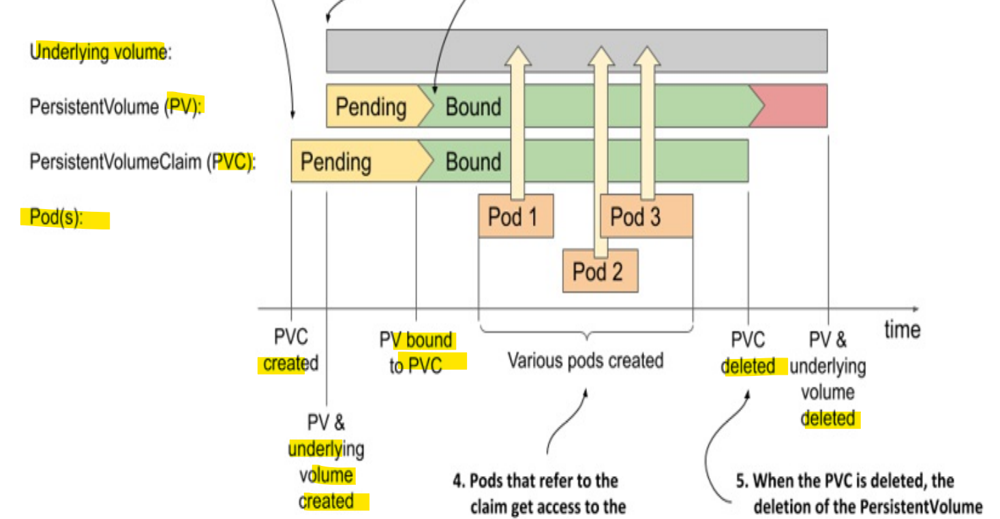

# Kubernetes - Storage: Dynamic Provisioned Persistent Volumes

[Back](../../index.md)

- [Kubernetes - Storage: Dynamic Provisioned Persistent Volumes](#kubernetes---storage-dynamic-provisioned-persistent-volumes)
  - [Dynamic provisioned Persistent Volumes](#dynamic-provisioned-persistent-volumes)
    - [StorageClass object](#storageclass-object)
    - [Declarative Method](#declarative-method)
    - [Imperative Commands](#imperative-commands)
  - [Lab: StorageClass](#lab-storageclass)
    - [Lab: Create PVC with Default SC](#lab-create-pvc-with-default-sc)
    - [Lab: Expand PVC size 1G to 10G](#lab-expand-pvc-size-1g-to-10g)

---

## Dynamic provisioned Persistent Volumes

- `Dynamic volume provisioning`
  - **automates storage creation on-demand** when a user requests it via a `PersistentVolumeClaim (PVC)`, eliminating manual admin setup;
- When a `persistent volume claim` is created, the `dynamic provisioner` provisions the `underlying storage` and creates the `PersistentVolume` object for that particular claim.
  - The two objects are then bound.



---

### StorageClass object

- Static Provisioning vs Dynamic Provisioning

  - `Static Provisioning`
    - a volume must be created before a pv creates.
  - `Dynamic Provisioning`
    - the volume automatically is created
    - implemented by `storageClass`

- the `persistentVolumeClaim.storageClassName` field:

  - omitting value:
    - causes the **default storage** class to be used,
  - `""`:
    - disables dynamic provisioning

- has not `spec` and `status` fields
- `reclaimPolicy`: Always is `Delete`

  - the `volume` is deleted when it gets released by deleting the `claim`.

- binding mode:

  - `Immediate`:
    - The provision and binding of the `persistent volume` **takes place immediately** after the `claim` is created.
    - only applicable to `volumes` that are can be **accessed** from any `cluster node`.
  - `WaitForFirstConsumer`:
    - The `volume` is provisioned and bound to the `claim` when the **first** `pod` that uses this claim is created.
    - This mode is used for **topology-constrained** `volume` types.
  - Depends on the storage provisioners, the status of the PVC using SC might be `Pending` and turns to `Bound` after the pod is created.
    - especially for the provisioners use "local" in **multiple** `nodes`.

- If a `persistent volume claim` refers to a **non-existent** `storage class`, the `claim` **remains** `Pending` until the `storage class` is **created**.
  - Kubernetes attempts to bind the `claim` at regular intervals, generating a `ProvisioningFailed` event each time.

---

### Declarative Method

- create a storage class with `google cloud engine`
  - pc is not required

```yaml
apiVersion: storage.k8s.io/v1
kind: StorageClass
metadata:
  name: google-storage
provisioner: kubernetes.io/gce-pd
parameters:
  type: pd-standard
  replication-type: none
```

- Create a pvc with storage class

```yaml
apiVersion: v1
kind: PersistentVolumeClaim
metadata:
  name: myclaim
spec:
  accessModes:
    - ReadWriteOnce
  storageClassName: google-storage # refer storage class
  resources:
    requests:
      storage: 500Mi
```

- Apply PVC to a pod

```yaml
apiVersion: v1
kind: Pod
metadata:
  name: my-pod
spec:
  containers:
    - image: alpine
      name: alpine
      command: ["/bin/sh", "-c"]
      args: ["shuf -i 0-100 -n 1 >> /opt/number.out;"]
      volumeMounts:
        - mountPath: /opt
          name: data-volume

  volumes:
    - name: data-volume
      persistentVolumeClaim:
        claimName: myclaim # refer pvc
```

---

### Imperative Commands

| Command                                       | Description                                                                       |
| --------------------------------------------- | --------------------------------------------------------------------------------- |
| `kubectl get storageclass` / `kubectl get sc` | List all StorageClasses in the cluster.                                           |
| `kubectl get sc <name>`                       | Show basic info for a specific StorageClass.                                      |
| `kubectl describe sc <name>`                  | Show detailed configuration, reclaim policy, parameters, and provisioner details. |
| `kubectl delete sc <name>`                    | Delete a specific StorageClass.                                                   |

---

## Lab: StorageClass

- Get default sc

```sh
kubectl get sc
# NAME                 PROVISIONER          RECLAIMPOLICY   VOLUMEBINDINGMODE   ALLOWVOLUMEEXPANSION   AGE
# hostpath (default)   docker.io/hostpath   Delete          Immediate           false                  49d

kubectl describe sc hostpath
# Name:            hostpath
# IsDefaultClass:  Yes
# Annotations:     kubectl.kubernetes.io/last-applied-configuration={"apiVersion":"storage.k8s.io/v1","kind":"StorageClass","metadata":{"annotations":{"storageclass.kubernetes.io/is-default-class":"true"},"name":"hostpath"},"provisioner":"docker.io/hostpath","reclaimPolicy":"Delete","volumeBindingMode":"Immediate"}
# ,storageclass.kubernetes.io/is-default-class=true
# Provisioner:           docker.io/hostpath
# Parameters:            <none>
# AllowVolumeExpansion:  <unset>
# MountOptions:          <none>
# ReclaimPolicy:         Delete
# VolumeBindingMode:     Immediate
# Events:                <none>

kubectl get sc hostpath -o yaml
# apiVersion: storage.k8s.io/v1
# kind: StorageClass
# metadata:
#   annotations:
#     kubectl.kubernetes.io/last-applied-configuration: |
#       {"apiVersion":"storage.k8s.io/v1","kind":"StorageClass","metadata":{"annotations":{"storageclass.kubernetes.io/is-default-class":"true"},"name":"hostpath"},"provisioner":"docker.io/hostpath","reclaimPolicy":"Delete","volumeBindingMode":"Immediate"}
#     storageclass.kubernetes.io/is-default-class: "true"
#   creationTimestamp: "2025-11-05T18:00:48Z"
#   name: hostpath
#   resourceVersion: "402"
#   uid: 1f503168-2cfb-4064-a51e-66605b6bdd4a
# provisioner: docker.io/hostpath
# reclaimPolicy: Delete
# volumeBindingMode: Immediate
```

---

### Lab: Create PVC with Default SC

- Define PVC

```yaml
# demo-pvc-default-sc.yaml
apiVersion: v1
kind: PersistentVolumeClaim
metadata:
  name: demo-pvc-default-sc
spec:
  # use default sc by omitting sc
  resources:
    requests:
      storage: 1Gi
  accessModes:
    - ReadWriteOnce
```

- Create `StorageClass`

```sh
kubectl apply -f demo-pvc-default-sc.yaml
# persistentvolumeclaim/demo-pvc-default-sc created

# confirm: status=bound; sc=hostpath
kubectl get pvc
# NAME                  STATUS   VOLUME                                     CAPACITY   ACCESS MODES   STORAGECLASS   VOLUMEATTRIBUTESCLASS   AGE
# demo-pvc-default-sc   Bound    pvc-db934e53-321b-473c-8cd2-1dcf54ec288c   10Gi       RWO            hostpath       <unset>                 5s

# confirm pv created
kubectl get pv
# NAME                                       CAPACITY   ACCESS MODES   RECLAIM POLICY   STATUS   CLAIM                         STORAGECLASS   VOLUMEATTRIBUTESCLASS   REASON   AGE
# pvc-db934e53-321b-473c-8cd2-1dcf54ec288c   10Gi       RWO            Delete           Bound    default/demo-pvc-default-sc   hostpath       <unset>                          18s
```

- Define pod

```yaml
# demo-pvc-default-sc-pod-writer.yaml
apiVersion: v1
kind: Pod
metadata:
  name: demo-pvc-default-sc-pod-writer
spec:
  volumes:
    - name: share-data
      persistentVolumeClaim:
        claimName: demo-pvc-default-sc
  containers:
    - name: writer
      image: busybox
      command:
        - sh
        - -c
        - |
          while true; do
            echo "<h1>Hello from the data writer container!$(date)</h1>" > /share/index.html;
            sleep 1;
          done
      volumeMounts:
        - name: share-data
          mountPath: /share
```

- Create pod

```sh
kubectl apply -f demo-pvc-default-sc-pod-writer.yaml
# pod/demo-pvc-default-sc-pod-writer created

# confirm pod status: running
kubectl get pvc
# NAME                             READY   STATUS    RESTARTS   AGE
# demo-pvc-default-sc-pod-writer   1/1     Running   0          22s

kubectl describe pod demo-pvc-default-sc-pod-writer
# Volumes:
#   share-data:
#     Type:       PersistentVolumeClaim (a reference to a PersistentVolumeClaim in the same namespace)
#     ClaimName:  demo-pvc-default-sc
#     ReadOnly:   false
```

---

### Lab: Expand PVC size 1G to 10G

```sh
# edit spec.resources.requests.storage=10Gi
kubectl apply -f demo-pvc-default-sc.yaml
# error when patching "demo-pvc-default-sc.yaml": persistentvolumeclaims "demo-pvc-default-sc" is forbidden: only dynamically provisioned pvc can be resized and the storageclass that provisions the pvc must support resize

kubectl delete pod demo-pvc-default-sc-pod-writer
# pod "demo-pvc-default-sc-pod-writer" deleted from default namespace

kubectl replace --force -f demo-pvc-default-sc.yaml
# persistentvolumeclaim "demo-pvc-default-sc" deleted from default namespace
# persistentvolumeclaim/demo-pvc-default-sc replaced

kubectl get pvc
# NAME                  STATUS   VOLUME                                     CAPACITY   ACCESS MODES   STORAGECLASS   VOLUMEATTRIBUTESCLASS   AGE
# demo-pvc-default-sc   Bound    pvc-4dd47494-6dfe-4cb0-8662-c63dbaf2bb31   10Gi       RWO            hostpath       <unset>                 17s

kubectl apply -f demo-pvc-default-sc-pod-writer.yaml
# pod/demo-pvc-default-sc-pod-writer created

kubectl get pod
# NAME                             READY   STATUS    RESTARTS   AGE
# demo-pvc-default-sc-pod-writer   1/1     Running   0          15s

```

---

- shrink the pvc size

```sh
# shrink size: # edit spec.resources.requests.storage=0.5Gi
kubectl apply -f demo-pvc-default-sc.yaml
# The PersistentVolumeClaim "demo-pvc-default-sc" is invalid: spec.resources.requests.storage: Forbidden: field can not be less than status.capacity

kubectl delete pod demo-pvc-default-sc-pod-writer
# pod "demo-pvc-default-sc-pod-writer" deleted from default namespace

kubectl replace --force -f demo-pvc-default-sc.yaml
# persistentvolumeclaim "demo-pvc-default-sc" deleted from default namespace
# persistentvolumeclaim/demo-pvc-default-sc replaced

kubectl get pvc
# NAME                  STATUS   VOLUME                                     CAPACITY   ACCESS MODES   STORAGECLASS   VOLUMEATTRIBUTESCLASS   AGE
# demo-pvc-default-sc   Bound    pvc-69d4dffc-94ed-47bd-b50e-3680a0a64150   512Mi      RWO            hostpath       <unset>                 15s

kubectl apply -f demo-pvc-default-sc-pod-writer.yaml
# pod/demo-pvc-default-sc-pod-writer created

kubectl get pod
# NAME                             READY   STATUS    RESTARTS   AGE
# demo-pvc-default-sc-pod-writer   1/1     Running   0          16s
```

---
