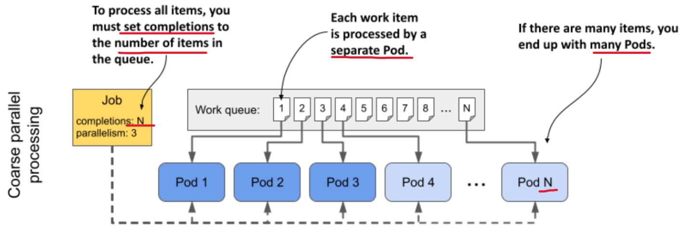
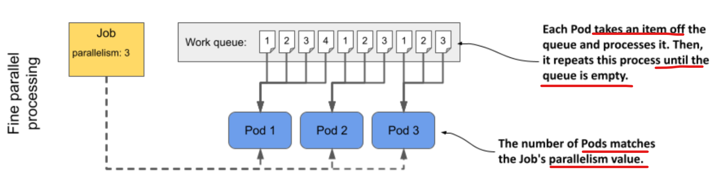

# Kubernetes - Job

[Back](../../index.md)

- [Kubernetes - Job](#kubernetes---job)
  - [Job](#job)
    - [common fields](#common-fields)
  - [Lab: Job with Completion](#lab-job-with-completion)
  - [Lab: Job with parallelism](#lab-job-with-parallelism)
  - [Lab: Job with Completion \> parallelism](#lab-job-with-completion--parallelism)
  - [Lab: Job with Completion \< parallelism](#lab-job-with-completion--parallelism-1)
    - [Label](#label)
  - [Handling Job failure](#handling-job-failure)
    - [Control Always Failure job](#control-always-failure-job)
    - [Lab: Control Always Failure Job - backoffLimit](#lab-control-always-failure-job---backofflimit)
    - [Lab: Control Always Failure Job - activeDeadlineSeconds](#lab-control-always-failure-job---activedeadlineseconds)
  - [Parameterizing Pods](#parameterizing-pods)
    - [Lab: Indexed Job - `JOB_COMPLETION_INDEX` environment variable](#lab-indexed-job---job_completion_index-environment-variable)
    - [Lab: job-completion-index annotation](#lab-job-completion-index-annotation)
    - [Imperative Commands](#imperative-commands)
  - [Lab: Job](#lab-job)
  - [Lab: Job init container](#lab-job-init-container)
  - [Lab: Create a suspend jog](#lab-create-a-suspend-jog)
  - [Work Queue](#work-queue)
  - [Communication between Job Pods](#communication-between-job-pods)
    - [Lab: Job Pod Communication](#lab-job-pod-communication)

---

## Job

- `finite workload`
  - a task run to completion
  - **doesn’t** run **continuously**
- `Job`
  - runs its Pods **immediately**
    - can’t use it for scheduling tasks.
- `CronJob object`

  - allows you to schedule the task to run **at a specific time** in the future or at **regular intervals**.

- **can’t modify** the **template** in a `Job object` after creating the object.

- `Job controller` create
  - `job` object
  - `Pod` object
    - controlled by the `job`
    - will not get deleted when completed

---

### common fields

- `spec.suspend` field

  - specify whether the job gets suspended
  - `true`
    - `Job controller` **immediately deletes** the `Pod` associated with the Job and generates an `Event` indicating that the Job has been **suspended**.

- `ttlSecondsAfterFinished` field:

  - set the TTL seconds to automatically cleanup for finished Jobs

- `spec.completions` field:

  - default: 1
  - specifies the **number of Pods** that **must be successfully completed** for this Job to be complete.
  - If set **only** `spec.parallelism`, number of Pods that run **one after the other**.

- `spec.parallelism` field:

  - default: 1
  - specifies **how many of these Pods** may **run in parallel**.
  - If set **only** `spec.parallelism`, this is the number of Pods that run, but **only one must complete successfully** for the Job to be complete.

- If `parallelism` > `completions`, the `Job controller` creates **only as many** `Pods` as specified in the `completions` field.
- If `parallelism` < `completions`, the `Job controller` runs at most `parallelism` Pods **in parallel** but **creates additional** `Pods` when those **first** Pods **complete**.

  - It keeps creating new Pods until the number of successfully completed Pods matches completions.

- Example:
  - `completions: 5`; `parallelism: 2`:
    - Create 2 pods at once
    - maximum 2 pods running
    - complete until total 5 pods

---

## Lab: Job with Completion

```yaml
# demo-job-completion.yaml
apiVersion: batch/v1
kind: Job
metadata:
  name: demo-job-completion
spec:
  completions: 5 # # of pod must complete
  template:
    spec:
      restartPolicy: Never
      volumes:
        - name: local-storage
          hostPath:
            path: /tmp/data
            type: DirectoryOrCreate
      initContainers:
        - name: init
          image: busybox
          volumeMounts:
            - name: local-storage
              mountPath: /data
          command:
            - "/bin/sh"
            - "-c"
          args:
            - |
              echo "$(date) Init container message";
              echo "$(date) Init container message" >> /data/message.txt;
              sleep 10;
      containers:
        - name: writer
          image: busybox
          volumeMounts:
            - name: local-storage
              mountPath: /data
          command:
            - "/bin/sh"
            - "-c"
          args:
            - |
              echo "$(date) Container message";
              echo "$(date) Container message" >> /data/message.txt;
              sleep 30;
```

```sh
kubectl apply -f demo-job-completion.yaml
# job.batch/demo-job-completion created

# confirm completion = 5
kubectl get job -w
# NAME                  STATUS    COMPLETIONS   DURATION   AGE
# demo-job-completion   Running   0/5                      0s
# demo-job-completion   Running   0/5           0s         0s
# demo-job-completion   Running   0/5           19s        19s
# demo-job-completion   Running   0/5           53s        53s
# demo-job-completion   Running   0/5           54s        54s
# demo-job-completion   Running   1/5           54s        54s
# demo-job-completion   Running   1/5           71s        71s
# demo-job-completion   Running   1/5           104s       104s
# demo-job-completion   Running   1/5           105s       105s
# demo-job-completion   Running   2/5           105s       105s
# demo-job-completion   Running   2/5           2m3s       2m3s
# demo-job-completion   Running   2/5           2m37s      2m37s
# demo-job-completion   Running   2/5           2m38s      2m38s
# demo-job-completion   Running   3/5           2m38s      2m38s
# demo-job-completion   Running   3/5           2m54s      2m54s
# demo-job-completion   Running   3/5           3m27s      3m27s
# demo-job-completion   Running   3/5           3m28s      3m28s
# demo-job-completion   Running   4/5           3m28s      3m28s
# demo-job-completion   Running   4/5           3m46s      3m46s
# demo-job-completion   Running   4/5           4m20s      4m20s
# demo-job-completion   SuccessCriteriaMet   4/5           4m21s      4m21s
# demo-job-completion   Complete             5/5           4m21s      4m21s


kubectl get pod -w
# NAME                          READY       STATUS              RESTARTS   AGE
# observer                      1/1         Running             0          6h4m
# demo-job-completion-xpmdt     0/1         Pending             0          0s
# demo-job-completion-xpmdt     0/1         Pending             0          0s
# demo-job-completion-xpmdt     0/1         Init:0/1            0          0s
# demo-job-completion-xpmdt     0/1         Init:0/1            0          4s
# demo-job-completion-xpmdt     0/1         PodInitializing     0          17s
# demo-job-completion-xpmdt     1/1         Running             0          18s
# demo-job-completion-xpmdt     0/1         Completed           0          52s
# demo-job-completion-xpmdt     0/1         Completed           0          54s
# demo-job-completion-vg4wh     0/1         Pending             0          0s
# demo-job-completion-vg4wh     0/1         Pending             0          0s
# demo-job-completion-xpmdt     0/1         Completed           0          54s
# demo-job-completion-vg4wh     0/1         Init:0/1            0          0s
# demo-job-completion-vg4wh     0/1         Init:0/1            0          3s
# demo-job-completion-vg4wh     0/1         PodInitializing     0          13s
# demo-job-completion-vg4wh     1/1         Running             0          15s
# demo-job-completion-vg4wh     0/1         Completed           0          49s
# demo-job-completion-vg4wh     0/1         Completed           0          50s
# demo-job-completion-56jpl     0/1         Pending             0          0s
# demo-job-completion-56jpl     0/1         Pending             0          0s
# demo-job-completion-vg4wh     0/1         Completed           0          51s
# demo-job-completion-56jpl     0/1         Init:0/1            0          0s
# demo-job-completion-56jpl     0/1         Init:0/1            0          2s
# demo-job-completion-56jpl     0/1         PodInitializing     0          16s
# demo-job-completion-56jpl     1/1         Running             0          17s
# demo-job-completion-56jpl     0/1         Completed           0          51s
# demo-job-completion-56jpl     0/1         Completed           0          53s
# demo-job-completion-wc4nc     0/1         Pending             0          0s
# demo-job-completion-wc4nc     0/1         Pending             0          0s
# demo-job-completion-56jpl     0/1         Completed           0          53s
# demo-job-completion-wc4nc     0/1         Init:0/1            0          0s
# demo-job-completion-wc4nc     0/1         Init:0/1            0          3s
# demo-job-completion-wc4nc     0/1         PodInitializing     0          12s
# demo-job-completion-wc4nc     1/1         Running             0          15s
# demo-job-completion-wc4nc     1/1         Running             0          15s
# demo-job-completion-wc4nc     0/1         Completed           0          48s
# demo-job-completion-wc4nc     0/1         Completed           0          50s
# demo-job-completion-7j8qj     0/1         Pending             0          0s
# demo-job-completion-7j8qj     0/1         Pending             0          0s
# demo-job-completion-wc4nc     0/1         Completed           0          50s
# demo-job-completion-7j8qj     0/1         Init:0/1            0          0s
# demo-job-completion-7j8qj     0/1         Init:0/1            0          3s
# demo-job-completion-7j8qj     0/1         PodInitializing     0          16s
# demo-job-completion-7j8qj     1/1         Running             0          17s
# demo-job-completion-7j8qj     0/1         Completed           0          51s
# demo-job-completion-7j8qj     0/1         Completed           0          52s
# demo-job-completion-7j8qj     0/1         Completed           0          53s

# confirm in message file: 5 message
kubectl exec -it observer -- cat /data/message.txt
# Sat Jan  3 01:46:29 UTC 2026 Init container message
# Sat Jan  3 01:46:44 UTC 2026 Container message
# Sat Jan  3 01:47:22 UTC 2026 Init container message
# Sat Jan  3 01:47:34 UTC 2026 Container message
# Sat Jan  3 01:48:12 UTC 2026 Init container message
# Sat Jan  3 01:48:27 UTC 2026 Container message
# Sat Jan  3 01:49:05 UTC 2026 Init container message
# Sat Jan  3 01:49:17 UTC 2026 Container message
# Sat Jan  3 01:49:55 UTC 2026 Init container message
# Sat Jan  3 01:50:11 UTC 2026 Container message
```

---

## Lab: Job with parallelism

```yaml
# demo-job-parallelism.yaml
apiVersion: batch/v1
kind: Job
metadata:
  name: demo-job-parallelism
spec:
  parallelism: 5 # # of parallelism
  template:
    spec:
      restartPolicy: Never
      volumes:
        - name: local-storage
          hostPath:
            path: /tmp/data
            type: DirectoryOrCreate
      initContainers:
        - name: init
          image: busybox
          volumeMounts:
            - name: local-storage
              mountPath: /data
          command:
            - "/bin/sh"
            - "-c"
          args:
            - |
              echo "$(date) Init container message";
              echo "$(date) Init container message" >> /data/message.txt;
              sleep 10;
      containers:
        - name: writer
          image: busybox
          volumeMounts:
            - name: local-storage
              mountPath: /data
          command:
            - "/bin/sh"
            - "-c"
          args:
            - |
              echo "$(date) Container message";
              echo "$(date) Container message" >> /data/message.txt;
              sleep 30;
```

```sh
kubectl apply -f demo-job-parallelism.yaml
# job.batch/demo-job-parallelism created

# confirm: total 5
kubectl get job -w
# NAME                   STATUS    COMPLETIONS   DURATION   AGE
# demo-job-parallelism   Running   0/1 of 5                 0s
# demo-job-parallelism   Running   0/1 of 5      1s         1s
# demo-job-parallelism   Running   0/1 of 5      19s        19s
# demo-job-parallelism   Running   0/1 of 5      20s        20s
# demo-job-parallelism   Running   0/1 of 5      22s        22s
# demo-job-parallelism   Running   0/1 of 5      23s        23s
# demo-job-parallelism   Running   0/1 of 5      53s        53s
# demo-job-parallelism   Running   0/1 of 5      54s        54s
# demo-job-parallelism   Running   1/1 of 5      54s        54s
# demo-job-parallelism   Running   1/1 of 5      55s        55s
# demo-job-parallelism   Running   2/1 of 5      55s        55s
# demo-job-parallelism   Running   2/1 of 5      56s        56s
# demo-job-parallelism   Running   2/1 of 5      57s        57s
# demo-job-parallelism   Running   3/1 of 5      57s        57s
# demo-job-parallelism   SuccessCriteriaMet   3/1 of 5      58s        58s
# demo-job-parallelism   Complete             5/1 of 5      58s        58s


kubectl get pod -w
# NAME       READY   STATUS    RESTARTS   AGE
# observer   1/1     Running   0          6h34m
# demo-job-parallelism-9hcqc   0/1     Pending   0          0s
# demo-job-parallelism-t4dml   0/1     Pending   0          0s
# demo-job-parallelism-9hcqc   0/1     Pending   0          0s
# demo-job-parallelism-7rv6d   0/1     Pending   0          0s
# demo-job-parallelism-2pd5l   0/1     Pending   0          0s
# demo-job-parallelism-qvwgb   0/1     Pending   0          0s
# demo-job-parallelism-t4dml   0/1     Pending   0          0s
# demo-job-parallelism-7rv6d   0/1     Pending   0          0s
# demo-job-parallelism-qvwgb   0/1     Pending   0          0s
# demo-job-parallelism-2pd5l   0/1     Pending   0          0s
# demo-job-parallelism-9hcqc   0/1     Init:0/1   0          1s
# demo-job-parallelism-7rv6d   0/1     Init:0/1   0          1s
# demo-job-parallelism-t4dml   0/1     Init:0/1   0          1s
# demo-job-parallelism-qvwgb   0/1     Init:0/1   0          1s
# demo-job-parallelism-2pd5l   0/1     Init:0/1   0          1s
# demo-job-parallelism-9hcqc   0/1     Init:0/1   0          3s
# demo-job-parallelism-7rv6d   0/1     Init:0/1   0          4s
# demo-job-parallelism-t4dml   0/1     Init:0/1   0          4s
# demo-job-parallelism-qvwgb   0/1     Init:0/1   0          6s
# demo-job-parallelism-2pd5l   0/1     Init:0/1   0          6s
# demo-job-parallelism-9hcqc   0/1     PodInitializing   0          17s
# demo-job-parallelism-7rv6d   0/1     PodInitializing   0          18s
# demo-job-parallelism-9hcqc   1/1     Running           0          18s
# demo-job-parallelism-qvwgb   0/1     PodInitializing   0          18s
# demo-job-parallelism-t4dml   0/1     PodInitializing   0          18s
# demo-job-parallelism-2pd5l   0/1     PodInitializing   0          20s
# demo-job-parallelism-7rv6d   1/1     Running           0          20s
# demo-job-parallelism-qvwgb   1/1     Running           0          21s
# demo-job-parallelism-t4dml   1/1     Running           0          22s
# demo-job-parallelism-2pd5l   1/1     Running           0          23s
# demo-job-parallelism-9hcqc   0/1     Completed         0          52s
# demo-job-parallelism-7rv6d   0/1     Completed         0          53s
# demo-job-parallelism-9hcqc   0/1     Completed         0          53s
# demo-job-parallelism-9hcqc   0/1     Completed         0          54s
# demo-job-parallelism-qvwgb   0/1     Completed         0          54s
# demo-job-parallelism-7rv6d   0/1     Completed         0          54s
# demo-job-parallelism-7rv6d   0/1     Completed         0          55s
# demo-job-parallelism-t4dml   0/1     Completed         0          55s
# demo-job-parallelism-2pd5l   0/1     Completed         0          56s
# demo-job-parallelism-qvwgb   0/1     Completed         0          56s
# demo-job-parallelism-qvwgb   0/1     Completed         0          57s
# demo-job-parallelism-t4dml   0/1     Completed         0          57s
# demo-job-parallelism-2pd5l   0/1     Completed         0          57s
# demo-job-parallelism-2pd5l   0/1     Completed         0          58s
# demo-job-parallelism-t4dml   0/1     Completed         0          58s

# confirm 5 parallel
kubectl exec -it observer -- cat /data/message.txt
# Sat Jan  3 01:56:03 UTC 2026 Init container message
# Sat Jan  3 01:56:19 UTC 2026 Container message
# Sat Jan  3 02:00:54 UTC 2026 Init container message
# Sat Jan  3 02:00:54 UTC 2026 Init container message
# Sat Jan  3 02:00:55 UTC 2026 Init container message
# Sat Jan  3 02:00:55 UTC 2026 Init container message
# Sat Jan  3 02:00:56 UTC 2026 Init container message
# Sat Jan  3 02:01:09 UTC 2026 Container message
# Sat Jan  3 02:01:10 UTC 2026 Container message
# Sat Jan  3 02:01:11 UTC 2026 Container message
# Sat Jan  3 02:01:12 UTC 2026 Container message
# Sat Jan  3 02:01:12 UTC 2026 Container message
```

---

## Lab: Job with Completion > parallelism

```yaml
# demo-job-completion-lg-parallelism.yaml
apiVersion: batch/v1
kind: Job
metadata:
  name: demo-job-completion-lg-parallelism
spec:
  completions: 5 # completion > parallelism
  parallelism: 2
  template:
    spec:
      restartPolicy: Never
      volumes:
        - name: local-storage
          hostPath:
            path: /tmp/data
            type: DirectoryOrCreate
      containers:
        - name: writer
          image: busybox
          volumeMounts:
            - name: local-storage
              mountPath: /data
          command:
            - "/bin/sh"
            - "-c"
          args:
            - |
              echo "$(date) Container message";
              echo "$(date) Container message" >> /data/message.txt;
              sleep 30;
```

```sh
kubectl apply -f demo-job-completion-lg-parallelism.yaml
# job.batch/demo-job-completion-lg-parallelism created

kubectl get job -w
# NAME                                 STATUS    COMPLETIONS   DURATION   AGE
# demo-job-completion-lg-parallelism   Running   0/5                      0s
# demo-job-completion-lg-parallelism   Running   0/5           0s         0s
# demo-job-completion-lg-parallelism   Running   0/5           4s         4s
# demo-job-completion-lg-parallelism   Running   0/5           37s        37s
# demo-job-completion-lg-parallelism   Running   0/5           38s        38s
# demo-job-completion-lg-parallelism   Running   2/5           38s        38s
# demo-job-completion-lg-parallelism   Running   2/5           42s        42s
# demo-job-completion-lg-parallelism   Running   2/5           75s        75s
# demo-job-completion-lg-parallelism   Running   2/5           77s        77s
# demo-job-completion-lg-parallelism   Running   4/5           77s        77s
# demo-job-completion-lg-parallelism   Running   4/5           83s        83s
# demo-job-completion-lg-parallelism   Running   4/5           116s       116s
# demo-job-completion-lg-parallelism   SuccessCriteriaMet   4/5           117s       117s
# demo-job-completion-lg-parallelism   Complete             5/5           117s       118s

# confirm max 2 parallel
kubectl get pod -w
# NAME       READY   STATUS    RESTARTS   AGE
# observer   1/1     Running   0          6h42m
# demo-job-completion-lg-parallelism-cc7fr   0/1     Pending   0          0s
# demo-job-completion-lg-parallelism-w9dg6   0/1     Pending   0          0s
# demo-job-completion-lg-parallelism-cc7fr   0/1     Pending   0          0s
# demo-job-completion-lg-parallelism-w9dg6   0/1     Pending   0          0s
# demo-job-completion-lg-parallelism-cc7fr   0/1     ContainerCreating   0          0s
# demo-job-completion-lg-parallelism-w9dg6   0/1     ContainerCreating   0          0s
# demo-job-completion-lg-parallelism-cc7fr   1/1     Running             0          3s
# demo-job-completion-lg-parallelism-w9dg6   1/1     Running             0          3s
# demo-job-completion-lg-parallelism-cc7fr   0/1     Completed           0          36s
# demo-job-completion-lg-parallelism-w9dg6   0/1     Completed           0          37s
# demo-job-completion-lg-parallelism-w9dg6   0/1     Completed           0          38s
# demo-job-completion-lg-parallelism-cc7fr   0/1     Completed           0          38s
# demo-job-completion-lg-parallelism-4rpng   0/1     Pending             0          0s
# demo-job-completion-lg-parallelism-z2vkj   0/1     Pending             0          0s
# demo-job-completion-lg-parallelism-4rpng   0/1     Pending             0          0s
# demo-job-completion-lg-parallelism-z2vkj   0/1     Pending             0          0s
# demo-job-completion-lg-parallelism-4rpng   0/1     ContainerCreating   0          0s
# demo-job-completion-lg-parallelism-cc7fr   0/1     Completed           0          38s
# demo-job-completion-lg-parallelism-w9dg6   0/1     Completed           0          38s
# demo-job-completion-lg-parallelism-z2vkj   0/1     ContainerCreating   0          0s
# demo-job-completion-lg-parallelism-4rpng   1/1     Running             0          3s
# demo-job-completion-lg-parallelism-z2vkj   1/1     Running             0          3s
# demo-job-completion-lg-parallelism-4rpng   0/1     Completed           0          36s
# demo-job-completion-lg-parallelism-z2vkj   0/1     Completed           0          36s
# demo-job-completion-lg-parallelism-z2vkj   0/1     Completed           0          38s
# demo-job-completion-lg-parallelism-4rpng   0/1     Completed           0          38s
# demo-job-completion-lg-parallelism-vp42k   0/1     Pending             0          0s
# demo-job-completion-lg-parallelism-vp42k   0/1     Pending             0          0s
# demo-job-completion-lg-parallelism-4rpng   0/1     Completed           0          39s
# demo-job-completion-lg-parallelism-z2vkj   0/1     Completed           0          39s
# demo-job-completion-lg-parallelism-vp42k   0/1     ContainerCreating   0          0s
# demo-job-completion-lg-parallelism-vp42k   1/1     Running             0          5s
# demo-job-completion-lg-parallelism-vp42k   0/1     Completed           0          38s
# demo-job-completion-lg-parallelism-vp42k   0/1     Completed           0          40s
# demo-job-completion-lg-parallelism-vp42k   0/1     Completed           0          40s

# confirm max 2 parallel
kubectl exec -it observer -- cat /data/message.txt
# Sat Jan  3 02:08:43 UTC 2026 Container message
# Sat Jan  3 02:08:43 UTC 2026 Container message
# Sat Jan  3 02:09:21 UTC 2026 Container message
# Sat Jan  3 02:09:21 UTC 2026 Container message
# Sat Jan  3 02:10:02 UTC 2026 Container message
```

---

## Lab: Job with Completion < parallelism

```yaml
# demo-job-completion-lt-parallelism.yaml
apiVersion: batch/v1
kind: Job
metadata:
  name: demo-job-completion-lt-parallelism
spec:
  completions: 2 # completion < parallelism
  parallelism: 5
  template:
    spec:
      restartPolicy: Never
      volumes:
        - name: local-storage
          hostPath:
            path: /tmp/data
            type: DirectoryOrCreate
      containers:
        - name: writer
          image: busybox
          volumeMounts:
            - name: local-storage
              mountPath: /data
          command:
            - "/bin/sh"
            - "-c"
          args:
            - |
              echo "$(date) Container message";
              echo "$(date) Container message" >> /data/message.txt;
              sleep 30;
```

```sh
kubectl apply -f demo-job-completion-lt-parallelism.yaml
# job.batch/demo-job-completion-lt-parallelism created

# confirm: completion =2
kubectl get job -w
# NAME                                 STATUS    COMPLETIONS   DURATION   AGE
# demo-job-completion-lt-parallelism   Running   0/2                      0s
# demo-job-completion-lt-parallelism   Running   0/2           0s         0s
# demo-job-completion-lt-parallelism   Running   0/2           4s         4s
# demo-job-completion-lt-parallelism   Running   0/2           5s         5s
# demo-job-completion-lt-parallelism   Running   0/2           37s        37s
# demo-job-completion-lt-parallelism   Running   0/2           38s        38s
# demo-job-completion-lt-parallelism   Running   1/2           38s        38s
# demo-job-completion-lt-parallelism   SuccessCriteriaMet   1/2           39s        39s
# demo-job-completion-lt-parallelism   Complete             2/2           39s        39s

# confirm: completion =2 in parallel
kubectl get pod -w
# NAME       READY   STATUS    RESTARTS   AGE
# observer   1/1     Running   0          6h51m
# demo-job-completion-lt-parallelism-ch9m9   0/1     Pending   0          0s
# demo-job-completion-lt-parallelism-qn7lt   0/1     Pending   0          0s
# demo-job-completion-lt-parallelism-ch9m9   0/1     Pending   0          0s
# demo-job-completion-lt-parallelism-qn7lt   0/1     Pending   0          0s
# demo-job-completion-lt-parallelism-ch9m9   0/1     ContainerCreating   0          0s
# demo-job-completion-lt-parallelism-qn7lt   0/1     ContainerCreating   0          0s
# demo-job-completion-lt-parallelism-qn7lt   1/1     Running             0          3s
# demo-job-completion-lt-parallelism-ch9m9   1/1     Running             0          4s
# demo-job-completion-lt-parallelism-qn7lt   0/1     Completed           0          36s
# demo-job-completion-lt-parallelism-ch9m9   0/1     Completed           0          37s
# demo-job-completion-lt-parallelism-qn7lt   0/1     Completed           0          38s
# demo-job-completion-lt-parallelism-qn7lt   0/1     Completed           0          38s
# demo-job-completion-lt-parallelism-ch9m9   0/1     Completed           0          39s
# demo-job-completion-lt-parallelism-ch9m9   0/1     Completed           0          39s

# confirm completion =2
kubectl exec -it observer -- cat /data/message.txt
# Sat Jan  3 02:18:00 UTC 2026 Container message
# Sat Jan  3 02:18:01 UTC 2026 Container message
```

---

### Label

- Additional labels:

- `controller-uid`:
  - automatically added to the Job’s Pod template

---

## Handling Job failure

- `template.spec.restartPolicy` field:
  - required
  - determines whether the failure is handled at the `Pod level` by the `Kubelet` or at the `Job level` by the `Job controller`.
  - `OnFailure`:
    - Handling failures at the **Pod level**
    - the failed container is **restarted within the same Pod**.
      - the `container` terminates with a **non-zero exit code**.
      - The `Kubelet` notices the failure and **restarts** the container.
      - The **new container** runs in the **same Pod** on the **same Node** and therefore allows for a **quick turnaround**.
      - `Kubelete` adds a **delay** after each crash and **doubles** it after each restart.
  - `Never`:
    - the entire Pod is marked as **failed** and the `Job controller` **creates a new Pod**.

---

### Control Always Failure job

- `spec.backoffLimit` field

  - control the limit of backoff
  - default: 6; max 6 retries

- `spec.activeDeadlineSeconds` field
  - default, the time isn’t limited

---

### Lab: Control Always Failure Job - backoffLimit

```yaml
# demo-job-fails-default-limit.yaml
apiVersion: batch/v1
kind: Job
metadata:
  name: demo-job-fails-default-limit
spec:
  completions: 10
  parallelism: 3
  template:
    spec:
      restartPolicy: OnFailure # pod level
      containers:
        - name: busybox
          image: busybox
          command:
            - "false"
```

```sh
kubectl apply -f demo-job-fails-default-limit.yaml
# job.batch/demo-job-fails-default-limit created

kubectl get job
# NAME                           STATUS   COMPLETIONS   DURATION   AGE
# demo-job-fails-default-limit   Failed   0/10          2m23s      2m23s

# confirm default limit=6
kubectl describe job demo-job-fails-default-limit
# Backoff Limit:    6
#   Type     Reason                Age    From            Message
#   ----     ------                ----   ----            -------
#   Normal   SuccessfulCreate      2m51s  job-controller  Created pod: demo-job-fails-default-limit-dgddj
#   Normal   SuccessfulCreate      2m51s  job-controller  Created pod: demo-job-fails-default-limit-x2xgt
#   Normal   SuccessfulCreate      2m51s  job-controller  Created pod: demo-job-fails-default-limit-sh7bv
#   Normal   SuccessfulDelete      2m23s  job-controller  Deleted pod: demo-job-fails-default-limit-sh7bv
#   Normal   SuccessfulDelete      2m23s  job-controller  Deleted pod: demo-job-fails-default-limit-dgddj
#   Normal   SuccessfulDelete      2m23s  job-controller  Deleted pod: demo-job-fails-default-limit-x2xgt
#   Warning  BackoffLimitExceeded  2m22s  job-controller  Job has reached the specified backoff limit

```

### Lab: Control Always Failure Job - activeDeadlineSeconds

```yaml
# demo-job-fail-deadline.yaml
apiVersion: batch/v1
kind: Job
metadata:
  name: demo-job-fail-deadline
spec:
  completions: 2
  parallelism: 1
  activeDeadlineSeconds: 90 # deadline 90s
  template:
    spec:
      restartPolicy: OnFailure
      containers:
        - name: demo-suspend
          image: busybox
          command:
            - sleep
            - "60"
```

```sh
kubectl apply -f demo-job-fail-deadline.yaml
# job.batch/demo-job-fail-deadline created

kubectl get job
# NAME                     STATUS   COMPLETIONS   DURATION   AGE
# demo-job-fail-deadline   Failed   1/2           4m41s      4m41s

kubectl describe job demo-job-fail-deadline
# Active Deadline Seconds:  90s
# Events:
#   Type     Reason            Age    From            Message
#   ----     ------            ----   ----            -------
#   Normal   SuccessfulCreate  5m11s  job-controller  Created pod: demo-job-fail-deadline-qdhxq
#   Normal   SuccessfulCreate  3m59s  job-controller  Created pod: demo-job-fail-deadline-zt2b7
#   Normal   SuccessfulDelete  3m41s  job-controller  Deleted pod: demo-job-fail-deadline-zt2b7
#   Warning  DeadlineExceeded  3m7s   job-controller  Job was active longer than specified deadline

```

---

## Parameterizing Pods

- `completionMode` field

  - `NonIndexed`:
    - default
    - All Pods are equal to each other.
    - Completion: number of successfully completed Pods == spec.completions
  - `Indexed`
    - Each Pod is given a completion index (starting at 0) to distinguish the Pods from each other.
    - each Pod to perform only a portion of the entire task
    - Completion: there is **one successfully completed** Pod for each **index**.
      - If a Pod with a particular `index` **fails**, the `Job controller` creates a **new Pod** with the **same index**.
    - `completion index` assigned to each Pod:
      - annotation `batch.kubernetes.io/job-completion-index`
      - environment variable `JOB_COMPLETION_INDEX`
    - With `completions` field
      - `completions` field determines number of Pods to be created

- Use Case: indexed job to process files
  

---

### Lab: Indexed Job - `JOB_COMPLETION_INDEX` environment variable

```yaml
# demo-job-indexed.yaml
apiVersion: batch/v1
kind: Job
metadata:
  name: demo-job-indexed
spec:
  completions: 12
  parallelism: 3
  completionMode: Indexed # Indexed completionMode
  template:
    spec:
      restartPolicy: OnFailure
      volumes:
        - name: local-storage
          hostPath:
            path: /tmp/data
            type: DirectoryOrCreate
      containers:
        - name: busybox
          image: busybox
          volumeMounts:
            - name: local-storage
              mountPath: /data
          command:
            - "sh"
            - "-c"
          args:
            - |
              echo "$(date) Container Index: $JOB_COMPLETION_INDEX" >> /data/message.txt
```

```sh
kubectl apply -f demo-job-indexed.yaml
# job.batch/demo-job-indexed created

kubectl get job -w
# NAME               STATUS    COMPLETIONS   DURATION   AGE
# demo-job-indexed   Running   0/12                     0s
# demo-job-indexed   Running   0/12          0s         0s
# demo-job-indexed   Running   2/12          5s         5s
# demo-job-indexed   Running   3/12          6s         6s
# demo-job-indexed   Running   5/12          10s        10s
# demo-job-indexed   Running   6/12          11s        11s
# demo-job-indexed   Running   7/12          16s        16s
# demo-job-indexed   Running   9/12          17s        17s
# demo-job-indexed   Running   11/12         22s        22s
# demo-job-indexed   SuccessCriteriaMet   12/12         26s        26s
# demo-job-indexed   Complete             12/12         26s        26s

kubectl exec -it observer -- cat /data/message.txt
# Sat Jan  3 04:37:58 UTC 2026 Container Index: 1
# Sat Jan  3 04:37:59 UTC 2026 Container Index: 2
# Sat Jan  3 04:37:59 UTC 2026 Container Index: 0
# Sat Jan  3 04:38:03 UTC 2026 Container Index: 3
# Sat Jan  3 04:38:03 UTC 2026 Container Index: 4
# Sat Jan  3 04:38:04 UTC 2026 Container Index: 5
# Sat Jan  3 04:38:09 UTC 2026 Container Index: 7
# Sat Jan  3 04:38:09 UTC 2026 Container Index: 6
# Sat Jan  3 04:38:10 UTC 2026 Container Index: 8
# Sat Jan  3 04:38:14 UTC 2026 Container Index: 9
# Sat Jan  3 04:38:15 UTC 2026 Container Index: 10
# Sat Jan  3 04:38:16 UTC 2026 Container Index: 11
```

---

### Lab: job-completion-index annotation

```yaml
# demo-job-indexed-annotation.yaml
apiVersion: batch/v1
kind: Job
metadata:
  name: demo-job-indexed
spec:
  completions: 12
  parallelism: 1
  completionMode: Indexed # Indexed completionMode
  template:
    spec:
      restartPolicy: OnFailure
      volumes:
        - name: local-storage
          hostPath:
            path: /tmp/data
            type: DirectoryOrCreate
      containers:
        - name: busybox
          image: busybox
          volumeMounts:
            - name: local-storage
              mountPath: /data
          env:
            - name: INDEX
              valueFrom:
                fieldRef:
                  fieldPath: metadata.annotations['batch.kubernetes.io/job-completion-index'] # get value from annotation
          command:
            - "sh"
            - "-c"
          args:
            - |
              echo "$(date) Container Index: $INDEX" >> /data/message.txt
```

```sh
kubectl apply -f demo-job-indexed-annotation.yaml
# job.batch/demo-job-indexed created

kubectl get job -w
# NAME               STATUS               COMPLETIONS   DURATION   AGE
# demo-job-indexed   Running              0/12          0s         0s
# demo-job-indexed   Running              1/12          5s         5s
# demo-job-indexed   Running              2/12          10s        10s
# demo-job-indexed   Running              3/12          14s        14s
# demo-job-indexed   Running              4/12          20s        20s
# demo-job-indexed   Running              5/12          25s        25s
# demo-job-indexed   Running              6/12          33s        33s
# demo-job-indexed   Running              7/12          38s        38s
# demo-job-indexed   Running              8/12          43s        43s
# demo-job-indexed   Running              9/12          48s        48s
# demo-job-indexed   Running              10/12         53s        53s
# demo-job-indexed   Running              11/12         61s        61s
# demo-job-indexed   SuccessCriteriaMet   12/12         68s        68s
# demo-job-indexed   Complete             12/12         68s        68s

kubectl get pod
# NAME                        READY   STATUS      RESTARTS   AGE
# demo-job-indexed-0-p4564    0/1     Completed   0          3m10s
# demo-job-indexed-1-wzbbk    0/1     Completed   0          3m5s
# demo-job-indexed-10-8qn7r   0/1     Completed   0          2m17s
# demo-job-indexed-11-zxmp6   0/1     Completed   0          2m9s
# demo-job-indexed-2-dmdvx    0/1     Completed   0          3m
# demo-job-indexed-3-58pss    0/1     Completed   0          2m56s
# demo-job-indexed-4-ghvpl    0/1     Completed   0          2m50s
# demo-job-indexed-5-ph9p5    0/1     Completed   0          2m45s
# demo-job-indexed-6-46jmj    0/1     Completed   0          2m37s
# demo-job-indexed-7-2hkcp    0/1     Completed   0          2m32s
# demo-job-indexed-8-vbgd4    0/1     Completed   0          2m27s
# demo-job-indexed-9-v6nhd    0/1     Completed   0          2m22s

kubectl exec -it observer -- cat /data/message.txt
# Sat Jan  3 04:50:07 UTC 2026 Container Index: 0
# Sat Jan  3 04:50:11 UTC 2026 Container Index: 1
# Sat Jan  3 04:50:17 UTC 2026 Container Index: 2
# Sat Jan  3 04:50:22 UTC 2026 Container Index: 3
# Sat Jan  3 04:50:27 UTC 2026 Container Index: 4
# Sat Jan  3 04:50:32 UTC 2026 Container Index: 5
# Sat Jan  3 04:50:40 UTC 2026 Container Index: 6
# Sat Jan  3 04:50:44 UTC 2026 Container Index: 7
# Sat Jan  3 04:50:49 UTC 2026 Container Index: 8
# Sat Jan  3 04:50:54 UTC 2026 Container Index: 9
# Sat Jan  3 04:51:01 UTC 2026 Container Index: 10
# Sat Jan  3 04:51:10 UTC 2026 Container Index: 11
```

---

### Imperative Commands

| Command                                                | Description                                                                        |
| ------------------------------------------------------ | ---------------------------------------------------------------------------------- |
| `kubectl create job <name> --image=<image>`            | Creates a Job from a specific image.                                               |
| `kubectl create job <name> --from=cronjob/<cron-name>` | Manually triggers a Job immediately from an existing CronJob template.             |
| `kubectl get jobs`                                     | Lists all Jobs in the current namespace and their completion status.               |
| `kubectl describe job <name>`                          | Shows detailed information, including events and why a Job might be failing.       |
| `kubectl logs job/<name>`                              | Fetches logs from the Pod created by the Job (works even if the Pod has finished). |
| `kubectl wait --for=condition=complete job/<name>`     | Pauses your terminal until the Job finishes successfully.                          |
| `kubectl delete job <name>`                            | Removes the Job and automatically cleans up the Pods it created.                   |
| `kubectl delete job <name> --cascade=orphan`           | delete only the Job, but keep the Pods                                             |

---

## Lab: Job

```yaml
# demo-job-observer.yaml
apiVersion: v1
kind: Pod
metadata:
  name: observer
spec:
  volumes:
    - name: local-storage
      hostPath:
        path: /tmp/data
        type: DirectoryOrCreate
  containers:
    - name: busybox
      image: busybox
      command:
        - sleep
        - infinity
      volumeMounts:
        - name: local-storage
          mountPath: /data
```

```sh
kubectl apply -f demo-job-observer.yaml
# pod/observer created

kubectl get pod
# NAME                   READY   STATUS      RESTARTS   AGE
# observer               1/1     Running     0          2m42s
```

```yaml
# demo-job-write.yaml
apiVersion: batch/v1
kind: Job
metadata:
  name: demo-job-write
spec:
  template:
    spec:
      restartPolicy: Never
      volumes:
        - name: local-storage
          hostPath:
            path: /tmp/data
            type: DirectoryOrCreate
      containers:
        - name: writer
          image: busybox
          command: ["/bin/sh", "-c"]
          args:
            - |
              echo "$(date) Demo Job writer" >> /data/hello.txt;
          volumeMounts:
            - name: local-storage
              mountPath: /data
```

```sh
kubectl apply -f demo-job-write.yaml
# job.batch/demo-job-write created

kubectl get job -w
# NAME             STATUS               COMPLETIONS   DURATION   AGE
# demo-job-write   Running              0/1                      0s
# demo-job-write   Running              0/1           0s         0s
# demo-job-write   SuccessCriteriaMet   0/1           6s         6s
# demo-job-write   Complete             1/1           6s         6s

kubectl describe job demo-job-write
# Name:             demo-job-write
# Namespace:        default
# Selector:         batch.kubernetes.io/controller-uid=8438f59c-d4c9-4a28-a90e-36cd80553d8a
# Labels:           batch.kubernetes.io/controller-uid=8438f59c-d4c9-4a28-a90e-36cd80553d8a
#                   batch.kubernetes.io/job-name=demo-job-write
#                   controller-uid=8438f59c-d4c9-4a28-a90e-36cd80553d8a
#                   job-name=demo-job-write
# Annotations:      <none>
# Parallelism:      1
# Completions:      1
# Completion Mode:  NonIndexed
# Suspend:          false
# Backoff Limit:    6
# Start Time:       Fri, 02 Jan 2026 14:46:39 -0500
# Completed At:     Fri, 02 Jan 2026 14:46:45 -0500
# Duration:         6s
# Pods Statuses:    0 Active (0 Ready) / 1 Succeeded / 0 Failed
# Pod Template:
#   Labels:  batch.kubernetes.io/controller-uid=8438f59c-d4c9-4a28-a90e-36cd80553d8a
#            batch.kubernetes.io/job-name=demo-job-write
#            controller-uid=8438f59c-d4c9-4a28-a90e-36cd80553d8a
#            job-name=demo-job-write
#   Containers:
#    writer:
#     Image:      busybox
#     Port:       <none>
#     Host Port:  <none>
#     Command:
#       /bin/sh
#       -c
#     Args:
#       echo "$(date) Demo Job writer";
#       echo "$(date) Demo Job writer" > /data/message.txt;

#     Environment:  <none>
#     Mounts:
#       /data from local-storage (rw)
#   Volumes:
#    local-storage:
#     Type:          HostPath (bare host directory volume)
#     Path:          /tmp/data
#     HostPathType:  DirectoryOrCreate
#   Node-Selectors:  <none>
#   Tolerations:     <none>
# Events:
#   Type    Reason            Age   From            Message
#   ----    ------            ----  ----            -------
#   Normal  SuccessfulCreate  21s   job-controller  Created pod: demo-job-write-2rt82
#   Normal  Completed         15s   job-controller  Job completed

# get log
kubectl logs job/demo-job-write --all-containers --prefix
# [pod/demo-job-write-2rt82/writer] Fri Jan  2 19:46:41 UTC 2026 Demo Job writer


kubectl get pod
# NAME                   READY   STATUS      RESTARTS   AGE
# demo-job-write-2rt82   0/1     Completed   0          59s
# observer               1/1     Running     0          21m

kubectl describe pod demo-job-write-2rt82
# Labels:           batch.kubernetes.io/controller-uid=8438f59c-d4c9-4a28-a90e-36cd80553d8a
#                   batch.kubernetes.io/job-name=demo-job-write
#                   controller-uid=8438f59c-d4c9-4a28-a90e-36cd80553d8a
#                   job-name=demo-job-write
# Annotations:      <none>
# Controlled By:  Job/demo-job-write

# confirm file in volume
kubectl exec -it observer -- cat /data/message.txt
# Fri Jan  2 19:46:41 UTC 2026 Demo Job writer

```

- Deletion

```sh
kubectl delete job demo-job-write
# job.batch "demo-job-write" deleted from default namespace

kubectl get job
# No resources found in default namespace.
```

---

## Lab: Job init container

```yaml
# demo-job-write-init.yaml
apiVersion: batch/v1
kind: Job
metadata:
  name: demo-job-write-init
spec:
  template:
    spec:
      restartPolicy: Never
      volumes:
        - name: local-storage
          hostPath:
            path: /tmp/data
            type: DirectoryOrCreate
      initContainers:
        - name: init01
          image: busybox
          command:
            - sh
            - -c
          args:
            - |
              echo "$(date) Init container 01 message";
              echo "$(date) Init container 02 message" > /data/message.txt;
        - name: init02
          image: busybox
          command:
            - sh
            - -c
          args:
            - |
              echo "$(date) Init container 02 message";
              echo "$(date) Init container 03 message" > /data/message.txt;
      containers:
        - name: writer01
          image: busybox
          command: ["/bin/sh", "-c"]
          args:
            - |
              echo "$(date) Container writer01 message";
              echo "$(date) Container writer01 message" > /data/message.txt;
          volumeMounts:
            - name: local-storage
              mountPath: /data
        - name: writer02
          image: busybox
          command: ["/bin/sh", "-c"]
          args:
            - |
              echo "$(date) Container writer02 message";
              echo "$(date) Container writer02 message" > /data/message.txt;
              sleep 10; 
              echo "$(date) Container writer02 message";
              echo "$(date) Container writer02 message" > /data/message.txt;
          volumeMounts:
            - name: local-storage
              mountPath: /data
```

```sh
kubectl apply -f demo-job-write-init.yaml
# job.batch/demo-job-write-init created

kubectl get job -w
# NAME                  STATUS                COMPLETIONS   DURATION   AGE
# demo-job-write-init   Running               0/1                      0s
# demo-job-write-init   Running               0/1           0s         0s
# demo-job-write-init   Running               0/1           27s        27s
# demo-job-write-init   Running               0/1           31s        31s
# demo-job-write-init   SuccessCriteriaMet    0/1           39s        39s
# demo-job-write-init   Complete              1/1           39s        39s

kubectl get pod -w
# NAME                          READY   STATUS              RESTARTS   AGE
# observer                      1/1     Running             0          45m
# demo-job-write-init-mhlpz     0/2     Pending             0          0s
# demo-job-write-init-mhlpz     0/2     Pending             0          0s
# demo-job-write-init-mhlpz     0/2     Init:0/2            0          0s
# demo-job-write-init-mhlpz     0/2     Init:0/2            0          2s
# demo-job-write-init-mhlpz     0/2     Init:1/2            0          8s
# demo-job-write-init-mhlpz     0/2     Init:1/2            0          11s
# demo-job-write-init-mhlpz     0/2     PodInitializing     0          23s
# demo-job-write-init-mhlpz     2/2     Running             0          26s
# demo-job-write-init-mhlpz     1/2     NotReady            0          30s
# demo-job-write-init-mhlpz     0/2     Completed           0          36s
# demo-job-write-init-mhlpz     0/2     Completed           0          38s
# demo-job-write-init-mhlpz     0/2     Completed           0          39s

# confirm
kubectl exec -it observer -- cat /data/message.txt
# Fri Jan  2 20:15:54 UTC 2026 Init container 02 message
# Fri Jan  2 20:16:01 UTC 2026 Init container 03 message
# Fri Jan  2 20:16:13 UTC 2026 Container writer01 message
# Fri Jan  2 20:16:14 UTC 2026 Container writer02 message
# Fri Jan  2 20:16:18 UTC 2026 Container writer01 message
# Fri Jan  2 20:16:28 UTC 2026 Container writer02 message

# check log
kubectl logs job/demo-job-write-init --all-containers --prefix
# [pod/demo-job-write-init-vt54v/init01] Fri Jan  2 20:15:54 UTC 2026 Init container 01 message
# [pod/demo-job-write-init-vt54v/init02] Fri Jan  2 20:16:01 UTC 2026 Init container 02 message
# [pod/demo-job-write-init-vt54v/writer01] Fri Jan  2 20:16:13 UTC 2026 Container writer01 message
# [pod/demo-job-write-init-vt54v/writer01] Fri Jan  2 20:16:18 UTC 2026 Container writer01 message
# [pod/demo-job-write-init-vt54v/writer02] Fri Jan  2 20:16:14 UTC 2026 Container writer02 message
# [pod/demo-job-write-init-vt54v/writer02] Fri Jan  2 20:16:28 UTC 2026 Container writer02 message
```

---

## Lab: Create a suspend jog

```yaml
# demo-job-suspend.yaml
apiVersion: batch/v1
kind: Job
metadata:
  name: demo-job-suspend
spec:
  suspend: true
  template:
    spec:
      restartPolicy: OnFailure
      containers:
        - name: busybox
          image: busybox
          command:
            - sleep
            - "60"
```

```sh
kubectl apply -f demo-job-suspend.yaml
# job.batch/demo-job-suspend created

kubectl get job
# NAME               STATUS      COMPLETIONS   DURATION   AGE
# demo-job-suspend   Suspended   0/1                      4m41s

kubectl describe job demo-job-suspend
# Events:
#   Type    Reason     Age   From            Message
#   ----    ------     ----  ----            -------
#   Normal  Suspended  54s   job-controller  Job suspended

# run job
kubectl patch job demo-job-suspend -p '{"spec":{"suspend": false}}'
# job.batch/demo-job-suspend patched

# confirm running
kubectl get job job demo-job-suspend
# NAME               STATUS      COMPLETIONS   DURATION   AGE
# demo-job-suspend   Running     0/1           30s        9m53s

# suspend
kubectl patch job demo-job-suspend -p '{"spec":{"suspend": true}}'
# job.batch/demo-job-suspend patched

# confirm suspend
kubectl get job job demo-job-suspend
# NAME               STATUS      COMPLETIONS   DURATION   AGE
# demo-job-suspend   Suspended   0/1           30s        9m53s

# resume
kubectl patch job demo-job-suspend -p '{"spec":{"suspend": false}}'
# job.batch/demo-job-suspend patched

# confirm
kubectl get job
# NAME               STATUS     COMPLETIONS   DURATION   AGE
# demo-job-suspend   Complete   1/1           3m59s      14m
```

---

## Work Queue

- `work queue`

  - used to **distribute tasks** among **multiple** worker `pods` **asynchronously**
  - used to assign workload **dynamically**

- two ways to process a work queue:
  - coarse
  - fine





---

## Communication between Job Pods

- By Default,
  - Pods running in a Job run **independently**
- enable communication between Job Pods

  - Set the `completionMode` of the Job to `Indexed`
  - Create a `headless Service`.
  - Configure this `Service` as a **subdomain** in the **Pod template**.

- Connection via svc dns
  - `JOB_NAME-INDEX.SVC_NAME.NAMESPACE.CLUSTER_DOMAIN`

---

### Lab: Job Pod Communication

```yaml
# demo-job-comm-svc.yaml
apiVersion: v1
kind: Service
metadata:
  name: demo-job-comm-svc
spec:
  clusterIP: None # headless svc
  selector:
    job-name: demo-job-comm # use the job-name label
  ports:
    - name: http
      port: 80
```

```yaml
# demo-job-comm.yaml
apiVersion: batch/v1
kind: Job
metadata:
  name: demo-job-comm
spec:
  completionMode: Indexed # enable communication
  completions: 2
  parallelism: 2 # 2 pods exists at a time
  template:
    spec:
      subdomain: demo-job-comm-svc # specify svc
      restartPolicy: Never
      containers:
        - name: busybox
          image: busybox
          command:
            - sleep
            - "600"
```

```sh
# create service
kubectl apply -f demo-job-comm-svc.yaml
# service/demo-job-comm-svc created

kubectl get svc
# NAME                TYPE        CLUSTER-IP   EXTERNAL-IP   PORT(S)   AGE
# demo-job-comm-svc   ClusterIP   None         <none>        80/TCP    13s

# create job
kubectl apply -f demo-job-comm.yaml
# job.batch/demo-job-comm created

kubectl get job
# NAME               STATUS     COMPLETIONS   DURATION   AGE
# demo-job-comm      Running    0/2           13s        13s

kubectl get pod
# NAME                        READY   STATUS      RESTARTS        AGE
# demo-job-comm-0-rnqtn       1/1     Running     0               51s
# demo-job-comm-1-b4rw9       1/1     Running     0               51s

# Display the FQDN
kubectl exec -it demo-job-comm-0-rnqtn -- hostname -f
# demo-job-comm-0.demo-job-comm-svc.default.svc.cluster.local

# Confirm connection from pod 2 to pod 1
kubectl exec -it demo-job-comm-1-b4rw9 --  ping -c5 demo-job-comm-0.demo-job-comm-svc.default.svc.cluster.local
# PING demo-job-comm-0.demo-job-comm-svc.default.svc.cluster.local (10.1.4.184): 56 data bytes
# 64 bytes from 10.1.4.184: seq=0 ttl=64 time=0.064 ms
# 64 bytes from 10.1.4.184: seq=1 ttl=64 time=0.094 ms
# 64 bytes from 10.1.4.184: seq=2 ttl=64 time=0.056 ms
# 64 bytes from 10.1.4.184: seq=3 ttl=64 time=0.066 ms
# 64 bytes from 10.1.4.184: seq=4 ttl=64 time=0.077 ms

# --- demo-job-comm-0.demo-job-comm-svc.default.svc.cluster.local ping statistics ---
# 5 packets transmitted, 5 packets received, 0% packet loss
# round-trip min/avg/max = 0.056/0.071/0.094 ms

kubectl exec -it demo-job-comm-1-b4rw9 --  ping -c5 demo-job-comm-0.demo-job-comm-svc
# PING demo-job-comm-0.demo-job-comm-svc (10.1.4.186): 56 data bytes
# 64 bytes from 10.1.4.186: seq=0 ttl=64 time=1.258 ms
# 64 bytes from 10.1.4.186: seq=1 ttl=64 time=0.120 ms
# 64 bytes from 10.1.4.186: seq=2 ttl=64 time=0.212 ms
# 64 bytes from 10.1.4.186: seq=3 ttl=64 time=0.087 ms
# 64 bytes from 10.1.4.186: seq=4 ttl=64 time=0.081 ms

# --- demo-job-comm-0.demo-job-comm-svc ping statistics ---
# 5 packets transmitted, 5 packets received, 0% packet loss
# round-trip min/avg/max = 0.081/0.351/1.258 ms
```

---
