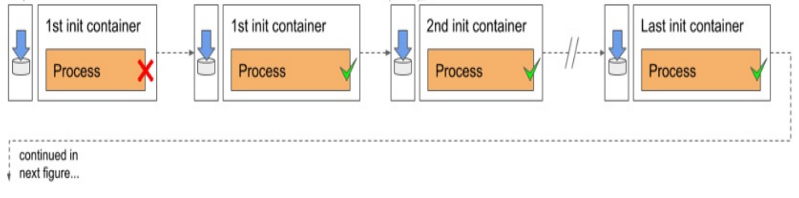
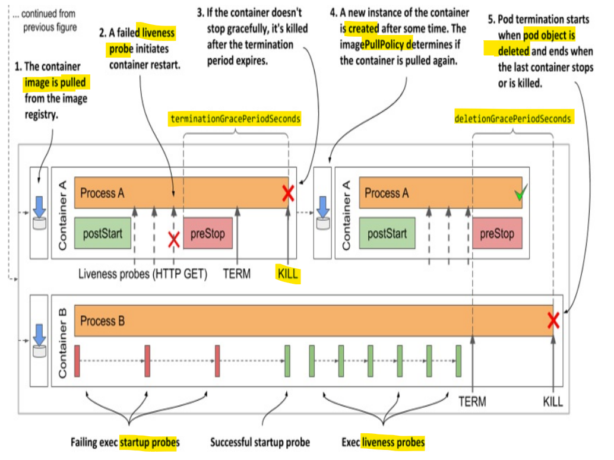

# Kubernetes - Pod: Pod and Container Lifecycle

[Back](../../index.md)

- [Kubernetes - Pod: Pod and Container Lifecycle](#kubernetes---pod-pod-and-container-lifecycle)
  - [Pod Phase](#pod-phase)
  - [Pod Conditions](#pod-conditions)
    - [Lab: Show pod contidtion](#lab-show-pod-contidtion)
  - [container Status and state](#container-status-and-state)
    - [Init Container Status](#init-container-status)
    - [Lab: Get Container Status and state](#lab-get-container-status-and-state)
    - [Lab: Pod phase](#lab-pod-phase)
      - [Running a pod](#running-a-pod)
      - [Update a pod manifest file](#update-a-pod-manifest-file)
      - [edit](#edit)
      - [Deleting a pod](#deleting-a-pod)
      - [Lab: Pod state - ErrImagePull](#lab-pod-state---errimagepull)
      - [Lab: Pod state - One-off Complete](#lab-pod-state---one-off-complete)
      - [Lab: Pod state - one-off Failed](#lab-pod-state---one-off-failed)
  - [Feature: Container Auto-restart](#feature-container-auto-restart)
    - [Lab: Container Auto-restart](#lab-container-auto-restart)
    - [restart policy](#restart-policy)
    - [Exponential back-off](#exponential-back-off)
    - [liveness probes](#liveness-probes)
      - [Types of liveness probes](#types-of-liveness-probes)
    - [Lab: Liveness Probe](#lab-liveness-probe)
    - [Lab: Liveness Probe - Failed](#lab-liveness-probe---failed)
  - [Startup Probe](#startup-probe)
    - [Best Pracices](#best-pracices)
  - [`lifecycle hooks`: Executing actions at container start-up and shutdown](#lifecycle-hooks-executing-actions-at-container-start-up-and-shutdown)
    - [post-start hooks](#post-start-hooks)
      - [Lab: post-start hooks](#lab-post-start-hooks)
  - [pre-stop hooks](#pre-stop-hooks)
      - [Lab: pre-stop hooks - Graceful shutdown](#lab-pre-stop-hooks---graceful-shutdown)
  - [pod lifecycle](#pod-lifecycle)
  - [initialization stage](#initialization-stage)
    - [Pulling the container image](#pulling-the-container-image)
    - [Running the containers](#running-the-containers)
    - [Restarting failed init containers](#restarting-failed-init-containers)
  - [Run stage](#run-stage)
    - [`post-start hook` error impact a container](#post-start-hook-error-impact-a-container)
    - [Pulling the container image](#pulling-the-container-image-1)
    - [Running the container](#running-the-container)
    - [Terminating and restarting the container on failures](#terminating-and-restarting-the-container-on-failures)
    - [`termination grace period`](#termination-grace-period)
  - [termination stage](#termination-stage)
    - [Containers termination](#containers-termination)
    - [deletion grace period](#deletion-grace-period)

---

## Pod Phase

- `Pending`
  - since
    - the pod object is created
  - until
    - one of the container in the pod is running
- `Running`
  - since
    - At least one of the pod's containers is running
- `Succeeded`
  - pod that is **not** intended to run **indefinitely**
  - all containers **complete** successfully
- `Failed`
  - pod that is **not** intended to run **indefinitely**
  - at least one of the container terminates unsuccessfully
- `Unknown`
  - the **state** of the `pod` is **unknown** because the `Kubelet` has **stopped reporting communicating** with the `API server`.
  - Possibly the worker node has failed or has disconnected from the network.

---

## Pod Conditions

- `PodScheduled`: Whether the pod has been scheduled to a node.
- `Initialized`: Whether the init containers have all completed.
- `ContainersReady`: Whether all containers in the pod are ready.
- `Ready`: Whether the readiness gates are all reporting that all containers are ready.

---

### Lab: Show pod contidtion

```sh
kubectl run web --image=nginx
# pod/web created

kubectl describe pod web
# Conditions:
#   Type                        Status
#   PodReadyToStartContainers   True
#   Initialized                 True
#   Ready                       True
#   ContainersReady             True
#   PodScheduled                True

kubectl get pod web -o json | jq .status.conditions
# [
#   {
#     "lastProbeTime": null,
#     "lastTransitionTime": "2025-12-22T22:02:02Z",
#     "observedGeneration": 1,
#     "status": "True",
#     "type": "PodReadyToStartContainers"
#   },
#   {
#     "lastProbeTime": null,
#     "lastTransitionTime": "2025-12-22T22:01:58Z",
#     "observedGeneration": 1,
#     "status": "True",
#     "type": "Initialized"
#   },
#   {
#     "lastProbeTime": null,
#     "lastTransitionTime": "2025-12-22T22:02:02Z",
#     "observedGeneration": 1,
#     "status": "True",
#     "type": "Ready"
#   },
#   {
#     "lastProbeTime": null,
#     "lastTransitionTime": "2025-12-22T22:02:02Z",
#     "observedGeneration": 1,
#     "status": "True",
#     "type": "ContainersReady"
#   },
#   {
#     "lastProbeTime": null,
#     "lastTransitionTime": "2025-12-22T22:01:58Z",
#     "observedGeneration": 1,
#     "status": "True",
#     "type": "PodScheduled"
#   }
# ]
```

---

## container Status and state

- `Waiting`: waiting to be started
- `Running`: the `container` has been **created** and `processes` are **running** in it
- `Terminated`: the `processes` that had been **running** in the container have **terminated**.
- `Unknown`: The state of the container **couldn’t be determined**

### Init Container Status

- In the `status.initContainerStatuses` field

---

### Lab: Get Container Status and state

```sh
kubectl describe pod web
# ...
# Containers:
#   web:
#     Container ID:   docker://1f12820fdf03c49c3f454d34e92c25bddfbcd74eb60bb550401d35bee8c06360
#     Image:          nginx
#     Image ID:       docker-pullable://nginx@sha256:fb01117203ff38c2f9af91db1a7409459182a37c87cced5cb442d1d8fcc66d19
#     Port:           <none>
#     Host Port:      <none>
#     State:          Running
#       Started:      Mon, 22 Dec 2025 17:02:01 -0500
#     Ready:          True
#     Restart Count:  0
#     Environment:    <none>
#     Mounts:
#       /var/run/secrets/kubernetes.io/serviceaccount from kube-api-access-qmvjn (ro)
# ...


kubectl get pod web -o json | jq .status.containerStatuses
# [
#   {
#     "containerID": "docker://1f12820fdf03c49c3f454d34e92c25bddfbcd74eb60bb550401d35bee8c06360",
#     "image": "nginx:latest",
#     "imageID": "docker-pullable://nginx@sha256:fb01117203ff38c2f9af91db1a7409459182a37c87cced5cb442d1d8fcc66d19",
#     "lastState": {},
#     "name": "web",
#     "ready": true,
#     "resources": {},
#     "restartCount": 0,
#     "started": true,
#     "state": {
#       "running": {
#         "startedAt": "2025-12-22T22:02:01Z"
#       }
#     },
#     "volumeMounts": [
#       {
#         "mountPath": "/var/run/secrets/kubernetes.io/serviceaccount",
#         "name": "kube-api-access-qmvjn",
#         "readOnly": true,
#         "recursiveReadOnly": "Disabled"
#       }
#     ]
#   }
# ]
```

---

### Lab: Pod phase

#### Running a pod

```yaml
# demo_pod_state.yaml
apiVersion: v1
kind: Pod
metadata:
  labels:
    run: web
  name: web
spec:
  containers:
    - image: nginx
      name: web
```

- Apply

```sh
# terminal A:
kubectl apply -f demo_pod_state.yaml
# pod/web created

# terminal B:
kubectl get pod --watch
# NAME   READY   STATUS    RESTARTS   AGE
# web    0/1     Pending   0          0s
# web    0/1     Pending   0          0s
# web    0/1     ContainerCreating   0          0s
# web    1/1     Running             0          8s
```

---

#### Update a pod manifest file

```yaml
# demo_pod_state.yaml
apiVersion: v1
kind: Pod
metadata:
  labels:
    run: web-app # updated
  name: web
spec:
  containers:
    - image: nginx
      name: web
```

- Apply

```sh
# terminal A:
kubectl apply -f demo_pod_state.yaml
# pod/web configured

# terminal B:
kubectl get pod --watch
# NAME   READY   STATUS    RESTARTS   AGE
# web    1/1     Running   0          14s
# web    1/1     Running   0          64s
# web    1/1     Running   0          64s
# web    1/1     Running   1 (5s ago)   69s
```

---

#### edit

```sh
# edit: update image: nginx:1.29.4-alpine
kubectl edit pod web
# pod/web edited

# terminal B:
kubectl get pod --watch
# NAME   READY   STATUS    RESTARTS      AGE
# web    1/1     Running   1 (42s ago)   106s
```

---

#### Deleting a pod

```sh
# terminal A:
kubectl delete -f demo_pod_state.yaml
# pod "web" deleted from default namespace

# terminal B:
kubectl get pod --watch
# NAME   READY   STATUS    RESTARTS        AGE
# web    1/1     Running   1 (4m50s ago)   5m54s
# web    1/1     Terminating   1 (7m12s ago)   8m16s
# web    1/1     Terminating   1 (7m12s ago)   8m16s
# web    0/1     Completed     1 (7m13s ago)   8m17s
# web    0/1     Completed     1               8m18s
# web    0/1     Completed     1               8m18s
# web    0/1     Completed     1               8m18s
```

---

#### Lab: Pod state - ErrImagePull

```sh
# terminal A:
kubectl run web --image=xnign
# pod/web created

kubectl delete pod web
# pod "web" deleted from default namespace

# terminal B:
kubectl get pod --watch
# NAME   READY   STATUS    RESTARTS   AGE
# web    0/1     Pending   0          0s
# web    0/1     Pending   0          0s
# web    0/1     ContainerCreating   0          0s
# web    0/1     ErrImagePull        0          1s
# web    0/1     ImagePullBackOff    0          16s
# web    0/1     ErrImagePull        0          31s
# web    0/1     ImagePullBackOff    0          42s
# web    0/1     ErrImagePull        0          56s
# web    0/1     ImagePullBackOff    0          71s
# web    0/1     ErrImagePull        0          101s
# web    0/1     ImagePullBackOff    0          116s
# web    0/1     Terminating         0          2m59s
# web    0/1     Terminating         0          2m59s
# web    0/1     Terminating         0          3m
# web    0/1     ContainerStatusUnknown   0          3m1s
# web    0/1     ContainerStatusUnknown   0          3m1s
# web    0/1     ContainerStatusUnknown   0          3m1s
# ...
```

---

#### Lab: Pod state - One-off Complete

- indefinite/one-off pod:
  - `--restart=Never`

```sh
# terminal A:
kubectl run demo --image=busybox --restart=Never -- sleep 10
# pod/demo created

# terminal B:
kubectl get pod --watch
# NAME   READY   STATUS    RESTARTS   AGE
# demo   0/1     Pending   0          0s
# demo   0/1     Pending   0          0s
# demo   0/1     ContainerCreating   0          0s
# demo   1/1     Running             0          3s
# demo   0/1     Completed           0          13s
# demo   0/1     Completed           0          14s
```

- Delete

```sh
# terminal A:
kubectl get pod
# NAME   READY   STATUS      RESTARTS   AGE
# demo   0/1     Completed   0          78

kubectl delete pod demo
# pod "demo" deleted from default namespace

kubectl get pod
# No resources found in default namespace.

# terminal B:
kubectl get pod --watch
# NAME   READY   STATUS      RESTARTS   AGE
# demo   0/1     Completed   0          114s
# demo   0/1     Completed   0          2m
# demo   0/1     Completed   0          2m
```

---

#### Lab: Pod state - one-off Failed

- indefinite/one-off pod:
  - `--restart=Never`

```sh
# terminal A:
kubectl run demo --image=busybox --restart=Never -- slep 10 # incoreect command
# pod/demo created

kubectl get pod
# NAME   READY   STATUS               RESTARTS   AGE
# demo   0/1     ContainerCannotRun   0          67s

# terminal B:
kubectl get pod --watch
# NAME   READY   STATUS    RESTARTS   AGE
# demo   0/1     Pending   0          0s
# demo   0/1     Pending   0          0s
# demo   0/1     ContainerCreating   0          0s
# demo   0/1     ContainerCannotRun   0          3s
# demo   0/1     ContainerCannotRun   0          4s
```

- Delete

```sh
# terminal A:
kubectl delete pod demo
# pod "demo" deleted from default namespace

kubectl get pod
# No resources found in default namespace.

# terminal B:
kubectl get pod --watch
# NAME   READY   STATUS               RESTARTS   AGE
# demo   0/1     ContainerCannotRun   0          2m42s
# demo   0/1     ContainerCannotRun   0          2m49s
# demo   0/1     ContainerCannotRun   0          2m49s
```

---

## Feature: Container Auto-restart

- When a pod is **scheduled** to a `node`, the `Kubelet` on that node **starts** its containers and from then on **keeps them running** for **as long as the pod object exists**.

  - If the **main process** in the `container` **terminates** for any reason, the `Kubelet` **restarts** the `container`.
  - If an **error** in your application causes it to **crash**, Kubernetes automatically **restarts** it, so even without doing anything special in the application itself.

- If `init containers` are defined in the pod and one of the pod’s **regular containers** is **restarted**, the `init containers` are **not executed again**.

---

### Lab: Container Auto-restart

- Busybox sleep for 30s; Kubelet auto-restart the busybox.
  - pod status: running -> not ready -> running -> ...
  - repeating "starting"; actually discard, pull image, and start a new container.
- nginx keep running, get started only one time

```yaml
# demo_auto_restart.yaml
apiVersion: v1
kind: Pod
metadata:
  name: demo-auto-restart
spec:
  containers:
    - image: nginx
      name: nginx
    - image: busybox
      name: busybox
      command: ["sleep", "30"]
```

- Run

```sh
# main terminal
kubectl apply -f demo_auto_restart.yaml
# pod/demo-auto-restart created

# monitoer terminal A:
kubectl get pod -w
# NAME                READY   STATUS                RESTARTS        AGE
# demo-auto-restart   0/2     Pending               0               0s
# demo-auto-restart   0/2     Pending               0               0s
# demo-auto-restart   0/2     ContainerCreating     0               0s
# demo-auto-restart   2/2     Running               0               5s
# demo-auto-restart   1/2     NotReady              0               36s
# demo-auto-restart   2/2     Running               1 (3s ago)      38s
# demo-auto-restart   1/2     NotReady              1 (33s ago)     68s
# demo-auto-restart   1/2     CrashLoopBackOff      1 (14s ago)     81s
# demo-auto-restart   2/2     Running               2 (16s ago)     83s
# demo-auto-restart   1/2     NotReady              2 (46s ago)     113s
# demo-auto-restart   1/2     CrashLoopBackOff      2 (15s ago)     2m7s
# demo-auto-restart   2/2     Running               3 (31s ago)     2m23s

# monitoer terminal B:
kubectl get events -w
# 0s          Normal   Scheduled   pod/demo-auto-restart   Successfully assigned default/demo-auto-restart to docker-desktop
# 0s          Normal   Pulling     pod/demo-auto-restart   Pulling image "nginx"
# 0s          Normal   Pulled      pod/demo-auto-restart   Successfully pulled image "nginx" in 1.427s (1.427s including waiting). Image size: 59795293 bytes.
# 0s          Normal   Created     pod/demo-auto-restart   Created container: nginx
# 0s          Normal   Started     pod/demo-auto-restart   Started container nginx
# 0s          Normal   Pulling     pod/demo-auto-restart   Pulling image "busybox"
# 0s          Normal   Pulled      pod/demo-auto-restart   Successfully pulled image "busybox" in 1.082s (1.082s including waiting). Image size: 2224358 bytes.
# 0s          Normal   Created     pod/demo-auto-restart   Created container: busybox
# 0s          Normal   Started     pod/demo-auto-restart   Started container busybox
# 0s          Normal   Pulling     pod/demo-auto-restart   Pulling image "busybox"
# 0s          Normal   Pulled      pod/demo-auto-restart   Successfully pulled image "busybox" in 952ms (952ms including waiting). Image size: 2224358 bytes.
# 0s          Normal   Created     pod/demo-auto-restart   Created container: busybox
# 0s          Normal   Started     pod/demo-auto-restart   Started container busybox
# 0s          Warning   BackOff     pod/demo-auto-restart   Back-off restarting failed container busybox in pod demo-auto-restart_default(bdcabef0-35cb-41d0-a92b-a844b95fe089)
# 0s          Normal    Pulling     pod/demo-auto-restart   Pulling image "busybox"
# 0s          Normal    Pulled      pod/demo-auto-restart   Successfully pulled image "busybox" in 891ms (891ms including waiting). Image size: 2224358 bytes.
# 0s          Normal    Created     pod/demo-auto-restart   Created container: busybox
# 0s          Normal    Started     pod/demo-auto-restart   Started container busybox
# 0s          Warning   BackOff     pod/demo-auto-restart   Back-off restarting failed container busybox in pod demo-auto-restart_default(bdcabef0-35cb-41d0-a92b-a844b95fe089)
# 0s          Warning   BackOff     pod/demo-auto-restart   Back-off restarting failed container busybox in pod demo-auto-restart_default(bdcabef0-35cb-41d0-a92b-a844b95fe089)
# 0s          Normal    Pulling     pod/demo-auto-restart   Pulling image "busybox"
# 0s          Normal    Pulled      pod/demo-auto-restart   Successfully pulled image "busybox" in 1.191s (1.192s including waiting). Image size: 2224358 bytes.
# 0s          Normal    Created     pod/demo-auto-restart   Created container: busybox
# 0s          Normal    Started     pod/demo-auto-restart   Started container busybox
# 0s          Normal    Killing     pod/demo-auto-restart   Stopping container nginx
# 0s          Normal    Killing     pod/demo-auto-restart   Stopping container busybox
```

---

### restart policy

- By default

  - Kubernetes restarts the container regardless of whether the process in the container
    - terminates successfully without any errors: `exits 0`
    - terminates with error: `exits` non-zero

- Modify by `restartPolicy` field

- 3 restart policies:

  - `Always`
    - default,
    - Container is **restarted regardless** of the exit code the process in the container terminates with.
  - `OnFailure`
    - The container is **restarted only if** the process **terminates with a non-zero exit code**, which by convention indicates **failure**.
  - `Never`
    - The container is **never restarted** - not even when it fails.

- `restart policy` is configured **at the `pod` level** and applies to all its containers.
  - It **can’t** be configured for each `container` **individually**.

---

### Exponential back-off

- `Exponential back-off`

  - **delay that doubles** between attempts to restart a terminated container
  - for the first time a container terminates,
    - restarted immediately.
  - The 2nd time terminates,
    - restart by an exponential delay
  - exponential delay:
    - 10s, 20, 40s, 80, ..., 160s, 5m, 5m, 5m, ...


- The delay is **reset** to **zero** when the container has run successfully for **10 minutes**.

  - If the container must be restarted later, it is restarted **immediately**.

- Command to show exponential back-off

  - `kubectl get pod demo -o json | jq .status.containerStatuses`

- Error `CrashLoopBackOff` can be misleading
  - it just show the exponetial back-off occur due to container termination
  - it does not tell the reason, whether it is because of exit 0 or error.

---

### liveness probes

- `liveness probe`

  - k8s feature used to periodically check whether an **application is still alive**
  - can specify a liveness probe for each container in the pod.

- Work with restart policy

  - if the application doesn’t respond, an error occurs, or the response is negative,
    - the container is considered **unhealthy** and is **terminated**.
    - The container is then **restarted** if the `restart policy` allows it.

- limit:
  - **only** be used in the pod’s `regular containers`.
  - They **can’t be** defined in `init containers`.

---

#### Types of liveness probes

- `HTTP GET probe`
  - sends a `GET` request to the container’s **IP address**, on the network **port** and **path** you specify.
    - If the probe receives a response, and the response code **doesn’t represent an error** (`HTTP response code` is `2xx` or `3xx`), the probe is considered **successful**.
    - If the server returns an **error response code**, or if it doesn’t respond in time, the probe is considered to have **failed**.
- `TCP Socket probe`
  - try with a **TCP connection** to the specified **port** of the container.
    - If the connection is **successfully established**, the probe is considered **successful**.
    - If the connection **can’t** be established in time, the probe is considered **failed**.
- `Exec probe`

  - **executes a command** inside the container and **checks the exit code** it terminates with.
    - If the exit code is `zero`, the probe is **successful**.
    - A `non-zero` exit code is considered a **failure**.
    - The probe is also considered to have **failed** if the command fails to **terminate in time**.

- default settings:
  - `initialDelaySeconds`: first request is sent `10s` after the container starts
  - `periodSeconds`: repeated every `5s`.
  - `timeoutSeconds`: timeout less then `2s`
  - `failureThreshold`: max failure less than 3 times

---

- Manifest file - liveness probe

```yaml
spec:
  containers:
    # http get
    livenessProbe:
      httpGet:
      path: /
      port: 8080

    # tcp probe
    livenessProbe:
      tcpSocket:
        port: 5432

    # exec probe
    livenessProbe:
      exec:
        command:
        - /usr/bin/healthcheck
```

---

### Lab: Liveness Probe

```yaml
# demo-liveness-probe.yaml
apiVersion: v1
kind: Pod
metadata:
  name: demo-liveness-probe
spec:
  containers:
    - name: nginx
      image: nginx
      ports:
        - name: http
          containerPort: 80
      livenessProbe:
        # HTTP GET probe
        httpGet:
          path: /
          port: http # use the port name define int ports
        initialDelaySeconds: 10
        periodSeconds: 5
        timeoutSeconds: 2
        failureThreshold: 3
    - name: redis
      image: redis
      livenessProbe:
        # exec probe
        exec:
          command:
            - "sh"
            - "-c"
            - "redis-cli ping" # Checks if Redis is alive
        initialDelaySeconds: 5 # Initial wait before the first probe
        periodSeconds: 5 # How often to perform the probe
        timeoutSeconds: 2 # Timeout for the probe command
        failureThreshold: 3
```

- run

```sh
kubectl apply -f demo-liveness-probe.yaml
# pod/demo-liveness-probe created

kubectl logs demo-liveness-probe -c nginx -f
# /docker-entrypoint.sh: /docker-entrypoint.d/ is not empty, will attempt to perform configuration
# /docker-entrypoint.sh: Looking for shell scripts in /docker-entrypoint.d/
# /docker-entrypoint.sh: Launching /docker-entrypoint.d/10-listen-on-ipv6-by-default.sh
# 10-listen-on-ipv6-by-default.sh: info: Getting the checksum of /etc/nginx/conf.d/default.conf
# 10-listen-on-ipv6-by-default.sh: info: Enabled listen on IPv6 in /etc/nginx/conf.d/default.conf
# /docker-entrypoint.sh: Sourcing /docker-entrypoint.d/15-local-resolvers.envsh
# /docker-entrypoint.sh: Launching /docker-entrypoint.d/20-envsubst-on-templates.sh
# /docker-entrypoint.sh: Launching /docker-entrypoint.d/30-tune-worker-processes.sh
# /docker-entrypoint.sh: Configuration complete; ready for start up
# 2025/12/23 01:13:06 [notice] 1#1: using the "epoll" event method
# 2025/12/23 01:13:06 [notice] 1#1: nginx/1.29.4
# 2025/12/23 01:13:06 [notice] 1#1: built by gcc 14.2.0 (Debian 14.2.0-19)
# 2025/12/23 01:13:06 [notice] 1#1: OS: Linux 5.15.153.1-microsoft-standard-WSL2
# 2025/12/23 01:13:06 [notice] 1#1: getrlimit(RLIMIT_NOFILE): 1048576:1048576
# 2025/12/23 01:13:06 [notice] 1#1: start worker processes
# 2025/12/23 01:13:06 [notice] 1#1: start worker process 29
# 2025/12/23 01:13:06 [notice] 1#1: start worker process 30
# 2025/12/23 01:13:06 [notice] 1#1: start worker process 31
# 2025/12/23 01:13:06 [notice] 1#1: start worker process 32
# 2025/12/23 01:13:06 [notice] 1#1: start worker process 33
# 2025/12/23 01:13:06 [notice] 1#1: start worker process 34
# 2025/12/23 01:13:06 [notice] 1#1: start worker process 35
# 2025/12/23 01:13:06 [notice] 1#1: start worker process 36
# 2025/12/23 01:13:06 [notice] 1#1: start worker process 37
# 2025/12/23 01:13:06 [notice] 1#1: start worker process 38
# 2025/12/23 01:13:06 [notice] 1#1: start worker process 39
# 2025/12/23 01:13:06 [notice] 1#1: start worker process 40
# 10.1.0.1 - - [23/Dec/2025:01:13:19 +0000] "GET / HTTP/1.1" 200 615 "-" "kube-probe/1.34" "-"
# 10.1.0.1 - - [23/Dec/2025:01:13:24 +0000] "GET / HTTP/1.1" 200 615 "-" "kube-probe/1.34" "-"
# 10.1.0.1 - - [23/Dec/2025:01:13:29 +0000] "GET / HTTP/1.1" 200 615 "-" "kube-probe/1.34" "-"
# 10.1.0.1 - - [23/Dec/2025:01:13:34 +0000] "GET / HTTP/1.1" 200 615 "-" "kube-probe/1.34" "-"
# 10.1.0.1 - - [23/Dec/2025:01:13:39 +0000] "GET / HTTP/1.1" 200 615 "-" "kube-probe/1.34" "-"
# 10.1.0.1 - - [23/Dec/2025:01:13:44 +0000] "GET / HTTP/1.1" 200 615 "-" "kube-probe/1.34" "-"

kubectl describe pod demo-liveness-probe
# Containers:
#   nginx:
#     Liveness:       http-get http://:http/ delay=10s timeout=2s period=5s #success=1 #failure=3
#   redis:
#     Liveness:       exec [sh -c redis-cli ping] delay=5s timeout=2s period=5s #success=1 #failure=3

kubectl delete -f demo-liveness-probe.yaml
# pod "demo-liveness-probe" deleted from default namespace
```

---

### Lab: Liveness Probe - Failed

```yaml
# demo-liveness-probe-failure.yaml
apiVersion: v1
kind: Pod
metadata:
  name: demo-liveness-probe-failure
spec:
  containers:
    - name: nginx
      image: nginx
      ports:
        - name: http
          containerPort: 80
      livenessProbe:
        # HTTP GET probe
        httpGet:
          path: /
          port: 8080
        initialDelaySeconds: 10
        periodSeconds: 5
        timeoutSeconds: 2
        failureThreshold: 3
    - name: redis
      image: redis
      livenessProbe:
        # exec probe
        exec:
          command:
            - "sh"
            - "-c"
            - "redis-cli ping1"
        initialDelaySeconds: 10
        periodSeconds: 5
        timeoutSeconds: 2
        failureThreshold: 3
```

- run

```sh
kubectl apply -f demo-liveness-probe-failure.yaml
# pod/demo-liveness-probe-failure created

kubectl get pod -w
# NAME                          READY   STATUS             RESTARTS      AGE
# demo-liveness-probe-failure   1/2     CrashLoopBackOff   5 (69s ago)   4m20s
# demo-liveness-probe-failure   2/2     Running            6 (93s ago)   4m44s
# demo-liveness-probe-failure   1/2     CrashLoopBackOff   6 (1s ago)    5m7s

kubectl logs demo-liveness-probe-failure -c nginx -f
# /docker-entrypoint.sh: /docker-entrypoint.d/ is not empty, will attempt to perform configuration
# /docker-entrypoint.sh: Looking for shell scripts in /docker-entrypoint.d/
# /docker-entrypoint.sh: Launching /docker-entrypoint.d/10-listen-on-ipv6-by-default.sh
# 10-listen-on-ipv6-by-default.sh: info: Getting the checksum of /etc/nginx/conf.d/default.conf
# 10-listen-on-ipv6-by-default.sh: info: Enabled listen on IPv6 in /etc/nginx/conf.d/default.conf
# /docker-entrypoint.sh: Sourcing /docker-entrypoint.d/15-local-resolvers.envsh
# /docker-entrypoint.sh: Launching /docker-entrypoint.d/20-envsubst-on-templates.sh
# /docker-entrypoint.sh: Launching /docker-entrypoint.d/30-tune-worker-processes.sh
# /docker-entrypoint.sh: Configuration complete; ready for start up
# 2025/12/23 01:34:36 [notice] 1#1: using the "epoll" event method
# 2025/12/23 01:34:36 [notice] 1#1: nginx/1.29.4
# 2025/12/23 01:34:36 [notice] 1#1: built by gcc 14.2.0 (Debian 14.2.0-19)
# 2025/12/23 01:34:36 [notice] 1#1: OS: Linux 5.15.153.1-microsoft-standard-WSL2
# 2025/12/23 01:34:36 [notice] 1#1: getrlimit(RLIMIT_NOFILE): 1048576:1048576
# 2025/12/23 01:34:36 [notice] 1#1: start worker processes
# 2025/12/23 01:34:36 [notice] 1#1: start worker process 28
# 2025/12/23 01:34:36 [notice] 1#1: start worker process 29
# 2025/12/23 01:34:36 [notice] 1#1: start worker process 30
# 2025/12/23 01:34:36 [notice] 1#1: start worker process 31
# 2025/12/23 01:34:36 [notice] 1#1: start worker process 32
# 2025/12/23 01:34:36 [notice] 1#1: start worker process 33
# 2025/12/23 01:34:36 [notice] 1#1: start worker process 34
# 2025/12/23 01:34:36 [notice] 1#1: start worker process 35
# 2025/12/23 01:34:36 [notice] 1#1: start worker process 36
# 2025/12/23 01:34:36 [notice] 1#1: start worker process 37
# 2025/12/23 01:34:36 [notice] 1#1: start worker process 38
# 2025/12/23 01:34:36 [notice] 1#1: start worker process 39
# 2025/12/23 01:34:58 [notice] 1#1: signal 3 (SIGQUIT) received, shutting down
# 2025/12/23 01:34:58 [notice] 29#29: gracefully shutting down
# 2025/12/23 01:34:58 [notice] 29#29: exiting
# 2025/12/23 01:34:58 [notice] 29#29: exit
# 2025/12/23 01:34:58 [notice] 28#28: gracefully shutting down
# 2025/12/23 01:34:58 [notice] 30#30: gracefully shutting down
# 2025/12/23 01:34:58 [notice] 28#28: exiting
# 2025/12/23 01:34:58 [notice] 31#31: gracefully shutting down
# 2025/12/23 01:34:58 [notice] 30#30: exiting
# 2025/12/23 01:34:58 [notice] 31#31: exiting
# 2025/12/23 01:34:58 [notice] 28#28: exit
# 2025/12/23 01:34:58 [notice] 32#32: gracefully shutting down
# 2025/12/23 01:34:58 [notice] 32#32: exiting
# 2025/12/23 01:34:58 [notice] 30#30: exit
# 2025/12/23 01:34:58 [notice] 34#34: gracefully shutting down
# 2025/12/23 01:34:58 [notice] 31#31: exit
# 2025/12/23 01:34:58 [notice] 34#34: exiting
# 2025/12/23 01:34:58 [notice] 33#33: gracefully shutting down
# 2025/12/23 01:34:58 [notice] 33#33: exiting
# 2025/12/23 01:34:58 [notice] 32#32: exit
# 2025/12/23 01:34:58 [notice] 33#33: exit
# 2025/12/23 01:34:58 [notice] 34#34: exit
# 2025/12/23 01:34:58 [notice] 36#36: gracefully shutting down
# 2025/12/23 01:34:58 [notice] 36#36: exiting
# 2025/12/23 01:34:58 [notice] 36#36: exit
# 2025/12/23 01:34:58 [notice] 35#35: gracefully shutting down
# 2025/12/23 01:34:58 [notice] 35#35: exiting
# 2025/12/23 01:34:58 [notice] 35#35: exit
# 2025/12/23 01:34:58 [notice] 37#37: gracefully shutting down
# 2025/12/23 01:34:58 [notice] 37#37: exiting
# 2025/12/23 01:34:58 [notice] 37#37: exit
# 2025/12/23 01:34:58 [notice] 38#38: gracefully shutting down
# 2025/12/23 01:34:58 [notice] 38#38: exiting
# 2025/12/23 01:34:58 [notice] 38#38: exit
# 2025/12/23 01:34:58 [notice] 39#39: gracefully shutting down
# 2025/12/23 01:34:58 [notice] 39#39: exiting
# 2025/12/23 01:34:58 [notice] 39#39: exit
# 2025/12/23 01:34:58 [notice] 1#1: signal 17 (SIGCHLD) received from 32
# 2025/12/23 01:34:58 [notice] 1#1: worker process 32 exited with code 0
# 2025/12/23 01:34:58 [notice] 1#1: worker process 35 exited with code 0
# 2025/12/23 01:34:58 [notice] 1#1: signal 29 (SIGIO) received
# 2025/12/23 01:34:58 [notice] 1#1: signal 17 (SIGCHLD) received from 39
# 2025/12/23 01:34:58 [notice] 1#1: worker process 28 exited with code 0
# 2025/12/23 01:34:58 [notice] 1#1: worker process 29 exited with code 0
# 2025/12/23 01:34:58 [notice] 1#1: worker process 31 exited with code 0
# 2025/12/23 01:34:58 [notice] 1#1: worker process 37 exited with code 0
# 2025/12/23 01:34:58 [notice] 1#1: worker process 39 exited with code 0
# 2025/12/23 01:34:58 [notice] 1#1: signal 29 (SIGIO) received
# 2025/12/23 01:34:58 [notice] 1#1: signal 17 (SIGCHLD) received from 37
# 2025/12/23 01:34:58 [notice] 1#1: signal 17 (SIGCHLD) received from 36
# 2025/12/23 01:34:58 [notice] 1#1: worker process 36 exited with code 0
# 2025/12/23 01:34:58 [notice] 1#1: signal 29 (SIGIO) received
# 2025/12/23 01:34:58 [notice] 1#1: signal 17 (SIGCHLD) received from 38
# 2025/12/23 01:34:58 [notice] 1#1: worker process 38 exited with code 0
# 2025/12/23 01:34:58 [notice] 1#1: signal 29 (SIGIO) received
# 2025/12/23 01:34:58 [notice] 1#1: signal 17 (SIGCHLD) received from 34
# 2025/12/23 01:34:58 [notice] 1#1: worker process 34 exited with code 0
# 2025/12/23 01:34:58 [notice] 1#1: signal 29 (SIGIO) received
# 2025/12/23 01:34:58 [notice] 1#1: signal 17 (SIGCHLD) received from 30
# 2025/12/23 01:34:58 [notice] 1#1: worker process 30 exited with code 0
# 2025/12/23 01:34:58 [notice] 1#1: signal 29 (SIGIO) received
# 2025/12/23 01:34:58 [notice] 1#1: signal 17 (SIGCHLD) received from 33
# 2025/12/23 01:34:58 [notice] 1#1: worker process 33 exited with code 0
# 2025/12/23 01:34:58 [notice] 1#1: exit


kubectl get events -w
# LAST SEEN   TYPE      REASON      OBJECT                            MESSAGE
# 8m10s       Normal    Scheduled   pod/demo-liveness-probe-failure   Successfully assigned default/demo-liveness-probe-failure to docker-desktop
# 6m29s       Normal    Pulling     pod/demo-liveness-probe-failure   Pulling image "nginx"
# 8m8s        Normal    Pulled      pod/demo-liveness-probe-failure   Successfully pulled image "nginx" in 1.318s (1.318s including waiting). Image size: 59795293 bytes.
# 6m53s       Normal    Created     pod/demo-liveness-probe-failure   Created container: nginx
# 6m53s       Normal    Started     pod/demo-liveness-probe-failure   Started container nginx
# 8m7s        Normal    Pulling     pod/demo-liveness-probe-failure   Pulling image "redis"
# 8m7s        Normal    Pulled      pod/demo-liveness-probe-failure   Successfully pulled image "redis" in 909ms (909ms including waiting). Image size: 53003220 bytes.
# 8m6s        Normal    Created     pod/demo-liveness-probe-failure   Created container: redis
# 8m6s        Normal    Started     pod/demo-liveness-probe-failure   Started container redis
# 4m59s       Warning   Unhealthy   pod/demo-liveness-probe-failure   Liveness probe failed: Get "http://10.1.2.104:8080/": dial tcp 10.1.2.104:8080: connect: connection refused
# 3m4s        Normal    Killing     pod/demo-liveness-probe-failure   Container nginx failed liveness probe, will be restarted
# 7m43s       Normal    Pulled      pod/demo-liveness-probe-failure   Successfully pulled image "nginx" in 916ms (916ms including waiting). Image size: 59795293 bytes.
# 7m18s       Normal    Pulled      pod/demo-liveness-probe-failure   Successfully pulled image "nginx" in 1.027s (1.027s including waiting). Image size: 59795293 bytes.
# 6m53s       Normal    Pulled      pod/demo-liveness-probe-failure   Successfully pulled image "nginx" in 1.012s (1.012s including waiting). Image size: 59795293 bytes.
# 2m48s       Warning   BackOff     pod/demo-liveness-probe-failure   Back-off restarting failed container nginx in pod demo-liveness-probe-failure_default(573bb3ef-de6e-4030-bcde-c4217c3dfca6)
# 46m         Normal    Scheduled   pod/demo-liveness-probe           Successfully assigned default/demo-liveness-probe to docker-desktop
# 46m         Normal    Pulling     pod/demo-liveness-probe           Pulling image "nginx"
# 46m         Normal    Pulled      pod/demo-liveness-probe           Successfully pulled image "nginx" in 1.3s (1.3s including waiting). Image size: 59795293 bytes.
# 46m         Normal    Created     pod/demo-liveness-probe           Created container: nginx
# 46m         Normal    Started     pod/demo-liveness-probe           Started container nginx
# 46m         Normal    Pulling     pod/demo-liveness-probe           Pulling image "redis"
# 46m         Normal    Pulled      pod/demo-liveness-probe           Successfully pulled image "redis" in 956ms (956ms including waiting). Image size: 53003220 bytes.
# 46m         Normal    Created     pod/demo-liveness-probe           Created container: redis
# 46m         Normal    Started     pod/demo-liveness-probe           Started container redis
# 45m         Normal    Killing     pod/demo-liveness-probe           Stopping container nginx
# 45m         Normal    Killing     pod/demo-liveness-probe           Stopping container redis
# 27m         Normal    Scheduled   pod/demo-liveness-probe           Successfully assigned default/demo-liveness-probe to docker-desktop
# 27m         Normal    Pulling     pod/demo-liveness-probe           Pulling image "nginx"
# 27m         Normal    Pulled      pod/demo-liveness-probe           Successfully pulled image "nginx" in 1.148s (1.148s including waiting). Image size: 59795293 bytes.
# 27m         Normal    Created     pod/demo-liveness-probe           Created container: nginx
# 27m         Normal    Started     pod/demo-liveness-probe           Started container nginx
# 27m         Normal    Pulling     pod/demo-liveness-probe           Pulling image "redis"
# 27m         Normal    Pulled      pod/demo-liveness-probe           Successfully pulled image "redis" in 686ms (686ms including waiting). Image size: 53003220 bytes.
# 27m         Normal    Created     pod/demo-liveness-probe           Created container: redis
# 27m         Normal    Started     pod/demo-liveness-probe           Started container redis
# 16m         Normal    Killing     pod/demo-liveness-probe           Stopping container nginx
# 16m         Normal    Killing     pod/demo-liveness-probe           Stopping container redis
# 9m21s       Normal    Scheduled   pod/demo-liveness-probe           Successfully assigned default/demo-liveness-probe to docker-desktop

kubectl describe pod demo-liveness-probe-failure
# Containers:
#   nginx:
#     State:          Waiting
#       Reason:       CrashLoopBackOff
#     Last State:     Terminated
#       Reason:       Completed
#       Exit Code:    0
#       Started:      Mon, 22 Dec 2025 20:40:53 -0500
#       Finished:     Mon, 22 Dec 2025 20:41:14 -0500
#     Ready:          False
#     Restart Count:  7
#     Liveness:       http-get http://:8080/ delay=10s timeout=2s period=5s #success=1 #failure=3
#   redis:
#     State:          Running
#       Started:      Mon, 22 Dec 2025 20:32:56 -0500
#     Ready:          True
#     Restart Count:  0
#     Liveness:       exec [sh -c redis-cli ping1] delay=10s timeout=2s period=5s #success=1 #failure=3
```

---

## Startup Probe

- `startup probe`

  - used to balance between:
    - the requirment that application takes too long to start
    - the negative effect on the normal operation of the application caused by the high result of `periodSeconds` \* `failureThreshold`,
  - If a `startup probe` is **defined** for a `container`, **only** the startup probe is **executed** when the container is **started**.
    - When the `startup probe` **succeeds**, Kubernetes **switches** to using the `liveness probe`, which is configured to quickly detect when the application becomes unhealthy.
  - work with `liveness probe`
    - **long period** `startup probe`: allow time-consumed startup
    - **short period** `liveness probe`: allow faster detection

- 3 types of the `startup probe`:

  - `exec`
  - `tcpSocket`
  - `httpGet`

- Manifest file - startup probe + liveness probe

```yaml
spec:
  containers:
    - name: con_name
      startupProbe:
        httpGet:
          path: /
          port: http
        periodSeconds: 10
        failureThreshold: 12
      livenessProbe:
        httpGet:
          path: /
          port: http
        periodSeconds: 5
        failureThreshold: 2
```

---

### Best Pracices

- To provide a better `liveness check`, web applications typically **expose a specific health-check endpoint**, such as `/healthz`.

  - When this endpoint is called, the application performs an **internal status check** of all the major components running within the application to ensure that none of them have died or are no longer doing what they should.

- Make sure that the `/healthz` HTTP endpoint doesn’t require **authentication** or the **probe** will always **fail**, causing your container to be restarted continuously

- Make sure that the application **checks only the operation of its internal components** and nothing that is **influenced by an external factor**.

  - For example, the health-check endpoint of a **frontend** service should never respond with failure when it can’t connect to a backend service.

- The handler invoked by a `liveness probe` **shouldn’t** use too much **computing resources** and shouldn’t take too **long** to complete.

  - By default, probes are executed relatively often and only given one second to complete.
  - e.g., use an `HTTP GET probe` instead of an `exec liveness probe` that **starts an entire JVM**.

- Dont set the `failureThreshold` field to a **higher value** so that the probe must fail several times before the application is considered unhealthy.

---

## `lifecycle hooks`: Executing actions at container start-up and shutdown

- `lifecycle hooks`

  - used to run additional processes every time a container starts and just before it stops.
  - only be applied to `regular containers` and not to `init containers`.
  - not support `tcpSocket` handlers.

- use cases:

  - execute a command inside the container
  - send an HTTP GET request to the application in the container.

- vs `init container`

  - `lifecycle hooks`:
    - container level, specified per `container`
  - `init container`:
    - specified at the pod level

- `Post-start hooks`
  - executed when the container **starts**
  - invoked **immediately** after the container is **created**
- `Pre-stop hooks`
  - executed shortly **before** the container **stops**.
  - when the container **shutdown is initiated**.

---

### post-start hooks

- affects

  - Run command asynchronously with the main container process
    - the `container` **remains** in the `Waiting` state and the phase of the `pod` is `Pending` until the `hook` invocation is **completed**.
  - if the hook can’t be executed or returns a `non-zero exit code`, the entire `container` is **restarted**.
    - pod status: `PostStartHookError`
    - warning event: `FailedPostStartHook`

- log file

  - if fails, **error** logged in the `event`
    - use `kubectl describe` to check **failed event**
  - if successes, **output** not logged anywhere
    - must log to a file instead of the standard or error output
    - `kubectl exec my-pod -- cat logfile.txt`

- **exclusive** 2 types:

  - **can’t** specify **both** an `exec` and an `httpGet` post-start hook for a container.

  - `exec hook`:
    - used to execute an **additional process** as the main process starts
    - can’t define multiple commands in a lifecycle hook
      - can use `sh -c "lines of commands"`
  - `httpGet hook`:

    - used to **send the request** to a process running in the container **itself**, a **different** container in the pod, or a different **host** altogether.
    - `host` field
      - defaults to the pod IP.
      - Don’t set it to localhost, because the request is sent from the host node, not from within the container.
    - risk:
      - might cause the container to enter an **endless restart loop**. Never configure this type of lifecycle hook to target the same container or any other container in the same pod.
      - Kubernetes doesn’t treat the hook as failed if the HTTP server responds with `status code` such as 404 Not Found.

- benefit:
  - excute additional task without the change of the code or image.

---

- Manifest file

```yaml
# exec
spec:
  containers:
    lifecycle:
      postStart:
        exec:
          command: []

# http get
spec:
  containers:
    lifecycle:
      postStart:
        httpGet:
          host: myservice.example.com
          port: 80
          path: /container-started
```

---

#### Lab: post-start hooks

```yaml
# demo-post-start.yaml
apiVersion: v1
kind: Pod
metadata:
  name: demo-post-start
spec:
  containers:
    - image: nginx
      name: nginx
      lifecycle:
        postStart:
          exec:
            command: ["echo1", "/usr/share/nginx/html"]
```

```sh
kubectl apply -f demo-post-start.yaml
# pod/demo-post-start created

kubectl describe pod/demo-post-start
# Events:
#   Type     Reason               Age                From               Message
#   ----     ------               ----               ----               -------
#   Normal   Scheduled            42s                default-scheduler  Successfully assigned default/demo-post-start to docker-desktop
#   Normal   Pulled               41s                kubelet            Successfully pulled image "nginx" in 1.038s (1.038s including waiting). Image size: 59795293 bytes.
#   Normal   Pulled               37s                kubelet            Successfully pulled image "nginx" in 990ms (990ms including waiting). Image size: 59795293 bytes.
#   Normal   Pulling              21s (x3 over 42s)  kubelet            Pulling image "nginx"
#   Normal   Created              20s (x3 over 39s)  kubelet            Created container: nginx
#   Normal   Started              20s (x3 over 39s)  kubelet            Started container nginx
#   Warning  FailedPostStartHook  20s (x3 over 39s)  kubelet            PostStartHook failed
#   Normal   Killing              20s (x3 over 39s)  kubelet            FailedPostStartHook
#   Normal   Pulled               20s                kubelet            Successfully pulled image "nginx" in 770ms (770ms including waiting). Image size: 59795293 bytes.
#   Warning  BackOff              7s (x4 over 36s)   kubelet            Back-off restarting failed container nginx in pod demo-post-start_default(2527e295-4db9-40b8-908e-fbda4f4120ed)
```

---

## pre-stop hooks

- `pre-stop hook`
  - executed immediately before a container is terminated.
    - `TERM` signal is not sent **until** the pre-stop hook **completes**
  - used to initiate a `graceful shutdown`
- When container **termination** is initiated, the `liveness` and other `probes` are **no longer invoked**.

- the `container` is **terminated** regardless of the result of the `pre-stop hook`

  - a failure to execute the command or a non-zero exit code **does not prevent** the container from being **terminated**.

- Log file:
  - only log in the `FailedPreStopHook` event

---

- Manifest file

```yaml
# exec
spec:
  containers:
    lifecycle:
      preStop:
        exec:
          command: []

# http get
spec:
  containers:
    lifecycle:
      preStop:
        httpGet:
          host: myservice.example.com
          port: 80
          path: /container-started
```

---

#### Lab: pre-stop hooks - Graceful shutdown

```yaml
# demo-pre-stop.yaml
apiVersion: v1
kind: Pod
metadata:
  name: demo-pre-stop
spec:
  containers:
    - image: nginx
      name: nginx
      lifecycle:
        preStop:
          exec:
            command: ["nginx", "-s", "quit"]
```

---

## pod lifecycle

- `initialization stage`
  - when the pod’s `init containers` run
- `run stage`
  - when the `regular containers` of the pod run
- `termination stage`
  - when the pod’s containers are **terminated**

---

## initialization stage

- the stage when `init containers` run



### Pulling the container image

- Before each `init container` is started, its container image is pulled to the `worker node`

- `containers.imagePullPolicy` field
  - determines whether the image is pulled every time, only the first time, or never.
  - value:
    - `Always`:
      - pulled image every time the container is (re)started.
      - the registry still needs to be contacted
        - container will not run if registry unavailable, even the image stored locally.
    - `Never`:
      - never pulled from the registry
      - image must exist on the worker node beforehand, can be
        - stored locally
        - built on the node
      - if not available locally, raise `ErrImageNeverPull` event
    - `IfNotPresent`
      - pulled if it is **not already** present on the node
      - image is only **pulled the first time** it’s required.
    - if not specified
      - image tag == `:latest`: defaults to `Always`
      - Otherwise, default to `IfNotPresent`

---

### Running the containers

- repeated process of `init containers`

  - image pull
  - container start
  - next image pull
  - next container start
  - ...
  - untill all init containers completed.

- All `init containers` must run to **completion** before the `regular containers` can **start**

---

### Restarting failed init containers

- When an `init container` terminates with an **error**
  - if pod’s `restart policy` == `Always`/`OnFailure`
    - failed `init container` is **restarted**
  - if pod’s `restart policy` == `Never`
    - **subsequent** `init containers` and the pod’s `regular containers` are never started
    - status: `Init:Error`
    - fix:
      - delete and recreate the pod object

---

## Run stage

- the stage when init containers are completed and regular containers create.



---

### `post-start hook` error impact a container

- **Sequential Start, Parallel Execution**
  - `Regular containers` are **created synchronously** in the **order** they are **defined in the pod’s spec**.
  - All `regular containers` execute **parallelly**.
    - **No Blocking**: it **does not wait** for one container to be "ready" or "successful" before starting the next.
- `post-start hook` runs **asynchronously** with the `Regular container` process
  - execution execution of the `post-start hook handler` **blocks** the creation and start of the **its container**.
  - `container` might Restart based on the `restart policy`
  - No Impact on Others

---

- **termination** of `containers` is performed in **parallel**.
- `pre-stop hooks` of the containers are all **invoked at the same time**
  - `pre-stop hook` **blocks** the shutdown of the container in which it is defined
  - does not **block** the **shutdown** of **other** containers

---

### Pulling the container image

- image is **pulled** from the image **registry**, following the pod’s `imagePullPolicy`.

  - Once the image is **pulled**, the `container` is **created**.

- Even if **a** container image **can’t be pulled**, the **other** containers in the pod are **started** nevertheless.
  - **risk**:
    - it could raise dependency issue across containers if the dependent container take time pulling image before start.

---

### Running the container

- The container **starts** when the `main container process` **starts**.
- `post-start hook` runs **asynchronously**
- `startup probe` started
  - followed by `liveness probe` is started

---

### Terminating and restarting the container on failures

- container is terminated if:

  - `startup probe` fails
  - `liveness probe` fails
  - `post-start hook` fails

- Container restarts based on the `restartPolicy`
  - if `restartPolicy` == `Never`, container remain in the `Terminated` state
  - note:
    - `startup hook` fails + `restartPolicy` == `Never`: pod status == `Completed`

### `termination grace period`

- `termination grace period`:
  - the amount of time to terminate a container
- `pod.spec.terminationGracePeriodSeconds` field
  - default: 30s
  - timer starts when
    - `pre-stop hook` is called
    - the `TERM` signal is sent if no hook is defined
  - If the `process` is **still running** after the `termination grace period` has **expired**, it’s terminated by force via the `KILL` signal.
    - This terminates the container.

---

## termination stage

- the `stage` when the pod object is **deleted**.
  - pod status is changed to `Terminating`.

---

### Containers termination

- the pod’s `containers` are **terminated** in **parallel**

  - if `pre-stop hook` is not called
    - `TERM signals` are sent to pro
  - if `pre-stop hook` is called,

    - executes pre-stop hook
    - then `TERM signals` are sent to container
    - terminate process by `KILL` signal if the `deletion grace period` **expires**

- After **all** the `containers` in the `pod` have **stopped** running, the `pod` object is **deleted**.

---

### deletion grace period

- the amount of time for the containers to shut down on their own.
- field `metadata.deletionGracePeriodSeconds`

  - By default, it gets its value from the `spec.terminationGracePeriodSeconds` field
    - `30s`

- it is advisable to extend it if the application usually **needs more time to shut down gracefully**.

- Example: manifest

```yaml
apiVersion: v1
kind: Pod
metadata:
  name: kiada-ssl-shortgraceperiod
spec:
  terminationGracePeriodSeconds: 50
  containers:
```

- Imperative Command

```sh
# give the pod 10s to shut down
kubectl delete po kiada-ssl --grace-period 10

# check the log for TERM signal
kubectl logs POD_NAME -c CONTAINER_NAME -f
```
