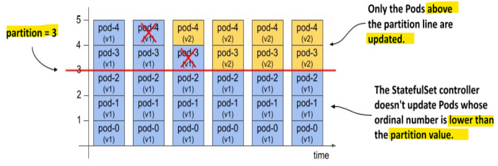

# Kubernetes - StatefulSet

[Back](../../index.md)

- [Kubernetes - StatefulSet](#kubernetes---statefulset)
  - [Statefule Workload](#statefule-workload)
    - [Associated Objects](#associated-objects)
  - [headless Service](#headless-service)
  - [Declarative manifest](#declarative-manifest)
  - [Imperative Commands](#imperative-commands)
  - [StatefulSets Object](#statefulsets-object)
  - [Lab: StatefulSet](#lab-statefulset)
    - [Explain](#explain)
    - [Create StatefulSet](#create-statefulset)
    - [Deleting Pod](#deleting-pod)
    - [Deleting StatefulSet](#deleting-statefulset)
  - [StatefulSet Behavior](#statefulset-behavior)
    - [**node failures** handling](#node-failures-handling)
      - [Solution A: Manual Intervention](#solution-a-manual-intervention)
      - [Solution B: Fix the disconnection](#solution-b-fix-the-disconnection)
  - [Scaling a StatefulSet](#scaling-a-statefulset)
  - [`PersistentVolumeClaim` retention policy](#persistentvolumeclaim-retention-policy)
  - [Pod management policy](#pod-management-policy)
  - [Updating a StatefulSet](#updating-a-statefulset)
    - [RollingUpdate strategy](#rollingupdate-strategy)
    - [Unready pod](#unready-pod)
    - [`ControllerRevision` Object: revision history](#controllerrevision-object-revision-history)
    - [Rolling back](#rolling-back)
    - [with partition: Implement Canary](#with-partition-implement-canary)
    - [Lab: StatefulSet RollingUpdate Strategy](#lab-statefulset-rollingupdate-strategy)
    - [Lab: Implement Canary Deployment with Partition](#lab-implement-canary-deployment-with-partition)
    - [Completing a partitioned update](#completing-a-partitioned-update)
    - [Rolling Back](#rolling-back-1)
  - [OnDelete strategy](#ondelete-strategy)
  - [Lab: update - OnDelete strategy](#lab-update---ondelete-strategy)
    - [Rolling Back](#rolling-back-2)
  - [Kubernetes Operators](#kubernetes-operators)

---

## Statefule Workload

- `stateful workload`

  - a piece of software that must **store and maintain state** in order to function.
  - state must be **maintained** when the workload is **restarted or relocated**.
  - harder to scale
    - **can’t** simply add and remove replicas **without considering their state**,

- Limitation of PV to share state:
  - in most cloud environments, the underlying **storage technology** typically **only** supports the `ReadWriteOnce` and `ReadOnlyMany` access modes, not `ReadWriteMany`,
  - **can’t** mount the volume on multiple nodes in `read/write mode`.

---

### Associated Objects

- the pod is controlled and managed by the `StatefulSet`

  - `StatefulSets` own the `Pods` **directly**

- Additional labels in pod:

  - `apps.kubernetes.io/pod-index`: the order of the pod
  - `controller-revision-hash`: hash value calculated based on the statefulset template to track the version
  - `statefulset.kubernetes.io/pod-name`: specifies the Pod name

- PVC:
  - each `Pod` instance gets its own `PersistentVolumeClaim`.
  - The name of the claim is made up of the `claimName` and the **name** of the Pod.

---

## headless Service

- `peer discovery`

  - the ability for each cluster member to find the other members.
  - an application deployed via a `StatefulSet` needs to find all other Pods in the `StatefulSet` via `DNS`

- For example, a client connecting to a **MongoDB replica** set must know the addresses of **all the replicas**, so it can find the **primary replica** when it needs to **write data**.

  - You must specify the **addresses in the connection string** you pass to the MongoDB client.

- Exposing stateful Pods through **DNS individually**

  - The `headless Service` provide `A` or `AAAA` record that resolves directly to the individual Pod’s IP.
  - the pod's resolvable address:
    - `POD_NAME.SVC_NAME.NAMESPACE.CLUSTER_DOMAIN`
    - e.g., `mongo-1.mongodb-svc.default.svc.cluster.local`

- Exposing stateful Pods via **SRV records**
  - SRV record address:
    - `PORT_NAME.PROTOCOL_NAME.SVC_NAME.NAMESPACE.CLUSTER_DOMAIN`
    - e.g., `_mongodb._tcp.mongodb-svc.default.svc.cluster.local`
    - MongoDB connection string: `mongodb+srv://mongodb-svc.default.svc.cluster.local`

---

- it’s common for a `StatefulSet` to be associated with both a `regular Service` and a `headless Service`.
  - `headless Service`: helps sts pod to find each other
  - `regular service`: help client traffice to forwards to those pod are ready.
    - since the `sts` needs to find each other event they are unready.

---

## Declarative manifest

- `podManagementPolicy`

  - specify how pods are created
  - `OrderedReady`
    - default
    - pods are created in increasing order
  - `Parallel`
    - create pods in parallel

- `volumeClaimTemplates`
  - specify the **templates** for the `PersistentVolumeClaims` that the controller creates for each replica.
  - must specify the name
  - name must match the name in the volumes

---

## Imperative Commands

| CMD                                                    | DESC                            |
| ------------------------------------------------------ | ------------------------------- |
| `kubectl explain statefulset`                          | API schema                      |
| `kubectl get sts <name> -o yaml`                       | Export YAML                     |
| `kubectl get statefulset` / `kubectl get sts`          | List StatefulSets               |
| `kubectl describe sts <name>`                          | Detailed info & events          |
| `kubectl create sts <name> --image= --replicas=N` | Create StatefulSet imperatively |
| `kubectl scale sts <name> --replicas=N`                | Scale replicas                  |
| `kubectl rollout status sts <name>`                    | Watch rolling update            |
| `kubectl rollout history sts <name>`                   | View revision history           |
| `kubectl rollout undo sts <name>`                      | Rollback to previous revision   |
| `kubectl delete sts <name>`                            | Delete StatefulSet              |
| `kubectl delete pod <sts-pod>`                         | Restart a single replica        |
| `kubectl edit sts <name>`                              | Live edit                       |
| `kubectl get pods -l app=<label> -o wide`              | View ordered pods               |
| `kubectl get pvc`                                      | List persistent volumes         |
| `kubectl get pvc -l app=<label>`                       | View volumes per pod            |

---

## StatefulSets Object

- `statefulset`
  - the API object designed to manage applications that need to maintain their identity and state.

---

## Lab: StatefulSet

### Explain

```sh
kubectl explain sts
# GROUP:      apps
# KIND:       StatefulSet
# VERSION:    v1

# DESCRIPTION:
#     StatefulSet represents a set of pods with consistent identities. Identities
#     are defined as:
#       - Network: A single stable DNS and hostname.
#       - Storage: As many VolumeClaims as requested.

#     The StatefulSet guarantees that a given network identity will always map to
#     the same storage identity.

# FIELDS:
#   apiVersion    <string>
#     APIVersion defines the versioned schema of this representation of an object.
#     Servers should convert recognized schemas to the latest internal value, and
#     may reject unrecognized values. More info:
#     https://git.k8s.io/community/contributors/devel/sig-architecture/api-conventions.md#resources

#   kind  <string>
#     Kind is a string value representing the REST resource this object
#     represents. Servers may infer this from the endpoint the client submits
#     requests to. Cannot be updated. In CamelCase. More info:
#     https://git.k8s.io/community/contributors/devel/sig-architecture/api-conventions.md#types-kinds

#   metadata      <ObjectMeta>
#     Standard object's metadata. More info:
#     https://git.k8s.io/community/contributors/devel/sig-architecture/api-conventions.md#metadata

#   spec  <StatefulSetSpec>
#     Spec defines the desired identities of pods in this set.

#   status        <StatefulSetStatus>
#     Status is the current status of Pods in this StatefulSet. This data may be
#     out of date by some window of time.

kubectl explain sts.spec
# GROUP:      apps
# KIND:       StatefulSet
# VERSION:    v1

# FIELD: spec <StatefulSetSpec>


# DESCRIPTION:
#     Spec defines the desired identities of pods in this set.
#     A StatefulSetSpec is the specification of a StatefulSet.

# FIELDS:
#   minReadySeconds       <integer>
#     Minimum number of seconds for which a newly created pod should be ready
#     without any of its container crashing for it to be considered available.
#     Defaults to 0 (pod will be considered available as soon as it is ready)

#   ordinals      <StatefulSetOrdinals>
#     ordinals controls the numbering of replica indices in a StatefulSet. The
#     default ordinals behavior assigns a "0" index to the first replica and
#     increments the index by one for each additional replica requested.

#   persistentVolumeClaimRetentionPolicy  <StatefulSetPersistentVolumeClaimRetentionPolicy>
#     persistentVolumeClaimRetentionPolicy describes the lifecycle of persistent
#     volume claims created from volumeClaimTemplates. By default, all persistent
#     volume claims are created as needed and retained until manually deleted.
#     This policy allows the lifecycle to be altered, for example by deleting
#     persistent volume claims when their stateful set is deleted, or when their
#     pod is scaled down.

#   podManagementPolicy   <string>
#   enum: OrderedReady, Parallel
#     podManagementPolicy controls how pods are created during initial scale up,
#     when replacing pods on nodes, or when scaling down. The default policy is
#     `OrderedReady`, where pods are created in increasing order (pod-0, then
#     pod-1, etc) and the controller will wait until each pod is ready before
#     continuing. When scaling down, the pods are removed in the opposite order.
#     The alternative policy is `Parallel` which will create pods in parallel to
#     match the desired scale without waiting, and on scale down will delete all
#     pods at once.

#     Possible enum values:
#      - `"OrderedReady"` will create pods in strictly increasing order on scale
#     up and strictly decreasing order on scale down, progressing only when the
#     previous pod is ready or terminated. At most one pod will be changed at any
#     time.
#      - `"Parallel"` will create and delete pods as soon as the stateful set
#     replica count is changed, and will not wait for pods to be ready or complete
#     termination.

#   replicas      <integer>
#     replicas is the desired number of replicas of the given Template. These are
#     replicas in the sense that they are instantiations of the same Template, but
#     individual replicas also have a consistent identity. If unspecified,
#     defaults to 1.

#   revisionHistoryLimit  <integer>
#     revisionHistoryLimit is the maximum number of revisions that will be
#     maintained in the StatefulSet's revision history. The revision history
#     consists of all revisions not represented by a currently applied
#     StatefulSetSpec version. The default value is 10.

#   selector      <LabelSelector> -required-
#     selector is a label query over pods that should match the replica count. It
#     must match the pod template's labels. More info:
#     https://kubernetes.io/docs/concepts/overview/working-with-objects/labels/#label-selectors

#   serviceName   <string>
#     serviceName is the name of the service that governs this StatefulSet. This
#     service must exist before the StatefulSet, and is responsible for the
#     network identity of the set. Pods get DNS/hostnames that follow the pattern:
#     pod-specific-string.serviceName.default.svc.cluster.local where
#     "pod-specific-string" is managed by the StatefulSet controller.

#   template      <PodTemplateSpec> -required-
#     template is the object that describes the pod that will be created if
#     insufficient replicas are detected. Each pod stamped out by the StatefulSet
#     will fulfill this Template, but have a unique identity from the rest of the
#     StatefulSet. Each pod will be named with the format
#     <statefulsetname>-<podindex>. For example, a pod in a StatefulSet named
#     "web" with index number "3" would be named "web-3". The only allowed
#     template.spec.restartPolicy value is "Always".

#   updateStrategy        <StatefulSetUpdateStrategy>
#     updateStrategy indicates the StatefulSetUpdateStrategy that will be employed
#     to update Pods in the StatefulSet when a revision is made to Template.

#   volumeClaimTemplates  <[]PersistentVolumeClaim>
#     volumeClaimTemplates is a list of claims that pods are allowed to reference.
#     The StatefulSet controller is responsible for mapping network identities to
#     claims in a way that maintains the identity of a pod. Every claim in this
#     list must have at least one matching (by name) volumeMount in one container
#     in the template. A claim in this list takes precedence over any volumes in
#     the template, with the same name.

```

---

### Create StatefulSet

- Headless serive

```yaml
# demo-mongodb-svc.yaml
apiVersion: v1
kind: Service
metadata:
  name: mongodb-svc
  labels:
    app: mongodb
spec:
  clusterIP: None # Headless
  selector:
    app: mongodb
  ports:
    - name: mongodb
      port: 27017
      targetPort: 27017
```

- Mongodb with statefulset

```yaml
# demo-mongodb.yaml
apiVersion: apps/v1
kind: StatefulSet
metadata:
  name: mongodb
spec:
  serviceName: mongodb-svc
  replicas: 3
  selector:
    matchLabels:
      app: mongodb
  template:
    metadata:
      labels:
        app: mongodb
    spec:
      containers:
        - name: mongodb
          image: mongo
          ports:
            - containerPort: 27017
          volumeMounts:
            - name: data
              mountPath: /data/db
  volumeClaimTemplates: # a unique PVC for each pod
    - metadata:
        name: data
      spec:
        accessModes: ["ReadWriteOnce"]
        resources:
          requests:
            storage: 10Gi
```

```sh
kubectl apply -f demo-mongodb-svc.yaml
# service/mongodb-svc created

kubectl apply -f demo-mongodb.yaml
# statefulset.apps/mongodb created

kubectl get sts -o wide
# NAME      READY   AGE   CONTAINERS   IMAGES
# mongodb   3/3     55s   mongodb      mongo

# confirm: no rs
kubectl get rs
# No resources found in default namespace.

kubectl rollout status sts mongodb
# Waiting for 3 pods to be ready...
# Waiting for 2 pods to be ready...
# Waiting for 2 pods to be ready...
# Waiting for 1 pods to be ready...
# Waiting for 1 pods to be ready...
# partitioned roll out complete: 3 new pods have been updated...

kubectl describe sts mongodb
# Name:               mongodb
# Namespace:          default
# CreationTimestamp:  Wed, 31 Dec 2025 17:50:43 -0500
# Selector:           app=mongodb
# Labels:             <none>
# Annotations:        <none>
# Replicas:           3 desired | 3 total
# Update Strategy:    RollingUpdate
#   Partition:        0
# Pods Status:        3 Running / 0 Waiting / 0 Succeeded / 0 Failed
# Pod Template:
#   Labels:  app=mongodb
#   Containers:
#    mongodb:
#     Image:        mongo
#     Port:         27017/TCP
#     Host Port:    0/TCP
#     Environment:  <none>
#     Mounts:
#       /data/db from data (rw)
#   Volumes:         <none>
#   Node-Selectors:  <none>
#   Tolerations:     <none>
# Volume Claims:
#   Name:          data
#   StorageClass:
#   Labels:        <none>
#   Annotations:   <none>
#   Capacity:      10Gi
#   Access Modes:  [ReadWriteOnce]
# Events:
#   Type    Reason            Age    From                    Message
#   ----    ------            ----   ----                    -------
#   Normal  SuccessfulCreate  2m33s  statefulset-controller  create Claim data-mongodb-0 Pod mongodb-0 in StatefulSet mongodb success
#   Normal  SuccessfulCreate  2m33s  statefulset-controller  create Pod mongodb-0 in StatefulSet mongodb successful
#   Normal  SuccessfulCreate  2m30s  statefulset-controller  create Claim data-mongodb-1 Pod mongodb-1 in StatefulSet mongodb success
#   Normal  SuccessfulCreate  2m30s  statefulset-controller  create Pod mongodb-1 in StatefulSet mongodb successful
#   Normal  SuccessfulCreate  2m27s  statefulset-controller  create Claim data-mongodb-2 Pod mongodb-2 in StatefulSet mongodb success
#   Normal  SuccessfulCreate  2m27s  statefulset-controller  create Pod mongodb-2 in StatefulSet mongodb successful


kubectl get pod -o wide
# NAME        READY   STATUS    RESTARTS   AGE     IP           NODE             NOMINATED NODE   READINESS GATES
# mongodb-0   1/1     Running   0          2m54s   10.1.3.214   docker-desktop   <none>           <none>
# mongodb-1   1/1     Running   0          2m50s   10.1.3.215   docker-desktop   <none>           <none>
# mongodb-2   1/1     Running   0          2m48s   10.1.3.216   docker-desktop   <none>           <none>

# confirm pod:
#   Controlled By:  StatefulSe
#   mount read/write volume
kubectl describe pod mongodb-0
# Labels:           app=mongodb
#                   apps.kubernetes.io/pod-index=0
#                   controller-revision-hash=mongodb-86954b94c4
#                   statefulset.kubernetes.io/pod-name=mongodb-0
# Controlled By:  StatefulSet/mongodb
# Volumes:
#   data:
#     Type:       PersistentVolumeClaim (a reference to a PersistentVolumeClaim in the same namespace)
#     ClaimName:  data-mongodb-0
#     ReadOnly:   false


# confirm: pvc
kubectl get pvc -o wide
# NAME             STATUS   VOLUME                                     CAPACITY   ACCESS MODES   STORAGECLASS   VOLUMEATTRIBUTESCLASS   AGE    VOLUMEMODE
# data-mongodb-0   Bound    pvc-76d4f6d8-c326-478a-b1b8-9fa9bb1064f2   10Gi       RWO            hostpath       <unset>                 175m   Filesystem
# data-mongodb-1   Bound    pvc-4e72560b-6a6d-4cc2-8f40-5efd8e2ab85d   10Gi       RWO            hostpath       <unset>                 175m   Filesystem
# data-mongodb-2   Bound    pvc-5b70bd9e-f4d9-4ecd-a4f3-919e926dbe38   10Gi       RWO            hostpath       <unset>                 174m   Filesystem

kubectl get pv -o wide
# NAME                                       CAPACITY   ACCESS MODES   RECLAIM POLICY   STATUS   CLAIM                    STORAGECLASS   VOLUMEATTRIBUTESCLASS   REASON   AGE    VOLUMEMODE
# pvc-4e72560b-6a6d-4cc2-8f40-5efd8e2ab85d   10Gi       RWO            Delete           Bound    default/data-mongodb-1   hostpath       <unset>                          175m   Filesystem
# pvc-5b70bd9e-f4d9-4ecd-a4f3-919e926dbe38   10Gi       RWO            Delete           Bound    default/data-mongodb-2   hostpath       <unset>                          175m   Filesystem
# pvc-76d4f6d8-c326-478a-b1b8-9fa9bb1064f2   10Gi       RWO            Delete           Bound    default/data-mongodb-0   hostpath       <unset>                          175m   Filesystem
```

- Run pod to verify

```sh
# run mongo cli
kubectl run mongo-client --rm -it --image=mongo -- mongosh --host mongodb-0.mongodb-svc --eval "db.adminCommand('ping')"
# { ok: 1 }

# test using svr url
kubectl run mongo-client --rm -it --image=mongo -- mongosh "mongodb+srv://mongodb-svc.default.svc.cluster.local/?tls=false"
# test>

# insert test data
kubectl run mongo-client --rm -it --image=mongo -- mongosh "mongodb+srv://mongodb-svc.default.svc.cluster.local/?tls=false" --eval "db.getSiblingDB('testdb').inventory.insertOne({ item: 'notebook', qty: 50, status: 'ready' })"
# {
#   acknowledged: true,
#   insertedId: ObjectId('6955e00d90775733ee8de666')
# }

# confirm
kubectl run mongo-client --rm -it --image=mongo -- mongosh "mongodb+srv://mongodb-svc.default.svc.cluster.local/?tls=false" --eval "db.getSiblingDB('testdb').inventory.find().pretty()"
# [
#   {
#     _id: ObjectId('6955e00d90775733ee8de666'),
#     item: 'notebook',
#     qty: 50,
#     status: 'ready'
#   },
# ]


kubectl run mongo-client --rm -it --image=mongo -- mongosh "mongodb+srv://mongodb-svc.default.svc.cluster.local/?tls=false" --eval "rs.hello().primary"
```

---

### Deleting Pod

```sh
kubectl delete pod mongodb-1
# pod "mongodb-1" deleted from default namespace

# confirm pod replacement
kubectl get po
# NAME        READY   STATUS    RESTARTS   AGE
# mongodb-0   1/1     Running   0          84m
# mongodb-1   1/1     Running   0          22s
# mongodb-2   1/1     Running   0          84m
```

---

### Deleting StatefulSet

```sh
# before deletion
kubectl get sts
# NAME      READY   AGE
# mongodb   3/3     17h

kubectl get pvc
# NAME             STATUS   VOLUME                                     CAPACITY   ACCESS MODES   STORAGECLASS   VOLUMEATTRIBUTESCLASS   AGE
# data-mongodb-0   Bound    pvc-76d4f6d8-c326-478a-b1b8-9fa9bb1064f2   10Gi       RWO            hostpath       <unset>                 19h
# data-mongodb-1   Bound    pvc-4e72560b-6a6d-4cc2-8f40-5efd8e2ab85d   10Gi       RWO            hostpath       <unset>                 19h
# data-mongodb-2   Bound    pvc-5b70bd9e-f4d9-4ecd-a4f3-919e926dbe38   10Gi       RWO            hostpath       <unset>                 19h

kubectl get pv
# NAME                                       CAPACITY   ACCESS MODES   RECLAIM POLICY   STATUS   CLAIM                    STORAGECLASS   VOLUMEATTRIBUTESCLASS   REASON   AGE
# pvc-4e72560b-6a6d-4cc2-8f40-5efd8e2ab85d   10Gi       RWO            Delete           Bound    default/data-mongodb-1   hostpath       <unset>                          19h
# pvc-5b70bd9e-f4d9-4ecd-a4f3-919e926dbe38   10Gi       RWO            Delete           Bound    default/data-mongodb-2   hostpath       <unset>                          19h
# pvc-76d4f6d8-c326-478a-b1b8-9fa9bb1064f2   10Gi       RWO            Delete           Bound    default/data-mongodb-0   hostpath       <unset>                          19h

kubectl delete sts mongodb
# statefulset.apps "mongodb" deleted from default namespace

# confirm
kubectl get sts
# No resources found in default namespace.

# confirm: pvc preserved
kubectl get pvc
# NAME             STATUS   VOLUME                                     CAPACITY   ACCESS MODES   STORAGECLASS   VOLUMEATTRIBUTESCLASS   AGE
# data-mongodb-0   Bound    pvc-76d4f6d8-c326-478a-b1b8-9fa9bb1064f2   10Gi       RWO            hostpath       <unset>                 19h
# data-mongodb-1   Bound    pvc-4e72560b-6a6d-4cc2-8f40-5efd8e2ab85d   10Gi       RWO            hostpath       <unset>                 19h
# data-mongodb-2   Bound    pvc-5b70bd9e-f4d9-4ecd-a4f3-919e926dbe38   10Gi       RWO            hostpath       <unset>                 19h

kubectl get pv
# NAME                                       CAPACITY   ACCESS MODES   RECLAIM POLICY   STATUS   CLAIM                    STORAGECLASS   VOLUMEATTRIBUTESCLASS   REASON   AGE
# pvc-4e72560b-6a6d-4cc2-8f40-5efd8e2ab85d   10Gi       RWO            Delete           Bound    default/data-mongodb-1   hostpath       <unset>                          20h
# pvc-5b70bd9e-f4d9-4ecd-a4f3-919e926dbe38   10Gi       RWO            Delete           Bound    default/data-mongodb-2   hostpath       <unset>                          20h
# pvc-76d4f6d8-c326-478a-b1b8-9fa9bb1064f2   10Gi       RWO            Delete           Bound    default/data-mongodb-0   hostpath       <unset>                          20h

# manually delete pvc
kubectl delete pvc data-mongodb-0 data-mongodb-1 data-mongodb-2
# persistentvolumeclaim "data-mongodb-0" deleted from default namespace
# persistentvolumeclaim "data-mongodb-1" deleted from default namespace
# persistentvolumeclaim "data-mongodb-2" deleted from default namespace

kubectl get pv
# No resources found

```

---

## StatefulSet Behavior

- `StatefulSet Controller` ensures that there are always the **desired number** of `Pods` configured in the replicas field.

  - if a `StatefulSet Pod` is **deleted** and replaced by the `controller` with a new instance
  - the replica **retains the same identity** and is **associated with the same** `PersistentVolumeClaim`.

---

### **node failures** handling

- if a node is disconnected, the pod of the `StatefulSet` that runs on the failed node will be marked as `Terminating` due to `Node is not ready`, even though it is still running on the node.

  - `StatefulSet Controller` will **not** delete and restart a new pod automatically.

---

#### Solution A: Manual Intervention

- `kubectl delete pod` command has no effect, because the pod is already `Terminating`
  - it works only when the `kubelet` on the failure node report the deleteion coompletes.
- `kubectl delete pod NAME --force --grace-period 0`: force to delete pod

  - should **confirm** the node **fails** and the pod get **deleted** **beforehand**.
  - `StatefulSet controller` then recreate the pod automatically.

- The recreated pod may not start.
  - Scenario 1: using local volume
    - the underlying `pv` is a **local volume on the failed node**.
    - recreated pod is `Pending`
      - `kubectl describe` for detailed events
        - `1 node had volume node affinity conflict.`
  - Scenario 2: using network attached volumes
    - Pod will be scheduled on **another node** but requires the `volume` to be **detached** from the **failed node**
    - recreated pod is `ContainerCreating`
    - events: `FailedAttachVolume`
    - solution: delete the old `pvc` and the `pod`
      - `kubectl delete pvc/PVC_NAME pod/POD_NAME`
      - then the controller recreates the PVC and pod, the replica will sync the data.

---

#### Solution B: Fix the disconnection

- When the node is back **online**, the **deletion** of the Pod is **complete**, and the **new** Pod is **created**.

---

## Scaling a StatefulSet

- When you **scale up** a `StatefulSet`, the `controller` creates both

  - a new `Pod`
  - a new `PersistentVolumeClaim`

- Scaling down

  - the `Pod` with the **highest ordinal number** is deleted first.
  - by default, the `PersistentVolumeClaims` are **preserved**
    - because the pvc deletion causes the bound `PersistentVolume` to be **recycled** or **deleted**, resulting in **data loss**.
    - can be change by `persistentVolumeClaimRetentionPolicy`
    - When the `sts` scale up again, the preserve pvc can be reattached.


- for some database, if scale down to 1, may lead to the Service is no longer available due to lack of `quorum`

---

## `PersistentVolumeClaim` retention policy

- `persistentVolumeClaimRetentionPolicy` field:

  - specify the **retention policy** to be used during **scaledown** and when the `StatefulSet` is **deleted**.
  - `Retain`
    - default
    - pvc will be preserved.
  - `Delete`
    - can be deleted if the workload managed by the `StatefulSet` **never requires data to be preserved**

- Example

```yaml
spec:
  persistentVolumeClaimRetentionPolicy:
    whenScaled: Delete
    whenDeleted: Retain
```

- also can configure the `StatefulSetAutoDeletePVC` feature when creating cluster

- If you want to **delete** a `StatefulSet` but **keep** the `Pods` and the `PersistentVolumeClaims`, you can use the `--cascade=orphan` option.
  - In this case, the `PersistentVolumeClaims` will be **preserved** even if the **retention policy** is set to `Delete`.

---

## Pod management policy

- `podManagementPolicy` field

  - `OrderedReady`:
    - default,
    - scale up/down the Pods sequentially
      - wait for each pod ready before create the next pod
      - wait for graceful time to terminate the pod before the next one.
    - the policy **doesn’t apply** when you **delete** the `StatefulSet`.
    - possible scenario:
      - when the app has bug to be ready; the technology need multiple instance to be ready;
      - the `sts` get stuck because Pod is never ready
      - when debug by deletion, because it still wait a graceful termination, it could be the case it gets stuck during the deletion.
    - used depends on the technology; can prevent race condition or concurrent startup problem
  - `Parallel`:
    - scale up/down all Pods at the same time
      - no waiting

- Common use: `podManagementPolicy` + `minReadySeconds`

  - `minReadySeconds`: applied when scale up, can avoid race condition; not applied when scale down

- Ordered removal of Pods when deleting the StatefulSet
  - since the policy doesn't apply when deleting `sts`
  - good practices: scale down to zero, then delete

---

## Updating a StatefulSet

- `updateStrategy` field
  - `RollingUpdate`
    - default
    - Pods are replaced one by one
      - pod with highest ordinal number is deleted and replaced first
      - when the new pod is ready
      - pod with the next highest ordinal number is replaced.
  - `OnDelete`
    - **waits** for each Pod to be **manually deleted**.
      - When the old Pod gets manually deleted, the controller replaces it with a new Pod
      - the replacement of the pod can in any order.

---

### RollingUpdate strategy

- only **one** `Pod` is **replaced** at a time.

- with `minReadySeconds` field:
  - **causes** the `controller` to **wait a certain amount of time** after the new Pods are ready **before replacing** the other Pods.

---

### Unready pod

- If a new `Pod` **fails to become ready** during the update, the update is also **paused**.
  - The rollout will **resume** when the `Pod` is **ready again**.
- So, if you deploy a **faulty version** whose readiness probe **never succeeds**, the update will be **blocked** after the first Pod is replaced.
- If the number of replicas in the `StatefulSet` is **sufficient**, the service provided by the Pods in the `StatefulSet` is **unaffected**.

---

### `ControllerRevision` Object: revision history

- `ControllerRevision` objects

  - the object stores the revision history of `StatefulSets` and `DaemonSets`
  - a generic object that represents an **immutable snapshot** of the **state of an object** at a particular point in time.

- vs history of deployment
  - `deployment`: using rs
  - `StatefulSets`: using `ControllerRevision`
  -

```sh
kubectl rollout history sts NAME

kubectl get controllerrevisions
```

---

### Rolling back

- use cases:

  - When updating the `StatefulSet` and the rollout **hangs**
  - When the rollout was successful, but want to **revert to the previous revision**

- If the strategy is `RollingUpdate`, the Pods are **reverted one at a time.**

```sh
kubectl rollout undo sts NAME

kubectl rollout undo sts NAME --to-revision VERSION

```

---

### with partition: Implement Canary

- `sts` does not support `kubectl rollout pause` command

- `spec.updateStrategy.rollingUpdate.partition` field
  - specifies the **ordinal number** at which the StatefulSet should be **partitioned**.
  - pods with an ordinal number lower than the partition value aren’t updated.



- Use case:

  - If you set the `partition` value appropriately, you can implement a `Canary deployment`, control the **rollout manually**, or **stage an update** instead of triggering it immediately.

- Implement Canary
  - set `partition` = replica and apply, as a safe net to block any auto update
  - `kubectl patch sts` to scale down `parition` by 1;
    - sts controller automatically update the highest pod
    - then test this new pod
  - if test is passed, continue `kubectl patch sts` to scale down `parition` by 1
  - until `parition` = 0

---

### Lab: StatefulSet RollingUpdate Strategy

```yaml
# demo-mongodb-rollingupdate.yaml
apiVersion: apps/v1
kind: StatefulSet
metadata:
  name: demo-mongodb-rollingupdate
spec:
  serviceName: mongodb-svc # headless svc
  replicas: 3
  minReadySeconds: 30 # wait for 30s for readiness
  selector:
    matchLabels:
      app: mongodb
  template:
    metadata:
      labels:
        app: mongodb
    spec:
      containers:
        - name: mongodb
          image: mongo:8
          ports:
            - containerPort: 27017
          volumeMounts:
            - name: data
              mountPath: /data/db
  volumeClaimTemplates: # a unique PVC for each pod
    - metadata:
        name: data
      spec:
        accessModes: ["ReadWriteOnce"]
        resources:
          requests:
            storage: 10Gi
```

```sh
kubectl apply -f demo-mongodb-rollingupdate.yaml
# statefulset.apps/demo-mongodb-rollingupdate created

# confirm
kubectl get sts -o wide
# NAME                         READY   AGE     CONTAINERS   IMAGES
# demo-mongodb-rollingupdate   3/3     4m14s   mongodb      mongo:8

kubectl set image sts demo-mongodb-rollingupdate mongodb=mongo:8.2.3
# statefulset.apps/demo-mongodb-rollingupdate image updated

# confirm:
#  sts update one by one
kubectl rollout status sts demo-mongodb-rollingupdate
# Waiting for 1 pods to be ready...
# Waiting for 1 pods to be ready...
# Waiting for 1 pods to be ready...
# Waiting for partitioned roll out to finish: 1 out of 3 new pods have been updated...
# Waiting for partitioned roll out to finish: 1 out of 3 new pods have been updated...
# Waiting for 1 pods to be ready...
# Waiting for 1 pods to be ready...
# Waiting for 1 pods to be ready...
# Waiting for partitioned roll out to finish: 2 out of 3 new pods have been updated...
# Waiting for partitioned roll out to finish: 2 out of 3 new pods have been updated...
# Waiting for 1 pods to be ready...
# Waiting for 1 pods to be ready...
# Waiting for 1 pods to be ready...
# partitioned roll out complete: 3 new pods have been updated...


# confirm:
#  sts update one by one
kubectl get sts -o wide -w
# NAME                         READY   AGE     CONTAINERS   IMAGES
# demo-mongodb-rollingupdate   3/3     3m50s   mongodb      mongo:8
# demo-mongodb-rollingupdate   3/3     4m37s   mongodb      mongo:8.2.3
# demo-mongodb-rollingupdate   3/3     4m37s   mongodb      mongo:8.2.3
# demo-mongodb-rollingupdate   2/3     4m38s   mongodb      mongo:8.2.3
# demo-mongodb-rollingupdate   2/3     4m38s   mongodb      mongo:8.2.3
# demo-mongodb-rollingupdate   2/3     4m38s   mongodb      mongo:8.2.3
# demo-mongodb-rollingupdate   3/3     4m39s   mongodb      mongo:8.2.3
# demo-mongodb-rollingupdate   3/3     5m10s   mongodb      mongo:8.2.3
# demo-mongodb-rollingupdate   2/3     5m10s   mongodb      mongo:8.2.3
# demo-mongodb-rollingupdate   2/3     5m11s   mongodb      mongo:8.2.3
# demo-mongodb-rollingupdate   2/3     5m11s   mongodb      mongo:8.2.3
# demo-mongodb-rollingupdate   3/3     5m13s   mongodb      mongo:8.2.3
# demo-mongodb-rollingupdate   3/3     6m14s   mongodb      mongo:8.2.3
# demo-mongodb-rollingupdate   2/3     6m15s   mongodb      mongo:8.2.3
# demo-mongodb-rollingupdate   2/3     6m15s   mongodb      mongo:8.2.3
# demo-mongodb-rollingupdate   2/3     6m15s   mongodb      mongo:8.2.3
# demo-mongodb-rollingupdate   3/3     6m18s   mongodb      mongo:8.2.3
# demo-mongodb-rollingupdate   3/3     7m18s   mongodb      mongo:8.2.3

# confirm:
#   sts update from highest
#   wait for ready
kubectl get pod -w
# NAME                           READY   STATUS              RESTARTS   AGE
# demo-mongodb-rollingupdate-0   1/1     Running             0          3m55s
# demo-mongodb-rollingupdate-1   1/1     Running             0          2m51s
# demo-mongodb-rollingupdate-2   1/1     Running             0          2m19s
# demo-mongodb-rollingupdate-2   1/1     Terminating         0          3m1s
# demo-mongodb-rollingupdate-2   1/1     Terminating         0          3m1s
# demo-mongodb-rollingupdate-2   0/1     Completed           0          3m2s
# demo-mongodb-rollingupdate-2   0/1     Completed           0          3m2s
# demo-mongodb-rollingupdate-2   0/1     Completed           0          3m2s
# demo-mongodb-rollingupdate-2   0/1     Pending             0          0s
# demo-mongodb-rollingupdate-2   0/1     Pending             0          0s
# demo-mongodb-rollingupdate-2   0/1     ContainerCreating   0          0s
# demo-mongodb-rollingupdate-2   1/1     Running             0          1s
# demo-mongodb-rollingupdate-1   1/1     Terminating         0          4m6s
# demo-mongodb-rollingupdate-1   1/1     Terminating         0          4m6s
# demo-mongodb-rollingupdate-1   0/1     Completed           0          4m6s
# demo-mongodb-rollingupdate-1   0/1     Completed           0          4m7s
# demo-mongodb-rollingupdate-1   0/1     Completed           0          4m7s
# demo-mongodb-rollingupdate-1   0/1     Completed           0          4m7s
# demo-mongodb-rollingupdate-1   0/1     Pending             0          0s
# demo-mongodb-rollingupdate-1   0/1     Pending             0          0s
# demo-mongodb-rollingupdate-1   0/1     ContainerCreating   0          0s
# demo-mongodb-rollingupdate-1   1/1     Running             0          2s
# demo-mongodb-rollingupdate-0   1/1     Terminating         0          6m14s
# demo-mongodb-rollingupdate-0   1/1     Terminating         0          6m14s
# demo-mongodb-rollingupdate-0   0/1     Completed           0          6m15s
# demo-mongodb-rollingupdate-0   0/1     Completed           0          6m15s
# demo-mongodb-rollingupdate-0   0/1     Completed           0          6m15s
# demo-mongodb-rollingupdate-0   0/1     Pending             0          0s
# demo-mongodb-rollingupdate-0   0/1     Pending             0          0s
# demo-mongodb-rollingupdate-0   0/1     ContainerCreating   0          0s
# demo-mongodb-rollingupdate-0   1/1     Running             0          3s

# confirm history
kubectl rollout history sts demo-mongodb-rollingupdate
# statefulset.apps/demo-mongodb-rollingupdate
# REVISION  CHANGE-CAUSE
# 1         <none>
# 2         <none>

kubectl get controllerrevisions
# NAME                                    CONTROLLER                                    REVISION   AGE
# demo-mongodb-rollingupdate-77dbc6c455   statefulset.apps/demo-mongodb-rollingupdate   2          18m
# demo-mongodb-rollingupdate-86bc878446   statefulset.apps/demo-mongodb-rollingupdate   1          21m

# confirm the version image get updated
kubectl describe controllerrevisions demo-mongodb-rollingupdate-77dbc6c455
# Name:         demo-mongodb-rollingupdate-77dbc6c455
# Namespace:    default
# Labels:       app=mongodb
#               controller.kubernetes.io/hash=77dbc6c455
# Annotations:  <none>
# API Version:  apps/v1
# Data:
#   Spec:
#     Template:
#       $patch:  replace
#       Metadata:
#         Labels:
#           App:  mongodb
#       Spec:
#         Containers:
#           Image:              mongo:8.2.3
#           Image Pull Policy:  IfNotPresent
#           Name:               mongodb
#           Ports:
#             Container Port:  27017
#             Protocol:        TCP
#           Resources:
#           Termination Message Path:    /dev/termination-log
#           Termination Message Policy:  File
#           Volume Mounts:
#             Mount Path:  /data/db
#             Name:        data
#         Dns Policy:      ClusterFirst
#         Restart Policy:  Always
#         Scheduler Name:  default-scheduler
#         Security Context:
#         Termination Grace Period Seconds:  30
# Kind:                                      ControllerRevision
# Metadata:
#   Creation Timestamp:  2026-01-01T19:43:27Z
#   Owner References:
#     API Version:           apps/v1
#     Block Owner Deletion:  true
#     Controller:            true
#     Kind:                  StatefulSet
#     Name:                  demo-mongodb-rollingupdate
#     UID:                   b608d553-b8f9-476f-aa58-ade3a9716e96
#   Resource Version:        2953656
#   UID:                     feb160f5-94c5-4f6e-8f5c-22fe8e90889b
# Revision:                  2
# Events:                    <none>

```

---

### Lab: Implement Canary Deployment with Partition

```yaml
# demo-sts-update-partition.yaml
apiVersion: apps/v1
kind: StatefulSet
metadata:
  name: demo-sts-update-partition
spec:
  serviceName: mongodb-svc # headless svc
  replicas: 3
  minReadySeconds: 30 # wait for 30s for readiness
  updateStrategy:
    type: RollingUpdate # RollingUpdate strategy
    rollingUpdate:
      partition: 3
  selector:
    matchLabels:
      app: mongodb
  template:
    metadata:
      labels:
        app: mongodb
    spec:
      containers:
        - name: mongodb
          image: mongo:8
          ports:
            - containerPort: 27017
          volumeMounts:
            - name: data
              mountPath: /data/db
  volumeClaimTemplates: # a unique PVC for each pod
    - metadata:
        name: data
      spec:
        accessModes: ["ReadWriteOnce"]
        resources:
          requests:
            storage: 10Gi
```

```sh
kubectl apply -f demo-sts-update-partition.yaml
# statefulset.apps/demo-sts-update-partition created

kubectl get sts demo-sts-update-partition
# NAME                        READY   AGE
# demo-sts-update-partition   3/3     76s
```

- Update image

```sh
kubectl set image sts demo-sts-update-partition mongodb=mongo:8.2.3

# confirm: no sts get updated
kubectl rollout status sts demo-sts-update-partition
# partitioned roll out complete: 0 new pods have been updated...
```

> No pod update due to partition = replicas

---

- Update partition to 2 and change image

```yaml
# demo-sts-update-partition-patch.yaml
spec:
  updateStrategy:
    rollingUpdate:
      partition: 2
```

```sh
# update partition number
kubectl patch sts demo-sts-update-partition --patch-file demo-sts-update-partition-patch.yaml
# statefulset.apps/demo-sts-update-partition patched

kubectl rollout status sts demo-sts-update-partition
# Waiting for 1 pods to be ready...
# partitioned roll out complete: 1 new pods have been updated...

# confirm
kubectl get sts -w
# NAME                        READY   AGE
# demo-sts-update-partition   3/3     2m33s
# demo-sts-update-partition   3/3     3m56s
# demo-sts-update-partition   3/3     3m56s
# demo-sts-update-partition   3/3     14m
# demo-sts-update-partition   3/3     14m
# demo-sts-update-partition   2/3     14m
# demo-sts-update-partition   2/3     14m
# demo-sts-update-partition   2/3     14m
# demo-sts-update-partition   3/3     14m

# confirm:
#  highest get updated
kubectl get pod -w
# NAME                          READY   STATUS              RESTARTS   AGE
# demo-sts-update-partition-0   1/1     Running             0          2m53s
# demo-sts-update-partition-1   1/1     Running             0          2m21s
# demo-sts-update-partition-2   1/1     Running             0          109s
# demo-sts-update-partition-2   1/1     Terminating         0          13m
# demo-sts-update-partition-2   1/1     Terminating         0          13m
# demo-sts-update-partition-2   0/1     Completed           0          13m
# demo-sts-update-partition-2   0/1     Completed           0          13m
# demo-sts-update-partition-2   0/1     Completed           0          13m
# demo-sts-update-partition-2   0/1     Pending             0          0s
# demo-sts-update-partition-2   0/1     Pending             0          0s
# demo-sts-update-partition-2   0/1     ContainerCreating   0          0s
# demo-sts-update-partition-2   1/1     Running             0          2s

# confirm from status
#  replica Revision
kubectl get sts demo-sts-update-partition -o yaml
# status:
#   availableReplicas: 3
#   currentReplicas: 2
#   currentRevision: demo-sts-update-partition-86bc878446
#   updateRevision: demo-sts-update-partition-77dbc6c455
#   updatedReplicas: 1
```

- Try to delete pod with partition update
  - if one of the **old Pods** get deleted, the replacement Pod will be created **with the previous template**.
  - If one of the **new pods** get deleted, it’ll be recreated with the new template.

```sh
# delete -0 with old version
kubectl delete pod demo-sts-update-partition-1
# pod "demo-sts-update-partition-1" deleted from default namespace

# confirm: replica and revision unchanged
kubectl get sts demo-sts-update-partition -o yaml
# status:
#   currentReplicas: 2
#   currentRevision: demo-sts-update-partition-86bc878446
#   updateRevision: demo-sts-update-partition-77dbc6c455
#   updatedReplicas: 1
```

---

### Completing a partitioned update

- Scale down partition to 0

```sh
# update demo-sts-update-partition-patch.yaml
# partition: 1
kubectl patch sts demo-sts-update-partition --patch-file demo-sts-update-partition-patch.yaml
# statefulset.apps/demo-sts-update-partition patched

# confirm updated=2
kubectl get sts demo-sts-update-partition -o yaml
# status:
#   currentReplicas: 1
#   currentRevision: demo-sts-update-partition-86bc878446
#   updateRevision: demo-sts-update-partition-77dbc6c455
#   updatedReplicas: 2

# update demo-sts-update-partition-patch.yaml
# partition: 0
kubectl patch sts demo-sts-update-partition --patch-file demo-sts-update-partition-patch.yaml
# statefulset.apps/demo-sts-update-partition patched

# confirm currentReplicas=updatedReplicas=3
kubectl get sts demo-sts-update-partition -o yaml
# status:
#   currentReplicas: 3
#   currentRevision: demo-sts-update-partition-77dbc6c455
#   updateRevision: demo-sts-update-partition-77dbc6c455
#   updatedReplicas: 3
```

---

### Rolling Back

```sh
kubectl rollout undo sts demo-sts-update-partition
# statefulset.apps/demo-sts-update-partition rolled back

# confirm: image = 8.0
kubectl get sts -o wide
# NAME                        READY   AGE   CONTAINERS   IMAGES
# demo-sts-update-partition   3/3     55m   mongodb      mongo:8
```

---

## OnDelete strategy

- Pod’s `readiness` status is **irrelevant**
  - because the rollout is controlled manually

---

## Lab: update - OnDelete strategy

```yaml
# demo-sts-update-ondelete.yaml
apiVersion: apps/v1
kind: StatefulSet
metadata:
  name: demo-sts-update-ondelete
spec:
  serviceName: mongodb-svc # headless svc
  replicas: 3
  minReadySeconds: 30 # wait for 30s for readiness
  updateStrategy:
    type: OnDelete # OnDelete strategy
  selector:
    matchLabels:
      app: mongodb
  template:
    metadata:
      labels:
        app: mongodb
    spec:
      containers:
        - name: mongodb
          image: mongo:8
          ports:
            - containerPort: 27017
          volumeMounts:
            - name: data
              mountPath: /data/db
  volumeClaimTemplates: # a unique PVC for each pod
    - metadata:
        name: data
      spec:
        accessModes: ["ReadWriteOnce"]
        resources:
          requests:
            storage: 10Gi
```

```sh
kubectl apply -f demo-sts-update-ondelete.yaml
# statefulset.apps/demo-sts-update-ondelete created

kubectl get sts -o wide
# NAME                       READY   AGE     CONTAINERS   IMAGES
# demo-sts-update-ondelete   3/3     3m10s   mongodb      mongo:8

# update image
kubectl set image sts demo-sts-update-ondelete mongodb=mongo:8.2.3
# statefulset.apps/demo-sts-update-ondelete image updated
```

> Sts controller do nothing due to the `onDelete` strategy

---

- Manually delete pod
  - not necessary to have to delete the Pod with the highest ordinal number first.

```sh
kubectl delete pod demo-sts-update-ondelete-1
# pod "demo-sts-update-ondelete-1" deleted from default namespace

# confirm: controller create new pod
kubectl get pod -w
# NAME                         READY   STATUS             RESTARTS   AGE
# demo-sts-update-ondelete-0   1/1     Running            0          89s
# demo-sts-update-ondelete-1   1/1     Running            0          57s
# demo-sts-update-ondelete-2   1/1     Running            0          25s
# demo-sts-update-ondelete-1   1/1     Terminating        0          18m
# demo-sts-update-ondelete-1   1/1     Terminating        0          18m
# demo-sts-update-ondelete-1   0/1     Completed          0          18m
# demo-sts-update-ondelete-1   0/1     Completed          0          18m
# demo-sts-update-ondelete-1   0/1     Completed          0          18m
# demo-sts-update-ondelete-1   0/1     Pending            0          0s
# demo-sts-update-ondelete-1   0/1     Pending            0          0s
# demo-sts-update-ondelete-1   0/1     ContainerCreating  0          0s
# demo-sts-update-ondelete-1   1/1     Running            0          1s

# delet next pod
kubectl delete pod demo-sts-update-ondelete-2
# pod "demo-sts-update-ondelete-2" deleted from default namespace

# confirm: controller create new pod
kubectl get pod -w
# NAME                         READY   STATUS               RESTARTS   AGE
# demo-sts-update-ondelete-0   1/1     Running              0          22m
# demo-sts-update-ondelete-1   1/1     Running              0          2m46s
# demo-sts-update-ondelete-2   1/1     Running              0          20m
# demo-sts-update-ondelete-2   1/1     Terminating          0          21m
# demo-sts-update-ondelete-2   1/1     Terminating          0          21m
# demo-sts-update-ondelete-2   0/1     Completed            0          21m
# demo-sts-update-ondelete-2   0/1     Completed            0          21m
# demo-sts-update-ondelete-2   0/1     Completed            0          21m
# demo-sts-update-ondelete-2   0/1     Pending              0          0s
# demo-sts-update-ondelete-2   0/1     Pending              0          0s
# demo-sts-update-ondelete-2   0/1     ContainerCreating    0          0s
# demo-sts-update-ondelete-2   1/1     Running              0          1s


# delet next pod
kubectl delete pod demo-sts-update-ondelete-0
# pod "demo-sts-update-ondelete-0" deleted from default namespace

# confirm: controller create new pod
kubectl get pod -w
# NAME                         READY   STATUS               RESTARTS   AGE
# demo-sts-update-ondelete-0   1/1     Running              0          24m
# demo-sts-update-ondelete-1   1/1     Running              0          4m55s
# demo-sts-update-ondelete-2   1/1     Running              0          95s
# demo-sts-update-ondelete-0   1/1     Terminating          0          24m
# demo-sts-update-ondelete-0   1/1     Terminating          0          24m
# demo-sts-update-ondelete-0   0/1     Completed            0          24m
# demo-sts-update-ondelete-0   0/1     Completed            0          24m
# demo-sts-update-ondelete-0   0/1     Completed            0          24m
# demo-sts-update-ondelete-0   0/1     Pending              0          0s
# demo-sts-update-ondelete-0   0/1     Pending              0          0s
# demo-sts-update-ondelete-0   0/1     ContainerCreating    0          0s
# demo-sts-update-ondelete-0   1/1     Running              0          1s

# confirm all replicas get updated
kubectl get sts demo-sts-update-ondelete -o yaml
# status:
#   replicas: 3
#   updateRevision: demo-sts-update-ondelete-77dbc6c455
#   updatedReplicas: 3

```

---

### Rolling Back

```sh
# before
kubectl get sts -o wide
# NAME                       READY   AGE   CONTAINERS   IMAGES
# demo-sts-update-ondelete   3/3     26m   mongodb      mongo:8.2.3

kubectl rollout undo sts demo-sts-update-ondelete
# statefulset.apps/demo-sts-update-ondelete rolled back

kubectl get sts -o wide
# NAME                       READY   AGE   CONTAINERS   IMAGES
# demo-sts-update-ondelete   3/3     28m   mongodb      mongo:8
```

---

## Kubernetes Operators

- `Kubernetes operator`

  - an **application-specific controller** that **automates** the deployment and management of an application running on Kubernetes.
  - must install them separately.

- Each `operator` **extends the Kubernetes API** with its own set of **custom object types** that you use to deploy and configure the application.
  - When an instance of this **custom object type** is **created** using the Kubernetes API, the `operator` creates the `Deployments` or `StatefulSets` that create the Pods in which the application runs.


