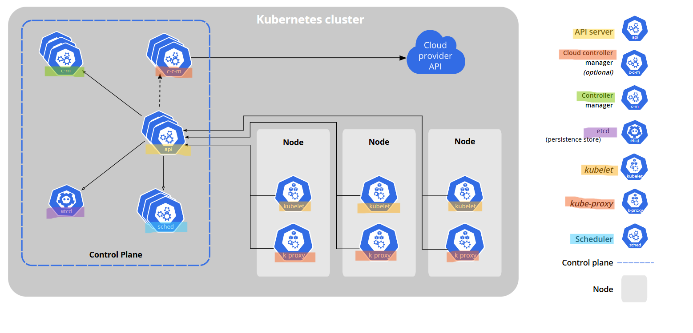
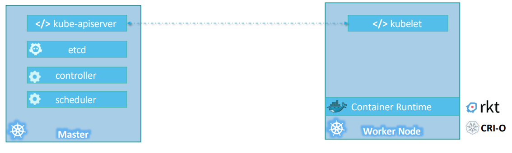

# Kubernetes Cluster - Architecture

[Back](../../index.md)

- [Kubernetes Cluster - Architecture](#kubernetes-cluster---architecture)
  - [Architecture](#architecture)
    - [Node and Cluster](#node-and-cluster)
  - [Control Plane](#control-plane)
  - [Worker Node](#worker-node)

---

## Architecture

---

### Node and Cluster

- `Node` / `Minions`
  - A machine, physical or virtual, that provides the resources required to run workloads.

- `Worker Node`
  - A type of `node` that runs the **application workloads** (pods) and provides compute, storage, and networking.

- `Master Node` / `Control Plane Node`
  - A type of `node` that runs the **control plane components** responsible for scheduling, orchestrating, and monitoring workloads across worker nodes.

- `Cluster`
  - A **collection** of `nodes`, master and worker, that operate together as a single system for running and managing applications.

---

## Control Plane

- `API Server`
  - the front-end for kubernetes
  - a `control plane` component that serves as the **central point of access** for interacting with the cluster
  - a `RESTful API` over HTTP, enabling users, other cluster components, and external systems to manage, query, and **manipulate the state** of Kubernetes objects like Pods, Services, and Deployments.

- `etcd`
  - a **distributed, key-value store** that Kubernetes uses as its **primary datastore**.
    - used to **stores the configuration information** which can be used by **each of the nodes** in the cluster.
    - responsible for **implementing locks** within the cluster to ensure there are no conflicts between the Masters.
  - distributed among multiple nodes.
  - accessible **only** by `Kubernetes API server` as it may have some sensitive information.

- `Scheduler`
  - a `control plane` component used to **allocate** `Pods` to `Nodes` in the cluster and **distribute the workload**.
  - To **track utilization** of working load on cluster nodes and then **place the workload** on which resources are available and accept the workload.
  - **Default** scheduler: `kube-scheduler`.

- `Controller Manager`
  - a `control plane` component used to run controller processes.
  - `controller`
    - a control loop that constantly checks the differences between the desired state and the current state.
    - a **daemon** which runs in **nonterminating loop** and is responsible for **collecting and sending information** to `API server`.
    - a feature to make k8s declarative, ensure the current state to match desired state
  - Common controllers
    - `Deployment controller`: Maintains desired number of application Pods
    - `ReplicaSet controller`: Ensures correct number of Pod replicas
    - `Node controller`: Watches node health
    - `Job controller`: Ensures batch jobs complete
    - `ServiceAccount controller`: Creates default service accounts
    - `Namespace controller`: Handles namespace cleanup

- `cloud controller manager`
  - A `control plane` component that embeds **cloud**-specific control **logic**.
  - Optional component.
  - the bridge between Kubernetes and cloud provider.
    - **acts as a mediator** between _Kubernetes_ and the _infrastructure of the cloud provider_.
  - e.g., Service LoadBalancer -> AWS ELB

---

## Worker Node

- `Container runtime`
  - A node component that empowers Kubernetes to **run containers** effectively.
  - To **manage the execution and lifecycle** of containers within the Kubernetes environment.
  - e.g., `containerd`, `CRI-O`

- `kubelet`
  - An **agent** that runs on **each node** in the cluster.
  - To **ensure** that containers are **running** in a Pod.
    - **relay information** to and from `control plane` service.
    - **interact** with `etcd` store to **read configuration** details and wright values.
    - **receive commands** and work.
    - **manage** network rules, port forwarding, etc.

- `kube proxy`
  - a **network proxy** that runs on each **node** in cluster, implementing the Kubernetes Service.
  - **forward the request** to correct containers
  - **perform** primitive **load balancing**
  - **maintains network rules** on nodes.
  - optional
