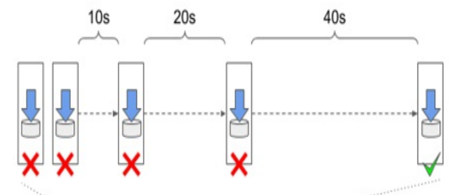

# Kubernetes: Container - Back-off Mechanism & Restart Policy

[Back](../../index.md)

- [Kubernetes: Container - Back-off Mechanism \& Restart Policy](#kubernetes-container---back-off-mechanism--restart-policy)
  - [Exponential Back-off Mechanism](#exponential-back-off-mechanism)
    - [Container Auto-restart](#container-auto-restart)
    - [Lab: Container Auto-restart](#lab-container-auto-restart)
  - [Restart Policy](#restart-policy)

---

## Exponential Back-off Mechanism

- `Exponential back-off`

  - **delay that doubles** between attempts to restart a terminated container
  - for the first time a container terminates,
    - restarted immediately.
  - The 2nd time terminates,
    - restart by an exponential delay
  - exponential delay:
    - 10s, 20, 40s, 80, ..., 160s, 5m, 5m, 5m, ...



- The delay is **reset** to **zero** when the container has run successfully for **10 minutes**.

  - If the container must be restarted later, it is restarted **immediately**.

- Command to show exponential back-off

  - `kubectl get pod demo -o json | jq .status.containerStatuses`

- Error `CrashLoopBackOff` can be misleading
  - it just show the exponetial back-off occur due to container termination
  - it does not tell the reason, whether it is because of exit 0 or error.

---

### Container Auto-restart

- When a pod is **scheduled** to a `node`, the `Kubelet` on that node **starts** its containers and from then on **keeps them running** for **as long as the pod object exists**.

  - If the **main process** in the `container` **terminates** for any reason, the `Kubelet` **restarts** the `container`.
  - If an **error** in your application causes it to **crash**, Kubernetes automatically **restarts** it, so even without doing anything special in the application itself.

- If `init containers` are defined in the pod and one of the pod’s **regular containers** is **restarted**, the `init containers` are **not executed again**.

---

### Lab: Container Auto-restart

- Busybox sleep for 30s; Kubelet auto-restart the busybox.
  - pod status: running -> not ready -> running -> ...
  - repeating "starting"; actually discard, pull image, and start a new container.
- nginx keep running, get started only one time

```yaml
# demo_auto_restart.yaml
apiVersion: v1
kind: Pod
metadata:
  name: demo-auto-restart
spec:
  containers:
    - image: nginx
      name: nginx
    - image: busybox
      name: busybox
      command: ["sleep", "30"]
```

- Run

```sh
# main terminal
kubectl apply -f demo_auto_restart.yaml
# pod/demo-auto-restart created

# monitoer terminal A:
kubectl get pod -w
# NAME                READY   STATUS                RESTARTS        AGE
# demo-auto-restart   0/2     Pending               0               0s
# demo-auto-restart   0/2     Pending               0               0s
# demo-auto-restart   0/2     ContainerCreating     0               0s
# demo-auto-restart   2/2     Running               0               5s
# demo-auto-restart   1/2     NotReady              0               36s
# demo-auto-restart   2/2     Running               1 (3s ago)      38s
# demo-auto-restart   1/2     NotReady              1 (33s ago)     68s
# demo-auto-restart   1/2     CrashLoopBackOff      1 (14s ago)     81s
# demo-auto-restart   2/2     Running               2 (16s ago)     83s
# demo-auto-restart   1/2     NotReady              2 (46s ago)     113s
# demo-auto-restart   1/2     CrashLoopBackOff      2 (15s ago)     2m7s
# demo-auto-restart   2/2     Running               3 (31s ago)     2m23s

# monitoer terminal B:
kubectl get events -w
# 0s          Normal   Scheduled   pod/demo-auto-restart   Successfully assigned default/demo-auto-restart to docker-desktop
# 0s          Normal   Pulling     pod/demo-auto-restart   Pulling image "nginx"
# 0s          Normal   Pulled      pod/demo-auto-restart   Successfully pulled image "nginx" in 1.427s (1.427s including waiting). Image size: 59795293 bytes.
# 0s          Normal   Created     pod/demo-auto-restart   Created container: nginx
# 0s          Normal   Started     pod/demo-auto-restart   Started container nginx
# 0s          Normal   Pulling     pod/demo-auto-restart   Pulling image "busybox"
# 0s          Normal   Pulled      pod/demo-auto-restart   Successfully pulled image "busybox" in 1.082s (1.082s including waiting). Image size: 2224358 bytes.
# 0s          Normal   Created     pod/demo-auto-restart   Created container: busybox
# 0s          Normal   Started     pod/demo-auto-restart   Started container busybox
# 0s          Normal   Pulling     pod/demo-auto-restart   Pulling image "busybox"
# 0s          Normal   Pulled      pod/demo-auto-restart   Successfully pulled image "busybox" in 952ms (952ms including waiting). Image size: 2224358 bytes.
# 0s          Normal   Created     pod/demo-auto-restart   Created container: busybox
# 0s          Normal   Started     pod/demo-auto-restart   Started container busybox
# 0s          Warning   BackOff     pod/demo-auto-restart   Back-off restarting failed container busybox in pod demo-auto-restart_default(bdcabef0-35cb-41d0-a92b-a844b95fe089)
# 0s          Normal    Pulling     pod/demo-auto-restart   Pulling image "busybox"
# 0s          Normal    Pulled      pod/demo-auto-restart   Successfully pulled image "busybox" in 891ms (891ms including waiting). Image size: 2224358 bytes.
# 0s          Normal    Created     pod/demo-auto-restart   Created container: busybox
# 0s          Normal    Started     pod/demo-auto-restart   Started container busybox
# 0s          Warning   BackOff     pod/demo-auto-restart   Back-off restarting failed container busybox in pod demo-auto-restart_default(bdcabef0-35cb-41d0-a92b-a844b95fe089)
# 0s          Warning   BackOff     pod/demo-auto-restart   Back-off restarting failed container busybox in pod demo-auto-restart_default(bdcabef0-35cb-41d0-a92b-a844b95fe089)
# 0s          Normal    Pulling     pod/demo-auto-restart   Pulling image "busybox"
# 0s          Normal    Pulled      pod/demo-auto-restart   Successfully pulled image "busybox" in 1.191s (1.192s including waiting). Image size: 2224358 bytes.
# 0s          Normal    Created     pod/demo-auto-restart   Created container: busybox
# 0s          Normal    Started     pod/demo-auto-restart   Started container busybox
# 0s          Normal    Killing     pod/demo-auto-restart   Stopping container nginx
# 0s          Normal    Killing     pod/demo-auto-restart   Stopping container busybox
```

---

## Restart Policy

- By default

  - Kubernetes restarts the container regardless of whether the process in the container
    - terminates successfully without any errors: `exits 0`
    - terminates with error: `exits` non-zero

- Modify by `restartPolicy` field

- 3 restart policies:

  - `Always`
    - default,
    - Container is **restarted regardless** of the exit code the process in the container terminates with.
  - `OnFailure`
    - The container is **restarted only if** the process **terminates with a non-zero exit code**, which by convention indicates **failure**.
  - `Never`
    - The container is **never restarted** - not even when it fails.

- `restart policy` is configured **at the `pod` level** and applies to all its containers.
  - It **can’t** be configured for each `container` **individually**.

---
