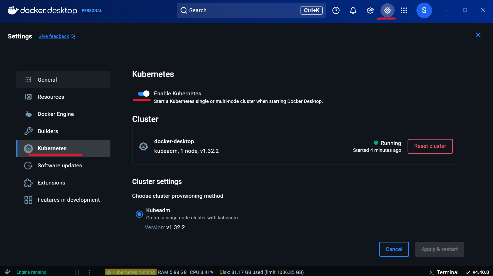

# Kubernetes: Enable within `Docker Desktop`

[Back](../../index.md)

- [Kubernetes: Enable within `Docker Desktop`](#kubernetes-enable-within-docker-desktop)
  - [Enable Kubernetes in `Docker Desktop`](#enable-kubernetes-in-docker-desktop)

---

## Enable Kubernetes in `Docker Desktop`



- Confirm

```sh
kubectl version
# Client Version: v1.32.2
# Kustomize Version: v5.5.0
# Server Version: v1.32.2

kubectl get node
# NAME             STATUS   ROLES           AGE   VERSION
# docker-desktop   Ready    control-plane   38s   v1.32.2
```
