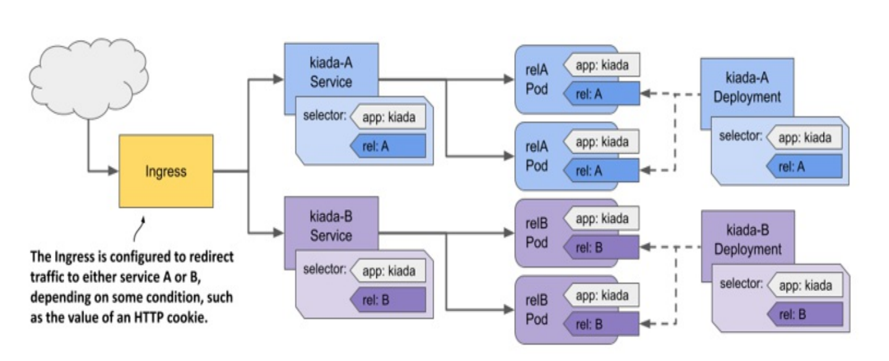
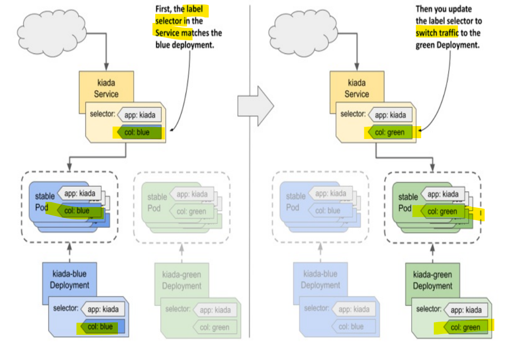

# Kubernetes: Deployment - Common Strategies

[Back](../index.md)

- [Kubernetes: Deployment - Common Strategies](#kubernetes-deployment---common-strategies)
  - [Common deployment strategies](#common-deployment-strategies)
    - [Canary deployment strategy](#canary-deployment-strategy)
    - [A/B strategy](#ab-strategy)
    - [The Blue/Green strategy](#the-bluegreen-strategy)
    - [Traffic shadowing](#traffic-shadowing)

---

## Common deployment strategies

| strategy                                          | Desc                                                                                     |
| ------------------------------------------------- | ---------------------------------------------------------------------------------------- |
| `Recreate` / `big bang`                           | Stop all old Pods, then create all new Pods                                              |
| `RollingUpdate` /`Ramped`/ `Incremental`          | Gradually replace the old Pods with the new ones                                         |
| `Canary` / `pilot` / `Grayscale Release`          | Create a very small number of new Pods for testing, then replace all the remaining Pods. |
| `A/B testing`                                     | Create a small number of new Pods **to collect data**                                    |
| `Blue/Green`                                      | Deploy new Pods in **parallel** with old pods. Swith when ready and delete the old one   |
| `Shadowing` / `Traffic mirroring` / `Dark launch` | Deploy new Pods in **parallel** with old pods. return respone from only the old pods     |

---

### Canary deployment strategy

- implementation in k8s
  - option 1:
    - high `minReadySeconds` + `kubectl rollout pause`
      - pause after the first Pod(`canary pod`) and test the new pod
    - once confirm `canary pod` acts as expected, `kubectl rollout resume` to resume
  - option 2:
    - create a separate `canary Deployment` for the `canary Pods` with **low replicas**
    - configure `Service` forward traffic to `canary Deployment`
    - Once `Canary deployment` meets requirments, roll out the **old deployment** and delete `Canary deployment`

---

### A/B strategy

- implement in k8s
  - Create 2 `deployments` and 2 `services`
  - create an `ingress` and path rule to **route traffic** forward to 2 `services` based on the condition

---

### The Blue/Green strategy

- `Blue Deployment`: the stable production deployment
- `Green Deployment`: the deployment along with production deployment

- Implementation in k8s
  - Configure `Service` with label selector targeting the `Blue Deployment`
  - Create `Green Deployment` for testing
  - Once `Green Deployment` meets the requirements, update the `Service`'s label selector to target the `Green Deployment`

---

### Traffic shadowing

- implementation in k8s
  - Create `shdowing deployment` with `shadowing service`
  - Configure the `ingress`
    - forward the incoming traffic to the `shdowing deployment`
    - discard the response from the `shdowing deployment`

