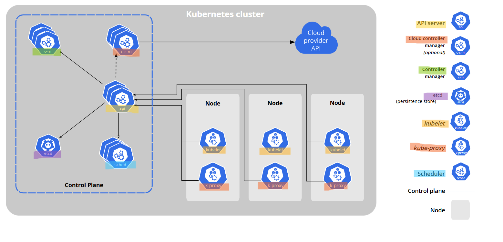

# Kubernetes - Architecture

[Back](../../index.md)

- [Kubernetes - Architecture](#kubernetes---architecture)
  - [Architecture](#architecture)
  - [Master Machine Components](#master-machine-components)
  - [Node Components](#node-components)

---

## Architecture

---

## Master Machine Components

- `Control Plane Components`

  - Manage the overall state of the cluster

- `etcd`

  - a **distributed, key-value store** that Kubernetes uses as its **primary datastore**.
  - used to **stores the configuration information** which can be used by **each of the nodes** in the cluster.
  - distributed among multiple nodes.
  - accessible **only** by `Kubernetes API server` as it may have some sensitive information.

- `API Server`

  - a `control plane` component that serves as the **central point of access** for interacting with the cluster
  - a `RESTful API` over HTTP, enabling users, other cluster components, and external systems to manage, query, and **manipulate the state** of Kubernetes objects like Pods, Services, and Deployments.

- `Controller Manager`

  - a `control plane` component used to run controller processes.
  - a **daemon** which runs in **nonterminating loop** and is responsible for **collecting and sending information** to `API server`.
  - To **get the shared state** of cluster and then **change the current status** of the server to the **desired state**.
  - key controllers
    - `replication controller`,
    - `endpoint controller`,
    - `namespace controller`,
    - and `service account controller`.

- `Scheduler`

  - a `control plane` component used to **allocate** `Pods` to `Nodes` in the cluster and **distribute the workload**.
  - To **track utilization** of working load on cluster nodes and then **place the workload** on which resources are available and accept the workload.
  - **Default** scheduler: `kube-scheduler`.

- `cloud controller manager`
  - A `control plane` component that embeds **cloud**-specific control **logic**.
  - Optional component.

---

## Node Components

- `Container runtime`

  - A node component that empowers Kubernetes to **run containers** effectively.
  - To **manage the execution and lifecycle** of containers within the Kubernetes environment.

- `kubelet`

  - An **agent** that runs on **each node** in the cluster.
  - To **ensure** that containers are **running** in a Pod.
    - **relay information** to and from `control plane` service.
    - **interact** with `etcd` store to **read configuration** details and wright values.
    - **receive commands** and work.
    - **manage** network rules, port forwarding, etc.

- `kube proxy`
  - a **network proxy** that runs on each **node** in cluster, implementing the Kubernetes Service.
  - **forward the request** to correct containers
  - **perform** primitive **load balancing**
  - **maintains network rules** on nodes.
  - optional
