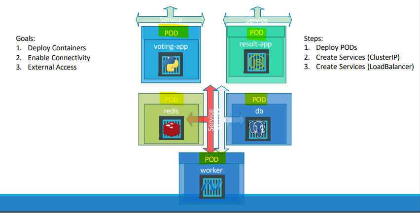
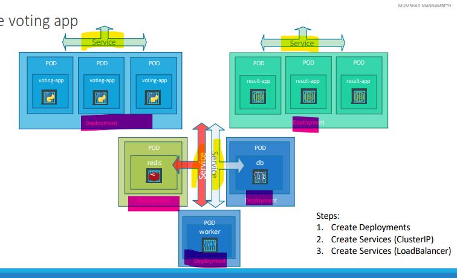

# Kubernetes - Fundamental

[Back](../../index.md)

- [Kubernetes - Fundamental](#kubernetes---fundamental)
  - [`kubernetes`](#kubernetes)
  - [architecture of a Kubernetes cluster](#architecture-of-a-kubernetes-cluster)
  - [Virtualization vs. Containerization vs. Orchestration](#virtualization-vs-containerization-vs-orchestration)
  - [Kubernetes](#kubernetes-1)
  - [Microservices](#microservices)
    - [Example - Voting system](#example---voting-system)
  - [Declarative vs Imperative vs Functional vs Procedural](#declarative-vs-imperative-vs-functional-vs-procedural)
    - [K8s = Declarative](#k8s--declarative)
    - [K8s: Imperative vs Declarative](#k8s-imperative-vs-declarative)
  - [kubectl apply](#kubectl-apply)
  - [Contiainerization](#contiainerization)
  - [K8s resources](#k8s-resources)

---

## `kubernetes`

- `kubernetes`

  - Greek for helmsman
  - Kubernetes schedules the components of a distributed application onto individual computers in the underlying computer cluster and acts as an interface between the application and the cluster.

- Feature
  - provides an abstraction layer over the underlying hardware to both users and applications.
  - Standardizing application deployment
    - A single manifest that describes the application can be used for local deployment and for deploying on any cloud provider.
  - Deploying applications declaratively
  - takes over the daily management of the application

---

## architecture of a Kubernetes cluster

- `Kubernetes cluster` consists of nodes divided into two groups:
  - `master nodes`
    - the node hosts the `Control Plane` components, which are the brains of the system, since they control the entire cluster.
  - `worker nodes`
    - the nodes that form the `Workload Plane`, which is where your workloads (or applications) run.

---

- Everything in Kubernetes is represented by an `object`.
  - These objects are usually defined in one or more **manifest files** in either `YAML` or `JSON` format.

---

the process of deploying the application:

1. submit the **application manifest** to the Kubernetes `API`. The `API Server` **writes** the objects defined in the **manifest** to `etcd`.
2. A `controller` notices the newly created objects and **creates several new objects** - one for each application instance.
3. The `Scheduler` **assigns a node** to each instance.
4. The `Kubelet` notices that an instance is assigned to the Kubelet’s node. It runs the application instance via the `Container Runtime`.
5. The `Kube Proxy` notices that the application instances are ready to accept connections from clients and **configures a load balancer** for them.
6. The `Kubelets` and the `Controllers` **monitor** the system and keep the applications running.

---

## Virtualization vs. Containerization vs. Orchestration

- `Virtualization`

  - A **hardware-abstraction** solution that **partitions a physical machine** into multiple independent environment, called `virtual machines`, each with its own `operating system`.
  - purpose:
    - Run **multiple OS instances** on one physical machine
  - tool:
    - VMware, Hyper-V, KVM, Proxmox VE

- `Containerization`

  - An **application-abstraction** solution that packages an application and its **dependencies** into a consistent, called `container`, isolated environment running on a shared operating system.
  - purpose:
    - Ensure **consistent application environments** across systems
  - tool:
    - Docker, Podman, LXC

- `Orchestration`
  - An automation solution that coordinates the deployment, scaling, and operation of **applications** across **distributed containerized environments**.
  - purpose:
    - Automate and optimize containerized application lifecycle at scale
  - tool:
    - Kubernetes, Docker Swarm, Amazon ECS

---

| Aspect                   | **Virtualization**             | **Containerization**                      | **Orchestration**         |
| ------------------------ | ------------------------------ | ----------------------------------------- | ------------------------- |
| **Level of Abstraction** | Hardware / OS                  | Application / runtime                     | Infrastructure management |
| **Isolation Target**     | Operating systems              | Applications                              | Application operations    |
| **Overhead**             | High (each VM runs its own OS) | Low (containers share the host OS kernel) | Variable                  |

---

## Kubernetes

- `Kubernetes`

  - An open-source orchestration solution that **automates** the deployment, scaling, networking, and lifecycle management of applications **across clusters of containerized environments**.
  - maintained by the `Cloud Native Computing Foundation (CNCF)`

---

## Microservices

- `Microservices`

  - a **software architecture** that structures a large application as a **collection** of small, **independent**, and **loosely coupled services**, each responsible for a specific business function.
  - vs `monolithic architectures`
    - services **communicate** with each other via lightweight **APIs**
    - services can be **developed**, **deployed**, and **scaled** independently, offering benefits like enhanced agility, resilience, and easier maintenance

---

### Example - Voting system

- Basic services

| Service          | description              |
| ---------------- | ------------------------ |
| Voting service   | Receive votes from users |
| Cache service    | Cache vote data          |
| backend service  | handle vote transaction  |
| database service | persist vote data        |
| result service   | return vote data         |



- Application Architecture with deployment



---

## Declarative vs Imperative vs Functional vs Procedural

- `Declarative Programming`

  - A paradigm to **describe what the program should accomplish**, **not how to do it**.
  - The **control flow** is abstracted away by the language or framework.
  - **Focuses on results** rather than steps.
  - Examples: SQL, HTML, regular expressions, Prolog.

- `Imperative Programming`

  - A paradigm to explicitly tell the computer **how to perform tasks, step by step**.
  - **define the control flow** with statements that change program state.
  - Focuses on **commands** and **state changes**.
  - Examples: C, Python (when used with loops and assignments), Assembly.

- `Functional Programming`

  - A style of `declarative programming` where computation is treated as the **evaluation of mathematical functions** without changing state or mutable data.
  - Emphasizes pure functions, immutability, and avoiding side effects.
  - Examples: Haskell, Lisp, Scala, Python (functional features: map, lambda, etc.).

- `Procedural Programming`

  - A subset of `imperative programming` that organizes code into **procedures** (functions or routines).
  - Each **procedure** performs a specific **task** and can be reused.
  - Focuses on **procedures** (reusable blocks of code).
  - Examples: C, Pascal, Fortran, Python (when structured into functions).

- `Object-Oriented Programming (OOP)`

  - A paradigm that organizes software design around `objects`
    - bundles of data (**attributes**) and behavior (**methods**).
  - emphasizes **encapsulation**, **inheritance**, and **polymorphism**.
  - Focuses on **objects that model real-world entities**.
  - Examples: Java, C++, C#, Python (when using classes/objects).

- Categorization

  - `Imperative` (broad category: how to do it)
    - `Procedural`
    - `Object-Oriented`
  - `Declarative` (broad category: what to achieve)
    - `Functional`

---

### K8s = Declarative

- Kubernetes is a Declarative style
  - describe the desired state
  - `Kubernetes controllers` work continuously to **reconcile the actual state** with the desired state.

---

### K8s: Imperative vs Declarative

- Imperative Approach in k8s

  - tell Kubernetes what action **to do right now** using direct commands.
  - e.g.,
    - `kubectl run`
    - `kubectl create`
    - `kubectl expose`
    - `kubectl edit`
    - ...

- Categories:
  - create objects:
    - run, create, expose
  - update object:
    - edit, scale, set image

---

- Declarative Approach in k8s

  - declare the **desired state** in a manifest file (YAML/JSON), and Kubernetes continuously works to **match** the **actual state** to that **desired state**.
  - e.g., kubectl apply -f deployment.yaml

- Create object:
  - the object must not exist; Otherwise error
  - yaml + create
- Update object:
  - the object must exist; Otherwise error
  - edit + yaml
  - yaml + replace
- Create/update object:
  - yaml + apply

---

## kubectl apply

- kubectl apply

  - the local yaml file will also convert to a json file in the `last applied configuration`
  - the local yaml file will convert to a yaml file in the `live object configuration` in the control plane

- e.g., the image of a pod get changed in the local yaml

  - then API server compares and update `last applied configuration` and update it
  - API server compares with `live object configuration` and update the image

- `live object configuration`
  - reside in the k8s memory
  - the actual object status
- `last applied configuration`
  - reside in the `live object configuration` as annotation
  - helps compare with the local yaml file to identify the changes
  - only apply to `kubectl apply` command
    - not to `kubectl create/replace` (not store last applied config)

---

## Contiainerization

- `Container Runtime Interface (CRI)`

  - a Kub**ernetes API standar**d (gRPC-based) that lets the `kubelet` (Kubernetes node agent) communicate with various `container runtimes` (like `containerd`, `CRI-O`) to manage container lifecycles (pulling images, starting/stopping containers) without needing specific code for each.
  - Common `OCI-compliant container runtime`:
    - `rkt`
    - `runC`: The foundational, **low-level** tool that directly interacts with the OS to create and run containers
    - `containerd`: **high-level** runtime that manages the full container lifecycle, `runc`
    - `CRI-O`: a lightweight `container runtime` specifically built for `Kubernetes`
    - `podman`: A daemonless alternative to Docker
    - `Kata Containers`: Provides strong isolation by running containers **inside lightweight virtual machines**, enhancing security.

---

## K8s resources

```sh
# list all resources
kubectl api-resources
# NAME                                SHORTNAMES   APIVERSION                          NAMESPACED   KIND
# bindings                                         v1                                  true         Binding
# componentstatuses                   cs           v1                                  false        ComponentStatus
# configmaps                          cm           v1                                  true         ConfigMap
# endpoints                           ep           v1                                  true         Endpoints
# events                              ev           v1                                  true         Event
# limitranges                         limits       v1                                  true         LimitRange
# namespaces                          ns           v1                                  false        Namespace
# nodes                               no           v1                                  false        Node
# persistentvolumeclaims              pvc          v1                                  true         PersistentVolumeClaim
# persistentvolumes                   pv           v1                                  false        PersistentVolume
# pods                                po           v1                                  true         Pod
# podtemplates                                     v1                                  true         PodTemplate
# replicationcontrollers              rc           v1                                  true         ReplicationController
# resourcequotas                      quota        v1                                  true         ResourceQuota
# secrets                                          v1                                  true         Secret
# serviceaccounts                     sa           v1                                  true         ServiceAccount
# services                            svc          v1                                  true         Service
# mutatingwebhookconfigurations                    admissionregistration.k8s.io/v1     false        MutatingWebhookConfiguration
# validatingadmissionpolicies                      admissionregistration.k8s.io/v1     false        ValidatingAdmissionPolicy
# validatingadmissionpolicybindings                admissionregistration.k8s.io/v1     false        ValidatingAdmissionPolicyBinding
# validatingwebhookconfigurations                  admissionregistration.k8s.io/v1     false        ValidatingWebhookConfiguration
# customresourcedefinitions           crd,crds     apiextensions.k8s.io/v1             false        CustomResourceDefinition
# apiservices                                      apiregistration.k8s.io/v1           false        APIService
# controllerrevisions                              apps/v1                             true         ControllerRevision
# daemonsets                          ds           apps/v1                             true         DaemonSet
# deployments                         deploy       apps/v1                             true         Deployment
# replicasets                         rs           apps/v1                             true         ReplicaSet
# statefulsets                        sts          apps/v1                             true         StatefulSet
# selfsubjectreviews                               authentication.k8s.io/v1            false        SelfSubjectReview
# tokenreviews                                     authentication.k8s.io/v1            false        TokenReview
# localsubjectaccessreviews                        authorization.k8s.io/v1             true         LocalSubjectAccessReview
# selfsubjectaccessreviews                         authorization.k8s.io/v1             false        SelfSubjectAccessReview
# selfsubjectrulesreviews                          authorization.k8s.io/v1             false        SelfSubjectRulesReview
# subjectaccessreviews                             authorization.k8s.io/v1             false        SubjectAccessReview
# horizontalpodautoscalers            hpa          autoscaling/v2                      true         HorizontalPodAutoscaler
# cronjobs                            cj           batch/v1                            true         CronJob
# jobs                                             batch/v1                            true         Job
# certificatesigningrequests          csr          certificates.k8s.io/v1              false        CertificateSigningRequest
# ingressclassparameterses                         configuration.konghq.com/v1alpha1   true         IngressClassParameters
# kongclusterplugins                  kcp          configuration.konghq.com/v1         false        KongClusterPlugin
# kongconsumergroups                  kcg          configuration.konghq.com/v1beta1    true         KongConsumerGroup
# kongconsumers                       kc           configuration.konghq.com/v1         true         KongConsumer
# kongcustomentities                  kce          configuration.konghq.com/v1alpha1   true         KongCustomEntity
# kongingresses                       ki           configuration.konghq.com/v1         true         KongIngress
# konglicenses                        kl           configuration.konghq.com/v1alpha1   false        KongLicense
# kongplugins                         kp           configuration.konghq.com/v1         true         KongPlugin
# kongupstreampolicies                kup          configuration.konghq.com/v1beta1    true         KongUpstreamPolicy
# kongvaults                          kv           configuration.konghq.com/v1alpha1   false        KongVault
# tcpingresses                                     configuration.konghq.com/v1beta1    true         TCPIngress
# udpingresses                                     configuration.konghq.com/v1beta1    true         UDPIngress
# leases                                           coordination.k8s.io/v1              true         Lease
# endpointslices                                   discovery.k8s.io/v1                 true         EndpointSlice
# events                              ev           events.k8s.io/v1                    true         Event
# flowschemas                                      flowcontrol.apiserver.k8s.io/v1     false        FlowSchema
# prioritylevelconfigurations                      flowcontrol.apiserver.k8s.io/v1     false        PriorityLevelConfiguration
# ingressclasses                                   networking.k8s.io/v1                false        IngressClass
# ingresses                           ing          networking.k8s.io/v1                true         Ingress
# ipaddresses                         ip           networking.k8s.io/v1                false        IPAddress
# networkpolicies                     netpol       networking.k8s.io/v1                true         NetworkPolicy
# servicecidrs                                     networking.k8s.io/v1                false        ServiceCIDR
# runtimeclasses                                   node.k8s.io/v1                      false        RuntimeClass
# poddisruptionbudgets                pdb          policy/v1                           true         PodDisruptionBudget
# clusterrolebindings                              rbac.authorization.k8s.io/v1        false        ClusterRoleBinding
# clusterroles                                     rbac.authorization.k8s.io/v1        false        ClusterRole
# rolebindings                                     rbac.authorization.k8s.io/v1        true         RoleBinding
# roles                                            rbac.authorization.k8s.io/v1        true         Role
# deviceclasses                                    resource.k8s.io/v1                  false        DeviceClass
# resourceclaims                                   resource.k8s.io/v1                  true         ResourceClaim
# resourceclaimtemplates                           resource.k8s.io/v1                  true         ResourceClaimTemplate
# resourceslices                                   resource.k8s.io/v1                  false        ResourceSlice
# priorityclasses                     pc           scheduling.k8s.io/v1                false        PriorityClass
# csidrivers                                       storage.k8s.io/v1                   false        CSIDriver
# csinodes                                         storage.k8s.io/v1                   false        CSINode
# csistoragecapacities                             storage.k8s.io/v1                   true         CSIStorageCapacity
# storageclasses                      sc           storage.k8s.io/v1                   false        StorageClass
# volumeattachments                                storage.k8s.io/v1                   false        VolumeAttachment
# volumeattributesclasses             vac          storage.k8s.io/v1                   false        VolumeAttributesClass
```