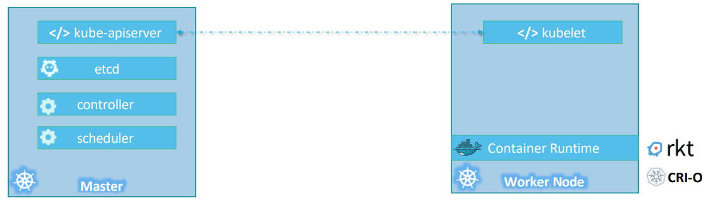

# Kubernetes

[Back](../../index.md)

---

## Commands

## Container vs Orchestration

### Container

- `Container`

  - completely isolated environments

- Benefits

  - Compatibility/Dependency Issue
  - Long setup time
  - Different Dev/Test/Prod environment

- Address by Containerizing Applications

  - Run each service with its own dependenciesin separate containers

- `Container Orchestration`

---

## Architecture

- `node (Minions)`

  - a machine, physical or virtual, on which kubernetesis installed.
  - a worker machine where containers will be launched by kubernetes.

- `cluster`

  - a set of nodes grouped together.
  - This way even if one node fails you have your application still accessible from the other nodes. -
  - Moreover having multiple nodes helps in sharing load as well.

- `master`
  - a node with Kubernetes installed in it, and is configured as a Master.
  - The master **watches over** the nodes in the cluster and is responsible for the **actual orchestration** of containers on the worker nodes.

---

## components

- Components

  - **API Server**
    - the front-end for kubernetes
    - The users, management devices, Command line interfaces all talk to the API server to interact with the kubernetes cluster.
  - **An ETCD service**
    - a distributed reliable **key-value store** used by kubernetesto store all data used to manage the cluster.
    - stores all that information on all the nodes in the cluster in a distributed manner
    - responsible for implementing locks within the cluster to ensure there are no conflicts between the Masters.
  - **A kubelet service**
    - agent that runs on each node in the cluster.
    - responsible for making sure that the containers are running on the nodes as expected.
  - **A Container Runtime**
    - the underlying software that is used to run containers.
    - example: docker
  - **Controllers**

    - responsible for noticing and responding when nodes, containers or endpoints **goes down**.
    - The controllers makes decisions to **bring up new containers** in such cases.

  - **Schedulers**
    - s responsible for **distributing** work or containers across multiple nodes.
    - looks for newly created containers and assigns them to Nodes.

---

## `kubectl`

- `kubectl`:
  - the command line utilities
  - used to deploy and manage applications on a kubernetes cluster, to get cluster information, get the status of nodes in the cluster and many other things.

| CMD                    | DESC                                   |
| ---------------------- | -------------------------------------- |
| `kubectl run app_name` | deploy an application on the cluster   |
| `kubectl cluster-info` | view information about the cluster     |
| `kubectl get nodes`    | list all the nodes part of the cluster |

---

- Rel:
  - https://kubernetes.io/docs/concepts/overview/components/
- https://scriptwang.github.io/blog/#/blog/2021-06-14_K8S%E5%8E%9F%E7%90%86%E6%9E%B6%E6%9E%84%E4%B8%8E%E5%AE%9E%E6%88%98%EF%BC%88%E5%9F%BA%E7%A1%80%E7%AF%87%EF%BC%89

## Kubernetes

- [Fundamental](./fundamental/fundamental/fundamental.md)

  - [Architecture](./fundamental/architecture/architecture.md)

- Setup Environment
  - [RHEL9: `minikube` installation](./deploy/minikube_rhel9/minikube_rhel9.md)
  - [Windows: `Docker Desktop` enable `Kubernetes`](./deploy/kube_docker_desktop_win/kube_docker_desktop_win.md)
