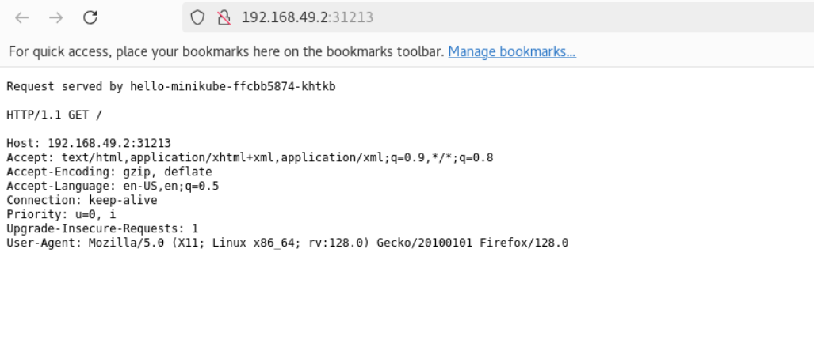

# Kubernetes: `minikube` Installation on RHEL 9

[Back](../../index.md)

- [Kubernetes: `minikube` Installation on RHEL 9](#kubernetes-minikube-installation-on-rhel-9)
  - [Overview](#overview)
  - [Create a RHEL 9 VM](#create-a-rhel-9-vm)
  - [Install `docker`](#install-docker)
  - [`minikube` Installation](#minikube-installation)
  - [Deploy applications](#deploy-applications)

---

## Overview

- `minikube`

  - a tool that enables developers to run a local **single-node Kubernetes cluster** on their personal computer.
  - This allows for **testing** and **development** of Kubernetes applications without needing a full-scale, cloud-based cluster. It supports various operating systems and is designed to be lightweight and portable.

- Goal:

  - Setup single-node Kubernetes cluster on RHEL 9 to practice CKA.

- Ref:
  - https://minikube.sigs.k8s.io/docs/start/?arch=%2Fwindows%2Fx86-64%2Fstable%2F.exe+download

---

## Create a RHEL 9 VM

- Skip

```sh
# configure network
nmcli c modify ens160 ipv4.addresses 192.168.128.43/24
nmcli c modify ens160 ipv4.gateway 192.168.128.2
nmcli c modify ens160 ipv4.dns 192.168.128.2
nmcli c up ens160

ip a
ip r
```

---

## Install `docker`

```sh
sudo dnf upgrade -y
sudo reboot

# install docker
sudo dnf remove -y docker \
    docker-client \
    docker-client-latest \
    docker-common \
    docker-latest \
    docker-latest-logrotate \
    docker-logrotate \
    docker-engine \
    podman \
    runc

sudo dnf -y install dnf-plugins-core
sudo dnf config-manager --add-repo https://download.docker.com/linux/rhel/docker-ce.repo

sudo dnf install -y docker-ce docker-ce-cli containerd.io docker-buildx-plugin docker-compose-plugin

# Start Docker Engine.
sudo systemctl enable --now docker
# Verify
sudo docker run hello-world
```

---

## `minikube` Installation

```sh
# Install kubectl

# Add the Kubernetes yum repository.
# This overwrites any existing configuration in /etc/yum.repos.d/kubernetes.repo
cat <<EOF | sudo tee /etc/yum.repos.d/kubernetes.repo
[kubernetes]
name=Kubernetes
baseurl=https://pkgs.k8s.io/core:/stable:/v1.32/rpm/
enabled=1
gpgcheck=1
gpgkey=https://pkgs.k8s.io/core:/stable:/v1.32/rpm/repodata/repomd.xml.key
EOF

# Install kubectl
sudo dnf install -y kubectl

# Install minikube
# To install the latest minikube stable release on x86-64 Linux using RPM package
curl -LO https://storage.googleapis.com/minikube/releases/latest/minikube-latest.x86_64.rpm
sudo rpm -Uvh minikube-latest.x86_64.rpm

# use unprivilege user, due to minikube cannot start as root.
su - rheladmin
sudo usermod -aG docker $USER && newgrp docker
minikube start --driver=docker
# 😄  minikube v1.35.0 on Redhat 8.10
# ✨  Using the docker driver based on user configuration
# 📌  Using Docker driver with root privileges
# 👍  Starting "minikube" primary control-plane node in "minikube" cluster
# 🚜  Pulling base image v0.0.46 ...
# 💾  Downloading Kubernetes v1.32.0 preload ...
#     > preloaded-images-k8s-v18-v1...:  333.57 MiB / 333.57 MiB  100.00% 7.72 Mi
#     > gcr.io/k8s-minikube/kicbase...:  500.31 MiB / 500.31 MiB  100.00% 6.85 Mi
# 🔥  Creating docker container (CPUs=2, Memory=2200MB) ...
# 🐳  Preparing Kubernetes v1.32.0 on Docker 27.4.1 ...
#     ▪ Generating certificates and keys ...
#     ▪ Booting up control plane ...
#     ▪ Configuring RBAC rules ...
# 🔗  Configuring bridge CNI (Container Networking Interface) ...
# 🔎  Verifying Kubernetes components...
#     ▪ Using image gcr.io/k8s-minikube/storage-provisioner:v5
# 🌟  Enabled addons: storage-provisioner, default-storageclass
# 🏄  Done! kubectl is now configured to use "minikube" cluster and "default" namespace by default

# confirm
kubectl version
# Client Version: v1.32.3
# Kustomize Version: v5.5.0
# Server Version: v1.32.0

minikube version
# minikube version: v1.35.0

kubectl get nodes
# NAME       STATUS   ROLES           AGE    VERSION
# minikube   Ready    control-plane   3m8s   v1.32.0

minikube dashboard
```

## Deploy applications

```sh
# Create a sample deployment and expose it on port 8080
kubectl create deployment hello-minikube --image=kicbase/echo-server:1.0
kubectl expose deployment hello-minikube --type=NodePort --port=8080

# confirm
kubectl get services hello-minikube
# NAME             TYPE       CLUSTER-IP      EXTERNAL-IP   PORT(S)          AGE
# hello-minikube   NodePort   10.104.173.58   <none>        8080:31213/TCP   9s

# use minikube launch a web browser
minikube service hello-minikube
# |-----------|----------------|-------------|---------------------------|
# | NAMESPACE |      NAME      | TARGET PORT |            URL            |
# |-----------|----------------|-------------|---------------------------|
# | default   | hello-minikube |        8080 | http://192.168.49.2:31213 |
# |-----------|----------------|-------------|---------------------------|
# 🎉  Opening service default/hello-minikube in default browser...

```



- Cleanup

```sh
kubectl delete service hello-minikube
# service "hello-minikube" deleted
kubectl delete deployment hello-minikube
# deployment.apps "hello-minikube" deleted

# confirm
kubectl get services hello-minikube
# Error from server (NotFound): services "hello-minikube" not found

kubectl get deployment hello-minikube
# Error from server (NotFound): deployments.apps "hello-minikube" not found

kubectl get pods
# No resources found in default namespace.
```