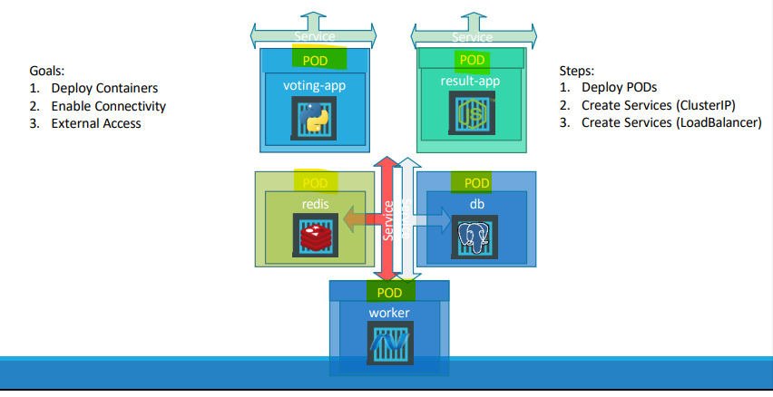

# Kubernetes - Microservices

[Back](../index.md)

- [Kubernetes - Microservices](#kubernetes---microservices)
  - [Microservices](#microservices)

---

## Microservices

- Application Architecture with **Pods**
  - 5 Pods:
  - 4 Services:
    - Service Redis:
      - ClusterIP
      - provid access to redis db for
        - voting app pod
        - worker pod
    - Service Postgre:
      - ClusterIP
      - provid access to postgre db for
        - result app pod
        - worker pod
    - external services for voting app
    - external services for result app

- Application Architecture with deployment

