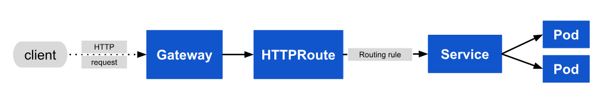

# Kubernetes Networking: `Gateway API` & `GatewayClass`

[Back](../../index.md)

- [Kubernetes Networking: `Gateway API` \& `GatewayClass`](#kubernetes-networking-gateway-api--gatewayclass)
  - [Gateway](#gateway)
    - [Four API Kinds](#four-api-kinds)
    - [Service vs Ingress vs Gateway API](#service-vs-ingress-vs-gateway-api)
    - [Declarative Manifests](#declarative-manifests)
    - [Imperative Commands](#imperative-commands)
  - [Gateway Class](#gateway-class)
    - [Imperative Commands](#imperative-commands-1)
  - [HTTPRoute](#httproute)
    - [Request flow](#request-flow)
    - [Declarative Manifest](#declarative-manifest)
    - [Imperative Commands](#imperative-commands-2)
  - [GRPCRoute](#grpcroute)
    - [Declarative Manifests](#declarative-manifests-1)
  - [Lab: Install Gateway Controller `envoy`](#lab-install-gateway-controller-envoy)
  - [Lab: Create Gateway API with GatewayClass](#lab-create-gateway-api-with-gatewayclass)
    - [Create GatewayClass](#create-gatewayclass)
    - [Create Gateway](#create-gateway)
  - [Lab: Simple Gateway](#lab-simple-gateway)

---

## Gateway

- **Ingress limitation**
  - Ingress cannot support for
    - multi-tenancy:
      - ingress paths must be managed by one tenancy
    - Namespace isolation
    - No RBAC
    - No resource isolations
    - ...

- `Gateway API`
  - represents the **instantiation** of a `logical load balancer`
  - used to provide **dynamic infrastructure provisioning** and **advanced traffic routing**.
  - provide **layer 4 and 7 routing**

- `GatewayClass`:
  - defines the load balancer **template** when users create a `Gateway`.
  - Defines a set of `gateways` with **common configuration**.
  - infractructure providers
  - e.g., nginx, loadbalancer
- Gateway:
  - Cluster Operators
- HttpRouter / TCPRoute / GRPCRoute
  - application Developers

---

### Four API Kinds

- `GatewayClass`:
  - Defines a **set of gateways** with **common configuration** and managed by a `controller` that implements the class.
- `Gateway`:
  - Defines an **instance of traffic handling infrastructure**
  - e.g., cloud load balancer.
- `HTTPRoute`:
  - Defines **HTTP-specific rules** for **mapping traffic** from a `Gateway listener` to a representation of backend network endpoints.
  - These endpoints are often represented as a `Service`.
- `GRPCRoute`:
  - Defines **gRPC-specific rules** for **mapping traffic** from a `Gateway listener` to a representation of backend network endpoints.
  - These endpoints are often represented as a `Service`.


---

### Service vs Ingress vs Gateway API

| Feature           | Service                                           | Ingress                                            | Gateway API                                           |
| ----------------- | ------------------------------------------------- | -------------------------------------------------- | ----------------------------------------------------- |
| Primary Goal      | Basic connectivity & load balancing between pods. | Routing external HTTP(S) traffic into the cluster. | Advanced, role-oriented traffic management (L4 & L7). |
| OSI Layer         | Layer 4 (TCP/UDP).                                | Layer 7 (HTTP/HTTPS only).                         | Layers 4 and 7 (HTTP, TCP, gRPC, etc.).               |
| Config Style      | Single resource (Service).                        | Single resource + custom Annotations.              | Modular (GatewayClass, Gateway, Routes).              |
| Persona           | App Developer.                                    | App Developer (often oversteps).                   | Infra Admin + Cluster Op + App Developer.             |
| Traffic Splitting | No (all pods get equal share).                    | Limited (requires vendor annotations).             | Built-in (e.g., 90% to v1, 10% to v2).                |

---

### Declarative Manifests

```yaml
apiVersion: gateway.networking.k8s.io/v1
kind: Gateway
metadata:
  name: example-gateway
  namespace: example-namespace
spec:
  gatewayClassName: example-class
  listeners:
    - name: http
      protocol: HTTP
      port: 80
      hostname: "www.example.com"
      allowedRoutes:
        namespaces:
          from: Same
```

---

- `listeners.allowedRoutes.namespaces.from`:
  - indicates where Routes will be selected for this Gateway
  - values:
    - `All`: Routes in **all namespaces** may be used by this Gateway.
    - `Selector`: Routes in **namespaces selected** by the selector may be used by this Gateway.
      - `from:selector`
    - `Same`: Only Routes in the **same namespace** may be used by this Gateway.

---

### Imperative Commands

| Command                                            | Description                                                                |
| -------------------------------------------------- | -------------------------------------------------------------------------- |
| `kubectl get gtw`                                  | Shows the Address and Programmed status.                                   |
| `kubectl get gtw -A`                               | Lists all gateways across all namespaces.                                  |
| `kubectl describe gtw NAME`                        | Critical for debugging. Shows why a gateway is stuck in "Pending."         |
| `kubectl edit gtw NAME`                            | Imperatively change ports (e.g., changing 8080 to 9090) on the fly.        |
| `kubectl wait --for=condition=programmed gtw/NAME` | Useful in scripts to wait until the proxy is ready before sending traffic. |

---

## Gateway Class

- `Gateway Class`
  - the object contains the name of the `controller` that implements the class.
  - a **cluster-scoped resource** that defines which **controller** (e.g., Envoy, Istio, Nginx) should **manage the Gateway**.
- A `Gateway` must reference a `GatewayClass`

- Example:

```yaml
apiVersion: gateway.networking.k8s.io/v1
kind: GatewayClass
metadata:
  name: demo-class
spec:
  # specify the controller name
  controllerName: example.com/gateway-controller
```

---

### Imperative Commands

| Command                    | Description                                                           |
| -------------------------- | --------------------------------------------------------------------- |
| `kubectl get gc`           | Lists all available classes and their controller names.               |
| `kubectl describe gc NAME` | Checks the Status to see if the controller has "Accepted" the class.  |
| `kubectl delete gc NAME`   | Removes the class definition (will break Gateways relying on it).     |
| `kubectl get gc -o yaml`   | Quickest way to see the controllerName string needed for new classes. |

---

## HTTPRoute

- `HTTPRoute`
  - specifies **routing behavior** of HTTP requests from a `Gateway listener` to **backend network endpoints**.
- represents **configuration** that is applied to the **underlying Gateway implementation**.
  - For example, defining a new `HTTPRoute` may result in configuring additional traffic routes in a cloud load balancer or in-cluster proxy server.
- For a `Service` backend, an implementation may represent the backend network `endpoint` as a `Service IP` or the backing `EndpointSlices` of the Service.

---

### Request flow



the request flow for a Gateway implemented as a reverse proxy is:

1. The `client` starts to prepare an **HTTP request** for the URL http://www.example.com
2. The `client`'s `DNS resolver` queries for the destination name and learns a mapping to one or more IP addresses associated with the Gateway.
3. The `client` **sends a request** to the `Gateway IP address`; the `reverse proxy` **receives** the HTTP request and uses the `Host: header` to match a configuration that was derived from the `Gateway` and attached `HTTPRoute`.
4. Optionally, the `reverse proxy` can perform request header and/or path **matching** based on match **rules** of the `HTTPRoute`.
5. Optionally, the `reverse proxy` can **modify** the request; for example, to add or remove headers, based on filter rules of the HTTPRoute.
6. Lastly, the `reverse proxy` **forwards** the request to one or more `backends`

---

### Declarative Manifest

```yaml
apiVersion: gateway.networking.k8s.io/v1
kind: HTTPRoute
metadata:
  name: example-httproute
spec:
  parentRefs:
    - name: example-gateway
  hostnames:
    - "www.example.com"
  rules:
    - matches:
        - path:
            type: PathPrefix
            value: /login
      backendRefs:
        - name: example-svc
          port: 8080
```

---

### Imperative Commands

| Command                      | Description |
| ---------------------------- | ----------- |
| `kubectl get httproute`      |             |
| `kubectl describe httproute` |             |

---

## GRPCRoute

- `GRPCRoute`
  - specifies **routing behavior of gRPC requests** from a `Gateway listener` to backend network endpoints.
  - represents **configuration** that is applied to the **underlying Gateway implementation**.
    - For example, defining a new `GRPCRoute` may result in configuring additional traffic routes in a cloud load balancer or in-cluster proxy server.
- For a `Service` backend, an implementation may represent the backend network **endpoint as a Service IP** or the backing `EndpointSlices` of the Service.

---

### Declarative Manifests

- Example:
  - traffic from `Gateway` example-gateway with the host set to svc.example.com **directed to** the `service` example-svc on port 50051

```yaml
apiVersion: gateway.networking.k8s.io/v1
kind: GRPCRoute
metadata:
  name: example-grpcroute
spec:
  parentRefs:
    - name: example-gateway
  hostnames:
    - "svc.example.com"
  rules:
    - backendRefs:
        - name: example-svc
          port: 50051
```

- Example:
  - traffic for svc.example.com and apply its routing rules to **forward** the traffic to the correct backend.
  - only requests for the `com.example.User.Login` **method** to svc.example.com will be forwarded.

```yaml
apiVersion: gateway.networking.k8s.io/v1
kind: GRPCRoute
metadata:
  name: example-grpcroute
spec:
  parentRefs:
    - name: example-gateway
  hostnames:
    - "svc.example.com"
  rules:
    - matches:
        - method:
            service: com.example
            method: Login
      backendRefs:
        - name: foo-svc
          port: 50051
```

---

## Lab: Install Gateway Controller `envoy`

```sh
# Install the Gateway API CRDs
kubectl apply -f https://github.com/kubernetes-sigs/gateway-api/releases/download/v1.0.0/standard-install.yaml
# customresourcedefinition.apiextensions.k8s.io/gatewayclasses.gateway.networking.k8s.io created
# customresourcedefinition.apiextensions.k8s.io/gateways.gateway.networking.k8s.io created
# customresourcedefinition.apiextensions.k8s.io/httproutes.gateway.networking.k8s.io created
# customresourcedefinition.apiextensions.k8s.io/referencegrants.gateway.networking.k8s.io created

# Install Envoy Gateway (the controller)
kubectl apply -f https://github.com/envoyproxy/gateway/releases/download/v1.0.0/install.yaml
# customresourcedefinition.apiextensions.k8s.io/backendtlspolicies.gateway.networking.k8s.io created
# customresourcedefinition.apiextensions.k8s.io/gatewayclasses.gateway.networking.k8s.io configured
# customresourcedefinition.apiextensions.k8s.io/gateways.gateway.networking.k8s.io configured
# customresourcedefinition.apiextensions.k8s.io/grpcroutes.gateway.networking.k8s.io created
# customresourcedefinition.apiextensions.k8s.io/httproutes.gateway.networking.k8s.io configured
# customresourcedefinition.apiextensions.k8s.io/referencegrants.gateway.networking.k8s.io configured
# customresourcedefinition.apiextensions.k8s.io/tcproutes.gateway.networking.k8s.io created
# customresourcedefinition.apiextensions.k8s.io/tlsroutes.gateway.networking.k8s.io created
# customresourcedefinition.apiextensions.k8s.io/udproutes.gateway.networking.k8s.io created
# customresourcedefinition.apiextensions.k8s.io/backendtrafficpolicies.gateway.envoyproxy.io created
# customresourcedefinition.apiextensions.k8s.io/clienttrafficpolicies.gateway.envoyproxy.io created
# customresourcedefinition.apiextensions.k8s.io/envoypatchpolicies.gateway.envoyproxy.io created
# customresourcedefinition.apiextensions.k8s.io/envoyproxies.gateway.envoyproxy.io created
# customresourcedefinition.apiextensions.k8s.io/securitypolicies.gateway.envoyproxy.io created
# namespace/envoy-gateway-system created
# serviceaccount/envoy-gateway created
# configmap/envoy-gateway-config created
# clusterrole.rbac.authorization.k8s.io/eg-gateway-helm-envoy-gateway-role created
# clusterrolebinding.rbac.authorization.k8s.io/eg-gateway-helm-envoy-gateway-rolebinding created
# role.rbac.authorization.k8s.io/eg-gateway-helm-infra-manager created
# role.rbac.authorization.k8s.io/eg-gateway-helm-leader-election-role created
# rolebinding.rbac.authorization.k8s.io/eg-gateway-helm-infra-manager created
# rolebinding.rbac.authorization.k8s.io/eg-gateway-helm-leader-election-rolebinding created
# service/envoy-gateway-metrics-service created
# service/envoy-gateway created
# deployment.apps/envoy-gateway created
# serviceaccount/eg-gateway-helm-certgen created
# role.rbac.authorization.k8s.io/eg-gateway-helm-certgen created
# rolebinding.rbac.authorization.k8s.io/eg-gateway-helm-certgen created
# job.batch/eg-gateway-helm-certgen created

# confirm
kubectl get pods -n envoy-gateway-system
# NAME                             READY   STATUS    RESTARTS   AGE
# envoy-gateway-655f47c4c5-nxntr   1/1     Running   0          22m
```

---

## Lab: Create Gateway API with GatewayClass

### Create GatewayClass

```yaml
# demo-gw-gc.yaml
apiVersion: gateway.networking.k8s.io/v1
kind: GatewayClass
metadata:
  name: envoy
spec:
  controllerName: gateway.envoyproxy.io/gatewayclass-controller
```

```sh
kubectl apply -f demo-gw-gc.yaml
# gatewayclass.gateway.networking.k8s.io/envoy created

# confirm
kubectl get gc
# NAME    CONTROLLER                                      ACCEPTED   AGE
# envoy   gateway.envoyproxy.io/gatewayclass-controller   True       14s

kubectl describe gc envoy
# Name:         envoy
# Namespace:
# Labels:       <none>
# Annotations:  <none>
# API Version:  gateway.networking.k8s.io/v1
# Kind:         GatewayClass
# Metadata:
#   Creation Timestamp:  2026-01-05T23:02:20Z
#   Finalizers:
#     gateway-exists-finalizer.gateway.networking.k8s.io
#   Generation:        1
#   Resource Version:  3157914
#   UID:               2b42919b-9d4d-4825-97db-04f6aa78a357
# Spec:
#   Controller Name:  gateway.envoyproxy.io/gatewayclass-controller
# Status:
#   Conditions:
#     Last Transition Time:  2026-01-05T23:02:21Z
#     Message:               Valid GatewayClass
#     Observed Generation:   1
#     Reason:                Accepted
#     Status:                True
#     Type:                  Accepted
# Events:                    <none>
```

---

### Create Gateway

- Deployment with svc

```yaml
# demo-gwapi-deploy-svc.yaml
apiVersion: apps/v1
kind: Deployment
metadata:
  name: nginx-app
spec:
  replicas: 2
  selector:
    matchLabels:
      app: nginx
  template:
    metadata:
      labels:
        app: nginx
    spec:
      containers:
        - name: nginx
          image: nginx:latest
          ports:
            - containerPort: 80
---
apiVersion: v1
kind: Service
metadata:
  name: nginx-service
spec:
  selector:
    app: nginx
  ports:
    - port: 8080
      targetPort: 80
```

```sh
kubectl apply -f demo-gwapi-deploy-svc.yaml
# deployment.apps/nginx-app created
# service/nginx-service created

# confirm
kubectl get deploy
# NAME        READY   UP-TO-DATE   AVAILABLE   AGE
# nginx-app   2/2     2            2           2m34s

kubectl get svc
# NAME            TYPE        CLUSTER-IP     EXTERNAL-IP   PORT(S)   AGE
# nginx-service   ClusterIP   10.111.49.12   <none>        8080/TCP   13m
```

- Create the Gateway

```yaml
# demo-gwapi.yaml
apiVersion: gateway.networking.k8s.io/v1
kind: Gateway
metadata:
  name: nginx-gateway
  namespace: default
spec:
  gatewayClassName: envoy # specify controller
  listeners:
    - name: http
      protocol: HTTP
      port: 8080
      allowedRoutes:
        namespaces:
          from: Same
```

```sh
kubectl apply -f demo-gwapi.yaml
# gateway.gateway.networking.k8s.io/nginx-gateway created

# confirm
kubectl get gtw
# NAME            CLASS   ADDRESS   PROGRAMMED   AGE
# nginx-gateway   envoy             Unknown      74s

kubectl describe gtw nginx-gateway
# Name:         nginx-gateway
# Namespace:    default
# Labels:       <none>
# Annotations:  <none>
# API Version:  gateway.networking.k8s.io/v1
# Kind:         Gateway
# Metadata:
#   Creation Timestamp:  2026-01-05T22:42:25Z
#   Generation:          2
#   Resource Version:    3156987
#   UID:                 87a88038-6610-4eef-94a8-651b7c869890
# Spec:
#   Gateway Class Name:  envoy
#   Listeners:
#     Allowed Routes:
#       Namespaces:
#         From:  Same
#     Name:      http
#     Port:      8080
#     Protocol:  HTTP
# Status:
#   Conditions:
#     Last Transition Time:  1970-01-01T00:00:00Z
#     Message:               Waiting for controller
#     Reason:                Pending
#     Status:                Unknown
#     Type:                  Accepted
#     Last Transition Time:  1970-01-01T00:00:00Z
#     Message:               Waiting for controller
#     Reason:                Pending
#     Status:                Unknown
#     Type:                  Programmed
# Events:                    <none>

```

- Create the HTTPRoute

```yaml
# demo-gw-httproute.yaml
apiVersion: gateway.networking.k8s.io/v1
kind: HTTPRoute
metadata:
  name: nginx-route
  namespace: default
spec:
  parentRefs:
    - name: nginx-gateway # specify gtw
  rules:
    - matches:
        - path:
            type: PathPrefix
            value: /
      backendRefs:
        - name: nginx-service # specify svc
          port: 8080
```

```sh
kubectl apply -f demo-gw-httproute.yaml
# httproute.gateway.networking.k8s.io/nginx-route created

kubectl get httproutes
# NAME          HOSTNAMES   AGE
# nginx-route               55s

kubectl describe httproutes
# Name:         nginx-route
# Namespace:    default
# Labels:       <none>
# Annotations:  <none>
# API Version:  gateway.networking.k8s.io/v1
# Kind:         HTTPRoute
# Metadata:
#   Creation Timestamp:  2026-01-05T22:46:27Z
#   Generation:          3
#   Resource Version:    3157317
#   UID:                 bde701f2-54f7-4017-922d-9a47ed217ffd
# Spec:
#   Parent Refs:
#     Group:  gateway.networking.k8s.io
#     Kind:   Gateway
#     Name:   nginx-gateway
#   Rules:
#     Backend Refs:
#       Group:
#       Kind:    Service
#       Name:    nginx-service
#       Port:    8080
#       Weight:  1
#     Matches:
#       Path:
#         Type:   PathPrefix
#         Value:  /
# Events:         <none>
```

- verify

```sh
# wait for gw programmed = true
kubectl get gtw
# NAME            CLASS   ADDRESS     PROGRAMMED   AGE
# nginx-gateway   envoy   127.0.0.1   True         20m

# confirm
curl http://localhost:8080
# <!DOCTYPE html>
# <html>
# <head>
# <title>Welcome to nginx!</title>
# <style>
# html { color-scheme: light dark; }
# body { width: 35em; margin: 0 auto;
# font-family: Tahoma, Verdana, Arial, sans-serif; }
# </style>
# </head>
# <body>
# <h1>Welcome to nginx!</h1>
# <p>If you see this page, the nginx web server is successfully installed and
# working. Further configuration is required.</p>

# <p>For online documentation and support please refer to
# <a href="http://nginx.org/">nginx.org</a>.<br/>
# Commercial support is available at
# <a href="http://nginx.com/">nginx.com</a>.</p>

# <p><em>Thank you for using nginx.</em></p>
# </body>
# </html>
```


---

## Lab: Simple Gateway

```sh

apiVersion: gateway.networking.k8s.io/v1
kind: Gateway
metadata:
  name: prod-web
spec:
  gatewayClassName: example
  listeners:
  - protocol: HTTP
    port: 80
    name: prod-web-gw
    allowedRoutes:
      namespaces:
        from: Same
```