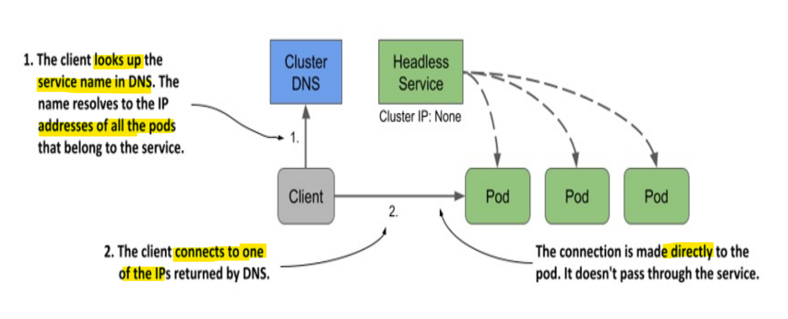

# Kubernetes Networking: Service - Headless Service

[Back](../../index.md)

- [Kubernetes Networking: Service - Headless Service](#kubernetes-networking-service---headless-service)
  - [Headless Service](#headless-service)
    - [Lab: Creating a Headless Service](#lab-creating-a-headless-service)
  - [Headless Services with no Label Selector](#headless-services-with-no-label-selector)
    - [Lab: Creating a CNAME alias for an existing service](#lab-creating-a-cname-alias-for-an-existing-service)

---

## Headless Service

- `headless service`
  - a type of **Service** to return the **individual IP addresses** of all the `pods` that match its selector, allowing clients to **connect** to the `pods` **directly**.
  - the `cluster DNS` **returns**
    - a `single A record` pointing to the `service’s cluster IP`
    - **multiple** `A records`
      - one for each `pod` that’s part of the service.
  - **Clients** can therefore **query the DNS** to get the IPs of all the pods in the service.
    - With this information, the client can then **connect directly** to the `pods`.



- vs **regular service**
  - `headless service`: connect **directly** to the `Pod IP`
  - `regular services`: connect to the `cluster IP` of the service and connection is **forwarded** to one of the `pods`.

---

### Lab: Creating a Headless Service

```yaml
# demo-headless-svc.yaml
apiVersion: v1
kind: Service
metadata:
  name: demo-headless-svc
spec:
  clusterIP: None # headless
  selector:
    app: nginx
  ports:
    - name: http
      protocol: TCP
      port: 8080
      targetPort: 80
```

```sh
kubectl apply -f demo-headless-svc.yaml
# service/demo-headless-svc created

kubectl get svc -o wide
# NAME                TYPE        CLUSTER-IP     EXTERNAL-IP   PORT(S)          AGE     SELECTOR
# demo-headless-svc   ClusterIP   None           <none>        8080/TCP         45s     app=nginx
# demo-nodeport-svc   NodePort    10.106.98.10   <none>        8080:30506/TCP   7h55m   app=nginx

kubectl describe svc demo-headless-svc
# Name:                     demo-headless-svc
# Namespace:                default
# Labels:                   <none>
# Annotations:              <none>
# Selector:                 app=nginx
# Type:                     ClusterIP
# IP Family Policy:         SingleStack
# IP Families:              IPv4
# IP:                       None
# IPs:                      None
# Port:                     http  8080/TCP
# TargetPort:               80/TCP
# Endpoints:                10.244.2.18:80,10.244.1.13:80
# Session Affinity:         None
# Internal Traffic Policy:  Cluster
# Events:                   <none>
```

- Confirm headless service return a list IP address of pods

```sh
# list ip of pod
kubectl get pod -o wide
# NAME                     READY   STATUS    RESTARTS      AGE     IP            NODE     NOMINATED NODE   READINESS GATES
# nginx-546c7dd8cf-rts7p   2/2     Running   0             7h59m   10.244.2.18   node02   <none>           <none>
# nginx-546c7dd8cf-t5kws   2/2     Running   2 (45m ago)   7h59m   10.244.1.13   node01   <none>           <none>

# run dns test tool
kubectl run -it --rm dns-test --image=giantswarm/tiny-tools

# lookup service
nslookup demo-headless-svc
# Server:         10.96.0.10
# Address:        10.96.0.10#53

# Name:   demo-headless-svc.default.svc.cluster.local
# Address: 10.244.2.18
# Name:   demo-headless-svc.default.svc.cluster.local
# Address: 10.244.1.13

# confirm: service returns content in pod
curl http://demo-headless-svc
# <h1>node01:nginx-546c7dd8cf-t5kws - Mon Dec 29 04:47:53 UTC 2025</h1>

# #######################
# vs regular svc
# #######################
# headless: connect directly to the pod IP
curl --verbose http://demo-headless-svc
# *   Trying 10.244.2.18:80...)
# * Connected to demo-headless-svc (10.244.2.18) port 80 (#0
# > GET / HTTP/1.1
# > Host: demo-headless-svc
# > User-Agent: curl/7.69.1
# > Accept: */*
# >
# * Mark bundle as not supporting multiuse
# < HTTP/1.1 200 OK
# < Server: nginx/1.29.4
# < Date: Mon, 29 Dec 2025 04:48:09 GMT
# < Content-Type: text/html
# < Content-Length: 70
# < Last-Modified: Mon, 29 Dec 2025 04:48:08 GMT
# < Connection: keep-alive
# < ETag: "69520808-46"
# < Accept-Ranges: bytes
# <
# <h1>node02:nginx-546c7dd8cf-rts7p - Mon Dec 29 04:48:08 UTC 2025</h1>
# * Connection #0 to host demo-headless-svc left intact

# nodeport: connect to nodeport(demo-nodeport-svc (10.106.98.10))
curl --verbose http://demo-nodeport-svc:8080
# *   Trying 10.106.98.10:8080...
# * Connected to demo-nodeport-svc (10.106.98.10) port 8080 (#0)
# > GET / HTTP/1.1
# > Host: demo-nodeport-svc:8080
# > User-Agent: curl/7.69.1
# > Accept: */*
# >
# * Mark bundle as not supporting multiuse
# < HTTP/1.1 200 OK
# < Server: nginx/1.29.4
# < Date: Mon, 29 Dec 2025 04:49:59 GMT
# < Content-Type: text/html
# < Content-Length: 70
# < Last-Modified: Mon, 29 Dec 2025 04:49:59 GMT
# < Connection: keep-alive
# < ETag: "69520877-46"
# < Accept-Ranges: bytes
# <
# <h1>node02:nginx-546c7dd8cf-rts7p - Mon Dec 29 04:49:59 UTC 2025</h1>
# * Connection #0 to host demo-nodeport-svc left intact
```

---

## Headless Services with no Label Selector

- When omitting the `label selector` and set the `clusterIP` to `None`,
  - DNS will return an `A/AAAA record` **for each endpoint**,

---

### Lab: Creating a CNAME alias for an existing service

- Creating an ExternalName service

```yaml
# demo-dns-cname-extralname.yaml
apiVersion: v1
kind: Service
metadata:
  name: demo-dns-cname-extralname
spec:
  type: ExternalName
  externalName: worldtimeapi.org
```

- Connecting to an ExternalName service from a pod

```sh
kubectl apply -f demo-dns-cname-extralname.yaml
# service/demo-dns-cname-extralname created

kubectl get svc
# NAME                        TYPE           CLUSTER-IP       EXTERNAL-IP        PORT(S)          AGE
# demo-dns-cname-extralname   ExternalName   <none>           worldtimeapi.org   <none>           70s

# test connection within cluster
kubectl run -it --rm dns-teset --image=giantswarm/tiny-tools

curl http://demo-dns-cname-extralname/api/timezone/America/Toronto
# {"utc_offset":"-05:00","timezone":"America/Toronto","day_of_week":1,"day_of_year":363,"datetime":"2025-12-29T14:41:25.859594-05:00","utc_datetime":"2025-12-29T19:41:25.859594+00:00","unixtime":1767037285,"raw_offset":-18000,"week_number":1,"dst":false,"abbreviation":"EST","dst_offset":0,"dst_from":null,"dst_until":null,"client_ip":"99.243.74.50"}

# the service points to worldtimeapi.org.
nslookup demo-dns-cname-extralname
# Server:         10.96.0.10
# Address:        10.96.0.10#53

# demo-dns-cname-extralname.default.svc.cluster.local     canonical name = worldtimeapi.org.
# Name:   worldtimeapi.org
# Address: 213.188.196.246
# Name:   worldtimeapi.org
# Address: 2a09:8280:1::3:e

```

---
