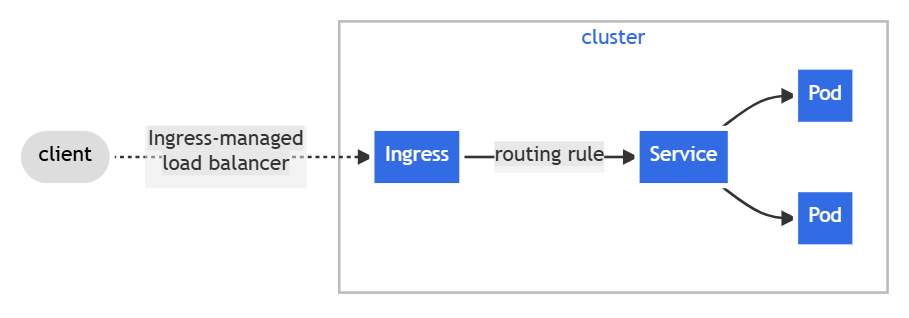
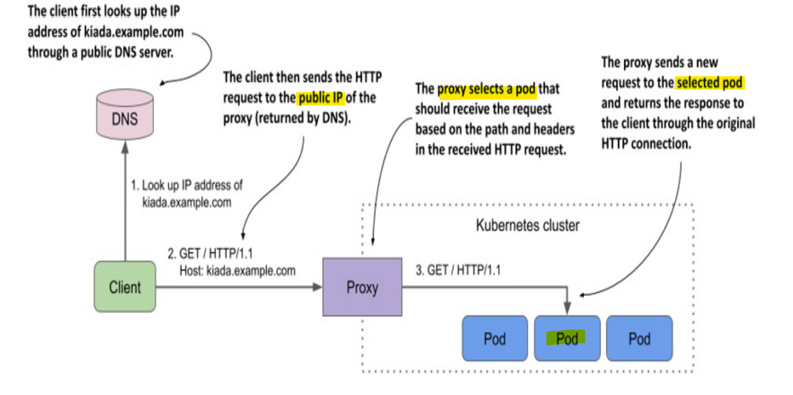
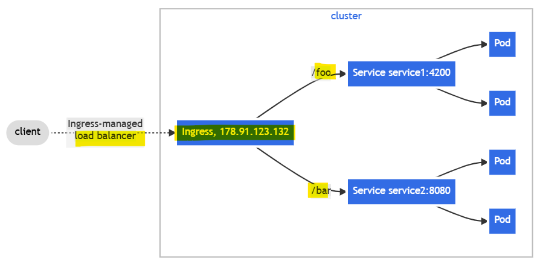
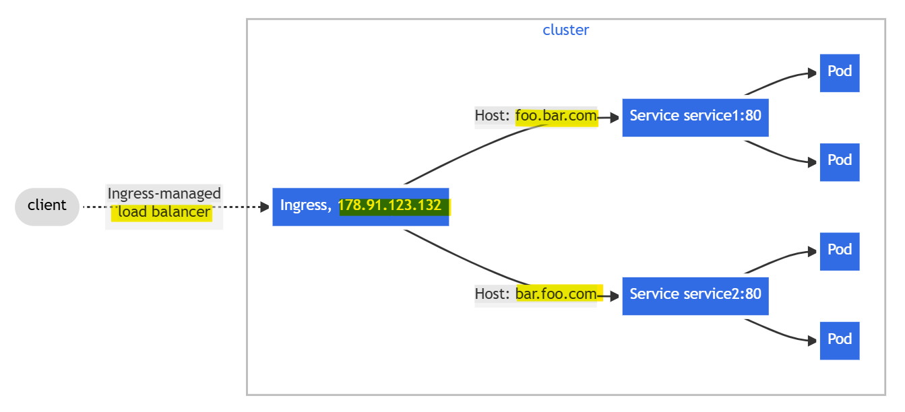

# Kubernetes Networking: Ingress

[Back](../../index.md)

- [Kubernetes Networking: Ingress](#kubernetes-networking-ingress)
  - [Ingress](#ingress)
    - [Ingress Controller](#ingress-controller)
    - [Default Backend](#default-backend)
    - [Declarative Manifest](#declarative-manifest)
      - [Resource backends](#resource-backends)
      - [Path types](#path-types)
      - [Hosts](#hosts)
    - [Imperative Commands](#imperative-commands)
  - [Ingress class](#ingress-class)
    - [Lab: Install `Nginx Ingress Controller`](#lab-install-nginx-ingress-controller)
  - [Types of Ingress](#types-of-ingress)
    - [Single Service](#single-service)
      - [Lab: Single Service Ingress](#lab-single-service-ingress)
    - [Simple fanout](#simple-fanout)
      - [Lab: Fanout Ingress](#lab-fanout-ingress)
    - [Name based virtual hosting](#name-based-virtual-hosting)
      - [Lab: Virtual Hosting Ingress](#lab-virtual-hosting-ingress)
    - [Rules without host](#rules-without-host)
  - [TLS](#tls)
    - [TLS passthrough](#tls-passthrough)
    - [Terminating TLS at the ingress](#terminating-tls-at-the-ingress)
      - [Lab: Enable Https with a single service ingress](#lab-enable-https-with-a-single-service-ingress)
  - [Customizing Ingress using annotations](#customizing-ingress-using-annotations)
    - [Lab: Cookie-based session affinity](#lab-cookie-based-session-affinity)
  - [Custom Resources as Backend](#custom-resources-as-backend)

---

## Ingress

- Limitation of service:
  - becomes problematic with large numbers of `services`, since each service needs its own public IP address.

- `Ingress`
  - an API object that **manages external access** to `services` within a Kubernetes cluster, typically using `HTTP` and `HTTPS` protocols.
  - used to expose multiple services with a single IP address

  - **exposes `HTTP` and `HTTPS` routes** from **outside** the cluster to `services` **within** the cluster.
    - Traffic routing is controlled by **rules** defined on the `Ingress` resource.

- **Only** expose services of `HTTP` and `HTTPS` to the internet



- Additional features:
  - **HTTP authentication**,
  - **cookie-based session affinity**,
  - **URL rewriting**

- An `Ingress object` **typically handles traffic** for **all** `Service objects` in a particular `Kubernetes namespace`.
  - **multiple** `Ingresses` are also an **option**.

- each `Ingress object` gets its own **IP address**
  - some **ingress implementations** use a **shared entrypoint** for all `Ingress objects`

- **Note that** the `proxy` **doesn’t** send the request to the `service IP`, but **directly to the pod**.



- `ingress` **forward the request** based on the **path** to different `services`

---

### Ingress Controller

- `Ingress Controller`
  - a cluster add-on component
  - a specialized, **Layer 7 load balancer** and **reverse proxy** that manages external traffic into cluster, routing it to the correct **internal services** based on rules.
  - link between the `Ingress object` and the actual **physical ingress** (the reverse proxy)
  - popular e.g., nginx, haproxy, trafik

- **Common Controllers**
  - Google Kubernetes Engine: `GLBC (GCE L7 Load Balancer)`
  - AWS: `AWS Load Balancer Controller`
  - Azure: `AGIC (Application Gateway Ingress Controller)`

- Nginx ingress controller: https://kubernetes.github.io/ingress-nginx/deploy/

---

### Default Backend

- If the client request **doesn’t match any rules** defined in the `Ingress object`, the response **404 Not Found** is normally returned.
- can define a `default backend` to which the ingress should forward the request if no rules are matched.
  - The default backend serves as a catch-all rule.

- `spec.defaultBackend` field

```yaml
spec:
  defaultBackend:
    service:
      name: fun404
      port:
        name: http
  rules:
    # ...
```

---

### Declarative Manifest

- Example:

```yaml
apiVersion: networking.k8s.io/v1
kind: Ingress
metadata:
  name: minimal-ingress
spec:
  ingressClassName: nginx-example
  rules:
    - http:
        paths:
          - path: /testpath
            pathType: Prefix
            backend:
              service:
                name: test
                port:
                  number: 80
```

---

- `spec.ingressClassName` field:
  - specify the `Ingress Class`
  - If omitted, a **default** `Ingress class` should be defined.

- `spec.rules[].http` field:
  - specify http rules
  - `http.paths`:
    - A list of paths, each of which has an associated `backend`
  - `http.paths[].backend`:
    - the associated `service`
    - defined with a `service.name` and a `service.port.name` or `service.port.number`.

- `spec.defaultBackend` field:
  - the backend that should handle requests when the `Ingress` has **no rules**
  - If **none** of the hosts or paths **match** the HTTP request in the `Ingress` objects, the **traffic is routed** to `default backend`

---

#### Resource backends

- `defaultBackend.resource`/`backend.resource` field:
  - an **ObjectRef** to another Kubernetes resource within the **same namespace** as the Ingress object.
  - cannot be a `service`

```yaml
# exampe of resource
spec:
  defaultBackend:
    resource:
      apiGroup: k8s.example.com
      kind: StorageBucket
      name: static-assets
spec:
  rules:
    - http:
        paths:
          - backend:
              resource:
                apiGroup: k8s.example.com
                kind: StorageBucket
                name: icon-assets
```

---

#### Path types

- `http.paths.pathType`:
  - required
  - specify the type of path
  - supported values:
    - `ImplementationSpecific`:
      - matching is up to the IngressClass.
    - `Exact`:
      - **Matches** the URL path **exactly** and with **case sensitivity**.
    - `Prefix`:
      - Matches based on a URL path prefix split by `/` with **case sensitive**

- Multiple matches
  - the precedence will be given first to the **longest matching path**.
  - If two paths are still **equally matched**, precedence will be given to paths with an `exact` path type over `prefix` path type.

| Path               | Matched Request path(s)                  |
| ------------------ | ---------------------------------------- |
| `/` Exact          | all paths                                |
| `/foo` Exact       | `/foo`                                   |
| `/foo` Prefix      | `/foo`, `/foo/`                          |
| `/foo/` Prefix     | `/foo`, `/foo/`                          |
| `/aaa/bbb` Prefix  | `/aaa/bbb` , `/aaa/bbb/`, `/aaa/bbb/ccc` |
| `/aaa/bbb/` Prefix | `/aaa/bbb`                               |

---

#### Hosts

- `http.host`:
  - optional
  - specify the the host to which current rule is applied.
  - used to matche **HTTP host header** with the `host` field.
  - if ommited, the rule applies to **all inbound HTTP traffic** through the IP address specified.

- Hostname wildcards match:
  - require the **HTTP host header** is equal to the **suffix** of the wildcard rule.

- Example

| Host        | Host header       | Match                                             |
| ----------- | ----------------- | ------------------------------------------------- |
| `*.foo.com` | `bar.foo.com`     | Matches based on shared suffix                    |
| `*.foo.com` | `baz.bar.foo.com` | No match, wildcard only covers a single DNS label |
| `*.foo.com` | `foo.com`         | No match, wildcard only covers a single DNS label |

- Example: multiple hosts rules

```yaml
apiVersion: networking.k8s.io/v1
kind: Ingress
metadata:
  name: ingress-wildcard-host
spec:
  rules:
    - host: "foo.bar.com"
      http:
        paths:
          - pathType: Prefix
            path: "/bar"
            backend:
              service:
                name: service1
                port:
                  number: 80
    - host: "*.foo.com"
      http:
        paths:
          - pathType: Prefix
            path: "/foo"
            backend:
              service:
                name: service2
                port:
                  number: 80
```

---

### Imperative Commands

| CMD                                                             | DESC                                                    |
| --------------------------------------------------------------- | ------------------------------------------------------- |
| `kubectl explain ingress`                                       | Show ingress API structure                              |
| `kubectl get ingress`                                           | List all ingress resources in current namespace         |
| `kubectl get ingress -A`                                        | List ingress in all namespaces                          |
| `kubectl describe ingress <name>`                               | Show rules, backend services, TLS, annotations          |
| `kubectl create ingress <name> --rule=host/path=svc:port`       | Create ingress imperatively                             |
| `kubectl edit ingress <name>`                                   | Edit ingress live                                       |
| `kubectl delete ingress <name>`                                 | Delete an ingress                                       |
| `kubectl logs -n ingress-nginx deploy/ingress-nginx-controller` | View ingress controller logs                            |
| `kubectl get svc -n ingress-nginx`                              | View ingress controller service (LoadBalancer/NodePort) |

---

## Ingress class

- `Ingresses` can be implemented by **different** `controllers`, often with different configuration. Each Ingress should specify a class, a reference to an IngressClass resource that contains additional configuration including the name of the controller that should implement the class.

- A cluster can use multiple ingress class
- An ingress object specify the ingress class in the `ingressClassName` field
- default IngressClass
  - `ingressclass.kubernetes.io/is-default-class:true`

```sh
kubectl get ingressclasses
# NAME    CONTROLLER             PARAMETERS   AGE
# nginx   k8s.io/ingress-nginx   <none>       5h7m

kubectl get ingressclasses nginx -o yaml
# apiVersion: networking.k8s.io/v1
# kind: IngressClass
# metadata:
#   annotations:
#     kubectl.kubernetes.io/last-applied-configuration: |
#       {"apiVersion":"networking.k8s.io/v1","kind":"IngressClass","metadata":{"annotations":{},"labels":{"app.kubernetes.io/component":"controller","app.kubernetes.io/instance":"ingress-nginx","app.kubernetes.io/name":"ingress-nginx","app.kubernetes.io/part-of":"ingress-nginx","app.kubernetes.io/version":"1.14.1"},"name":"nginx"},"spec":{"controller":"k8s.io/ingress-nginx"}}
#   creationTimestamp: "2025-12-29T23:00:55Z"
#   generation: 1
#   labels:
#     app.kubernetes.io/component: controller
#     app.kubernetes.io/instance: ingress-nginx
#     app.kubernetes.io/name: ingress-nginx
#     app.kubernetes.io/part-of: ingress-nginx
#     app.kubernetes.io/version: 1.14.1
#   name: nginx
#   resourceVersion: "2777695"
#   uid: 7788ee00-8598-4d8c-8851-3aa28910f190
# spec:
#   controller: k8s.io/ingress-nginx
```

---

### Lab: Install `Nginx Ingress Controller`

```sh
kubectl apply -f https://raw.githubusercontent.com/kubernetes/ingress-nginx/controller-v1.14.1/deploy/static/provider/cloud/deploy.yaml
# namespace/ingress-nginx created
# serviceaccount/ingress-nginx created
# serviceaccount/ingress-nginx-admission created
# role.rbac.authorization.k8s.io/ingress-nginx created
# role.rbac.authorization.k8s.io/ingress-nginx-admission created
# clusterrole.rbac.authorization.k8s.io/ingress-nginx created
# clusterrole.rbac.authorization.k8s.io/ingress-nginx-admission created
# rolebinding.rbac.authorization.k8s.io/ingress-nginx created
# rolebinding.rbac.authorization.k8s.io/ingress-nginx-admission created
# clusterrolebinding.rbac.authorization.k8s.io/ingress-nginx created
# clusterrolebinding.rbac.authorization.k8s.io/ingress-nginx-admission created
# configmap/ingress-nginx-controller created
# service/ingress-nginx-controller created
# service/ingress-nginx-controller-admission created
# deployment.apps/ingress-nginx-controller created
# job.batch/ingress-nginx-admission-create created
# job.batch/ingress-nginx-admission-patch created
# ingressclass.networking.k8s.io/nginx created
# validatingwebhookconfiguration.admissionregistration.k8s.io/ingress-nginx-admission created

# confirm
get pods --namespace=ingress-nginx
# NAME                                        READY   STATUS    RESTARTS   AGE
# ingress-nginx-controller-59bc454dc9-mdqtz   1/1     Running   0          51s

k get ingressclass
# NAME    CONTROLLER             PARAMETERS   AGE
# nginx   k8s.io/ingress-nginx   <none>       82s
```

- Local testing

```sh
kubectl create deployment demo --image=httpd --port=80
# deployment.apps/demo created
kubectl expose deployment demo
# service/demo exposed

kubectl get svc
# NAME                        TYPE           CLUSTER-IP       EXTERNAL-IP        PORT(S)          AGE
# demo                        ClusterIP      10.105.59.62     <none>             80/TCP           9s

kubectl create ingress demo-localhost --class=nginx --rule="demo.localdev.me/*=demo:80"
# ingress.networking.k8s.io/demo-localhost created

kubectl port-forward --namespace=ingress-nginx service/ingress-nginx-controller 8080:80
# Forwarding from 127.0.0.1:8080 -> 80
# Forwarding from [::1]:8080 -> 80

# test
curl --resolve demo.localdev.me:8080:127.0.0.1 http://demo.localdev.me:8080
# <!DOCTYPE HTML PUBLIC "-//W3C//DTD HTML 4.01//EN" "http://www.w3.org/TR/html4/strict.dtd">
# <html>
# <head>
# <title>It works! Apache httpd</title>
# </head>
# <body>
# <p>It works!</p>
# </body>
# </html>
```

---

## Types of Ingress

### Single Service

- using `Ingress` to expose a **single** `Service`

- Example

```yaml
apiVersion: networking.k8s.io/v1
kind: Ingress
metadata:
  name: demo-single-svc
spec:
  defaultBackend:
    service:
      name: test
      port:
        number: 80
```

---

#### Lab: Single Service Ingress

```sh
tee demo-ingress-single-svc.yaml<<EOF
apiVersion: apps/v1
kind: Deployment
metadata:
  name: demo-single-svc-deploy
spec:
  replicas: 3
  selector:
    matchLabels:
      app: demo-single-svc-deploy
  template:
    metadata:
      labels:
        app: demo-single-svc-deploy
    spec:
      containers:
      - name: nginx
        image: nginx
        ports:
        - containerPort: 80
---
apiVersion: v1
kind: Service
metadata:
  name: demo-single-svc-svc
spec:
  selector:
    app: demo-single-svc-deploy
  ports:
    - protocol: TCP
      port: 80
      targetPort: 80
---
apiVersion: networking.k8s.io/v1
kind: Ingress
metadata:
  name: demo-single-svc
spec:
  ingressClassName: nginx
  defaultBackend:
    service:
      name: demo-single-svc-svc
      port:
        number: 80
EOF

kubectl apply -f demo-ingress-single-svc.yaml
# deployment.apps/demo-single-svc-deploy created
# service/demo-single-svc-svc created
# ingress.networking.k8s.io/demo-single-svc created

kubectl get deploy demo-single-svc-deploy
# NAME                     READY   UP-TO-DATE   AVAILABLE   AGE
# demo-single-svc-deploy   3/3     3            3           29s

kubectl get svc demo-single-svc-svc
# NAME                  TYPE        CLUSTER-IP    EXTERNAL-IP   PORT(S)   AGE
# demo-single-svc-svc   ClusterIP   10.96.17.93   <none>        80/TCP    86s

kubectl get ing demo-single-svc
# NAME              CLASS   HOSTS   ADDRESS   PORTS   AGE
# demo-single-svc   nginx   *                 80      13m

# get ingress svc ip and port
kubectl -n ingress-nginx get svc ingress-nginx-controller
# NAME                       TYPE           CLUSTER-IP      EXTERNAL-IP   PORT(S)                      AGE
# ingress-nginx-controller   LoadBalancer   10.102.142.89   <pending>     80:31043/TCP,443:32723/TCP   4h46m

# test internal
kubectl run curltest --rm -it --image=curlimages/curl --restart=Never -- sh
curl -i http://10.102.142.89/
# HTTP/1.1 200 OK
# Date: Fri, 23 Jan 2026 01:20:49 GMT
# Content-Type: text/html
# Content-Length: 615
# Connection: keep-alive
# Last-Modified: Tue, 09 Dec 2025 18:28:10 GMT
# ETag: "69386a3a-267"
# Accept-Ranges: bytes

# <!DOCTYPE html>
# <html>
# <head>
# <title>Welcome to nginx!</title>
# <style>
# html { color-scheme: light dark; }
# body { width: 35em; margin: 0 auto;
# font-family: Tahoma, Verdana, Arial, sans-serif; }
# </style>
# </head>
# <body>
# <h1>Welcome to nginx!</h1>
# <p>If you see this page, the nginx web server is successfully installed and
# working. Further configuration is required.</p>

# <p>For online documentation and support please refer to
# <a href="http://nginx.org/">nginx.org</a>.<br/>
# Commercial support is available at
# <a href="http://nginx.com/">nginx.com</a>.</p>

# <p><em>Thank you for using nginx.</em></p>
# </body>
# </html>

# test externally
kubectl get node -o wide
# NAME           STATUS   ROLES           AGE     VERSION    INTERNAL-IP      EXTERNAL-IP   OS-IMAGE             KERNEL-VERSION      CONTAINER-RUNTIME
# controlplane   Ready    control-plane   5d20h   v1.32.11   192.168.10.150   <none>        Ubuntu 24.04.3 LTS   6.14.0-37-generic   containerd://1.7.28
# node01         Ready    <none>          5d20h   v1.32.11   192.168.10.151   <none>        Ubuntu 24.04.3 LTS   6.14.0-37-generic   containerd://1.7.28
# node02         Ready    <none>          5d20h   v1.32.11   192.168.10.152   <none>        Ubuntu 24.04.3 LTS   6.14.0-37-generic   containerd://1.7.28

curl http://192.168.10.150:31043
# <!DOCTYPE html>
# <html>
# <head>
# <title>Welcome to nginx!</title>
# <style>
# html { color-scheme: light dark; }
# body { width: 35em; margin: 0 auto;
# font-family: Tahoma, Verdana, Arial, sans-serif; }
# </style>
# </head>
# <body>
# <h1>Welcome to nginx!</h1>
# <p>If you see this page, the nginx web server is successfully installed and
# working. Further configuration is required.</p>

# <p>For online documentation and support please refer to
# <a href="http://nginx.org/">nginx.org</a>.<br/>
# Commercial support is available at
# <a href="http://nginx.com/">nginx.com</a>.</p>

# <p><em>Thank you for using nginx.</em></p>
# </body>
# </html>
```

---

### Simple fanout

- `fanout`
  - **routes** traffic **from a single IP address** to **more than one** `Service`, based on the HTTP URI being requested.
  - An `Ingress` allows to keep the number of `load balancers` down to **a minimum**.



- Example: fan

```yaml
apiVersion: networking.k8s.io/v1
kind: Ingress
metadata:
  name: simple-fanout-example
spec:
  rules:
    - host: foo.bar.com
      http:
        paths:
          - path: /foo
            pathType: Prefix
            backend:
              service:
                name: service1
                port:
                  number: 4200
          - path: /bar
            pathType: Prefix
            backend:
              service:
                name: service2
                port:
                  number: 8080
```

---

#### Lab: Fanout Ingress

```sh
tee demo-fanout.yaml<<EOF
apiVersion: apps/v1
kind: Deployment
metadata:
  name: demo-fanout-deploy1
spec:
  replicas: 3
  selector:
    matchLabels:
      app: demo-fanout-deploy1
  template:
    metadata:
      labels:
        app: demo-fanout-deploy1
    spec:
      containers:
      - name: nginx
        image: nginx
        ports:
        - containerPort: 80
---
apiVersion: apps/v1
kind: Deployment
metadata:
  name: demo-fanout-deploy2
spec:
  replicas: 3
  selector:
    matchLabels:
      app: demo-fanout-deploy2
  template:
    metadata:
      labels:
        app: demo-fanout-deploy2
    spec:
      containers:
      - name: nginx
        image: nginx
        ports:
        - containerPort: 80
---
apiVersion: v1
kind: Service
metadata:
  name: demo-fanout-svc1
spec:
  selector:
    app: demo-fanout-deploy1
  ports:
    - protocol: TCP
      port: 80
      targetPort: 80
---
apiVersion: v1
kind: Service
metadata:
  name: demo-fanout-svc2
spec:
  selector:
    app: demo-fanout-deploy2
  ports:
    - protocol: TCP
      port: 80
      targetPort: 80
---
apiVersion: networking.k8s.io/v1
kind: Ingress
metadata:
  name: demo-fanout-ingress
  annotations:
    nginx.ingress.kubernetes.io/rewrite-target: /
spec:
  ingressClassName: nginx
  rules:
  - host: fanout.mysite.com
    http:
      paths:
      - path: /alpha
        pathType: Prefix
        backend:
          service:
            name: demo-fanout-svc1
            port:
              number: 80
      - path: /beta
        pathType: Prefix
        backend:
          service:
            name: demo-fanout-svc2
            port:
              number: 80
EOF

kubectl apply -f demo-fanout.yaml
# deployment.apps/demo-fanout-deploy1 created
# deployment.apps/demo-fanout-deploy2 created
# service/demo-fanout-svc1 created
# service/demo-fanout-svc2 created
# ingress.networking.k8s.io/demo-fanout-ingress created

kubectl get deploy demo-fanout-deploy1 demo-fanout-deploy2
# NAME                  READY   UP-TO-DATE   AVAILABLE   AGE
# demo-fanout-deploy1   3/3     3            3           2m22s
# demo-fanout-deploy2   3/3     3            3           2m22s

kubectl get svc demo-fanout-svc1 demo-fanout-svc2
# NAME               TYPE        CLUSTER-IP       EXTERNAL-IP   PORT(S)   AGE
# demo-fanout-svc1   ClusterIP   10.107.227.140   <none>        80/TCP    2m42s
# demo-fanout-svc2   ClusterIP   10.111.143.230   <none>        80/TCP    2m42s

kubectl get ing demo-fanout-ingress
# NAME                  CLASS   HOSTS               ADDRESS   PORTS   AGE
# demo-fanout-ingress   nginx   fanout.mysite.com             80      25m
```

- Testing

```sh
kubectl -n ingress-nginx get svc ingress-nginx-controller
# NAME                       TYPE           CLUSTER-IP      EXTERNAL-IP   PORT(S)                      AGE
# ingress-nginx-controller   LoadBalancer   10.102.142.89   <pending>     80:31043/TCP,443:32723/TCP   5h57m


# test internal
kubectl run curltest --rm -it --image=curlimages/curl --restart=Never -- sh
curl -i -H "Host: fanout.mysite.com" http://10.102.142.89/alpha
curl -i -H "Host: fanout.mysite.com" http://10.102.142.89/beta

# test externally
curl -i -H "Host: fanout.mysite.com" http://192.168.10.150:31043/alpha
curl -i -H "Host: fanout.mysite.com" http://192.168.10.150:31043/beta
```

---

### Name based virtual hosting

- `Name-based virtual hosts`
  - support routing HTTP traffic to **multiple host names** at the **same IP address**.



- Example: virtual hosting

```yaml
apiVersion: networking.k8s.io/v1
kind: Ingress
metadata:
  name: name-virtual-host-ingress
spec:
  rules:
    - host: foo.bar.com
      http:
        paths:
          - pathType: Prefix
            path: "/"
            backend:
              service:
                name: service1
                port:
                  number: 80
    - host: bar.foo.com
      http:
        paths:
          - pathType: Prefix
            path: "/"
            backend:
              service:
                name: service2
                port:
                  number: 80
```

---

#### Lab: Virtual Hosting Ingress

```sh
tee demo-vhost.yaml<<EOF
apiVersion: apps/v1
kind: Deployment
metadata:
  name: demo-vhost-deploy1
spec:
  replicas: 3
  selector:
    matchLabels:
      app: demo-vhost-deploy1
  template:
    metadata:
      labels:
        app: demo-vhost-deploy1
    spec:
      containers:
      - name: nginx
        image: nginx
        ports:
        - containerPort: 80
---
apiVersion: apps/v1
kind: Deployment
metadata:
  name: demo-vhost-deploy2
spec:
  replicas: 3
  selector:
    matchLabels:
      app: demo-vhost-deploy2
  template:
    metadata:
      labels:
        app: demo-vhost-deploy2
    spec:
      containers:
      - name: nginx
        image: nginx
        ports:
        - containerPort: 80
---
apiVersion: v1
kind: Service
metadata:
  name: demo-vhost-svc1
spec:
  selector:
    app: demo-vhost-deploy1
  ports:
    - protocol: TCP
      port: 80
      targetPort: 80
---
apiVersion: v1
kind: Service
metadata:
  name: demo-vhost-svc2
spec:
  selector:
    app: demo-vhost-deploy2
  ports:
    - protocol: TCP
      port: 80
      targetPort: 80
---
apiVersion: networking.k8s.io/v1
kind: Ingress
metadata:
  name: demo-vhost-ingress
spec:
  rules:
  - host: foo.mysite.com
    http:
      paths:
      - pathType: Prefix
        path: "/"
        backend:
          service:
            name: demo-vhost-svc1
            port:
              number: 80
  - host: bar.mysite.com
    http:
      paths:
      - pathType: Prefix
        path: "/"
        backend:
          service:
            name: demo-vhost-svc2
            port:
              number: 80

EOF

kubectl apply -f demo-vhost.yaml
# deployment.apps/demo-vhost-deploy1 created
# deployment.apps/demo-vhost-deploy2 created
# service/demo-vhost-svc1 created
# service/demo-vhost-svc2 created
# ingress.networking.k8s.io/demo-vhost-ingress created

kubectl get ing demo-vhost-ingress
# NAME                 CLASS    HOSTS                           ADDRESS   PORTS   AGE
# demo-vhost-ingress   <none>   foo.mysite.com,bar.mysite.com             80      20s
```

- test

```sh
kubectl -n ingress-nginx get svc ingress-nginx-controller
# NAME                       TYPE           CLUSTER-IP      EXTERNAL-IP   PORT(S)                      AGE
# ingress-nginx-controller   LoadBalancer   10.102.142.89   <pending>     80:31043/TCP,443:32723/TCP   5h57m


# test internal
kubectl run curltest --rm -it --image=curlimages/curl --restart=Never -- sh
curl -i -H "Host: foo.mysite.com" http://10.102.142.89
curl -i -H "Host: bar.mysite.com" http://10.102.142.89

# test externally
curl -i -H "Host: foo.mysite.com" http://192.168.10.150:31043
curl -i -H "Host: bar.mysite.com" http://192.168.10.150:31043
```

---

### Rules without host

- If there is **not any hosts** defined in the **rules**, then **any web traffic** to the IP address of `Ingress controller` can be **matched** without a name based virtual host being required.

- Example:
  - traffic requested for `first.bar.com`: `service1`
  - traffic requested for `second.bar.com`: `service2`
  - any traffic whose request host header **doesn't match** `first.bar.com` and `second.bar.com`: `service3`

```yaml
apiVersion: networking.k8s.io/v1
kind: Ingress
metadata:
  name: name-virtual-host-ingress-no-third-host
spec:
  rules:
    - host: first.bar.com
      http:
        paths:
          - pathType: Prefix
            path: "/"
            backend:
              service:
                name: service1
                port:
                  number: 80
    - host: second.bar.com
      http:
        paths:
          - pathType: Prefix
            path: "/"
            backend:
              service:
                name: service2
                port:
                  number: 80
    - http:
        paths:
          - pathType: Prefix
            path: "/"
            backend:
              service:
                name: service3
                port:
                  number: 80
```

---

## TLS

- The `Ingress` **only supports** a single `TLS` port, `443`, and assumes `TLS termination` at the ingress point
  - secure the channel from the **client** to the **load balancer** using `TLS`
  - traffic to the `Service` and its `Pods` is **in plaintext**

- Example

```yaml
apiVersion: networking.k8s.io/v1
kind: Ingress
metadata:
  name: tls-example-ingress
spec:
  tls:
    - hosts:
        - https-example.foo.com
      secretName: testsecret-tls
  rules:
    - host: https-example.foo.com
      http:
        paths:
          - path: /
            pathType: Prefix
            backend:
              service:
                name: service1
                port:
                  number: 80
```

---

### TLS passthrough

- If the `ingress controller` **supports** TLS passthrough, you can usually configure it by adding `annotations` to the `Ingress object`

- Example: Nginx Ingress Controller

```yaml
apiVersion: networking.k8s.io/v1
kind: Ingress
metadata:
  name: demo-passthrough
  annotations:
    nginx.ingress.kubernetes.io/ssl-passthrough: "true"
spec:
```

---

### Terminating TLS at the ingress

- Most `ingress controller` implementations **support TLS termination** at the `ingress proxy`.
  - The `proxy` **terminates the TLS connection** between the client and itself and **forwards the HTTP request unencrypted** to the backend pod.

---

#### Lab: Enable Https with a single service ingress

```sh
# create key and crt
openssl req -x509 -nodes -days 365 -newkey rsa:2048 \
  -keyout tls.key \
  -out tls.crt \
  -subj "/CN=web.foo.com" \
  -addext "subjectAltName=DNS:web.foo.com"

# create tls secret
kubectl create secret tls tls-web-foo-com \
  --cert=tls.crt \
  --key=tls.key
# secret/tls-web-foo-com created

kubectl describe secret tls-web-foo-com
# Name:         tls-web-foo-com
# Namespace:    default
# Labels:       <none>
# Annotations:  <none>

# Type:  kubernetes.io/tls

# Data
# ====
# tls.key:  1704 bytes
# tls.crt:  1176 bytes

tee demo-single-svc-tls.yaml<<EOF
apiVersion: apps/v1
kind: Deployment
metadata:
  name: demo-single-svc-tls-deploy
spec:
  replicas: 3
  selector:
    matchLabels:
      app: demo-single-svc-tls-deploy
  template:
    metadata:
      labels:
        app: demo-single-svc-tls-deploy
    spec:
      containers:
      - name: nginx
        image: nginx
        ports:
        - containerPort: 80
---
apiVersion: v1
kind: Service
metadata:
  name: demo-single-svc-tls-svc
spec:
  selector:
    app: demo-single-svc-tls-deploy
  ports:
    - protocol: TCP
      port: 80
      targetPort: 80
---
apiVersion: networking.k8s.io/v1
kind: Ingress
metadata:
  name: demo-single-svc-tls-ingress
spec:
  ingressClassName: nginx
  tls:
  - hosts:
      - web.foo.com
    secretName: tls-web-foo-com
  rules:
  - host: web.foo.com
    http:
      paths:
      - path: /
        pathType: Prefix
        backend:
          service:
            name: demo-single-svc-tls-svc
            port:
              number: 80

EOF

kubectl apply -f demo-single-svc-tls.yaml
# deployment.apps/demo-single-svc-tls-deploy created
# service/demo-single-svc-tls-svc created
# ingress.networking.k8s.io/demo-single-svc-tls-ingress created
```

- Testing

```sh
kubectl get nodes -o wide
# NAME           STATUS   ROLES           AGE     VERSION    INTERNAL-IP      EXTERNAL-IP   OS-IMAGE             KERNEL-VERSION      CONTAINER-RUNTIME
# controlplane   Ready    control-plane   5d23h   v1.32.11   192.168.10.150   <none>        Ubuntu 24.04.3 LTS   6.14.0-37-generic   containerd://1.7.28
# node01         Ready    <none>          5d22h   v1.32.11   192.168.10.151   <none>        Ubuntu 24.04.3 LTS   6.14.0-37-generic   containerd://1.7.28
# node02         Ready    <none>          5d22h   v1.32.11   192.168.10.152   <none>        Ubuntu 24.04.3 LTS   6.14.0-37-generic   containerd://1.7.28

kubectl -n ingress-nginx get svc ingress-nginx-controller
# NAME                       TYPE           CLUSTER-IP      EXTERNAL-IP   PORT(S)                      AGE
# ingress-nginx-controller   LoadBalancer   10.102.142.89   <pending>     80:31043/TCP,443:32723/TCP   5h57m

kubectl get ing demo-single-svc-tls-ingress
# NAME                          CLASS   HOSTS         ADDRESS   PORTS     AGE
# demo-single-svc-tls-ingress   nginx   web.foo.com             80, 443   8s

# test internally
kubectl run curltest --rm -it --image=curlimages/curl --restart=Never -- sh
curl -k --resolve web.foo.com:443:10.102.142.89 https://web.foo.com/

# test externally
curl -k -H "Host: web.foo.com" https://192.168.10.151:32723/

```

---

## Customizing Ingress using annotations

- depends on the ingress controller implementation.
- Nginx:
  - https://kubernetes.github.io/ingress-nginx/user-guide/nginx-configuration/annotations/

---

### Lab: Cookie-based session affinity

- Service support the IP-based session affinity(Layer 4)
- Ingress support the Cookie-based session affinity( Layer 7 http)

```yaml
apiVersion: networking.k8s.io/v1
kind: Ingress
metadata:
  name: kiada
  annotations:
    nginx.ingress.kubernetes.io/affinity: cookie # enables cookie-based session affinity
    nginx.ingress.kubernetes.io/session-cookie-name: SESSION_COOKIE # sets the cookie name
spec:
# ...
```

- Test

```sh
curl -I http://kiada.example.com --resolve kiada.example.com:80


# include this cookie in request header
# request is always forwarded to the same pod
curl -H "Cookie: SESSION_COOKIE=1638781091" http://kiada.exampl
```

---

## Custom Resources as Backend

- depends on the ingress controllers
- e.g, The Citrix ingress controller provides the HTTPRoute custom object type, which allows you to configure where the ingress should route HTTP requests.

- example

```yaml
apiVersion: networking.k8s.io/v1
kind: Ingress
metadata:
  name: my-ingress
spec:
  ingressClassName: citrix
  rules:
    - host: example.com
      http:
        paths:
          - pathType: ImplementationSpecific
            backend: #A
              resource: #A
                apiGroup: citrix.com #B
                kind: HTTPRoute #B
                name: my-example-route
```
