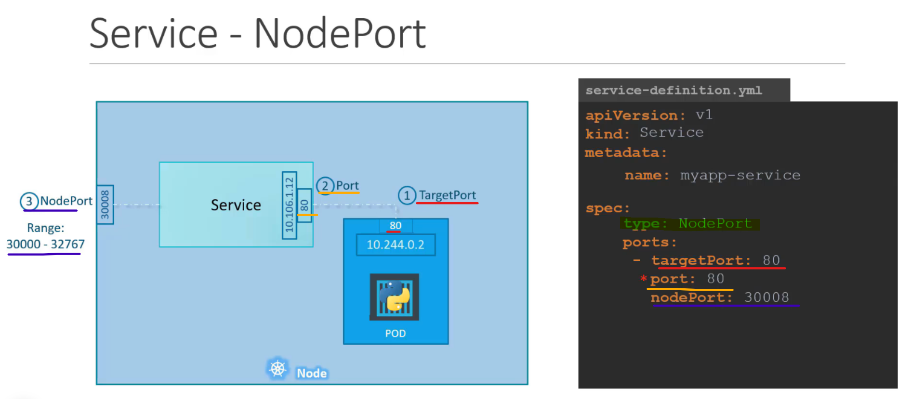
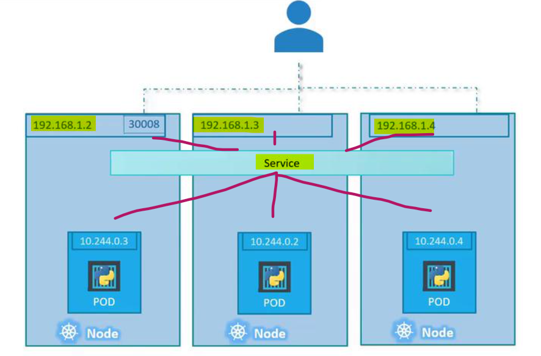

# Kubernetes - Services

[Back](../index.md)

- [Kubernetes - Services](#kubernetes---services)
  - [Services](#services)
    - [Common Commands](#common-commands)
  - [NodePort](#nodeport)
    - [Single Node Diagram](#single-node-diagram)
    - [Multiple Nodes Diagram](#multiple-nodes-diagram)
    - [Lab: Create NodePort with single Pod](#lab-create-nodeport-with-single-pod)
    - [Lab: Create NodePort with Deployment](#lab-create-nodeport-with-deployment)
  - [ClusterIP](#clusterip)
  - [Load Balancer](#load-balancer)
  - [Common Commands](#common-commands-1)

---

## Services

- `service`
  - a logical set of `pods`.
  - as an **abstraction** on the top of the `pod` which provides a **single IP address** and **DNS name** by which pods can be accessed.
- a **REST object** in Kubernetes whose definition can be posted to Kubernetes `apiServer` on the Kubernetes **master** to create a new instance.

- Benefits:

  - manage load balancing configuration.
  - helps pods to scale.

- Service Types

  - `NodePort`
  - `ClusterIP`
  - `Load Balancer`

---

### Common Commands

| Command                              | Description                                                                          |
| ------------------------------------ | ------------------------------------------------------------------------------------ |
| `kubectl create -f <file.yaml>`      | Create a Service from a YAML file.                                                   |
| `kubectl get services`               | List all Services in the current namespace.                                          |
| `kubectl describe service <service>` | Show detailed information about a specific Service.                                  |
| `kubectl delete service <service>`   | Delete a Service by name.                                                            |
| `kubectl apply -f <file.yaml>`       | Apply changes to a Service configuration from a YAML file.                           |
| `kubectl expose`                     | Expose a Service using a specific type such as NodePort, LoadBalancer, or ClusterIP. |

---

## NodePort

- `NodePort`:

  - expose the `service` on a **static port** on the deployed `node`.
  - listen to the port and forward the request to the Pod.
  - map a **port** on a `node` to a **port** on a `pod`

- When Pods are removed, the service is automatically updated.

- Define a nodePort

```yaml
apiVersion: v1
kind: Service
metadata:
  name: myservice
spec:
  type: NodePort # Type of service
  ports:
    - targetPort: 80 # port on a Pod
      port: 80 # port on this service
      nodePort: 30008 # port on the node
  seletor:
    # define the labels to identify the Pod
    app: myapp
    type: front-end
```

- Command

```sh
kubectl create -f service-definition.yaml
```

### Single Node Diagram



- Node:
  - port: 30008 (NodePort)
- Service:
  - ip: 10.106.1.12 (clusterIP)
  - port: 80 (connect with target port on Pod)
- Pod:

  - IP: 10.244.0.2
  - port: 80 (target port)

- NodePort Service
  - map `nodePort` to `targetPort` via service `port`
  - the `ports` is a list: can map multiple ports
  - `selector` identify the Pods with the same `labels`
    - NodePort service forward the incoming request to one of the Pods with matching labels

---

### Multiple Nodes Diagram



- K8s automatically create a service span across all nodes in cluster and maps the target port to the same nodePort on all the nodes in the cluster.
- External user can send requests to any node in the cluster with the same port number.
  - the service maps this requests to the Pods.

---

### Lab: Create NodePort with single Pod

- define pod: `pod-def.yaml`

```yaml
apiVersion: v1
kind: Pod
metadata:
  name: front-end
  labels:
    app: myweb
    type: front-end
spec:
  containers:
    - name: nginx-container
      image: nginx
```

- `service-def.yaml`

```yaml
apiVersion: v1
kind: Service
metadata:
  name: myservice
spec:
  type: NodePort # Type of service
  ports:
    - targetPort: 80 # port on a Pod
      port: 80 # port on this service
      nodePort: 30008 # port on the node
  selector:
    # define the labels to identify the Pod
    app: myapp
    type: front-end
```

- Create Pod and serice

```sh
kubectl create -f .
# pod/front-end created
# service/myservice created

# confirm
kubectl get all
# NAME            READY   STATUS    RESTARTS   AGE
# pod/front-end   1/1     Running   0          16s

# NAME                 TYPE        CLUSTER-IP       EXTERNAL-IP   PORT(S)        AGE
# service/kubernetes   ClusterIP   10.96.0.1        <none>        443/TCP        96d
# service/myservice    NodePort    10.101.227.183   <none>        80:30008/TCP   16s

curl localhost:30008
# <!DOCTYPE html>
# <html>
# <head>
# <title>Welcome to nginx!</title>
# <style>
# html { color-scheme: light dark; }
# body { width: 35em; margin: 0 auto;
# font-family: Tahoma, Verdana, Arial, sans-serif; }
# </style>
# </head>
# <body>
# <h1>Welcome to nginx!</h1>
# <p>If you see this page, the nginx web server is successfully installed and
# working. Further configuration is required.</p>

# <p>For online documentation and support please refer to
# <a href="http://nginx.org/">nginx.org</a>.<br/>
# Commercial support is available at
# <a href="http://nginx.com/">nginx.com</a>.</p>

# <p><em>Thank you for using nginx.</em></p>
# </body>
# </html>
```

---

### Lab: Create NodePort with Deployment

- Define deployment `deploy-def.yaml`

```yaml
apiVersion: apps/v1
kind: Deployment
metadata:
  name: mydeploy
spec:
  replicas: 4
  selector:
    matchLabels:
      app: myweb
      type: front-end
  template:
    metadata:
      name: front-end
      labels:
        app: myweb
        type: front-end
    spec:
      containers:
        - name: nginx-container
          image: nginx
```

- Define deployment `service-def.yaml`

```yaml
apiVersion: v1
kind: Service
metadata:
  name: myservice
spec:
  type: NodePort # Type of service
  ports:
    - targetPort: 80 # port on a Pod
      port: 80 # port on this service
      nodePort: 30008 # port on the node
  selector:
    # define the labels to identify the Pod
    app: myweb
    type: front-end
```

- Create

```sh
# create deployment
kubectl create -f deploy-def.yaml
# create service
kubectl create -f service-def.yaml
# service/myservice created

# confirm
kubectl get deploy
# NAME       READY   UP-TO-DATE   AVAILABLE   AGE
# mydeploy   4/4     4            4           3m4s
kubectl get svc
# NAME         TYPE        CLUSTER-IP       EXTERNAL-IP   PORT(S)        AGE
# kubernetes   ClusterIP   10.96.0.1        <none>        443/TCP        96d
# myservice    NodePort    10.106.170.132   <none>        80:30008/TCP   11s

curl localhost:30008
# <!DOCTYPE html>
# <html>
# <head>
# <title>Welcome to nginx!</title>
# <style>
# html { color-scheme: light dark; }
# body { width: 35em; margin: 0 auto;
# font-family: Tahoma, Verdana, Arial, sans-serif; }
# </style>
# </head>
# <body>
# <h1>Welcome to nginx!</h1>
# <p>If you see this page, the nginx web server is successfully installed and
# working. Further configuration is required.</p>

# <p>For online documentation and support please refer to
# <a href="http://nginx.org/">nginx.org</a>.<br/>
# Commercial support is available at
# <a href="http://nginx.com/">nginx.com</a>.</p>

# <p><em>Thank you for using nginx.</em></p>
# </body>
# </html>
```

---

## ClusterIP

- `ClusterIP`

  - default type of service
  - exposes the `service` within the defined Kubernetes `cluster`.
  - enable communication between `services`
  - a type of Service that provides an **internal, cluster-wide IP address** to enable **communication** between different **components** (typically Pods) within the **same** Kubernetes `cluster`.
  - forward the requests to one of the pods under the service **randomly**

- The service canbe aacessed by other pods using the cluster IP/service name

---

- Definition

```yaml
apiVersion: v1
kind: Service
metadata:
  name: back-end
spec:
  type: ClusterIP
  ports:
    - targetPort: 80 # the port exposed on backend
      port: 80 # the port exposed on service
  selector: # link the service to the pods
    app: myapp
    type: back-end
```

- Create

```sh
kubectl create -f service-cip-def.yaml

kubectl get svc
```

---

## Load Balancer

- `LoadBalancer`
  - a type of Service that provides **external access** to applications running in a Kubernetes cluster.
  - Only works with supported cloud platforms.

---

- Definition

```yaml
apiVersion: v1
kind: Service
metadata:
  name: myservice
spec:
  type: LoadBalancer
  ports:
    - targetPort: 80
      port: 80
      nodePort: 30008
```

---

## Common Commands

- how many services exist on system
  - `kubectl get svc`
- the type of default `kubernetes` service
  - ClusterIP
- what targetPort the default `kubernetes` is configured
  - `kubectl describe svc kubernetes`
  - 6443/TCP
- how many labels are configured on the default `kubernetes` service
  - `kubectl describe svc kubernetes`, labels
- how many endpoint are attached on the default `kubernetes` service
  - `kubectl describe svc kubernetes`, Endpoints
