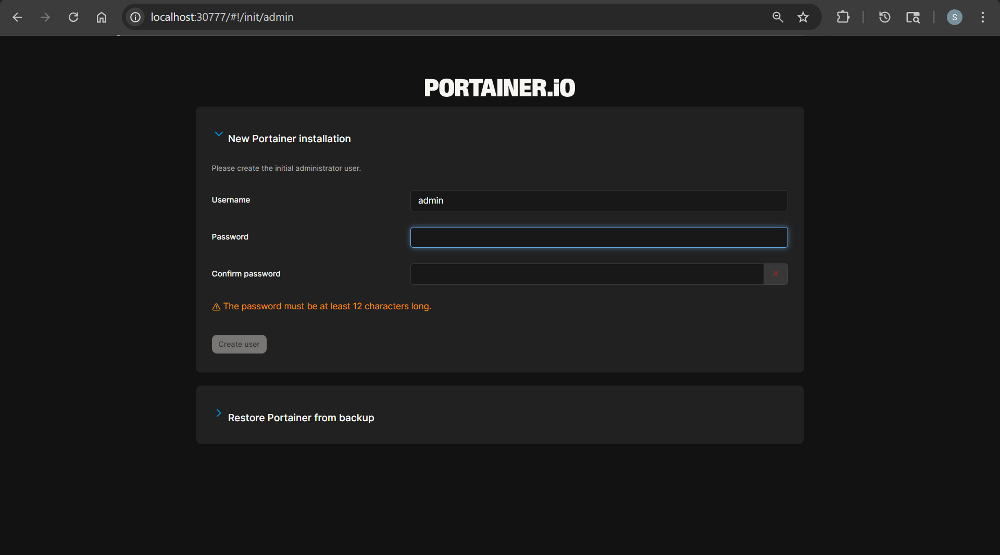

# Portainer - Install

[Back](../index.md)

---

## Install

```sh
helm repo add portainer https://portainer.github.io/k8s/
helm repo update

helm upgrade --install --create-namespace -n portainer portainer portainer/portainer \
    --set image.tag=lts

helm list
# NAME            NAMESPACE       REVISION        UPDATED                                 STATUS   CHART                    APP VERSION
# portainer       portainer       1               2026-04-30 23:59:25.915406113 -0400 EDT deployed portainer-239.1.0        ce-latest-ee-2.39.1

k get deploy -n portainer
# NAME        READY   UP-TO-DATE   AVAILABLE   AGE
# portainer   1/1     1            1           2m7s

```


