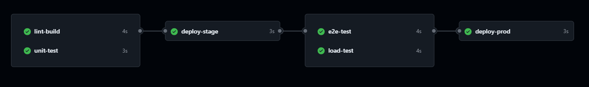
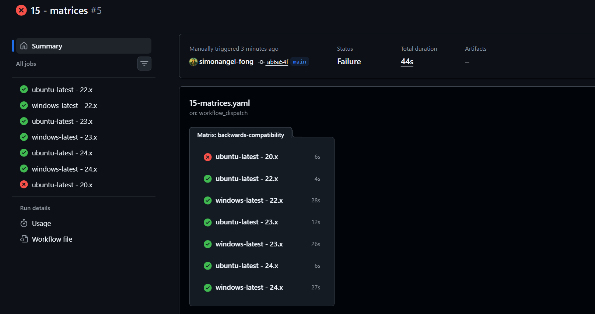
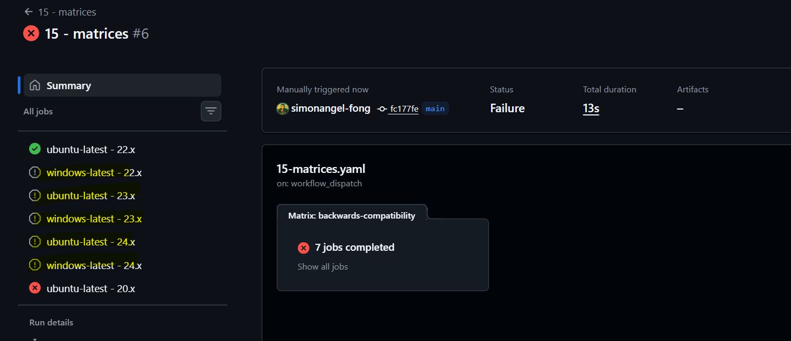
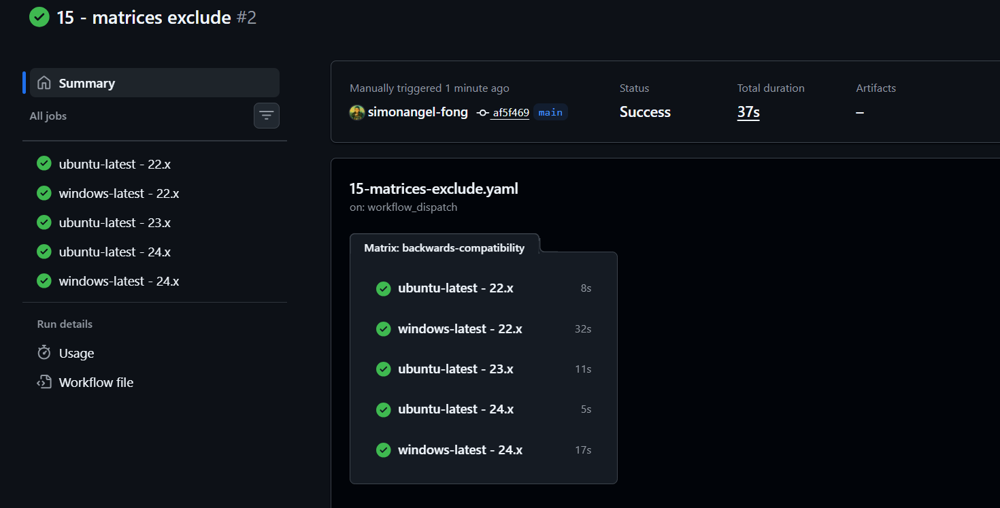

# GitHub Actions: Execution Flow

[Back](../index.md)

- [GitHub Actions: Execution Flow](#github-actions-execution-flow)
  - [Control Execution Flow](#control-execution-flow)
    - [Step Execution](#step-execution)
    - [Job Execution](#job-execution)
    - [Lab: Control Execution Flow](#lab-control-execution-flow)
  - [Matrices](#matrices)
    - [Lab: Matrix](#lab-matrix)
    - [Lab: Matrix Exclude](#lab-matrix-exclude)

---

## Control Execution Flow

### Step Execution

- Standard execution:
  - step 1 > step 2(fail) > step 3(not execute)
- Conditional execution
  - step 1 > step 2(fail) > step 3 if: ${{ !cancelled() }}(execute)

---

### Job Execution

- `needs` key
- `continue-on-error` key: true/false

- Non-dependent execution: executed in parallel
  - jobs:
    - job1:
    - job2:
    - job3:
    - job4:

- Dependent execution
  - jobs:
    - job1:
    - job2:
    - job3:
      - needs:
        - job1
        - job2
    - job4:
      - needs:
        - job1

---

### Lab: Control Execution Flow

```yaml
name: 10 - Execution Flow

on:
  workflow_dispatch:
    inputs:
      pass-unit-test:
        type: boolean
        description: whether unit tests pass
        default: true

jobs:
  lint-build:
    runs-on: ubuntu-latest
    steps:
      - name: lint and build
        run: echo "Lint and build"

  unit-test:
    runs-on: ubuntu-latest
    # continue-on-error: true
    steps:
      - name: unit test
        run: echo "running unit test"
      - name: failing tests
        if: ${{ !inputs.pass-unit-test }}
        run: exit 1
  deploy-stage:
    runs-on: ubuntu-latest
    needs:
      - lint-build
      - unit-test
    steps:
      - name: Deploy stage
        run: echo "Deploy stage"
  e2e-test:
    runs-on: ubuntu-latest
    needs:
      - deploy-stage
    steps:
      - name: end-to-end test
        run: echo "e2e test"
  load-test:
    runs-on: ubuntu-latest
    needs:
      - deploy-stage
    steps:
      - name: load test
        run: echo "load test"
  deploy-prod:
    runs-on: ubuntu-latest
    needs:
      - e2e-test
      - load-test
    steps:
      - name: deploy prod
        run: echo "deploy prod"
```



---

## Matrices

- `Matrices`:
  - Run several variations of the same job

- `fail fast strategy` key
  - By default, if one job fails, all fail.
- `exclude`:
  - specify a combination to be excluded.
  - process before `include`
- `include`:
  - specify additional combination

- Use-case:
  - Run test suits **in parallel** in multiple Node versions before publishing an NPM package to ensure backward compatibility.

- Example

```yaml
name: My NPM package workflow
on: push
jobs:
  backwards-compatibility:
    name: ${{ matrix.os }}-${{ matrix.node }}
    runs-on: ${{ matrix.os }}
    strategy:
      matrix:
        node: [14, 16, 18]
        os:
          - ubuntu-latest
          - macos-latest
          - windows-latest
    steps:
      - uses: actions/setup-node@v3
        with:
          node-version: ${{ matrix.node }}
```

---

### Lab: Matrix

```yaml
name: 15 - matrices

on:
  workflow_dispatch:

jobs:
  backwards-compatibility:
    name: ${{ matrix.os }} - ${{ matrix.node-version }}
    runs-on: ${{ matrix.os }}
    strategy:
      fail-fast: false
      matrix:
        node-version: [22.x, 23.x, 24.x]
        os:
          - ubuntu-latest
          - windows-latest
        include:
          - os: ubuntu-latest
            node-version: 20.x
            tag: beta
    steps:
      - name: Setup node
        uses: actions/setup-node@v6
        with:
          node-version: ${{ matrix.node-version }}

      - name: Fails a version
        if: ${{ matrix.tag == 'beta' }}
        run: exit 1

      - name: Execute testing
        run: echo "Testing against on OS ${{ matrix.os }}" and Node.js ${{
          matrix.node-version }}
```


> fail-fast: false
> matrix.include


> fail-fast: true

---

### Lab: Matrix Exclude

```yaml
name: 15 - matrices exclude

on:
  workflow_dispatch:

jobs:
  backwards-compatibility:
    name: ${{ matrix.os }} - ${{ matrix.node-version }}
    runs-on: ${{ matrix.os }}
    strategy:
      # fail-fast: false
      matrix:
        node-version: [ 22.x, 23.x, 24.x ]
        os:
          - ubuntu-latest
          - windows-latest
        exclude:
          - os: windows-latest
            node-version: 23.x
    steps:
      - name: Setup node
        uses: actions/setup-node@v6
        with:
          node-version: ${{ matrix.node-version }}

      - name: Execute testing
        run: echo "Testing against on OS ${{ matrix.os }}" and Node.js ${{
          matrix.node-version }}

```

