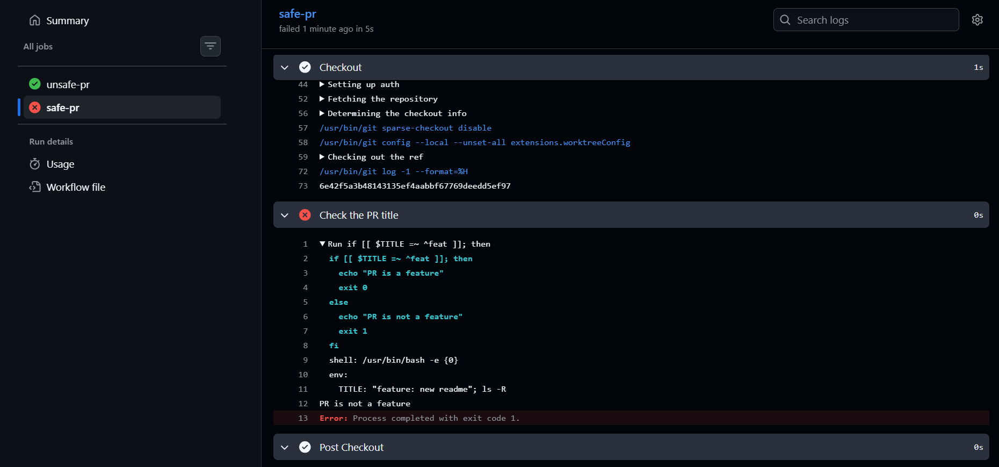
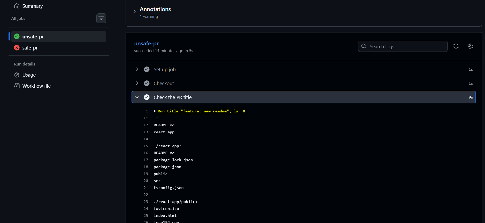

# GitHub Actions: Security

[Back](../index.md)

- [GitHub Actions: Security](#github-actions-security)
  - [Security](#security)
    - [Secret Management](#secret-management)
    - [Token Management](#token-management)
    - [Preventing Script Injection](#preventing-script-injection)
    - [Authentication - OpenID Connect](#authentication---openid-connect)
  - [Lab: Script Injection - PR](#lab-script-injection---pr)

---

## Security

### Secret Management

- Do not use **complex data types** for storing secrets
  - break down into separated values
- Register generated sensitive values within actions.
  - to mark sensitive values
- Make sure that any **third-party or external action** your workflows depend on **does not expose** sensitive values in logs or to other external services.
  - This can be done by **auditing the source code** of these actions.
- Regularly **rotate** secrets.
- **Delete** unused secrets.
- **Limit** those with **access** to create and update secrets.
- Always use credentials **with as few permissions** as necessary.

---

### Token Management

- **Never** use a `classic PAT (Personal Access Token)` to grant a workflow **access** to code **from another repo.**
  - Ideally, create a `GitHub App` and use its **short-term credentials**.
  - If needed, **use** a `fine-grained PAT`
    - give as **few permissions** as necessary for the workflow to do its job (i.e. only read access, only to the necessary repos).
    - **rotate** it regularly.
    - remember that it is **bound to a specific user**.
- When extending the permissions of `$GITHUB_TOKEN`, use only the **minimum set of permissions** required by the workflow.
- Do not pass the workflow's token stored in `$GITHUB_TOKEN` to untrusted third-party software (for example, custom actions from untrusted sources).

---

### Preventing Script Injection

- `Script injection` happens when **attackers inject malicious code** into the **workflow's context** in the hope that it will be executed.
  - Examples include contexts ending in `body`, `default_branch`, `email`, `head_ref`, `label`, `message`, `name`, among others.
- How to avoid script injection:
  - Create **custom actions** instead of executing inline shell scripts.
  - Use **intermediary environment variables**.
  - **Reduce** as much as possible the dependency of custom actions on **inputs from external users**.
  - Setup **code scanning**.

---

### Authentication - OpenID Connect

- For providers and external services that support `OpenID Connect`, it is possible to set up authentication so that we **obtain short-term credentials** from cloud providers instead of having to store long-term access credentials.
- Downsides of long-term credentials:
  - Are **hard-coded** in the secrets used by the workflow.
  - Need to be **rotated regularly**.
  - Are **valid beyond the execution** of the workflow.
  - Any **misstep can expose** these credentials, which normally have many permissions since they allow managing cloud resources.

---

- **Cloud Provider**
  1. **Create a role** to be used by workflows
  - The role should contain the **minimum set of permissions** for the workflows to accomplish their tasks.
  2. Create an `OIDC trust` in the cloud provider
  - The trust should **specify which repositories** are allowed to obtain tokens, as well as any additional information necessary to increase security.
- **GitHub Workflow**
  1. Exchange GitHub's `OIDC token` for credentials
  - There are several actions from trusted providers that implement this exchange process, we can simply use them.
  2. Use the short-lived credential to manage resources
  - The short-lived credentials are **valid only for a single job, and expire after that**.
  - If we need to use credentials in other jobs, we can simply reuse the third-party actions to obtain **new short-lived credentials**.

---

## Lab: Script Injection - PR

- Goal:
  - malicious codes can be injected in the PR.
  - the workflow check the title with shell; but the title can be inject with malicious codes
- Mitigate:
  - use environment variable as intermediate
  - or create a custom js action

```yaml
name: 20 security

on:
  pull_request:

jobs:
  unsafe-pr:
    runs-on: ubuntu-latest
    steps:
      - name: Checkout
        uses: actions/checkout@v4

      - name: Check the PR title
        run: |
          title=${{ github.event.pull_request.title }}
          if [[ $title =~ ^feat ]]; then
            echo "PR is a feature"
            exit 0
          else
            echo "PR is not a feature"
            exit 1
          fi
  safe-pr:
    runs-on: ubuntu-latest
    steps:
      - name: Checkout
        uses: actions/checkout@v4

      - name: Check the PR title
        env:
          TITLE: ${{ github.event.pull_request.title }}
        run: |
          if [[ $TITLE =~ ^feat ]]; then
            echo "PR is a feature"
            exit 0
          else
            echo "PR is not a feature"
            exit 1
          fi
```

- create a PR with title:
  - `"some title"; ls -R;`
  - the code `ls -R`: list all files



> PR title is passed as an environment variable, not inserted directly into the Bash script.



> script injection:
> title="feature: new readme"; ls -R
> if [[$title =~ ^feat]]; then
