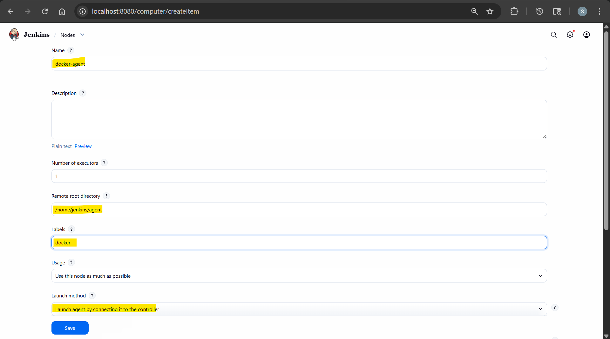
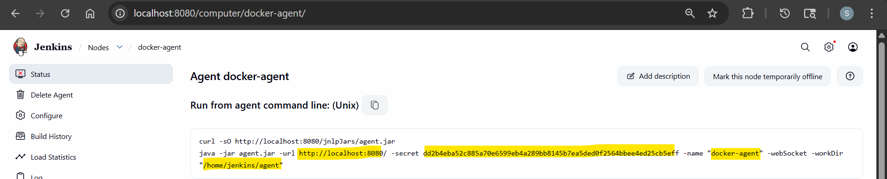
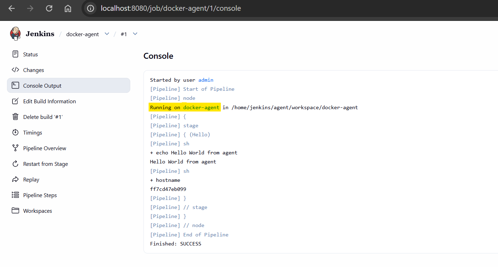

# Jenkins - Agent

[Back](../index.md)

- [Jenkins - Agent](#jenkins---agent)
  - [Deploy Agent](#deploy-agent)

---

## Deploy Agent

```sh
docker network create jenkins-net

# connect jenkins
docker network connect jenkins-net jenkins
```

- Setup agent
  - Manage Jenkins -> Nodes -> New node





- Create agent

```sh
docker run -d \
  --name jenkins-agent \
  --network jenkins-net \
  -e JENKINS_URL=http://jenkins:8080/ \
  -e JENKINS_AGENT_NAME=docker-agent \
  -e JENKINS_SECRET=<secret>  \
  -v jenkins-agent-work:/home/jenkins/agent \
  jenkins/inbound-agent
```

- run pipeline

```groovy
pipeline {
    agent { label 'docker' }

    stages {
        stage('Hello') {
            steps {
                sh 'echo Hello World from agent'
                sh 'hostname'
            }
        }
    }
}
```


