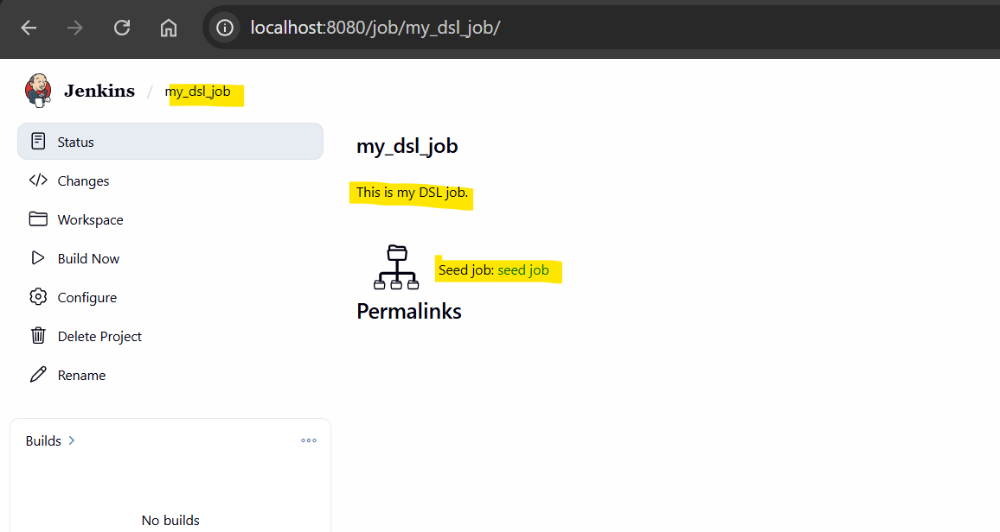

# Jenkins - DSL

[Back](../index.md)

- [Jenkins - DSL](#jenkins---dsl)
  - [DSL](#dsl)
  - [Seed Job](#seed-job)
  - [Lab: Create Freestyle Job DSL](#lab-create-freestyle-job-dsl)

---

## DSL

- `Domain-Specific Language (DSL)`
  - a specialized, Groovy-based programming language used to **define and manage** `Jenkins configurations as code`

- 2 types:
  - `Job DSL` (Plugin):
    - Used to create and manage `Jenkins jobs` programmatically.
    - Instead of manually clicking through the UI to create 100 similar jobs, you write a single Job DSL script that generates them automatically.
  - `Pipeline DSL`:
    - Used to **define the build/test/deploy workflow** itself.
    - defined in `Jenkinsfile`.
    - two flavors:
      - `Declarative Pipeline`:
        - A simplified, opinionated syntax (e.g., using pipeline, agent, stages).
      - `Scripted Pipeline`:
        - A more flexible, full-power **Groovy syntax** for complex logic.

- Plugin
  - `Job DSL`
- DSL dir:
  - `JENKINS_HOME/dsl`
- Document:
  - https://plugins.jenkins.io/job-dsl/
- DSL Struture:

---

## Seed Job

- `seed job`
  - used to generate other `Jenkins jobs` automatically using code (`DSL`).

- Flow:

```txt
Seed Job  -> reads DSL script -> creates Jenkins jobs
```

---

## Lab: Create Freestyle Job DSL

- Create Free style job
  - name: "seed job"
- Build Steps: "Process Job DSLs"
- Use the provided DSL script:

  ```groovy
  job("my_dsl_job"){
    description('This is my DSL job.')
    parameters {
      stringParam('task_name', defaultValue = 'my jenkins task', description = "This is my task.")
      booleanParam('isComplete', false)
      choiceParam('type', ['option 1 (default)', 'option 2', 'option 3'])
    }
    scm {
      git('https://github.com/jenkinsci/job-dsl-plugin','master')
    }
    triggers {
      cron {spec("H/5 * * * *")}
    }
    steps {
      shell("echo 'Hello world'")
    }
    publishers {
      mailer("who@example.com", true, true)
    }
  }
  ```

- Run build

- If failed, check Mange Jenkins > ScriptApprov > Approve
  - Build again
  ```txt
  Started by user admin
  Running as SYSTEM
  Building remotely on docker-agent (docker) in workspace /home/jenkins/agent/workspace/seed job
  Processing provided DSL script
  Added items:
    GeneratedJob{name='my_dsl_job'}
  Finished: SUCCESS
  ```


