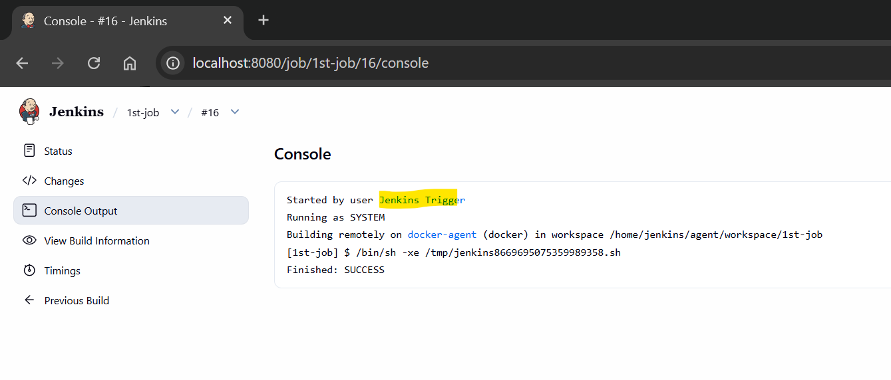

# Jenkins - Fundamental

[Back](../index.md)

- [Jenkins - Fundamental](#jenkins---fundamental)
  - [Architecture](#architecture)
  - [Core Components](#core-components)
    - [Jenkins Controller (Master)](#jenkins-controller-master)
    - [Jenkins Agents (Workers)](#jenkins-agents-workers)
    - [How It Works (Execution Flow)](#how-it-works-execution-flow)
    - [Common Deployment Patterns](#common-deployment-patterns)
    - [Plugins](#plugins)
  - [Environment Variables](#environment-variables)
  - [Jenkins URL](#jenkins-url)
  - [Trigger](#trigger)
    - [Cron Job](#cron-job)
    - [API Call](#api-call)
      - [Lab: triger a job via API](#lab-triger-a-job-via-api)
  - [Notification](#notification)
    - [Email](#email)

---

## Architecture

- a **controller–agent (master–worker) architecture**

```txt
        +----------------------+
        |     Jenkins UI       |
        |  (Web Interface/API) |
        +----------+-----------+
                   |
                   v
        +----------------------+
        |   Jenkins Controller |
        |  (Master Node)       |
        +----------+-----------+
                   |
        ----------------------------
        |            |            |
        v            v            v
+-------------+ +-------------+ +-------------+
|   Agent 1   | |   Agent 2   | |   Agent N   |
| (Worker)    | | (Worker)    | | (Worker)    |
+-------------+ +-------------+ +-------------+
```

---

## Core Components

### Jenkins Controller (Master)

- `Jenkins Controller`
  - the central controlling serve
- Responsibilities:
  - Manage `jobs` and `pipelines`
  - Schedule `builds`
  - Assign `tasks` to `agents`
  - Store configuration and build history
- Provides:
  - Web UI
  - REST API
  - Authentication & authorization

- `Controller` does not run heavy workloads
- `Agents` handle:
  - Compilation
  - Testing
  - Deployment

---

- `Jenkins jobs`
  - the **runnable**, configurable **projects** or **tasks** within the Jenkins automation server that **automate** software development workflows, such as building, testing, and deploying applications.

- `Jenkins Pipeline`
  - **automated process** that describes your entire software delivery workflow (Build, Test, Deploy).

  - Types:
    - **Pipeline** (Jenkinsfile) (recommended)
    - **Freestyle jobs** (basic UI-driven)
      - Written in Groovy-based DSL
      - Supports CI/CD workflows

- `Queue`
  - a **temporary waiting area** for scheduled build jobs that are pending execution due to a lack of available executors (nodes).
  - Controller schedules jobs based on:
    - Available executors
    - Node labels
    - Resource constraints

- `Plugins`
  - a **software extension** that **adds specific features** or integrations to the core Jenkins environment
  - Common plugins:
    - Git / GitHub integration
    - Docker
    - Kubernetes
    - AWS
    - Pipeline plugins

---

### Jenkins Agents (Workers)

- `Jenkins Agents`
  - the machines, containers, or cloud instances that connect to the `Jenkins Controller` **to execute build jobs and pipelines**.

  - Types:
    - `Static agents` (pre-configured)
    - `Dynamic agents` (provisioned on demand, e.g., Kubernetes)

---

- `Executor`
  - a **dedicated slot** on a build agent (or controller) that **executes a single build job or pipeline stage** at a time.
  - acts as a **thread** within an agent, meaning the number of executors per node determines how many jobs can run concurrently.
  - Example:
    - 1 agent with 4 executors → can run 4 jobs concurrently

- `Workspace`
  - a **disposable directory** on the file system of a Jenkins `Node` where a specific job or Pipeline executes its work.
  - It serves as a **temporary "sandbox"** for checking out source code, compiling files, and running tests.
  - Stores:
    - Source code
    - Build artifacts
    - Temporary files

---

### How It Works (Execution Flow)

1. Developer **pushes code** to GitHub
2. `Jenkins` **detects** change (webhook or polling)
3. `Job` is **triggered** and placed in `queue`
4. `Controller` selects an available `agent`
5. `Agent` **executes** pipeline steps
6. Results are sent back to `controller`
7. **Output** shown in `Jenkins UI`

---

### Common Deployment Patterns

1. **Single Node (Small Setup)**
   Controller + executor on **same** machine
   Simple but not scalable
2. **Controller + Multiple Agents (Recommended)**
   Production-ready setup
3. **Cloud-Native Jenkins**
   Controller in VM/container
   Agents dynamically provisioned (Kubernetes)

---

### Plugins

- `Jenkins plugins`
  - **add-on modules** that **extend the functionality** of the core Jenkins automation server, allowing it to integrate with thousands of tools for CI/CD, source control (Git), cloud platforms (Docker, Kubernetes), and build tools (Maven).

- Common plugins:
  - `Pipeline: Stage ViewVersion`

---

## Environment Variables

- **Built-in global variable env**
  - ref: https://www.jenkins.io/doc/book/pipeline/jenkinsfile/#using-environment-variables
- **Custome global env var**
  - Manage Jenkins > System > Global properties > check `Environment variables`
- **Pipeline env var**

```groovy
pipeline {
    agent {
        label '!windows'
    }

    environment {
        DISABLE_AUTH = 'true'
        DB_ENGINE    = 'sqlite'
    }

    stages {
        stage('Build') {
            steps {
                echo "Database engine is ${DB_ENGINE}"
                echo "DISABLE_AUTH is ${DISABLE_AUTH}"
                sh 'printenv'
            }
        }
    }
}
```

---

## Jenkins URL

- Manage Jenkins > System > Jenkins Location
  - Jenkins URL:

---

## Trigger

### Cron Job

- job > configure > Triggers > Build periodically

---

### API Call

- ref: https://www.jenkins.io/doc/book/using/remote-access-api/
- Job can be invoked by API call
- Common paths:
  - `/job/<job_name>/build`: build a job
  - `/job/<folder>/job/<job_name>/build`: with folder
  - `/job/<pipeline>/job/<branch>/build`: with pipeline and branch

#### Lab: triger a job via API

- Create user: jenkins_trigger
- Create global role: trigger
  - Overall: Read
  - Job: Build, Read
- Assign role
- Login as new user
- Create API token: User profile > Security > API Token > Add new token
- Test: build a job
- enable CSRF protection:
  - Manage Jenkins > Security: CSRF Protection = Crumb Issuer

- Trigger non-parameterized job

```sh
# Step 1: Get crumb
CRUMB=$(curl -u jenkins_trigger:<api_token> \
  http://<jenkins_host>/crumbIssuer/api/xml?xpath=concat(//crumbRequestField,":",//crumb))

# Step 2: Use crumb
curl -u jenkins_trigger:<api_token> \
  -H "$CRUMB" \
  -X POST http://<jenkins_host>/job/<job_name>/build?delay=0sec
```

- Parameterized jobs

```sh
curl -u jenkins_trigger:<api_token> \
  -X POST "http://<jenkins_host>/job/<job_name>/buildWithParameters"
  --data param1=value1 --data param2=value2
```



---

## Notification

### Email

- Plugin: `Email Extension Plugin`

---
