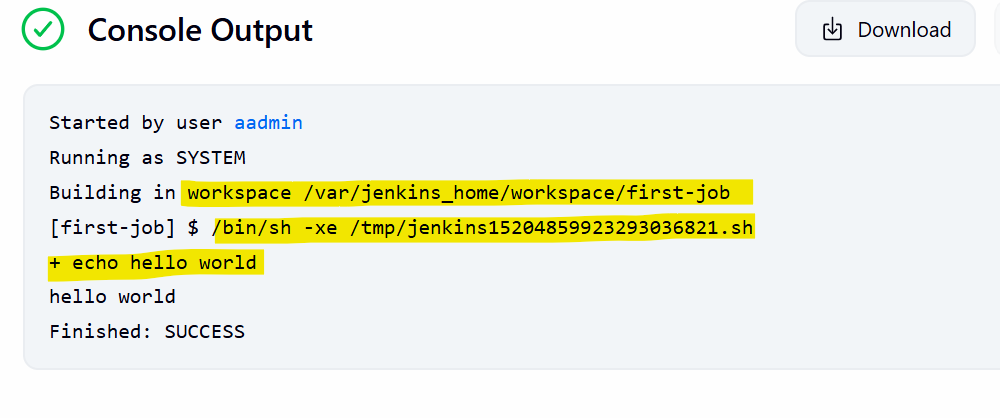
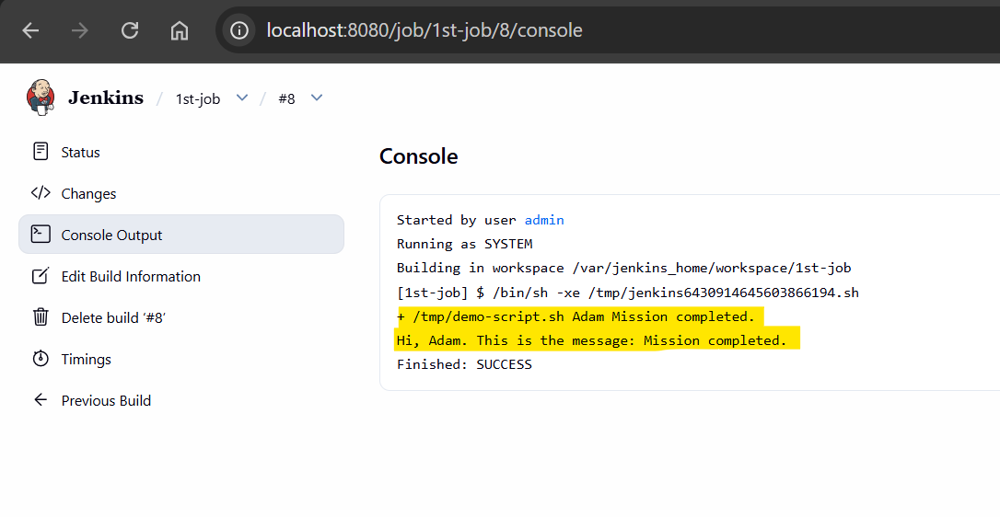
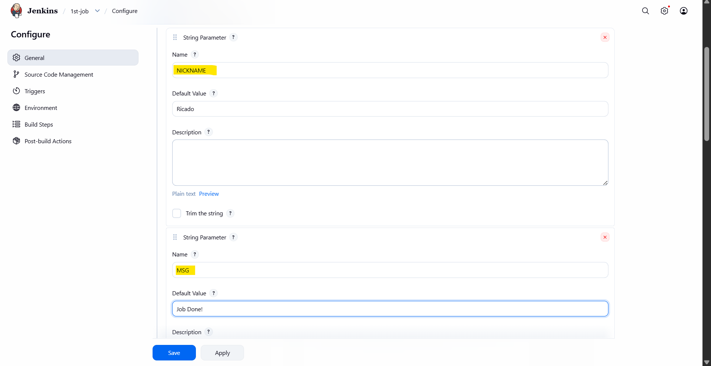
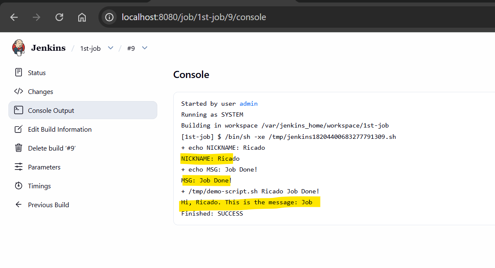
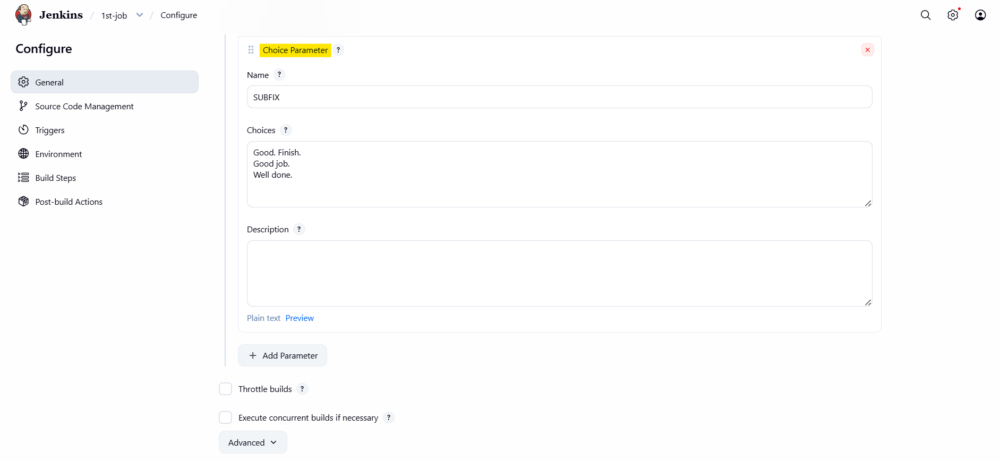
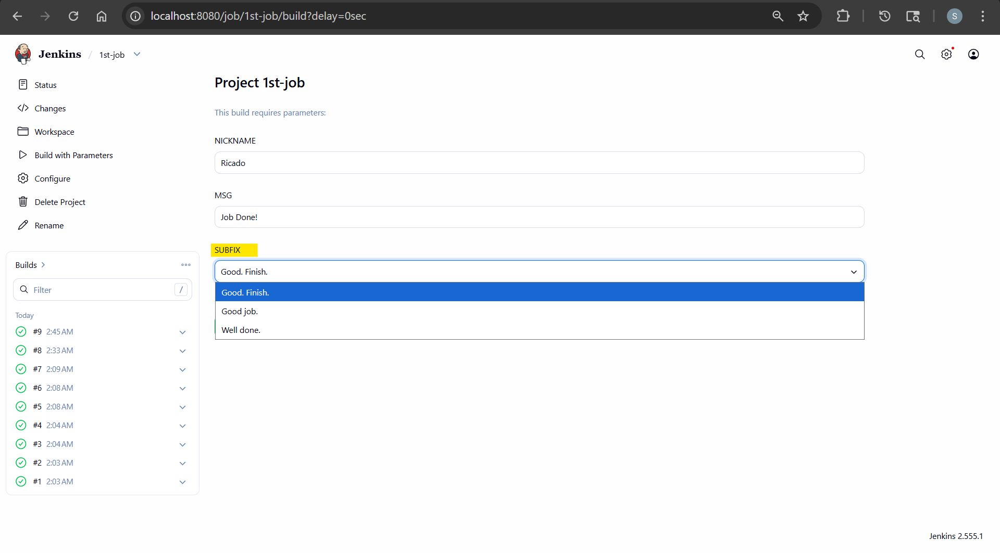
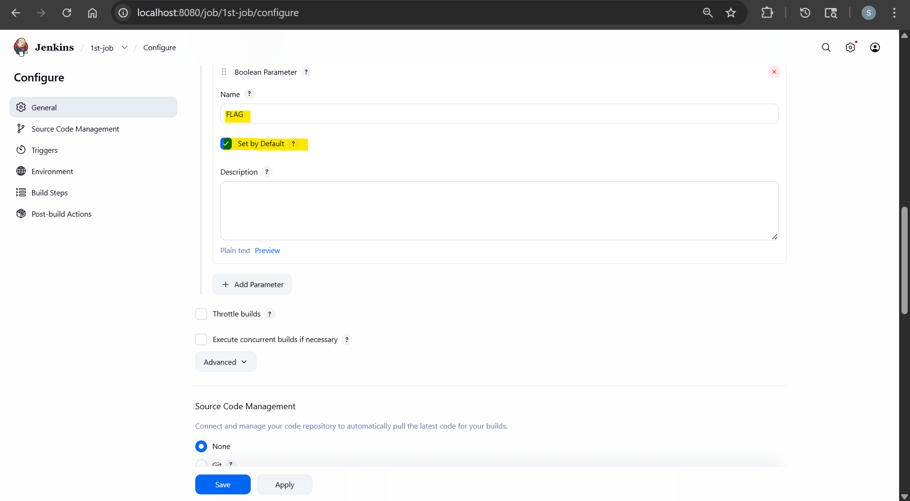
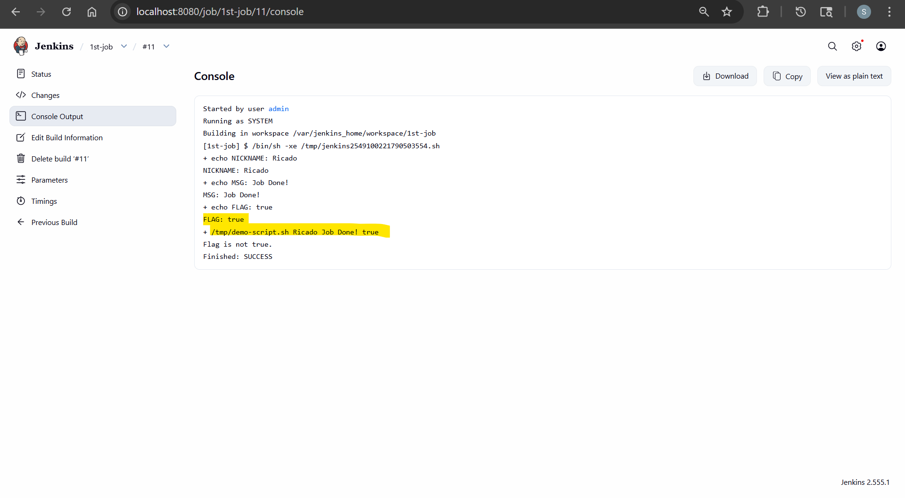

# Jenkins - Job

[Back](../index.md)

- [Jenkins - Job](#jenkins---job)
  - [Job](#job)
  - [Lab: Execute a bash script](#lab-execute-a-bash-script)
  - [Lab: Parameterized](#lab-parameterized)
    - [String Parameters](#string-parameters)
    - [Choose Parameters](#choose-parameters)
    - [Boolean Parameters](#boolean-parameters)

---

## Job

When creating a job in Jenkins, it creates a new directory in the `/var/jenkins_home/workspace/`

- `/var/jenkins_home/workspace/<job_name>`



---

## Lab: Execute a bash script

- Env:
  - Host OS: ubuntu
  - Jenkins Deploy: Docker

---

- Create a shell script

```sh
cat > demo-script.sh <<'EOF'
#!/bin/bash

NICKNAME=$1
MSG=$2

echo "Hi, $NICKNAME. This is the message: $MSG"
EOF

chmod +x demo-script.sh

./demo-script.sh Adam "Mission completed."
# Hi, Adam. This is the message: Mission completed.

# copy to docker container
docker ps
# CONTAINER ID   IMAGE                       COMMAND                  CREATED          STATUS          PORTS                                                                                          NAMES
# c818c31087ad   jenkins/jenkins:lts-jdk21   "/usr/bin/tini -- /u…"   32 minutes ago   Up 32 minutes   0.0.0.0:8080->8080/tcp, [::]:8080->8080/tcp, 0.0.0.0:50000->50000/tcp, [::]:50000->50000/tcp   jenkins
docker cp demo-script.sh jenkins:/tmp/demo-script.sh
# Successfully copied 2.05kB to jenkins:/tmp/demo-script.sh

# test in container
docker exec -it jenkins /tmp/demo-script.sh Adam "Mission completed."
# Hi, Adam. This is the message: Mission completed.
```

- Update the job
  - shell script

```sh
/tmp/demo-script.sh Adam "Mission completed."
```



---

## Lab: Parameterized

### String Parameters

- Based on previous bash script
- Set parameters
  - "This project is parameterized" -> "String Parameter"



- Update job shell script

```sh
echo "NICKNAME: $NICKNAME"
echo "MSG: $MSG"
/tmp/demo-script.sh $NICKNAME $MSG
```



---

### Choose Parameters



- Update shell script

```sh
/tmp/demo-script.sh $NICKNAME $MSG $SUBFIX
```

- execute



---

### Boolean Parameters

- Update shell script

```sh
cat > demo-script.sh <<'EOF'
#!/bin/bash

NICKNAME=$1
MSG=$2
FLAG=$3

if [ "$FLAG" = "true" ]; then
  echo "Hi, $NICKNAME. This is the message: $MSG"
else
  echo "Flag is not true."
fi

EOF

# test locally
./demo-script.sh Adam "Mission completed." true
# Hi, Adam. This is the message: Mission completed.
./demo-script.sh Adam "Mission completed."
# Flag is not true.

docker cp demo-script.sh jenkins:/tmp/demo-script.sh
# Successfully copied 2.05kB to jenkins:/tmp/demo-script.sh
```

- Add boolean param



- Update job script

```sh
echo "NICKNAME: $NICKNAME"
echo "MSG: $MSG"
echo "FLAG: $FLAG"
/tmp/demo-script.sh $NICKNAME $MSG $FLAG
```

- Execute



