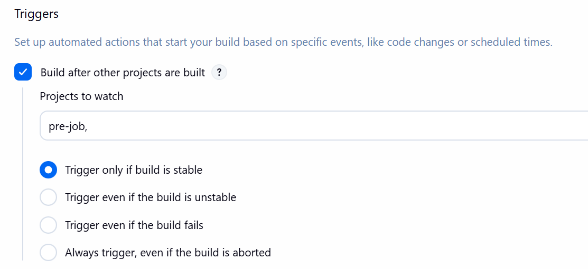
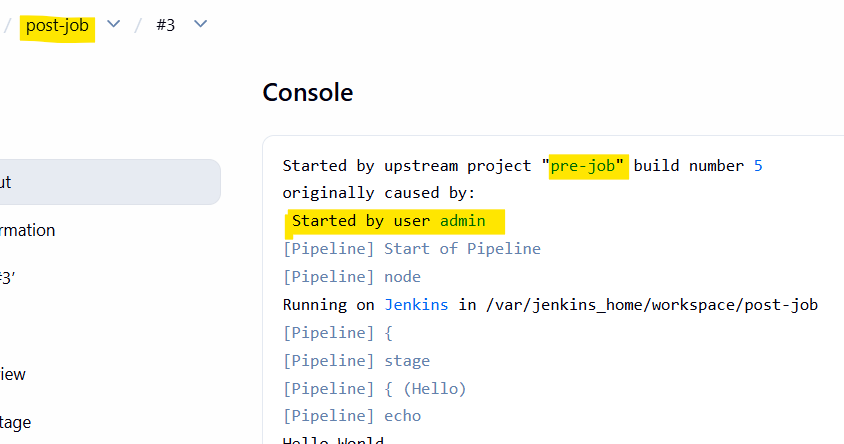
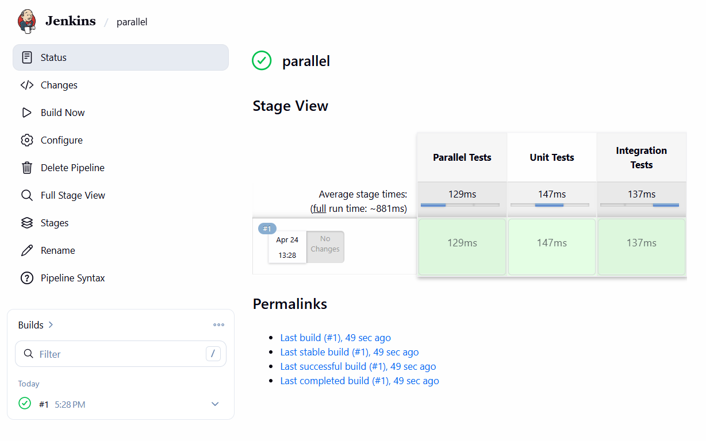
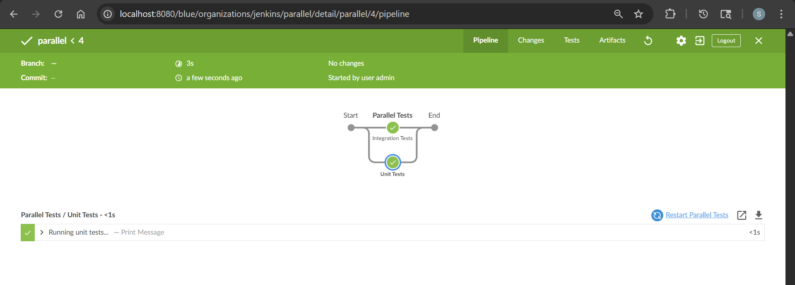

# Jenkins - Pipeline & Jenkinsfile

[Back](../index.md)

- [Jenkins - Pipeline \& Jenkinsfile](#jenkins---pipeline--jenkinsfile)
  - [Jenkins Pipeline](#jenkins-pipeline)
  - [Pipeline fundamental](#pipeline-fundamental)
    - [Best Practice](#best-practice)
    - [Node vs Agent](#node-vs-agent)
    - [Tools](#tools)
    - [Options](#options)
    - [Upstream and Downstream projects](#upstream-and-downstream-projects)
    - [Throttle Concurrent Builds](#throttle-concurrent-builds)
  - [Steps](#steps)
    - [Handle Credentials](#handle-credentials)
    - [Milestone](#milestone)
    - [Script Block](#script-block)
    - [Common workflow controls](#common-workflow-controls)
  - [Shared Library](#shared-library)
  - [Sample: Docker build and push](#sample-docker-build-and-push)
  - [Sample: Deploy pipeline](#sample-deploy-pipeline)
  - [Sample: Fast CI pipeline](#sample-fast-ci-pipeline)
  - [Lab: Create Pipeline](#lab-create-pipeline)
  - [Lab: Demo Retry](#lab-demo-retry)
  - [Lab: Demo Timeout](#lab-demo-timeout)
  - [Lab: Parallel statge pipeline](#lab-parallel-statge-pipeline)

---

## Jenkins Pipeline

- `Jenkins Pipeline`
  - used to define the CI/CD workflow as code instead of clicking around in the UI.
  - It describes how your software is built, tested, and deployed in a structured, repeatable way.

- `Jenkinsfile`
  - a **text file** that contains the **definition of that pipeline**, written using a `Domain-Specific Language (DSL)` based on the Groovy programming language.
  - Key components:
    - `pipeline` → top-level definition
    - `agent` → where it runs (node, container, k8s pod)
    - `stages` → logical phases
    - `steps` → actual commands


---

## Pipeline fundamental

### Best Practice

- Use `Declarative Pipeline` when possible
- Store `Jenkinsfile` in **SCM**
- Use `shared libraries` for common code
- Implement proper error handling
- Use meaningful stage names
- Secure credentials properly
- Keep pipelines simple and modular
- Use parallel execution for independent tasks
- Implement proper logging
- Clean workspaces regularly

---

### Node vs Agent

- `Node`:
  - A generic term for **any machine** (physical or virtual) that is part of the Jenkins environment.
    - includes the Controller (formerly Master) and all connected Agents.
  - mainly used in **Scripted Pipelines**.
    - can used in Declarartive pipeline: `script{ node{}}`
  - `node('linux') { ... }`

- `Agent`:
  - A specific "**worker" entity** that connects to the Jenkins controller to **execute jobs**.
    - An agent is technically a small **Java process (client)** running on a Node to perform tasks assigned by the controller.
  - used in **Declarative Pipelines**
  - `agent { label 'linux' }`

---

- Node

```groovy
node {
    checkout scm
    sh 'mvn test'
}

// choose a specific agent by label
node('linux && docker') {
    sh 'docker build -t myapp .'
}

// using in declarative pipeline
pipeline {
    agent none
    stages {
        stage('Build') {
            steps {
                script {
                    node('build-node') {
                        echo 'Building on build-node...'
                    }
                }
            }
        }
    }
}
```

---

- Agent

```groovy
pipeline {
    agent any
}

```

---

### Tools

- mention the tools and configurations used by defining them in the pipeline script itself

```groovy
pipeline {
    agent any
    tools {
        // Define the tools and their configurations here
        maven 'MavenTool' // Name of the tool and the tool installation name
        jdk 'JDKTool'    // Name of the tool and the tool installation name
    }
    stages {
        // Define your pipeline stages here
        stage('Build') {
            steps {
                // Use the configured tools in your pipeline stages
                script {
                    sh '''#!/bin/bash
                    echo "Building with Maven"
                    mvn clean package
                    '''
                }
            }
        }
    }
}
```

---

### Options

- `buildDiscarder(logRotator(numToKeepStr: '30', artifactNumToKeepStr: '10'))`:
  - Discards old builds to save disk space.

- `disableConcurrentBuilds`:
  - Prevents multiple versions of the same pipeline from running simultaneously.
- `retry`:
  - **Retries the entire pipeline** or a specific stage a set number of times if it fails.
- `timeout`:
  - Sets a maximum execution time for the pipeline or stage.
- `timestamps`:
  - Prepends the time of execution to each line in the console output.
- `skipStagesAfterUnstable`:
  - Skips all remaining stages once the build status becomes "unstable".

---

### Upstream and Downstream projects

- `Upstream projects` trigger `downstream projects`
- how to configure:
  - downstream projects: "Build after other projects are built?"
    
    

---

### Throttle Concurrent Builds

- plugin: `Throttle Concurrent Builds`
  - limits the number of concurrent executions of a job to prevent resource overload.

---

## Steps

### Handle Credentials

- Jenkins provides a credentials store
  - secret text,
  - username/password,
  - secret files,
  - SSH keys,
  - and certificates

- scope secrets:
  - `withCredentials`

```groovy
// scope secrets as narrowly as possible
stage('Call API') {
    steps {
        withCredentials([string(credentialsId: 'my-api-token', variable: 'API_TOKEN')]) {
            sh '''
              set +x
              curl -H "Authorization: Bearer $API_TOKEN" https://api.example.com
            '''
        }
    }
}
```

---

### Milestone

- `Milestones`
  - ensure that older builds don’t override newer builds, especially useful with concurrent builds.

- Example:

```groovy
pipeline {
    agent any
    stages {
        stage('Deploy') {
            steps {
                // Ensure no older build deploys after this point
                milestone 1
                echo "1111"
                milestone 2
                echo "2222"
            }
        }
    }
}

```

---

### Script Block

- `script block`
  - a specific step used within a Declarative Pipeline to execute Scripted Pipeline syntax.

```groovy
pipeline {
    agent any
    stages {
        stage('demo') {
            steps {
                // Standard declarative step
                echo 'Starting...'

                script {
                    // Scripted Groovy logic begins here
                    def browser = 'chrome'
                    if (browser == 'chrome') {
                        echo 'Running tests in Chrome'
                    } else {
                        echo 'Running tests in default browser'
                    }
                }
            }
        }
    }
}
```

---

### Common workflow controls

- `timeout(time: 20, unit: 'MINUTES') {}`:
  - Stops a block if it runs too long
  - Finished: ABORTED
- `retry(3) {}`:
  - Retries a failing block a fixed number of times.
- `try {} catch (err) {throw err} finally {}`:
  - failure handling
- `when {branch 'main'} steps {}`:
  - Controls whether a stage should run.
- `input { message 'Deploy to production?' ok 'Deploy'} steps {}`
  - Pauses the pipeline and waits for human approval
- `post {success {} failure {} always {} }`:
  - define behavior after execution

- parallel run

```groovy
pipeline {
    agent any
    options {
        parallelsAlwaysFailFast()   // fail-fast behavior
    }
    stages {
        stage('Test') {
            parallel {
                stage('A') {
                    steps { sh './test-a.sh' }
                }
                stage('B') {
                    steps { sh './test-b.sh' }
                }
            }
        }
    }
}
```

---

## Shared Library

- `Shared Library`
  - a **centralized repository** of **reusable `Groovy` code** that can be **shared** across multiple Jenkins Pipelines.
- best practices:
  - unit testing and code documentation, ensuring that the shared code is robust and well-documented.
  - standardize their CI/CD practices, reduce duplication of code

```groovy

@Library('my-shared-library') // Reference the Shared Library

// Import custom steps
import com.example.CustomPipelineSteps

pipeline {
    agent any
    stages {
        stage("Build") {
            steps {
                script {
                    CustomPipelineSteps.build() // Use a custom step from the Shared Library
                }
            }
        }
        stage('Test') {
            steps {
                script {
                    CustomPipelineSteps.test() // Another custom step
                }
            }
        }
    }
}
```

---

## Sample: Docker build and push

```groovy
pipeline {
  agent any
  stages {
    stage('Build') {
      steps {
        script {
          docker.build("my-app:${env.BUILD_ID}")
        }
      }
    }
    stage('Push') {
      steps {
        script {
          docker.withRegistry('https://www.docker.com/', 'docker-hub-credentials') {
            docker.image("my-app:${env.BUILD_ID}").push()
          }
        }
      }
    }
  }
}
```

---

## Sample: Deploy pipeline

```groovy
pipeline {
    agent any

    options {
        disableConcurrentBuilds()
        timeout(time: 30, unit: 'MINUTES')
    }

    stages {
        stage('Plan') {
            steps {
                retry(2) {
                    sh 'terraform plan'
                }
            }
        }

        stage('Approval') {
            input {
                message 'Apply infrastructure changes?'
                ok 'Apply'
            }
            steps {
                echo 'Approved'
            }
        }

        stage('Apply') {
            steps {
                sh 'terraform apply -auto-approve'
            }
        }
    }

    post {
        success {
            echo 'Success!'
        }
        failure {
            echo 'Failed!'
        }
    }
}
```

---

## Sample: Fast CI pipeline

```groovy
pipeline {
    agent any
    options {
        parallelsAlwaysFailFast()
    }

    stages {
        stage('Checks') {
            parallel {
                stage('Lint') {
                    steps { sh 'npm run lint' }
                }
                stage('Unit Test') {
                    steps { sh 'npm test' }
                }
                stage('Security Scan') {
                    steps { sh './scan.sh' }
                }
            }
        }
    }
}
```

---

## Lab: Create Pipeline

- Create item:
  - name: mypipeline
  - type: pipeline
- Pipeline:
  - Definition: pipeline script

```groovy
pipeline {
    agent any

    stages {
        stage('Build') {
            steps {
                echo 'Build ...'
                sh """
                    echo 'multiple steps:'
                    pwd
                    date
                    hostname
                """
            }
        }

        stage('Test') {
            steps {
                echo 'Testing ...'
            }
        }

        stage('Deploy') {
            steps {
                echo 'Deploy ...'
            }
        }
    }

    post {
        success {
            echo 'Success!'
        }
        failure {
            echo 'Failed!'
        }
    }
}
```

---

## Lab: Demo Retry

```groovy
pipeline {
    agent any

    stages {
        stage('Retry') {
            steps {
                retry(3){
                    sh 'deliberate error'
                }
            }
        }
    }
}
```


---

## Lab: Demo Timeout

```groovy
pipeline {
    agent any

    stages {
        stage('Deploy') {
            steps {
                timeout(time: 3, unit: "SECONDS"){
                    sh 'sleep 5'
                }
            }
        }
    }
}
```


---

## Lab: Parallel statge pipeline

```groovy
pipeline {
    agent any
    stages {
        stage('Parallel Tests') {
            parallel {
                stage('Unit Tests') {
                    steps { echo "Running unit tests..." }
                }
                stage('Integration Tests') {
                    steps { echo "Running integration tests..." }
                }
            }
        }
    }
}
```




