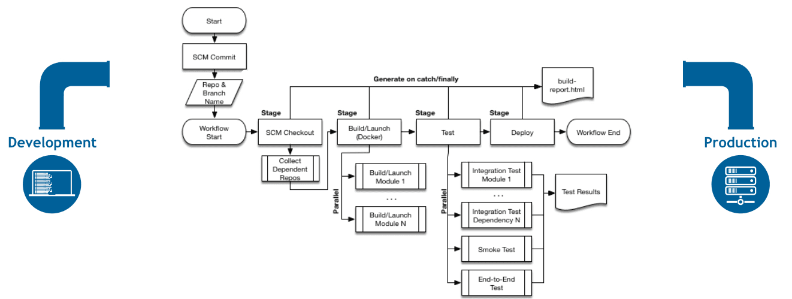
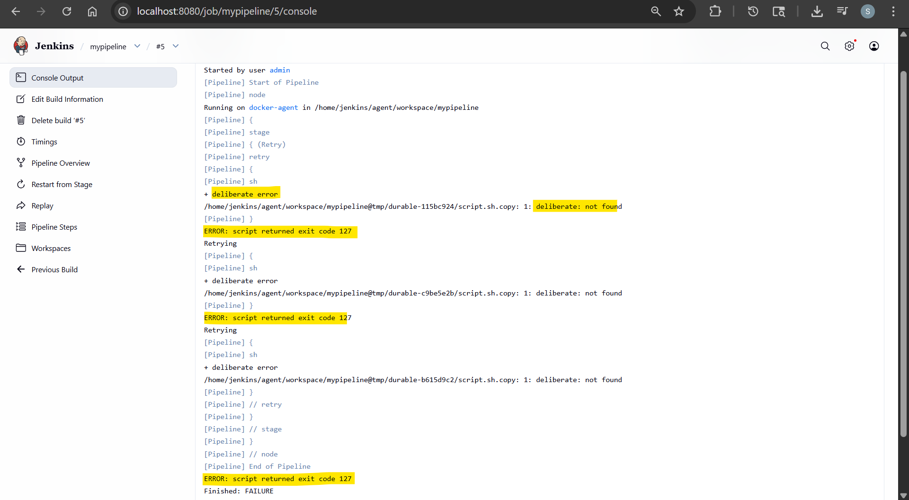
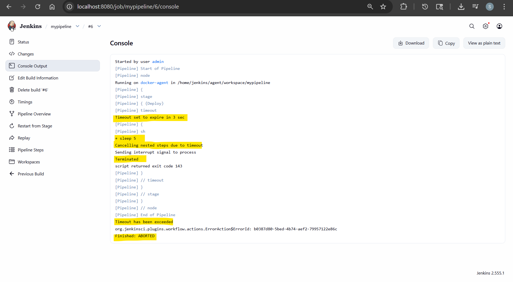

# Jenkins - Pipeline & Jenkinsfile

[Back](../index.md)

- [Jenkins - Pipeline \& Jenkinsfile](#jenkins---pipeline--jenkinsfile)
  - [Jenkins Pipeline](#jenkins-pipeline)
    - [Handle Credentials](#handle-credentials)
    - [Common workflow controls](#common-workflow-controls)
  - [Sample: Deploy pipeline](#sample-deploy-pipeline)
  - [Sample: Fast CI pipeline](#sample-fast-ci-pipeline)
  - [Lab: Create Pipeline](#lab-create-pipeline)
  - [Lab: Demo Retry](#lab-demo-retry)
  - [Lab: Demo Timeout](#lab-demo-timeout)

---

## Jenkins Pipeline

- `Jenkins Pipeline`
  - used to define the CI/CD workflow as code instead of clicking around in the UI.
  - It describes how your software is built, tested, and deployed in a structured, repeatable way.

- `Jenkinsfile`
  - a **text file** that contains the **definition of that pipeline**, written using a `Domain-Specific Language (DSL)` based on the Groovy programming language.
  - Key components:
    - `pipeline` → top-level definition
    - `agent` → where it runs (node, container, k8s pod)
    - `stages` → logical phases
    - `steps` → actual commands



---

### Handle Credentials

- Jenkins provides a credentials store
  - secret text,
  - username/password,
  - secret files,
  - SSH keys,
  - and certificates

- scope secrets:
  - `withCredentials`

```groovy
// scope secrets as narrowly as possible
stage('Call API') {
    steps {
        withCredentials([string(credentialsId: 'my-api-token', variable: 'API_TOKEN')]) {
            sh '''
              set +x
              curl -H "Authorization: Bearer $API_TOKEN" https://api.example.com
            '''
        }
    }
}
```

---

### Common workflow controls

- `timeout(time: 20, unit: 'MINUTES') {}`:
  - Stops a block if it runs too long
  - Finished: ABORTED
- `retry(3) {}`:
  - Retries a failing block a fixed number of times.
- `try {} catch (err) {throw err} finally {}`:
  - failure handling

- `when {branch 'main'} steps {}`:
  - Controls whether a stage should run.
- `input { message 'Deploy to production?' ok 'Deploy'} steps {}`
  - Pauses the pipeline and waits for human approval
- `post {success {} failure {} always {} }`:
  - define behavior after execution

- parallel run

```groovy
pipeline {
    agent any
    options {
        parallelsAlwaysFailFast()   // fail-fast behavior
    }
    stages {
        stage('Test') {
            parallel {
                stage('A') {
                    steps { sh './test-a.sh' }
                }
                stage('B') {
                    steps { sh './test-b.sh' }
                }
            }
        }
    }
}
```

---

- By default, Jenkins can allow **overlapping** builds
- prevent overlap:
  - `options { disableConcurrentBuilds() }`

---

## Sample: Deploy pipeline

```groovy
pipeline {
    agent any

    options {
        disableConcurrentBuilds()
        timeout(time: 30, unit: 'MINUTES')
    }

    stages {
        stage('Plan') {
            steps {
                retry(2) {
                    sh 'terraform plan'
                }
            }
        }

        stage('Approval') {
            input {
                message 'Apply infrastructure changes?'
                ok 'Apply'
            }
            steps {
                echo 'Approved'
            }
        }

        stage('Apply') {
            steps {
                sh 'terraform apply -auto-approve'
            }
        }
    }

    post {
        success {
            echo 'Success!'
        }
        failure {
            echo 'Failed!'
        }
    }
}
```

---

## Sample: Fast CI pipeline

```groovy
pipeline {
    agent any
    options {
        parallelsAlwaysFailFast()
    }

    stages {
        stage('Checks') {
            parallel {
                stage('Lint') {
                    steps { sh 'npm run lint' }
                }
                stage('Unit Test') {
                    steps { sh 'npm test' }
                }
                stage('Security Scan') {
                    steps { sh './scan.sh' }
                }
            }
        }
    }
}
```

---

## Lab: Create Pipeline

- Create item:
  - name: mypipeline
  - type: pipeline
- Pipeline:
  - Definition: pipeline script

```groovy
pipeline {
    agent any

    stages {
        stage('Build') {
            steps {
                echo 'Build ...'
                sh """
                    echo 'multiple steps:'
                    pwd
                    date
                    hostname
                """
            }
        }

        stage('Test') {
            steps {
                echo 'Testing ...'
            }
        }

        stage('Deploy') {
            steps {
                echo 'Deploy ...'
            }
        }
    }

    post {
        success {
            echo 'Success!'
        }
        failure {
            echo 'Failed!'
        }
    }
}
```

---

## Lab: Demo Retry

```groovy
pipeline {
    agent any

    stages {
        stage('Retry') {
            steps {
                retry(3){
                    sh 'deliberate error'
                }
            }
        }
    }
}
```



---

## Lab: Demo Timeout

```groovy
pipeline {
    agent any

    stages {
        stage('Deploy') {
            steps {
                timeout(time: 3, unit: "SECONDS"){
                    sh 'sleep 5'
                }
            }
        }
    }
}
```


