# Jenkins - Security

[Back](../index.md)

- [Jenkins - Security](#jenkins---security)
  - [Good Practices](#good-practices)
  - [Role-based Authorization Strategy](#role-based-authorization-strategy)
  - [Lab: Manage Users with RBAS](#lab-manage-users-with-rbas)

---

## Good Practices

- **User login**
  - Disable allow users sign up
  - Authorization:
    - disable **allow anonymous read access**: users who are not authenticated to access Jenkins in a read-only mode.

- **Secure Jenkins Controller**
  - set the number of executors on the built-in node to 0
    - `built-in node`: Jenkins controller itself — the machine where Jenkins is running.
    - Do NOT run any build jobs on the controller node.

---

## Role-based Authorization Strategy

- **Install Plugins**
  - `Role-based Authorization Strategy`: Enables user authorization using a Role-Based strategy.
    - enable: security > Authorization = Role-Based Strategy
    - Manage Jenkins > Security > Manage and Assign Roles

    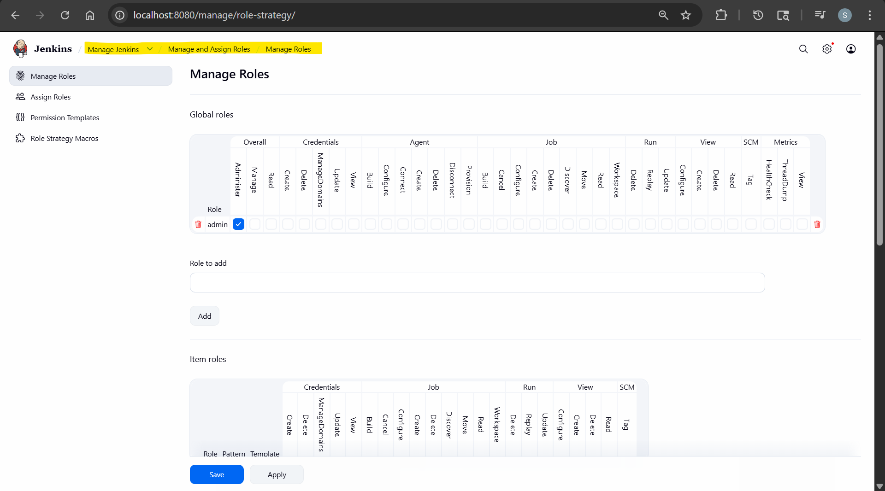

- `role`:
  - a set of permission to be granted

---

## Lab: Manage Users with RBAS

- Create new user and login
  - Access Denied, bob is missing the Overall/Read permission

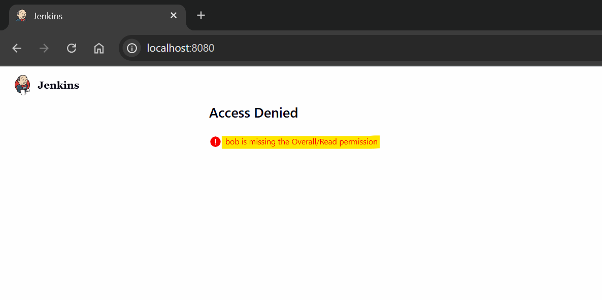

- Create read-only role

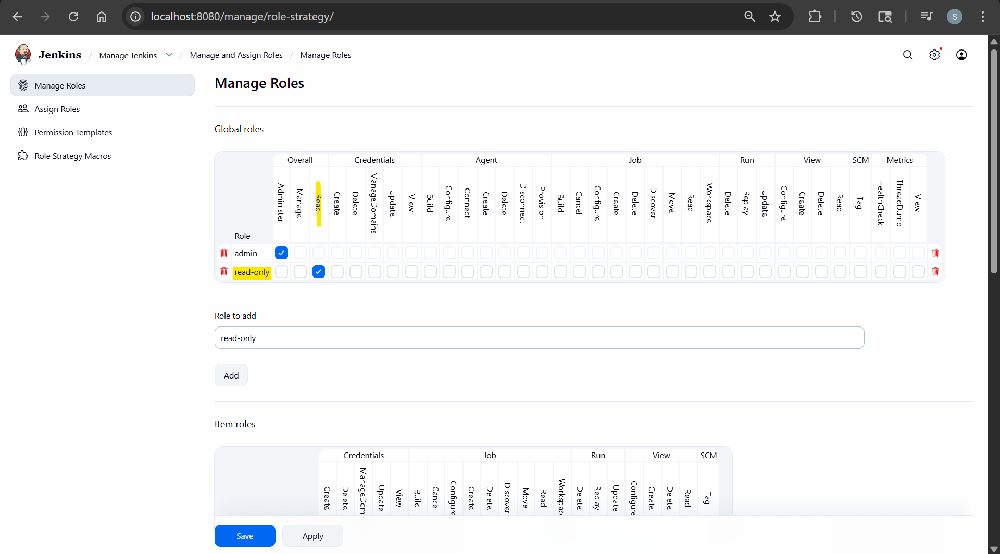

- Assign Role

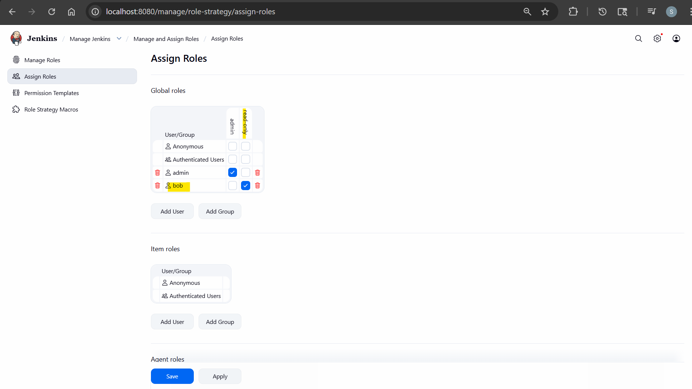

- re-login

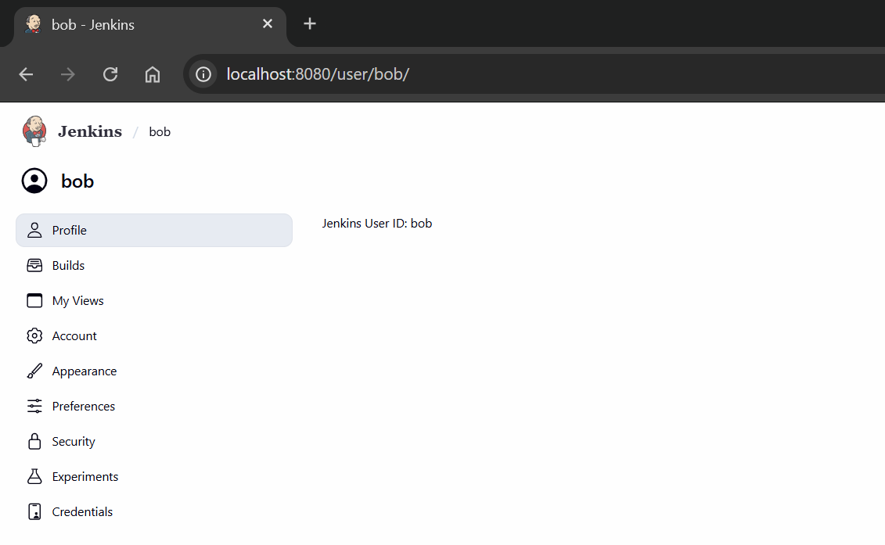

- Add permission: read job

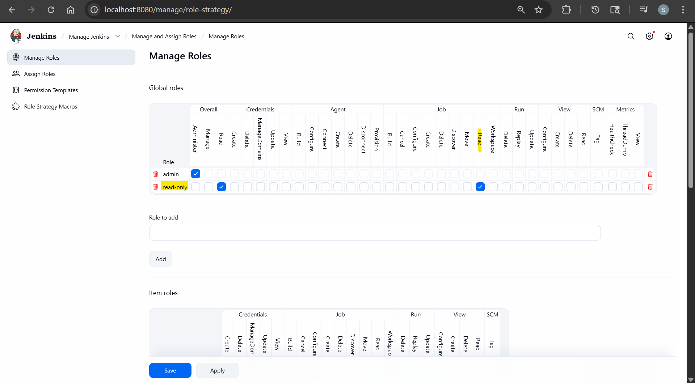

- re-login

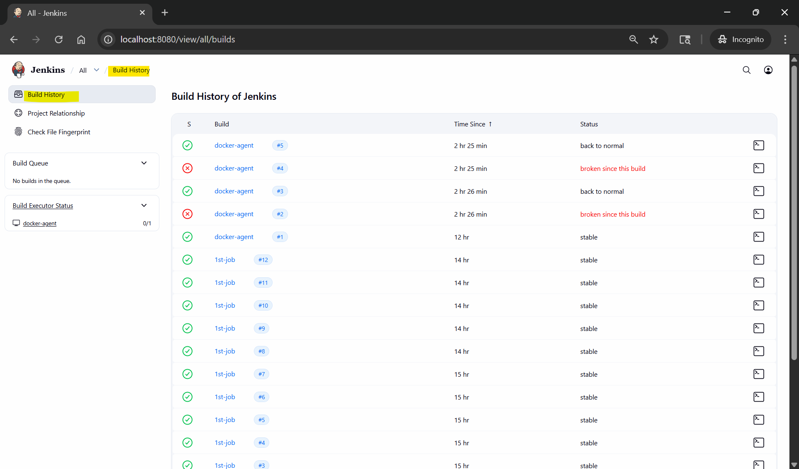

---

- Create new role: run-job

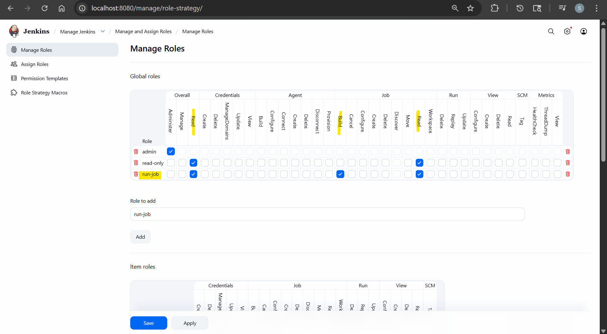

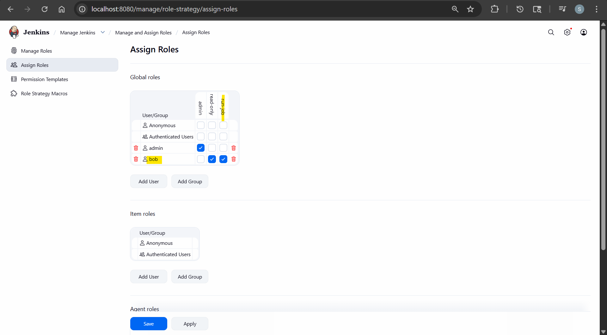

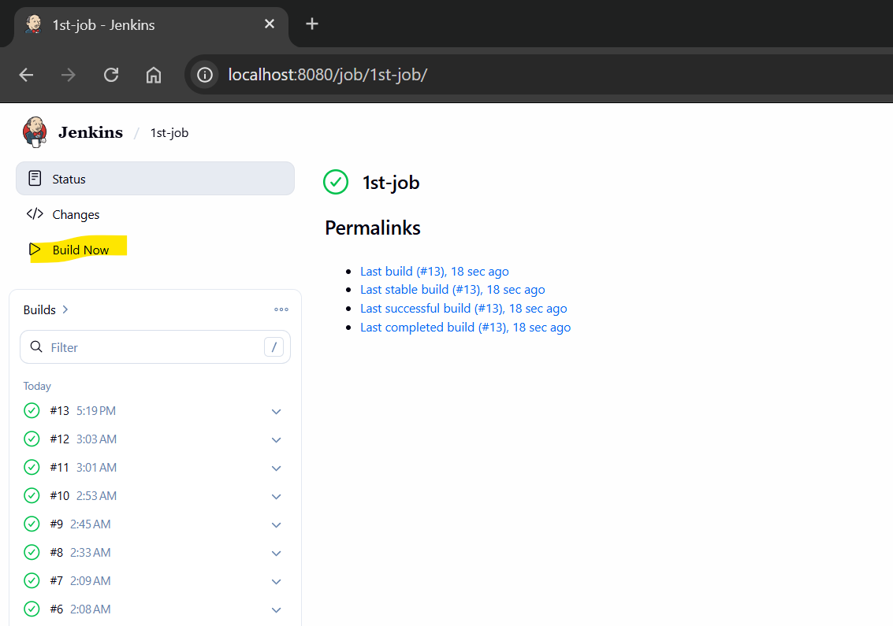

---

- Global roles: dev
  - overall: read
  - job: read

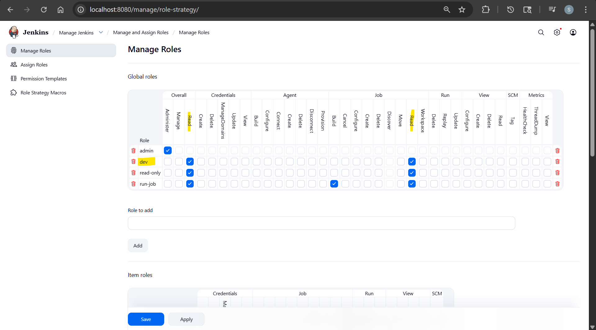

- Item roles: 1st
  - pattern: 1st.\*

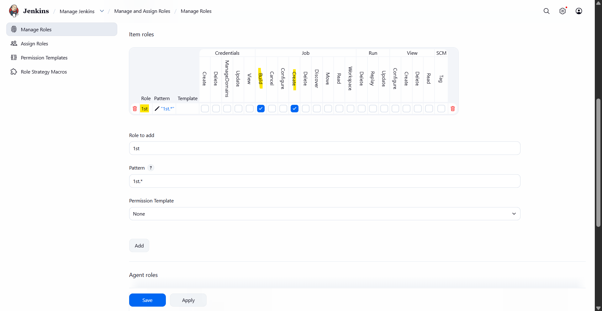

- Assign

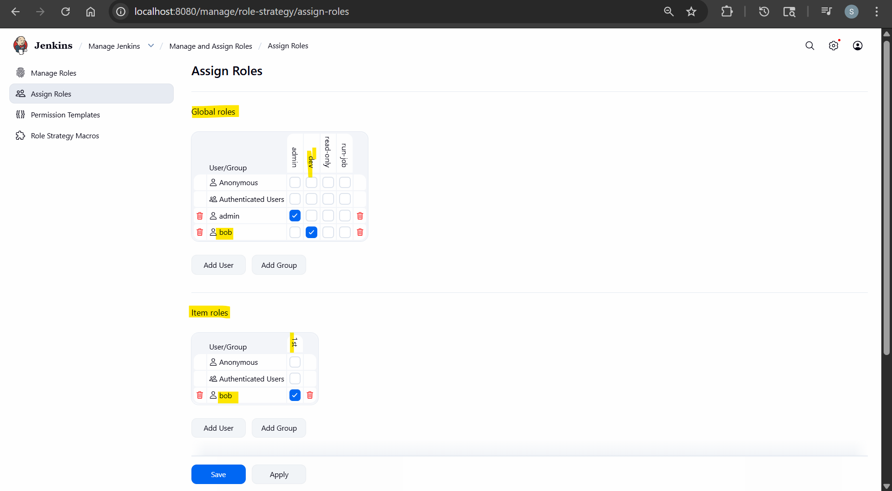

- re-login
  - 1st-\*: can see and run
  - docker\*: can see only

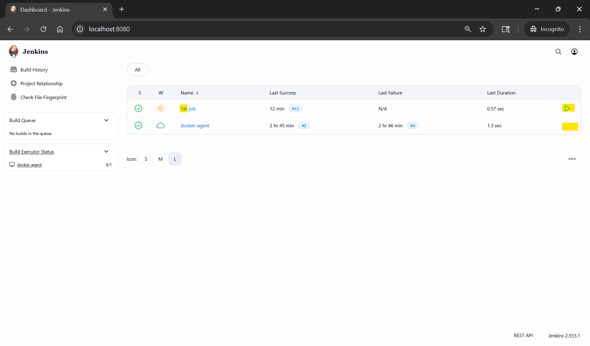
