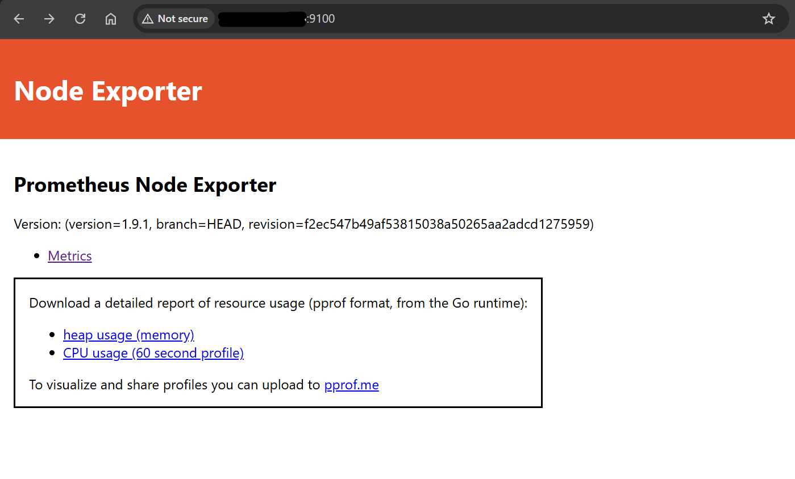
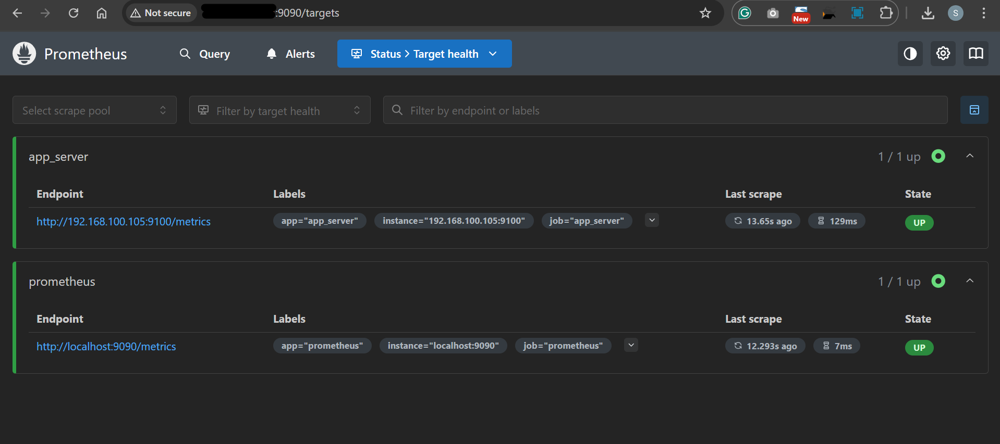

# Prometheus - Data Collection

[Back](../index.md)

- [Prometheus - Data Collection](#prometheus---data-collection)
  - [Data Collection](#data-collection)
  - [Node Exporter](#node-exporter)
  - [Lab: Node Exporter - Ubuntu](#lab-node-exporter---ubuntu)
    - [Client Node Configuration](#client-node-configuration)
    - [Prometheus Node Configuration](#prometheus-node-configuration)
    - [Reconfigure Client Node: Create a node export service](#reconfigure-client-node-create-a-node-export-service)
  - [PromQL](#promql)
    - [Data Types](#data-types)

---

## Data Collection

- **Scaping** method

  - Common method used by `Prometheus`
  - Applications install `exporter`, from which `Prometheus` pulls the metrics.

- **Push** method

  - `Prometheus` uses `push gateway` to collect metrics from the application.
  - Limitation of push method
    - requires application source code to implement the push method
    - unscalable

- `push gateway`
  - a component of `Prometheus`
  - acts as temporary storage, to which application send the metric and from which Prometheus can scrape metric.
  - allows applications to use push method.
  - Prometheus is always a pull time series database.

---

## Node Exporter

- Every Unix-based kernel is called a `Node`.
- `Node Exporter`

  - an official `Prometheus` exporter to collect metrics that are exposed by **Unix-based kernel**.

- Metrics:

  - CPU
  - Disk
  - Memory
  - Network I/O

- `Node Exporter` can be extended with **pluggable metric collectors**.

---

## Lab: Node Exporter - Ubuntu

- Architecture

  - Unless required, never put node server on Prometheus server
  - Prometheus server, where prometheus installed
  - Node server, from which data is collected.

- Security configuration:

  - allow inbound port `9100/TCP` and **IP** of the Prometheus server

- Url for node exporter package

  - https://prometheus.io/download/#node_exporter
  - https://github.com/prometheus/node_exporter/releases/download/v1.9.1/node_exporter-1.9.1.linux-amd64.tar.gz

---

### Client Node Configuration

```sh
sudo apt update && sudo apt upgrade -y

# download node exporter
sudo wget https://github.com/prometheus/node_exporter/releases/download/v1.9.1/node_exporter-1.9.1.linux-amd64.tar.gz

# confirm
ls -lh
# total 12M
# -rw-r--r-- 1 root root 12M Apr  1 11:24 node_exporter-1.9.1.linux-amd64.tar.gz

# unzip
sudo tar -xvf node_exporter-1.9.1.linux-amd64.tar.gz
# node_exporter-1.9.1.linux-amd64/
# node_exporter-1.9.1.linux-amd64/LICENSE
# node_exporter-1.9.1.linux-amd64/NOTICE
# node_exporter-1.9.1.linux-amd64/node_exporter

# confirm
ls -l
# total 11316
# drwxr-xr-x 2 1001 1002     4096 Apr  1 11:23 node_exporter-1.9.1.linux-amd64

# test node exporter
cd node_exporter-1.9.1.linux-amd64
./node_exporter
# check for msg="Listening on" address=[::]:9100
```

- Confirm 9100 port
  - http://client_node:9100



---

### Prometheus Node Configuration

- update cf

```yaml
# scrape_configs section
scrape_configs:
  # default job to scrape metrice from prometheus node
  - job_name: "prometheus"
    static_configs:
      - targets: ["localhost:9090"]
      - job_name: "prometheus"

  # add job to scrape from node exporter
  - job_name: "app_server"
    static_configs:
      - targets: ["192.168.100.105:9100"]
        labels:
          app: "app_server"
```

```sh
# restart prometheus
sudo systemctl restart prometheus
```

- Confirm: Prometheus server UI > Status > Target health



---

### Reconfigure Client Node: Create a node export service

```sh
# create user and group
sudo groupadd --system prometheus
sudo useradd prometheus -s /sbin/nologin --system -g prometheus

# move node_exporter binary
sudo mkdir -pv /var/lib/node/
# mkdir: created directory '/var/lib/node/'
sudo mv -v ./node_exporter /var/lib/node/
# renamed './node_exporter' -> '/var/lib/node/node_exporter'

# set permission
sudo chown -Rv prometheus:prometheus /var/lib/node/
# changed ownership of '/var/lib/node/node_exporter' from 1001:1002 to prometheus:prometheus
# changed ownership of '/var/lib/node/' from root:root to prometheus:prometheus
sudo chmod -Rv 775 /var/lib/node/
# mode of '/var/lib/node/' changed from 0755 (rwxr-xr-x) to 0775 (rwxrwxr-x)
# mode of '/var/lib/node/node_exporter' changed from 0755 (rwxr-xr-x) to 0775 (rwxrwxr-x)

sudo tee /etc/systemd/system/prometheus_node_exporter.service <<EOF
[Unit]
Description=Prometheus Node Exporter
Documentation=https://prometheus.io/docs/introduction/overview/
Wants=network-online.target
After=network-online.target

[Service]
Type=simple
User=prometheus
Group=prometheus
ExecReload=/bin/kill -HUP $MAINPID
ExecStart=/var/lib/node/node_exporter

SyslogIdentifier=prometheus_node_exporter
Restart=always

[Install]
WantedBy=multi-user.target
EOF

# start service
sudo systemctl daemon-reload
sudo systemctl enable --now prometheus_node_exporter

# confirm
sudo systemctl status prometheus_node_exporter
```

- Confirm: Prometheus server UI > Status > Target health

---


## PromQL

### Data Types

- Scalar:
  - Float
    - include integer
    - i.e., 1, 1.5
    - using `""`
  - String
    - using `""`/`''`
- Example:

```promql
<!-- store -->
prometheus_http_requests_total{code="200",job="prometheus"}

<!-- query, query a metric with 2** code-->
prometheus_http_requests_total{code=~"2.*",job="prometheus"}
<!-- query, query a metric with 200 code -->
prometheus_http_requests_total{code=~"200",job="prometheus"}
```

- `Instant Vectors`