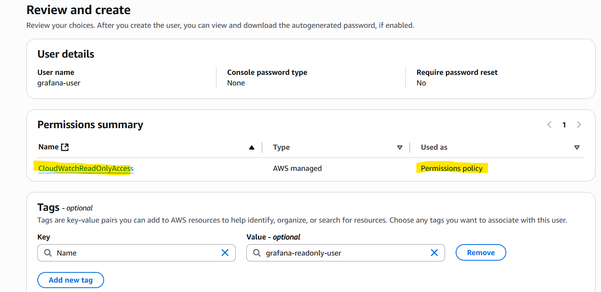
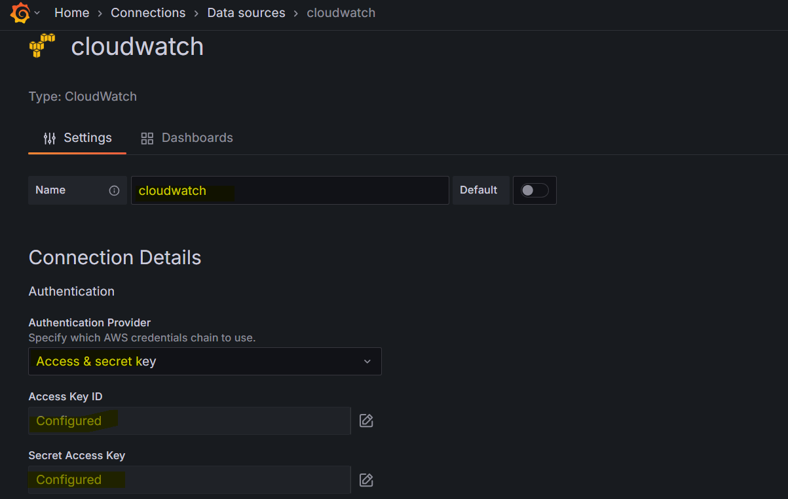
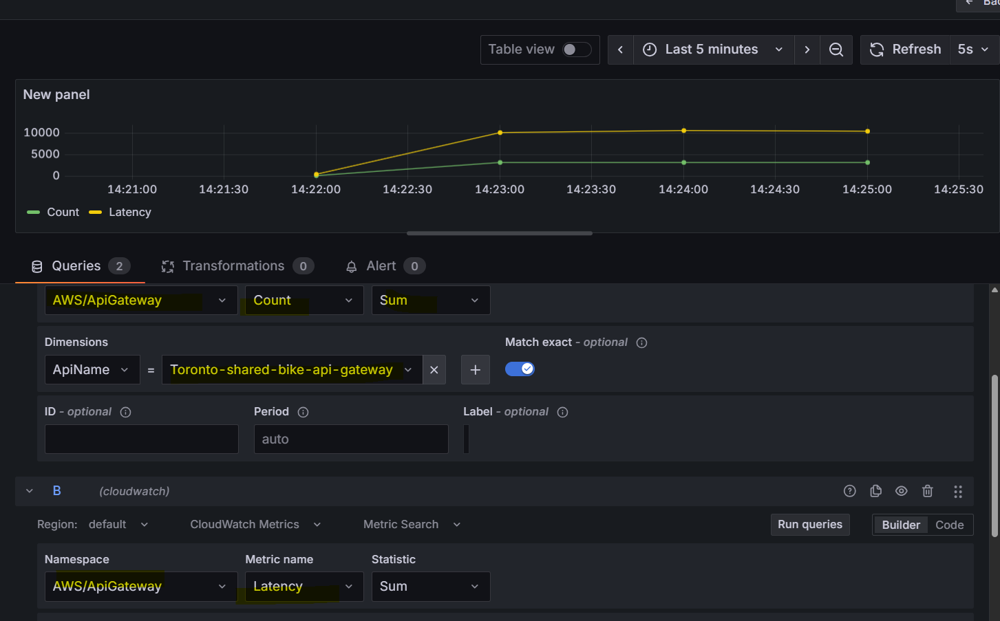

# Prometheus - Grafana Data Source: AWS CloudWatch

[Back](../../index.md)

- [Prometheus - Grafana Data Source: AWS CloudWatch](#prometheus---grafana-data-source-aws-cloudwatch)
  - [AWS CloudWatch](#aws-cloudwatch)
  - [IAM: Create Grafana User](#iam-create-grafana-user)
  - [Create CloudWatch Data Source](#create-cloudwatch-data-source)
  - [Create Dashboard](#create-dashboard)

---

## AWS CloudWatch

- AWS CloudWatch Hierarchy

  - **Region**
    - **Namespace**
      - `/aws/lambda`
        - **Dimension**: Function Name
        - **Metric**: Invocations
      - `/aws/ec2`
        - **Dimension**: instance id
        - **Metric**: CPU Usage

- Ref:

  - namespace: https://docs.aws.amazon.com/AmazonCloudWatch/latest/monitoring/aws-services-cloudwatch-metrics.html

- CloudWatch Configuration
  - IAM User
  - Assign CloudWatchReadOnly Policy
  - AccessKey + SecretKey

---

## IAM: Create Grafana User

- Create user and inline policy

- Create credential
  - local code
  - access key

---

## Create CloudWatch Data Source

---

## Create Dashboard

