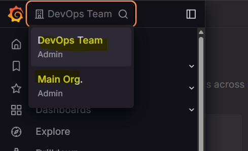
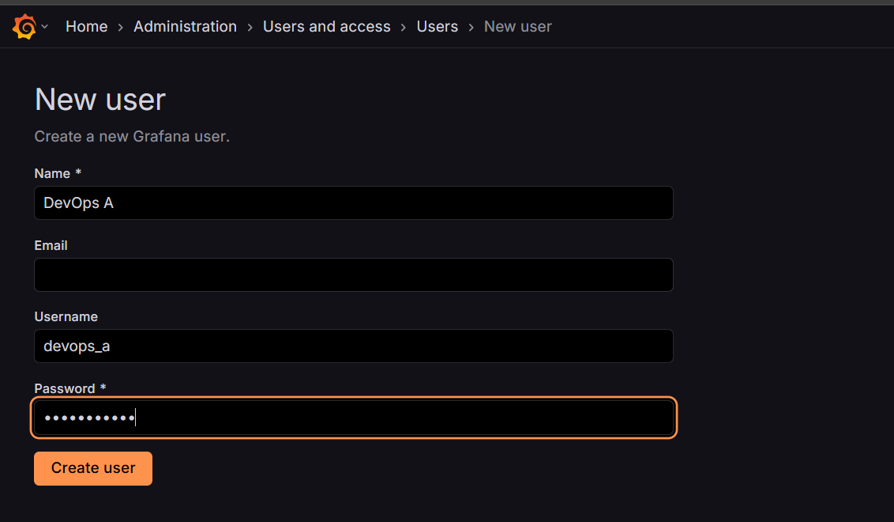
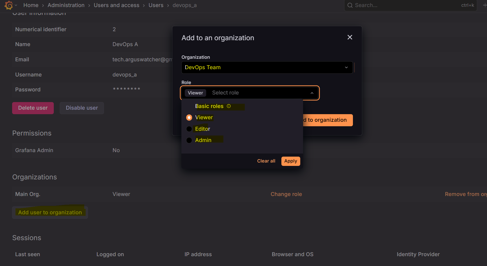
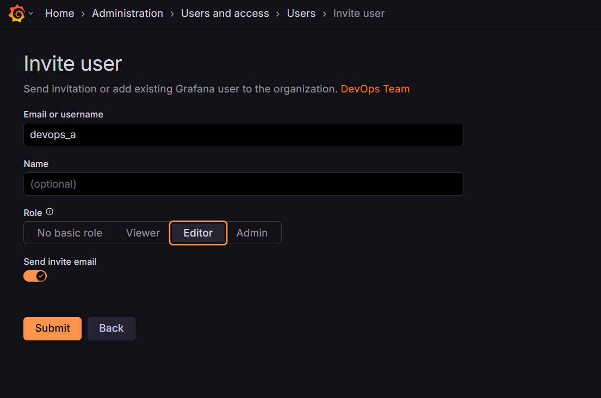
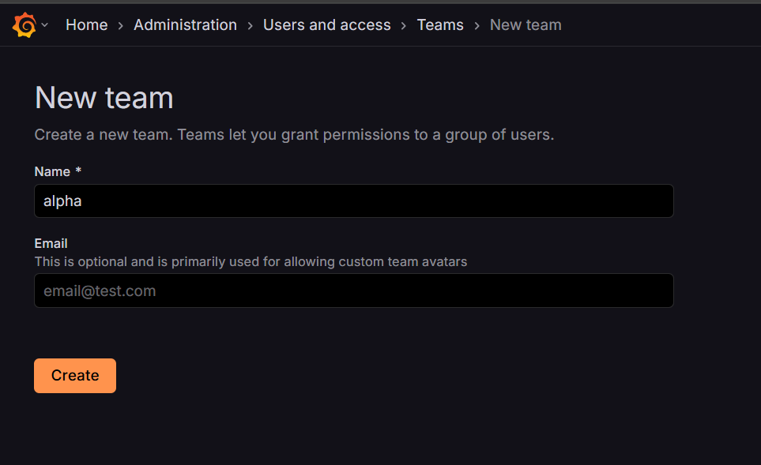
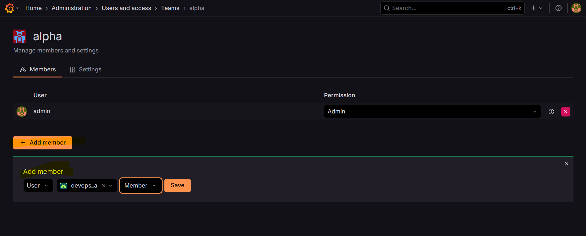

# Grafana - Administration

[Back](../../index.md)

- [Grafana - Administration](#grafana---administration)
  - [Administration](#administration)
    - [Organ](#organ)
  - [User](#user)
  - [Team](#team)

---

## Administration

- Users admin architecture

  - Organization
  - Users
  - Teams
  - Service accounts

---

### Organ

- Isolated instances of Grafana running on the same server

- Can choose between Organ
  - Dashboard are based on Organization

---

## User

- Create user

- Assign user to an Organ

- Can invite a user

---

## Team

- create team

- Add team member

