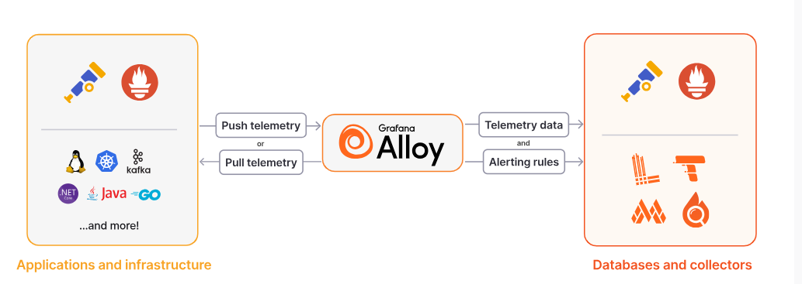

# Prometheus - Opentelemetry & Alloy

[Back](../../index.md)

- [Prometheus - Opentelemetry \& Alloy](#prometheus---opentelemetry--alloy)
  - [Opentelemetry](#opentelemetry)
    - [Dev view vs DevOps view](#dev-view-vs-devops-view)
    - [Architecture](#architecture)
    - [Prometheus Remote Write](#prometheus-remote-write)
  - [Grafana Alloy](#grafana-alloy)
    - [with loki](#with-loki)
    - [Install - Ubuntu](#install---ubuntu)

---

## Opentelemetry

- `Opentelemetry(OTel)`
  - vendor-neutral and open-source oberserability Framework.
  - collect and export metrics, logs, and traces
  - OTel is not an observability backend like Prometheus
    - focus on generation, collection, and export of telemetry.

---

### Dev view vs DevOps view

- dev:

  - produce measurements and logs in code
  - goal: get obserability by writing code.
  - Use Opentelemetry SDK to produce metric and logs
  - languages: Python, Java, javascript, ...

- devops:
  - collect metrics, logs, and traces and send them to an observability backend, i.e., Prometheus
  - visualize the collected metrics, traces and logs efficiently
  - goal: get telemetry without touching the code

---

### Architecture

Microservices (app code + OTel SDK) --> OTel Exporter(i.e., Prometheus Exporter) --> OTel Collectors(Optional) --> Backend (prometheus)

---

### Prometheus Remote Write

- `Prometheus Remote Write`
  - a protocol and feature within Prometheus that enables the **real-time transfer of metrics data to external storage systems**.

Exporter --pull--> Prometheus server --> Another Prometheus Server (http://prom_server:9090/api/v1/write)

---

## Grafana Alloy

- `Grafana Alloy`
  - a flexible, high-performance, vendor-neutral distribution of the `OpenTelemetry Collector`.
  - designed for production observability, packaging **upstream** `OpenTelemetry Collector` components and `Prometheus exporters`.



---

### with loki

- loki.source: the target log file
- otelcol.receiver.filelog: import log file into a file
- otelcol.exporter.loki: forward the log file
- loki.write: the endpoint

---

### Install - Ubuntu

```sh
# Import the GPG key:
sudo mkdir -p /etc/apt/keyrings/
wget -q -O - https://apt.grafana.com/gpg.key | gpg --dearmor | sudo tee /etc/apt/keyrings/grafana.gpg > /dev/null

# To add a repository for stable releases, run the following command:
echo "deb [signed-by=/etc/apt/keyrings/grafana.gpg] https://apt.grafana.com stable main" | sudo tee -a /etc/apt/sources.list.d/grafana.list

sudo apt update
sudo apt install alloy
```
