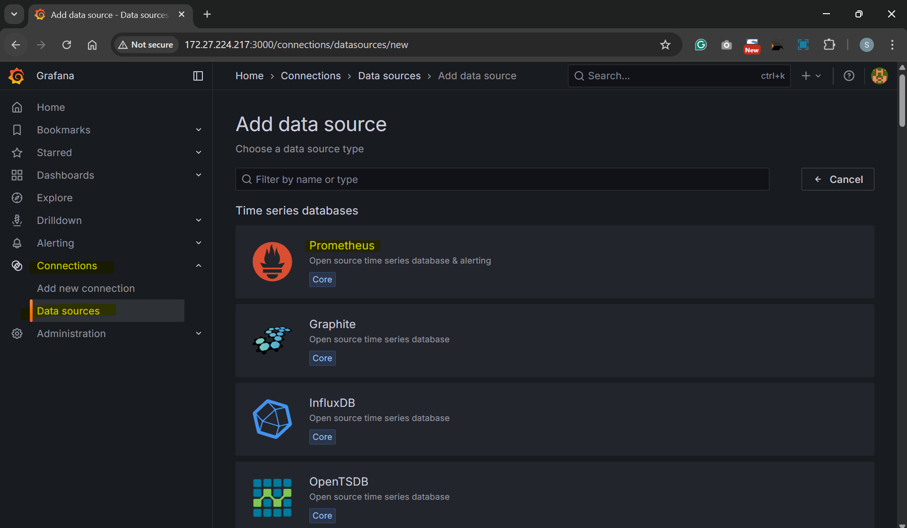
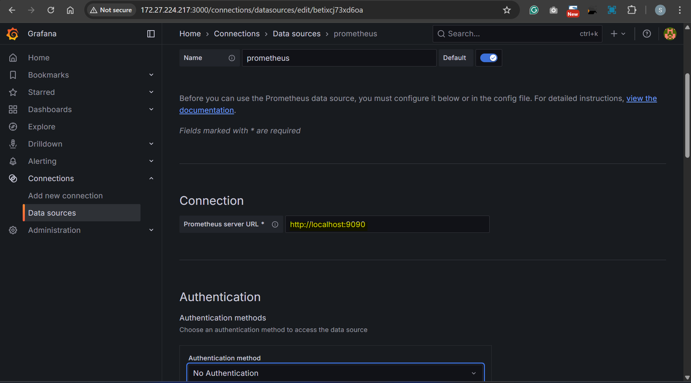
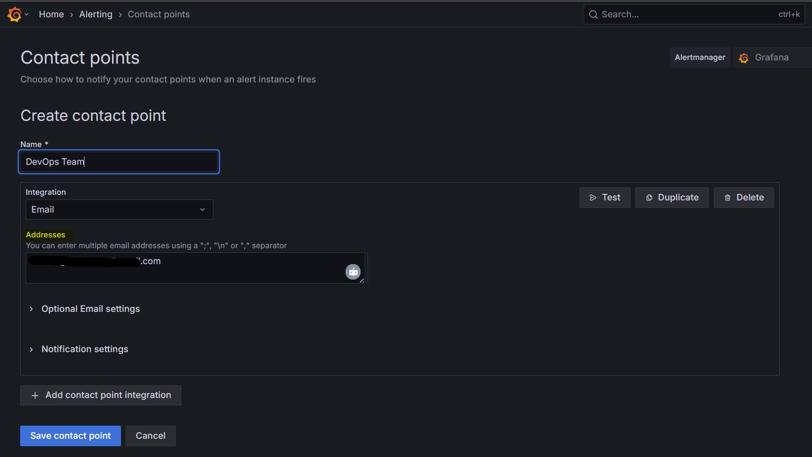
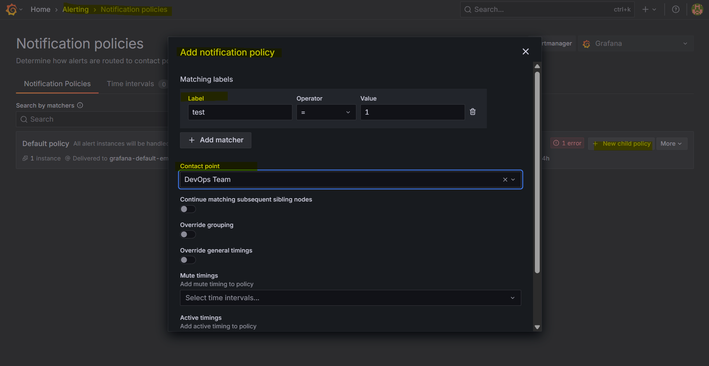
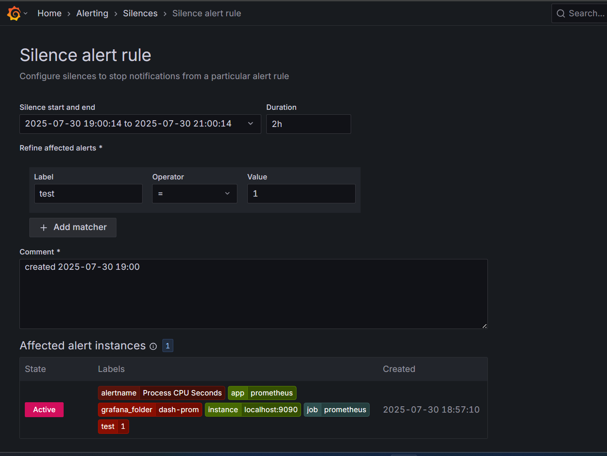

# Prometheus - Grafana

[Back](../../index.md)

- [Prometheus - Grafana](#prometheus---grafana)
  - [Grafana](#grafana)
  - [Configuration](#configuration)
  - [Dashboard Design](#dashboard-design)
  - [Connect with Prometheus](#connect-with-prometheus)
  - [Altering](#altering)
    - [Notification Configuration - Email](#notification-configuration---email)
    - [Silence Period](#silence-period)

---

## Grafana

- `Grafana Cloud`:
  - a fully managed cloud-hosted observability platform
  - Metrcis, logs and traces

---

## Configuration

- CF path: `/etc/grafana`

  - default cf: `/etc/grafana/grafana.ini`

- Good practices: backup default cf

```sh
ls /etc/grafana -lh
total 96K
-rw-r----- 1 root grafana  85K Jul 30 15:32 grafana.ini
-rw-r----- 1 root grafana 3.1K Jul 30 15:32 ldap.toml
drwxr-xr-x 7 root grafana 4.0K Jul 30 15:32 provisioning

# backup cf
sudo cp /etc/grafana/grafana.ini /etc/grafana/grafana.ini.bak
```

---

## Dashboard Design

- Common User Case

  - Browser Applications
  - Application performance Monitoring (APM) / Backend Services
  - Infrastructure (Host, Network, Disk, etc)
  - Synthetic Monitors
  - Business monitoring (Sales, Refunds, Payments)

- Example: Browser Applications

  - HTTP Error Rate
  - Top 10 Error Messages
  - Page View Load Time
  - Page View Per Minute
  - Largest Contentful Paint (LCP)
  - First Input Delay (FID)
  - Cumulative Layout Shift (CLS)

- Example: APM services

  - API Call Per Minute
  - Error Rate Per minute
  - Logs
  - Hosts / Containers
  - CPU Usage
  - Memory Usage

- Example: Infracture

  - Summary Info (Hosts, Applications, Events, Alerts etc)
  - Metrics (CPU, Memory, Disk Used, Disk Utilizations)
  - Hosts / Containers
  - Databases
  - Distributed Cache

- Example: SYnthetic Monitors

  - Landing Page up View/Alert
  - APIs Health Check Status
  - Page Load Performance
  - External Systems Status

- Example: Business Monitoring
  - Total Sales Count, Sales Value (This month)
  - Sales by Region/Country (This month)
  - Conversion Rate
  - Customer Acquisition
  - Abandoned Checkout
  - Top Payment Methods
  - Payments vs. Refunds
  - Basket Value

---

## Connect with Prometheus





> prometheus and grafana are installed on the same host.

---

## Altering

- `Altert Rule`

  - defined as queries and checked by **Alert Manager**

- `Alert`

  - raised when a defined rule is violated
  - sent to **Notification Policies**

- `Notification Policies`
  - decide whether to send out the notification
  - If so, send notifications to `contact points` (i.e., email).

---

### Notification Configuration - Email

- `grafana.ini`

```ini
[smtp]
enabled = true
host = smtp.gmail.com:587
user = tech.arguswatcher@gmail.com
password = pwd
```

- Create a Contact point



- Create Notification Policy



---

### Silence Period

- Alert fires, but no notification would be sent.


