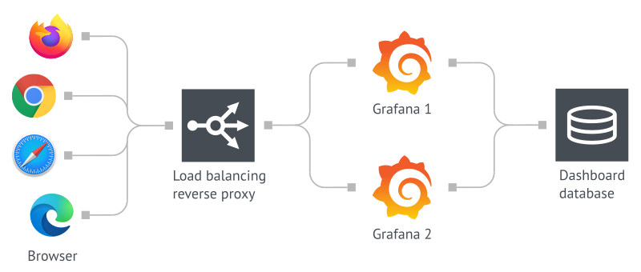
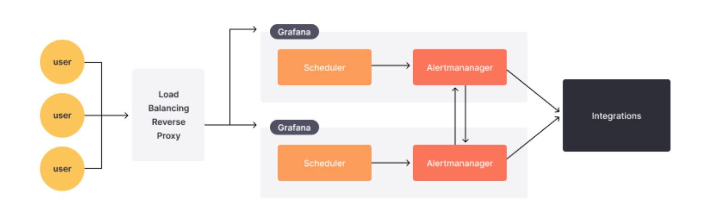

# Grafana - High Availability

[Back](../../index.md)

- [Grafana - Administration](#grafana---administration)
  - [Administration](#administration)

---

## High Availability

- ref

  - https://grafana.com/docs/grafana/latest/setup-grafana/set-up-for-high-availability/

- HA:
  - more than one Grafana instances

---

## Alerting HA

- ref:
  - https://grafana.com/docs/grafana/latest/alerting/set-up/configure-high-availability/

---

## Scalability

- Tools: manage Grafana instances dynamically
  - AWS Autoscaling Group
  - Azure VMSS
  - AWS ECS
  - AWS EKS

- To get the Grafana instance DNS, redis can be used to store the ips of each instance.