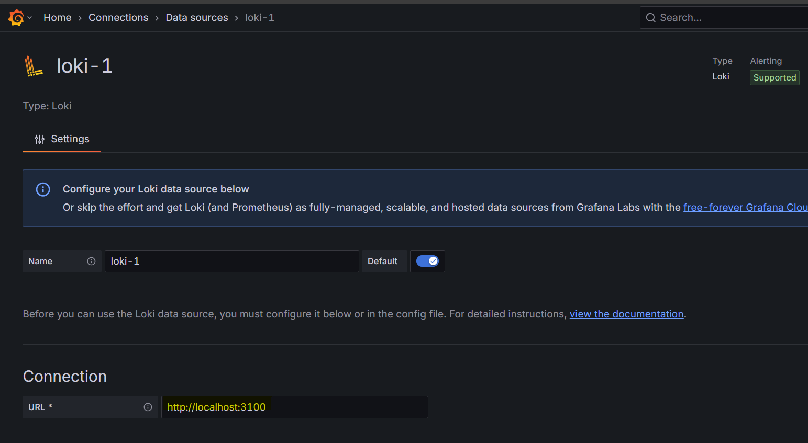
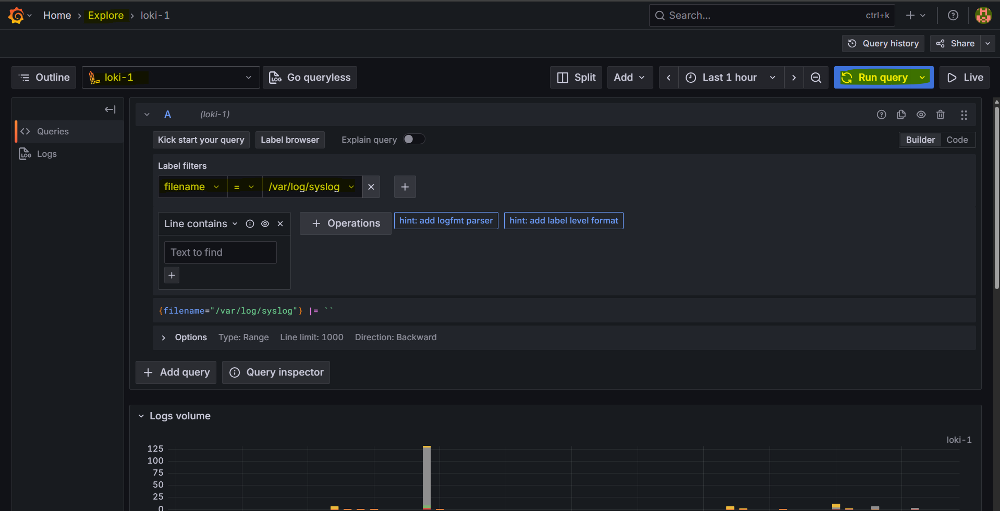
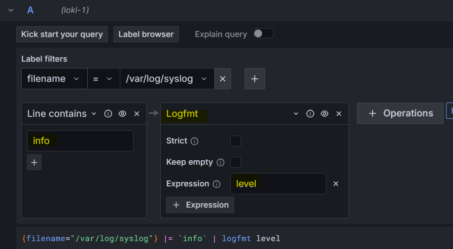
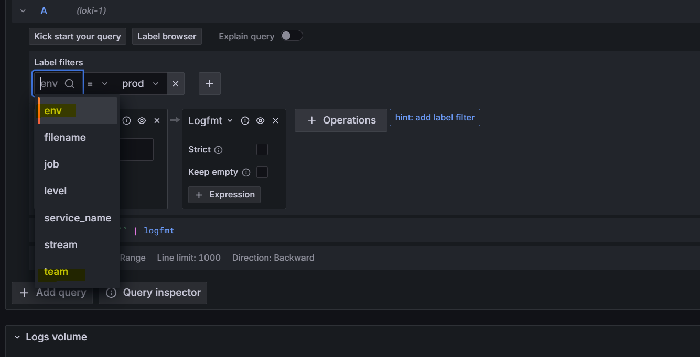
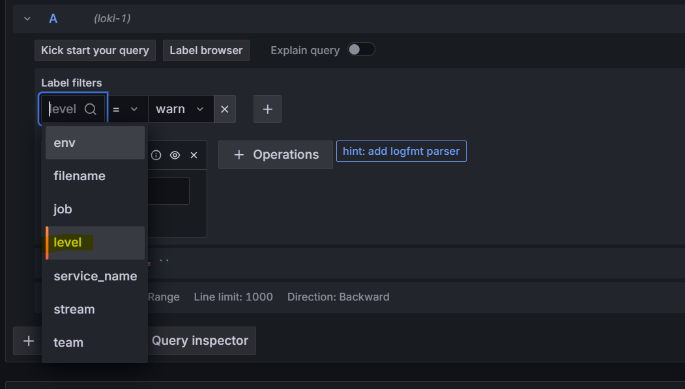
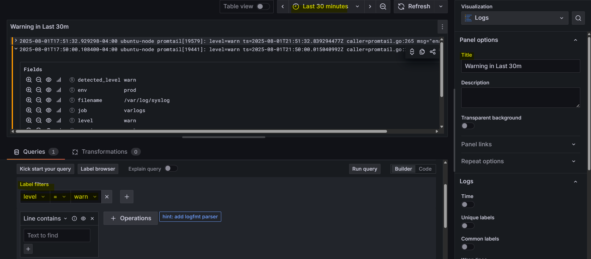
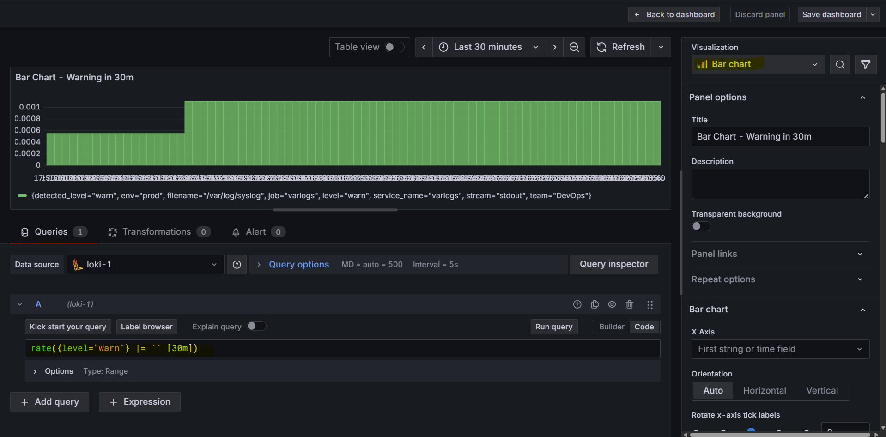
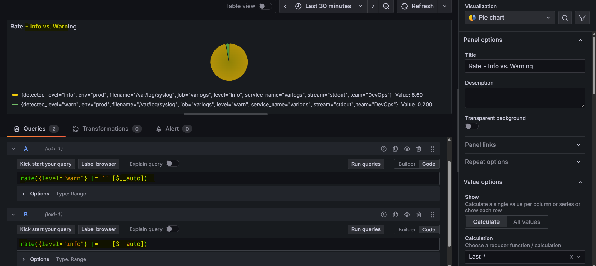

# Prometheus - Grafana Loki

[Back](../../index.md)

- [Prometheus - Grafana Loki](#prometheus---grafana-loki)
  - [Grafana Loki](#grafana-loki)
  - [Install - Ubuntu](#install---ubuntu)
  - [Query Log](#query-log)
    - [Create Data Source](#create-data-source)
    - [Configure Static Labels](#configure-static-labels)
    - [Dynamic Labels](#dynamic-labels)
  - [Visualize log](#visualize-log)
  - [Install - Docker](#install---docker)

---

## Grafana Loki

- `Loki`:

  - a log aggregation system designed to work with Grafana.

- features:

  - **Log Aggregation**: Collecting, storing, and querying large amount of logs.
  - **Prometheus-inspired design**: Users similar query language as Prometheus.
  - Intergration with Grafana: Users can visualize log data in Grafana dashboards, allowwing for **correlation** of log events with other observability **metrics**.
  - **Distributed Architecture**: It can scale horizontally.
  - **Cost-effective storage**: Chrunk-based storage mechanism

- How to collect log file from app to grafana
  - opt1:using Promtail, recommended
    - application: generate log files (/var/logs)
    - Promtail: an agent to collect log file and push log files to Loki
    - Loki: a data source in Grafana
    - Grafana: visualize log
  - opt2: not recommended, creating dependency with Loki
    - application: push log file Loki using API
  - opt3: Alloy
    - application: generate log files (/var/logs)
    - Alloy: ingest log files then push to Loki; not just log file, can collect info of process signal.
    - Loki: a data source in Grafana
    - Grafana: visualize log

---

## Install - Ubuntu

- ref: https://grafana.com/docs/loki/latest/setup/install/

- Loki server:

  - install `Loki`
  - port: 3100

- Application server:

  - install `Promtail`

---

- Loki Server

```sh
sudo apt update
sudo apt install unzip -y
# install loki
sudo wget https://github.com/grafana/loki/releases/download/v3.4.5/loki-linux-amd64.zip

sudo unzip loki-linux-amd64.zip
sudo mv -v loki-linux-amd64 /usr/local/bin/loki
sudo chmod +x -v /usr/local/bin/loki

# create config
sudo mkdir -pv /etc/loki
sudo tee /etc/loki/loki-local-config.yaml <<EOF
# This is a complete configuration to deploy Loki backed by the filesystem.
# The index will be shipped to the storage via tsdb-shipper.

auth_enabled: false

server:
  http_listen_port: 3100

common:
  ring:
    instance_addr: 127.0.0.1
    kvstore:
      store: inmemory
  replication_factor: 1
  path_prefix: /tmp/loki

schema_config:
  configs:
  - from: 2020-05-15
    store: tsdb
    object_store: filesystem
    schema: v13
    index:
      prefix: index_
      period: 24h

storage_config:
  filesystem:
    directory: /tmp/loki/chunks

EOF

# create a loki service
sudo tee /etc/systemd/system/loki.service <<EOF
[Unit]
Description=Loki service
After=network-online.target
Wants=network-online.target

[Service]
Type=simple
User=loki
ExecStart=/usr/bin/loki -config.file /etc/loki/loki-local-config.yaml
TimeoutSec = 120
Restart = on-failure
RestartSec = 2

[Install]
WantedBy=multi-user.target
EOF

sudo systemctl daemon-reload
sudo systemctl enable --now loki

sudo systemctl status loki

# test
curl http://localhost:3100/ready
# ready
```

---

- App Server
- Download url:
  - https://github.com/grafana/loki/releases/
  - promtail-linux-amd64.zip

```sh
sudo apt update

# download zip file
wget https://github.com/grafana/loki/releases/download/v3.4.5/promtail-linux-amd64.zip
# unzip
unzip promtail-linux-amd64.zip

# move files
sudo mv -v promtail-linux-amd64 /usr/local/bin/promtail
sudo chmod +x -v /usr/local/bin/promtail

# create cf
sudo mkdir -v /etc/promtail

# create cf
sudo tee /etc/promtail/promtail-config.yaml <<EOF
server:
  http_listen_port: 9080
  grpc_listen_port: 0

positions:
  filename: /tmp/positions.yaml

clients:
  - url: http://172.27.224.217:3100/loki/api/v1/push

scrape_configs:
- job_name: system
  static_configs:
  - targets:
      - localhost
    labels:
      job: varlogs
      __path__: /var/log/*log
      stream: stdout
EOF

# create a promtail service
sudo tee /etc/systemd/system/promtail.service <<EOF
[Unit]
Description=Promtail service
After=network.target

[Service]
Type=simple
ExecStart=/usr/local/bin/promtail -config.file=/etc/promtail/promtail-config.yaml
Restart=on-failure

[Install]
WantedBy=multi-user.target
EOF

# start service
sudo systemctl daemon-reload
sudo systemctl enable --now promtail

sudo systemctl start promtail
sudo systemctl status promtail
```

---

## Query Log

### Create Data Source



- Query by file



- Query by Logfmt
  - Filter level=info



---

### Configure Static Labels

- Static Labels: can be configured in the client server and used to filter log in Loki server

- Update the promtail cf

```sh
sudo tee /etc/promtail/promtail-config.yaml <<EOF
server:
  http_listen_port: 9080
  grpc_listen_port: 0

positions:
  filename: /tmp/positions.yaml

clients:
  - url: http://172.27.224.217:3100/loki/api/v1/push

scrape_configs:
- job_name: system
  static_configs:
  - targets:
    - localhost
    labels:
      job: varlogs
      __path__: /var/log/*log
      stream: stdout
      team: DevOps
      env: prod
EOF

sudo systemctl daemon-reload
sudo systemctl restart promtail
sudo systemctl status promtail
```

- Confirm in grafana
  - log can be filtered by label



---

### Dynamic Labels

- Update the promtail cf

```sh
sudo tee /etc/promtail/promtail-config.yaml <<EOF
server:
  http_listen_port: 9080
  grpc_listen_port: 0

positions:
  filename: /tmp/positions.yaml

clients:
  - url: http://172.27.224.217:3100/loki/api/v1/push

scrape_configs:
- job_name: system
  static_configs:
  - targets:
    - localhost
    labels:
      job: varlogs
      __path__: /var/log/*log
      stream: stdout
      team: DevOps
      env: prod
      level:
  pipeline_stages:
  # logfmt must go before labels
  - logfmt:
      mapping:
        level:
  - labels:
      level:
EOF

sudo systemctl daemon-reload
sudo systemctl restart promtail
sudo systemctl status promtail
```



---

## Visualize log

- List Warning







---

## Install - Docker

- ref:
  - https://grafana.com/docs/loki/latest/setup/install/docker/
- Assume Docker has been installed
- Using compose file: https://raw.githubusercontent.com/grafana/loki/v3.4.1/production/docker-compose.yaml

```sh
# get the docker compose file
sudo wget https://raw.githubusercontent.com/grafana/loki/v3.4.1/production/docker-compose.yaml -O docker-compose.yaml

sudo docker compose up -d
```
